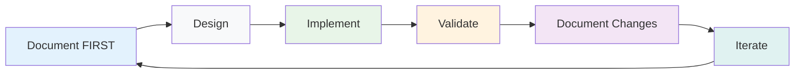
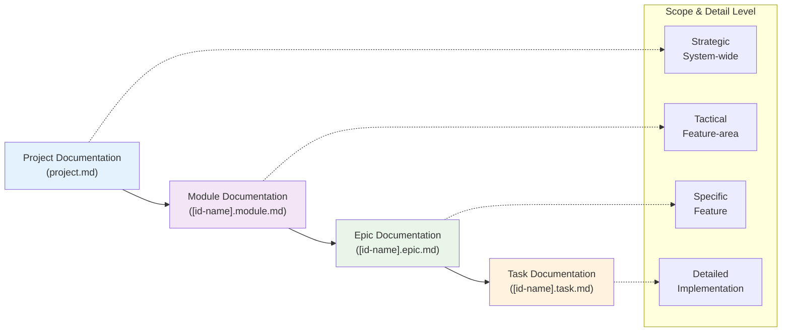

# Documentation Driven Development

## Document Objective

This document establishes the **Documentation Driven Development (DDD) methodology** for software development projects. It defines the principles, structure, and implementation approach where **documentation drives all development decisions** and serves as the single source of truth for the entire project.

**Terminology Note**: Throughout this document, "Documentation Driven Development", "Documentation-Driven Development", and "Documentation-First" all refer to the same core methodology where documentation creation precedes and drives all implementation activities.

**Primary Goals:**

- Establish documentation as the primary driver of all development activities
- Define clear structure and responsibility boundaries for different document types
- Provide practical templates and guidelines for documentation-first implementation
- Enable efficient knowledge sharing through comprehensive, authoritative documentation

## Table of Contents

- [Core Methodology & Principles](#core-methodology--principles)
  - [Development Philosophy](#development-philosophy)
  - [Fundamental Principles](#fundamental-principles)
- [Why Documentation-First for Software Development](#why-documentation-first-for-software-development)
  - [Project Complexity Drivers](#project-complexity-drivers)
  - [Expected Benefits](#expected-benefits)
- [Documentation-Driven Development Workflow](#documentation-driven-development-workflow)
  - [Mandatory Documentation-First Process](#mandatory-documentation-first-process)
  - [1. Documentation Creation Phase](#1-documentation-creation-phase)
  - [2. Implementation Phase](#2-implementation-phase)
  - [3. Validation Phase](#3-validation-phase)
  - [4. Documentation Evolution Phase](#4-documentation-evolution-phase)
- [Implementation Approach](#implementation-approach)
  - [4-Tier Documentation Hierarchy](#4-tier-documentation-hierarchy)
  - [Documentation-Driven Development Sequence](#documentation-driven-development-sequence)
    - [1. Project-Level Documentation (FIRST)](#1-project-level-documentation-first)
    - [2. Module-Level Documentation (SECOND)](#2-module-level-documentation-second)
    - [3. Epic-Level Documentation (THIRD)](#3-epic-level-documentation-third)
    - [4. Task-Level Documentation (FOURTH)](#4-task-level-documentation-fourth)
- [Living Documentation Process](#living-documentation-process)
  - [Documentation-First Change Management](#documentation-first-change-management)
    - [Documentation-First Change Workflow](#documentation-first-change-workflow)
    - [No-Exception Scenarios](#no-exception-scenarios)
    - [Implementation Discovery Protocol](#implementation-discovery-protocol)
- [The Documentation Schema](#the-documentation-schema)
  - [Schema-Driven Structure](#schema-driven-structure)
  - [Information Families](#information-families)
  - [Progressive Narrowing](#progressive-narrowing)
- [Documentation Standards](#documentation-standards)
  - [Documentation-First Enforcement](#documentation-first-enforcement)
  - [Common Principles Across All Levels](#common-principles-across-all-levels)
  - [Level-Specific Implementation Gates](#level-specific-implementation-gates)
- [Documentation Quality Standards](#documentation-quality-standards)
- [File and Directory Naming Convention](#file-and-directory-naming-convention)
- [Common Iconography and Status Keys](#common-iconography-and-status-keys)
- [Priority Levels](#priority-levels)
  - [Category-Specific Priority Matrix](#category-specific-priority-matrix)
  - [Practical Implementation Guidelines](#practical-implementation-guidelines)
  - [Practical Application Guide](#practical-application-guide)
- [The Future: Documentation as Living Dashboard](#the-future-documentation-as-living-dashboard)
  - [LLM-Enhanced Documentation Workflows](#llm-enhanced-documentation-workflows)
  - [Vision: Documentation-Native Project Management](#vision-documentation-native-project-management)
  - [The Competitive Edge](#the-competitive-edge)
  - [Vision: Increased Project Automation](#vision-increased-project-automation)

## Core Methodology & Principles

### Development Philosophy



**Documentation-Driven Approach:** ALL decisions, designs, changes, and implementations MUST begin with comprehensive documentation updates. No code is written without corresponding documentation being completed first.

### Fundamental Principles

**1. Documentation Before Code (PRIMARY PRINCIPLE)**
**ZERO code changes occur without corresponding documentation updates happening FIRST.** Documentation is the authoritative source of truth that drives all implementation decisions.

**2. Business Context First**
Every document starts with business justification and user value before diving into technical details.

**3. Self-Sufficient Documents**
Each document contains sufficient context to understand its scope without requiring extensive cross-referencing, while maintaining clear links to related decisions.

**4. Structured Decision Documentation**
Decisions are documented at the appropriate level of scope and detail, distributed across the documentation hierarchy.

**5. Documentation as Source of Truth**
When documentation and code conflict, documentation is correct by definition. Code must be updated to match documentation.

**6. Actionable Content**
Each section must enable decision-making or implementation, with specific acceptance criteria and concrete examples.

## Why Documentation-First for Software Development

### Project Complexity Drivers

**Complex Domain:** Modern software systems involve multiple interconnected components where requirements must be fully understood and documented before any implementation begins.

**Stakeholder Alignment:** Complex user workflows require crystal-clear definition in documentation before implementation to ensure user acceptance.

**System Integration:** Multiple system components require well-defined, documented interfaces and data contracts before any connections are built.

**Quality Assurance:** Complex business processes need clear oversight with documented decision criteria and audit trails established before implementation.

### Expected Benefits

- **Eliminated Development Risk:** Complete requirements and decisions documented and validated before any implementation
- **Structured Complexity Management:** Hierarchical documentation approach manages complexity at appropriate levels
- **Predictable Development Flow:** Documentation completeness drives implementation readiness
- **Superior Maintenance:** All decisions and trade-offs documented before they're built into code
- **User-Centered Design:** User workflows fully documented and validated before development begins

## Documentation-Driven Development Workflow

### Mandatory Documentation-First Process

**Core Rule: NO IMPLEMENTATION WITHOUT COMPLETE DOCUMENTATION**

**Primary Workflow (5-Step Process):**

1. Document Requirement
2. Review Documentation
3. Approve Documentation
4. Implement to Documentation
5. Validate Against Documentation

**Process Relationship Clarification:**

- **6-Step Philosophy Cycle**: High-level continuous improvement cycle (Document FIRST → Design → Implement → Validate → Document Changes → Iterate)
- **5-Step Operational Workflow**: Specific workflow for each feature/change (Document → Review → Approve → Implement → Validate)
- **4-Phase Development Sequence**: Project lifecycle phases (Creation → Implementation → Validation → Evolution)
- **4-Tier Documentation Hierarchy**: Organizational structure (Project → Module → Epic → Task).
- **7 Information Families**: A cross-cutting schema that governs the content _within_ each document, ensuring consistent and predictable information flow (see [The Documentation Schema](#the-documentation-schema)).

Each serves a different purpose and they work together to create a comprehensive methodology.

### 1. **Documentation Creation Phase**

- Document all requirements, designs, and decisions BEFORE any code
- Complete documentation review and approval process
- Validate documentation completeness and consistency
- NO implementation begins until documentation is complete

### 2. **Implementation Phase**

- Code written to exactly match approved documentation
- Implementation follows documentation specifications precisely
- Any discovered gaps require STOPPING implementation and updating documentation first

### 3. **Validation Phase**

- Verify implementation matches documentation exactly
- Document any approved variations from original specification
- Update documentation if implementation reveals better approaches (documentation-first)

### 4. **Documentation Evolution Phase**

- When changes are needed, update documentation FIRST
- Re-approve updated documentation before implementing changes
- Maintain documentation as the authoritative source of truth

## Implementation Approach

### 4-Tier Documentation Hierarchy

Our documentation follows a structured hierarchy where each level drives implementation at its scope:



### Documentation-Driven Development Sequence

#### **1. Project-Level Documentation (FIRST)**

- Define complete system architecture and technology decisions
- Document comprehensive user journeys and business processes
- Establish project-wide standards and quality gates
- **Nothing implemented until project documentation is complete**

#### **2. Module-Level Documentation (SECOND)**

- Break down project into documented functional modules
- Define and document module boundaries and integration points
- Document exactly how epics within each module work together
- **No module implementation until module documentation is complete**

#### **3. Epic-Level Documentation (THIRD)**

- Define complete feature scope, user stories, and acceptance criteria. An epic represents a complete, independent feature set that delivers value. It should correspond to one or more user stories and be testable on its own. Dependencies on other epics should be limited to well-defined integration points, such as API contracts.
- Document all epic-level design decisions and trade-offs
- Plan and document component architecture for the feature
- **No epic implementation until epic documentation is complete**

#### **4. Task-Level Documentation (FOURTH)**

- Document detailed implementation requirements and specifications
- Document specific technical decisions and algorithms
- Provide step-by-step documented development guidance
- **No task implementation until task documentation is complete**

## Living Documentation Process

### Documentation-First Change Management

**Principle:** ALL changes begin with documentation updates, regardless of size or urgency.

#### **Documentation-First Change Workflow**

```
Change Request → Update Documentation → Review → Approve → Implement → Validate
```

**Mandatory Steps:**

1. **Document the Change:** Update relevant documentation with all proposed changes
2. **Design Review:** Validate documentation changes for completeness and consistency
3. **Approval:** Documentation changes must be approved before ANY code changes
4. **Implementation:** Code updated to match the approved documentation exactly
5. **Validation:** Verify implementation matches updated documentation precisely

#### **No-Exception Scenarios**

**Architecture Changes:**

- Document new component relationships FIRST, then build
- Update integration patterns FIRST, then implement connections
- Define data models FIRST, then write data handling code

**Feature Development:**

- Document user stories and acceptance criteria FIRST, then code
- Update API specifications FIRST, then implement endpoints
- Define state management patterns FIRST, then write state logic

**Bug Fixes:**

- Document root cause analysis FIRST, then fix
- Update business rules if bug reveals incorrect assumptions FIRST
- Document the fix approach FIRST, then implement

**Quick Changes:**

- Even "trivial" changes require documentation updates FIRST
- No "emergency" exceptions to documentation-first rule
- All changes, regardless of size, follow documentation-first process

#### **Implementation Discovery Protocol**

When implementation work reveals new requirements or constraints:

1. **IMMEDIATELY STOP ALL IMPLEMENTATION**
2. **UPDATE DOCUMENTATION** with discovered requirements
3. **REVIEW AND APPROVE** documentation changes
4. **RESUME IMPLEMENTATION** only after documentation is complete and approved

**Enforcement:** No implementation continues until documentation accurately reflects all discovered requirements.

## The Documentation Schema

While the 4-tier hierarchy (Project → Module → Epic → Task) defines the organizational structure of our documentation, the _content_ within each document is governed by a formal schema. This ensures a consistent, predictable, and machine-readable flow of information from high-level business goals down to granular implementation details.

**The canonical definition for this schema is maintained in [docs/requirements/documentation-schema.md](./requirements/documentation-schema.md).** That document is the single source of truth for all document templates and content requirements.

### Schema-Driven Structure

Instead of relying on informal templates, all `*-plan.md` and `*.task.md` files are now structured according to a shared information architecture. This architecture is built around two core concepts: **Information Families** and **Progressive Narrowing**.

### Information Families

The schema groups all documentation content into seven distinct "families," each answering a primary question:

1.  **Meta & Governance**: How critical is this work and what is its status?
2.  **Business & Scope**: Why are we doing this?
3.  **Planning & Decomposition**: What are we building and in what order?
4.  **Architecture & Design**: How does it work under the hood?
5.  **Implementation Guidance**: What are the practical steps?
6.  **Quality & Operations**: How do we validate and run it?
7.  **Reference**: What other information might we need?

These families provide a consistent vocabulary and structure across all levels of the documentation hierarchy.

### Progressive Narrowing

The schema uses a "Depth Matrix" for each family to explicitly define which sections are required, optional, or omitted at each level (Project, Module, Epic, Task). This enforces **progressive narrowing**, where high-level concepts introduced at the Project level are progressively refined and detailed as they move down to the Task level.

This approach ensures that context is inherited and built upon, not repeated. It provides a clear and efficient path for both human developers and LLMs to gather the full context required for any given task.

## Documentation Standards

### **Documentation-First Enforcement**

**Absolute Documentation Priority:** Documentation is the authoritative source of truth that drives ALL development decisions
**Complete Before Implementation:** Every document must be 100% complete before any implementation begins at that level
**Implementation Follows Documentation:** Code must exactly match documented specifications
**Documentation Drives Changes:** All changes begin with documentation updates, never with code changes

### **Common Principles Across All Levels**

**Business Context First:** Every document starts with business justification and user value
**Documentation Before Implementation:** Complete documentation created and approved before any coding
**Self-Sufficient Content:** Each document contains sufficient context to drive implementation without gaps
**Clear Implementation Rules:** Explicit links to related decisions and precise implementation requirements

### **Level-Specific Implementation Gates**

**Project Level:** Complete strategic decisions, system-wide coordination, and technology choices BEFORE any module work
**Module Level:** Complete feature area coordination, epic integration, and module boundaries BEFORE any epic work
**Epic Level:** Complete feature design, component architecture, and user experience BEFORE any task work
**Task Level:** Complete implementation specifics, technical details, and development guidance BEFORE any coding

### **Documentation Quality Standards**

**Implementation-Ready Content:** Each section must provide complete specifications for immediate implementation
**Consistent Structure:** All documents of the same type follow identical section structure for predictable implementation
**Complete Specifications:** No ambiguity or gaps that would require implementation decisions
**Authoritative Source:** When documentation and code conflict, documentation is correct by definition

### **File and Directory Naming Convention**

To ensure consistency and predictability, all documentation-related files and directories **MUST** follow a standardized naming convention. The convention is based on the artefact's position in the hierarchy.

**Pattern:** `[parent-prefix]-[id]-[name]`

- **`parent-prefix`**: The full ID of the parent artefact. This is omitted for modules.
- **`id`**: The unique identifier for the current artefact (e.g., `m1`, `e1`, `t1`).
- **`name`**: A short, descriptive, kebab-case name for the artefact.

#### Examples

| Level  | Directory Name                 | File Name                              |
| :----- | :----------------------------- | :------------------------------------- |
| Module | `m1-analyzer`                  | `m1-analyzer.module.md`                |
| Epic   | `m1-e1-parser`                 | `m1-e1-parser.epic.md`                 |
| Task   | `m1-e1-t1-file-system-scanner` | `m1-e1-t1-file-system-scanner.task.md` |

This structure ensures that every file and directory is self-describing and its location in the project hierarchy can be determined from its name alone.

### **Common Iconography and Status Keys**

To ensure consistency and at-a-glance readability across all documentation (projects, modules, epics, and tasks), the following standardized set of icons and status keys should be used. This central key serves as the single source of truth for all status indicators.

#### **Status Keys**

- 💡 **Not Started:** The task, epic, or module has been identified but no work has begun.
- ⏳ **In Progress:** Active development or documentation work is currently underway.
- 🔍 **Under Review:** The work has been completed and is pending review and approval from stakeholders or peers.
- ✅ **Complete:** The work has been reviewed, approved, and merged. No further action is needed.
- ❌ **Blocked:** The work cannot proceed due to an external dependency, a required decision, or an unresolved issue.

### **Priority Levels**

The priority assigned to a project artefact (module, epic, task, bug, etc.) reflects a combination of **business / user impact** _and_ **urgency / time-risk**. Use the matrix below when deciding which bucket applies. This shared definition ensures humans and AI assistants interpret priority cues identically.

| Level         | Definition                                                                                                                 | Typical Handling                                                                       |
| ------------- | -------------------------------------------------------------------------------------------------------------------------- | -------------------------------------------------------------------------------------- |
| 🟥 **High**   | Blocking or business-critical work. Delay introduces material risk to launch dates, SLAs, compliance, or downstream teams. | Address in the **very next** working cycle. Surface in daily stand-ups until resolved. |
| 🟧 **Medium** | Important but not currently blocking. Provides clear value or unblocks future High items.                                  | Schedule within the next normal iteration. Escalate if it slips more than one cycle.   |
| 🟨 **Low**    | Nice-to-have, polish, or tech debt with no near-term risk.                                                                 | Tackle opportunistically during buffer / cleanup periods.                              |

**How to choose:**

1. Estimate the _impact_ of leaving the item undone (customer pain, revenue, compliance, team unblockers).
2. Estimate the _urgency_ (deadlines, external dependencies, risk of knowledge loss, time sensitivity).
3. Pick the highest applicable bucket — when in doubt, err on the side of **Medium** and revisit during grooming.
4. **Dependency Rule:** A 🟥 **High**-priority item cannot have an unresolved dependency on any 🟧 Medium or 🟨 Low item. If a High item relies on lower-priority work, either (a) immediately raise that dependency to 🟥 High as well, or (b) decouple the blocking relationship. This prevents hidden blockers from undermining MVP or deadline-critical scope.

### **Category-Specific Priority Matrix**

The tables below define canonical **Priority Drivers**. Each driver has a stable, human-readable ID (prefix = category) that can be referenced in project, module, and epic plans.

#### Core-Business Process (CBP)

##### CBP-Break_Block_Revenue_Legal

- **Priority:** 🟥 High
- **Description:** Breaks or blocks a revenue-generating or legally required workflow; stops frontline staff.
- **Detailed Description:** Any outage or defect that halts a money-making operation (checkout, subscription renewal) or prevents the organisation from meeting a statutory obligation (regulatory filings, mandatory disclosures). The impact is immediate revenue loss or legal exposure, so these issues are always treated as the single highest priority.

##### CBP-SLA_Breach

- **Priority:** 🟥 High
- **Description:** Service-Level Agreement (SLA) breach.
- **Detailed Description:** The system has failed to meet a contractual uptime or response-time commitment. Although a temporary workaround may exist, continued breach carries financial penalties and reputational damage. Work to return service within SLA takes precedence over feature delivery.

##### CBP-Partial_Degradation_KPI

- **Priority:** 🟧 Medium
- **Description:** Partial degradation with workaround; Key Performance Indicator (KPI) dip < 20 %.
- **Detailed Description:** Core functionality still works, but a measurable business metric (conversion, processing throughput) is below target yet above the "critical" threshold. Work is scheduled in the next normal sprint unless a trend indicates worsening performance.

##### CBP-Incremental_Improvement

- **Priority:** 🟨 Low
- **Description:** Incremental efficiency or quality improvements; nice-to-have automation.
- **Detailed Description:** Optimisations that shorten operator workflow or improve data quality without affecting revenue or compliance if delayed. Often bundled into "buffer" sprints or addressed alongside related medium-priority items.

#### Security / Compliance (SEC)

##### SEC-Critical_Vulnerability

- **Priority:** 🟥 High
- **Description:** Exploitable vulnerability (Common Vulnerability Scoring System, CVSS ≥ 7).
- **Detailed Description:** Any security finding rated High/Critical, including but not limited to remote-code execution, privilege escalation, or data exfiltration. Immediate remediation or mitigation is mandatory to protect customer data and organisational reputation.

##### SEC-Data_Leak

- **Priority:** 🟥 High
- **Description:** Confirmed data leak or exposure of sensitive information.
- **Detailed Description:** Evidence shows protected data has been or could be accessed by unauthorised parties. Requires incident response, forensics, disclosure, and patching—treated with the highest urgency.

##### SEC-Upcoming_Compliance

- **Priority:** 🟧 Medium
- **Description:** Upcoming compliance requirement (≥ 30 days lead).
- **Detailed Description:** A new regulation or audit-check will apply in the near future. Work must be completed before the effective date but can be scheduled thoughtfully within the next sprint cycle.

##### SEC-Hardening_Low_Risk

- **Priority:** 🟨 Low
- **Description:** Security hardening / best-practice alignment / low-risk library upgrade.
- **Detailed Description:** Routine defence-in-depth improvements such as adding HTTP security headers or bumping non-critical dependencies. Addressed opportunistically or when touching adjacent code.

#### User Experience (UX)

##### UX-Task_Abandonment

- **Priority:** 🟥 High
- **Description:** Causes task abandonment or major accessibility blocker.
- **Detailed Description:** Users cannot complete a primary job to be done, or an accessibility (a11y) defect blocks assistive-technology users. Resolving these directly ties to customer satisfaction and legal accessibility obligations.

##### UX-Severe_Usability

- **Priority:** 🟥 High
- **Description:** Severe usability frustration or misleading flow.
- **Detailed Description:** The UI misleads users into incorrect actions or requires unreasonable effort, leading to support calls or churn. Must be fixed promptly to protect product reputation.

##### UX-Noticeable_Friction

- **Priority:** 🟧 Medium
- **Description:** Noticeable friction, confusing copy, minor a11y issue.
- **Detailed Description:** Issues degrade the experience but have workarounds. Scheduled alongside other front-end work in the upcoming sprint.

##### UX-Cosmetic_Polish

- **Priority:** 🟨 Low
- **Description:** Cosmetic polish, micro-interaction tweak, visual refinement.
- **Detailed Description:** Pure UI aesthetics that do not block user goals. Batched into UI-polish iterations or addressed during low-load periods.

#### Marketing / Growth (MKT)

##### MKT-Launch_Critical

- **Priority:** 🟥 High
- **Description:** Launch-critical campaign asset or time-boxed opportunity.
- **Detailed Description:** Work is tied to a public launch date or promotional window. Missing the window nullifies the marketing spend; therefore prioritised over normal feature work.

##### MKT-Brand_Risk

- **Priority:** 🟥 High
- **Description:** Significant brand-risk mitigation.
- **Detailed Description:** Corrects messaging or visuals that could damage brand perception (offensive copy, legal trademark misuse). Addressed immediately ahead of user-visible releases.

##### MKT-Campaign_Optimisation

- **Priority:** 🟧 Medium
- **Description:** Campaign optimisation, secondary channel, moderate traffic driver.
- **Detailed Description:** Enhancements that improve conversion rates or extend reach but are not single-point failures. Planned in normal marketing-engineering cycles.

##### MKT-Long_Tail_SEO

- **Priority:** 🟨 Low
- **Description:** Long-tail SEO initiative, exploratory experiment, backlog idea.
- **Detailed Description:** Experiments or content updates aimed at incremental organic growth. Slotted into backlog grooming and tackled when bandwidth exists.

#### Technical Foundation / Infrastructure (TEC)

##### TEC-Prod_Stability_Blocker

- **Priority:** 🟥 High
- **Description:** Production stability or data-loss bug; scaling bottleneck; Continuous Integration (CI) is red.
- **Detailed Description:** Failures that jeopardise uptime, data integrity, or the ability to merge code safely. These are addressed before any feature release proceeds.

##### TEC-Dev_Productivity_Blocker

- **Priority:** 🟥 High
- **Description:** Critical performance optimisation or blocking developer productivity issue.
- **Detailed Description:** Build times, tooling failures, or environmental issues that materially slow down the team. Fast mitigation prevents cascading schedule slips.

##### TEC-Dev_Productivity_Enhancement

- **Priority:** 🟧 Medium
- **Description:** Proactive tooling or process improvements that accelerate development workflows.
- **Detailed Description:** Initiatives that reduce boilerplate, streamline local development, or improve CI/CD cycle times without fixing an active blocker. These are quality-of-life improvements that compound over time.

##### TEC-Flaky_Test

- **Priority:** 🟧 Medium
- **Description:** Flaky test; non-blocking performance improvement.
- **Detailed Description:** Intermittent test failures or optimisations that improve quality but have a workaround (rerun, retries). Bundled into maintenance sprints.

##### TEC-Tech_Debt_Refactor

- **Priority:** 🟨 Low
- **Description:** Code hygiene / refactor; technical debt payoff; low-risk upgrade.
- **Detailed Description:** Architectural clean-ups and low-risk library upgrades that improve long-term maintainability without immediate business impact.

> **Tip:** List all applicable Driver IDs in your plan; the highest default priority determines the headline priority.

### **Practical Implementation Guidelines**

#### **Definition of "Complete Documentation"**

Documentation is considered complete when:

- All required sections (per document templates) are filled with specific, actionable content
- No placeholders, TODOs, or "TBD" items remain
- Business context and technical requirements are fully specified
- Acceptance criteria are clearly defined and measurable
- All dependencies and integration points are documented
- Implementation steps are detailed enough for immediate execution

#### **Guidance on Defining Success Criteria**

- **Phase-Appropriate Metrics:** Success criteria should be tailored to the project's current maturity. For initial phases or proofs-of-concept, success may be defined by system completion and functional correctness. Quantitative performance benchmarks and business KPIs should be explicitly deferred to later, iterative phases.

#### **Review and Approval Process**

1. **Self-Review**: Author checks completeness against template requirements
2. **Peer Review**: Technical review for accuracy and implementability
3. **Stakeholder Review**: Business validation of requirements and approach
4. **Approval**: Formal sign-off required before implementation begins
5. **Version Control**: Approved version tagged and protected from changes

#### **Implementation Validation Criteria**

Code "exactly matches" documentation when:

- All documented interfaces are implemented as specified
- Business logic follows documented rules precisely
- Error handling matches documented scenarios
- Performance meets documented requirements
- Security measures implement documented controls
- Integration points work as documented

#### **Quality Gates**

- **Entry Gate**: Documentation complete and approved
- **Progress Gates**: Implementation matches documentation at checkpoints
- **Exit Gate**: Full validation confirms implementation matches documentation
- **Maintenance Gate**: Documentation updated before any code changes

#### **Enforcement Mechanisms**

- **Code Review**: Implementation must reference and match documentation
- **Automated Checks**: CI/CD pipeline validates documentation exists and is current
- **Definition of Done**: Documentation update required for all changes
- **Escalation Path**: Implementation blockers escalated to documentation review

### **Practical Application Guide**

#### **For LLMs Implementing This Methodology**

When processing requests under Documentation Driven Development:

1. **Prioritize Interactive Dialogue**: Before generating substantial content or code, engage in a dialogue to clarify requirements and context. Ask clarifying questions to avoid making assumptions, especially for complex or ambiguous requests. Do not "jump the gun" by providing a complete solution without sufficient interaction.
2. **Traverse Hierarchy Top-Down (MANDATORY)**: Before reading any document (Module, Epic, or Task), you **MUST** first read its direct parent to inherit context. The reading order must follow the hierarchy: `project.md` → `*.module.md` → `*.epic.md` → `*.task.md`. This ensures you have the full context before proceeding.
3. **Always Check Documentation First**: Before writing any code, verify complete documentation exists
4. **Refuse Implementation Without Documentation**: Do not generate code if documentation is incomplete
5. **Follow Exact Specifications**: Implement exactly as documented, no interpretation or improvisation
6. **Document First, Then Code**: When changes are needed, update documentation before code generation
7. **Validate Against Documentation**: Ensure generated code matches documented specifications precisely
8. **Adopt the Correct Tone and Audience Focus**: All documentation should be written for a technical audience. The tone must be objective, fact-based, and precise. Avoid marketing language, hyperbole, or overly narrative styles. The goal is to produce clear, professional, and reliable technical documentation. Emojis may be used sparingly to convey status (e.g., ✅, ❌) or a calibrated, positive tone grounded in technical success.

#### **For Human Developers Implementing This Methodology**

**Embrace Collaborative Authoring:**

- Use the documentation process as an interactive workshop, not a static writing exercise.
- Engage in dialogue, ask clarifying questions, and use the shared document as a tool to achieve a mutual understanding _before_ seeking formal review and approval. This surfaces misunderstandings early and leads to a more accurate final specification.

Daily workflow checklist:

1. **Morning Review**: Check that today's tasks have complete, approved documentation
2. **Implementation Gate**: Before coding, verify documentation completeness against template requirements
3. **Validation Points**: Regular checks that implementation matches documentation
4. **Change Protocol**: Stop coding and update documentation when gaps are discovered
5. **Completion Criteria**: Code review must verify implementation matches documentation

#### **Red Flags - Stop Implementation Immediately**

- Documentation contains "TODO", "TBD", or similar placeholders
- Requirements are ambiguous or open to interpretation
- Technical specifications are missing critical details
- Integration points are not fully defined
- Acceptance criteria are vague or unmeasurable
- Dependencies are not documented or unavailable

## Documentation-Native Project Management (Status Tracking)

We have codified a lightweight project-management process, and all related documents live in this repository. All planning and tracking happen here—no external boards needed.

### Status Files & Naming

| Level   | File                                       | Cadence          |
| ------- | ------------------------------------------ | ---------------- |
| Project | `docs/requirements/project-status.md`      | Weekly & Monthly |
| Module  | `docs/requirements/.../<module>-status.md` | Weekly           |
| Epic    | `docs/requirements/.../<epic>-status.md`   | Daily            |
| Task    | `*.task.md` header bullets                 | Daily            |

### Section Structure

Each **month** lives in its own block in the project status file:

```
## 2025-07 Progress

### Month-to-Date Summary
- Points Completed This Month: X
- Cumulative Completed: X / Y → Z %

### Weekly Progress
#### 2025-07-02 – 2025-07-08 (Tue→Mon)
| ... | ... |
```

Guidelines:

1. **Tuesday→Monday weeks** keep sprints aligned and avoid weekend gaps.
2. Archive a weekly table at week-end; archive the whole month block when the calendar flips.
3. Always compute velocity from **active days** to avoid inflated numbers.
4. Use the standard iconography (🟥, 🟧, 🟨, ✅, ⏳, 💡, ❌).
5. Track high-priority scope separately: include **High-Priority Points**, **High-Priority Done Points**, **High-Priority Completion Ratio**, and high-priority velocity metrics in Summary and Velocity sections for every status file.

### Standard Column Definitions for Status Tables

| Column                  | Description                                                                                     |
| ----------------------- | ----------------------------------------------------------------------------------------------- |
| Priority                | Priority indicator (🟥 High, 🟧 Medium, 🟨 Low)                                                 |
| Item (Task/Epic/Module) | Markdown link to the artefact                                                                   |
| Planning Points         | Initial story-point estimate before implementation begins                                       |
| Est. Variance (pts)     | Net change in points relative to planning; positive = scope increase, negative = scope decrease |
| Done Points             | Points counted once item is completed (planning points + Est. Variance)                         |
| Tasks / Items Done      | Progress indicator e.g., `7 / 14` tasks completed                                               |
| High Pts                | High-priority subset of planning points                                                         |
| High Done               | High-priority subset completed                                                                  |
| High %                  | High Done ÷ High Pts                                                                            |
| HP State                | ✅ if all High-priority scope done, blank otherwise                                             |
| Progress %              | Overall completion percentage                                                                   |
| State                   | Status key (💡, ⏳, 🔍, ✅, ❌)                                                                 |
| Created                 | Creation date                                                                                   |
| Started                 | Implementation start date                                                                       |
| Completed               | Completion date                                                                                 |

> All status tables (project, module, epic) must use these standard columns in this exact order. Omit columns that are not applicable at a given level (e.g., High-\* columns can be left blank if no high-priority items exist).

> **Usage Guidance:** Status tables at different hierarchy levels include a _subset_ of these columns tailored to their scope. Use the order above as a reference, but omit columns that are not meaningful at that level. For example:
> • **Project / Module** tables often include `Tasks / Items Done`, `High-*` metrics, and `Progress %` because they aggregate many items.
> • **Epic** tables typically list `Planning Points`, `Est. Variance`, `Done Points`, and omit `High-*` columns unless high-priority tracking is needed at the task level.
> • **Task** headers may include only `Status`, `Planning Points`, and dates.
>
> Maintain column order _within_ the subset you choose so automated tools can parse tables consistently.

### Update Cadence

- **Task / Epic:** update bullets the day work happens.
- **Module:** add/append weekly table rows every Monday evening.
- **Project:** update weekly table + month-to-date bullets every Monday; roll over month block on the 1st.

### Rationale

• **Noise Reduction:** Higher levels change less frequently, so weekly/monthly snapshots suffice.
• **Single Source of Truth:** Everything lives in Git—easy diff, code review, historical audit.
• **Scalable Reporting:** LLMs (see Vision) can now parse these tables to answer stand-up and planning queries.

---

## The Future: Documentation as Living Dashboard

### LLM-Enhanced Documentation Workflows

**Interactive Documentation Capabilities:**

#### **Documentation Becomes Queryable**

🤖 **"What's blocking the user-authentication module?"**  
→ LLM scans all task docs, identifies blockers, provides summary

📊 **"Show me velocity trends for the last 3 sprints"**  
→ LLM analyzes completion dates, generates trend analysis

🎯 **"Which tasks are at risk of missing the deadline?"**  
→ LLM compares estimated vs actual hours, flags concerns

📋 **"Generate a status report for stakeholders"**  
→ LLM creates executive summary from detailed documentation

#### **Natural Language Project Management**

**Documentation Becomes Conversational:**

- Instead of reading through multiple docs, just ask questions
- LLM provides context-aware responses based on current project state
- Natural language queries replace complex project management interfaces

**Intelligence Emerges from Structure:**

- Your 4-tier documentation hierarchy becomes queryable knowledge graph
- LLM can traverse relationships (Project → Module → Epic → Task)
- Cross-cutting insights emerge (dependencies, risks, bottlenecks)

**Reduced Tool Complexity:**

- Documentation + LLM API can handle many Project Management tasks
- Leverages existing Git/markdown workflows
- Maintains version control and audit trails

#### Documentation as Living Dashboard Examples

**Real-time Queries Instead of Static Reports:**

```
User: "How is the data-processing module doing?"


LLM Response: "The data-processing module is 67% complete:
✅ data-import epic: Done (3 tasks completed)
🔄 data-validation epic: In progress (2/3 tasks done)
⏳ reporting epic: Not started (blocked on data-validation)
📊 Current velocity: 1.2 tasks/week (on track for Nov 15 deadline)"
```

**Dynamic Context Switching:**

```
User: "I need to work on the login-form task. What do I need to know?"

LLM Response: "For login-form.task.md:
📋 Status: Ready for implementation (dependencies met)
🎯 Acceptance criteria: 4 requirements defined
🔧 Dependencies: user-profile API (completed), auth-service (ready)
⚠️ Blockers: None
📚 Implementation guide: 8 steps documented
🧪 Tests required: 6 unit tests, 2 integration tests"
```

### Vision: Documentation-Native Project Management

**Current Implementation (MVP):**

- ✅ Status files at Project, Module, Epic, Task levels adopted.
- ✅ Monthly block (`2025-07 Progress`) nests weekly Tuesday→Monday tables.
- ✅ Manual velocity & ETA formulas added.

**Next Iterations:**

- 🔄 CLI script to auto-roll weekly/monthly tables and inject current metrics.
- 🔄 LLM chatops commands ("/standup", " /velocity") parsing status docs.
- 🔄 Integrate CI check to fail PRs when status docs stale >7 days.

### The Competitive Edge

**What Dies:**

- Jira/Asana ($7/user/month)
- Confluence ($5/user/month)
- Slack for status updates
- Excel for tracking
- Tool switching overhead

**What Emerges:**

- 📁 Git repository ($0-20/month total)
- 🤖 LLM API ($20-100/month total)
- 🔄 Better integration across workflows
- 📊 Reduced context switching

### Capabilities That Didn't Exist Before

💡 **Enhanced Dependency Analysis**  
→ Cross-epic dependency analysis capabilities  
→ Automated risk assessment support  
→ Pattern-based blocking identification

📈 **Natural Language Reporting**  
→ LLM-generated executive summaries  
→ Automated status update generation  
→ Documentation-to-report conversion

⚡ **Documentation-Driven Code Generation**  
→ Code generation based on documented specs  
→ Compliance checking against requirements  
→ Automated validation workflows

```
Git repository: $0-$20/month
LLM API: $20-$100/month
+ Single system to learn
+ No context switching
+ Everything integrated
+ Complete audit trail
```

#### **Capabilities That Didn't Exist Before**

**Intelligent Dependency Analysis:**

- LLM understands cross-epic dependencies
- Automatic risk assessment for scope changes
- Predictive blocking issue identification

**Natural Language Reporting:**

- Generate executive summaries automatically
- Create customer-facing status updates
- Produce technical documentation from implementation

**Contextual Code Generation:**

- Generate code that matches exact documentation
- Automatic validation against requirements
- Built-in compliance with documented standards

### The Competitive Advantage

Teams adopting Documentation Driven Development with LLM integration gain:

**🚀 Development Velocity**

- Reduced context switching between tools
- Intelligent task prioritization
- Automated status tracking and reporting

**🎯 Quality Assurance**

- Implementation validated against documentation
- Automated compliance checking capabilities
- Complete audit trails through version control

**💰 Cost Efficiency**

- Eliminate multiple SaaS subscriptions
- Reduce onboarding complexity
- Minimize project management overhead

**🧠 Organizational Intelligence**

- Institutional knowledge preserved in documentation
- AI-powered project insights
- Predictive project management

### Vision: Increased Project Automation

Potential future capabilities as LLM technology matures:

- **Intelligent Backlog Analysis** - LLM could analyze dependencies and business value
- **Risk Pattern Recognition** - Early warning based on historical project data
- **Automated Status Generation** - Stakeholder updates derived from documentation state
- **Resource Optimization Suggestions** - Task assignment recommendations based on capacity
- **Process Optimization** - LLM could identify workflow inefficiencies from documentation patterns
