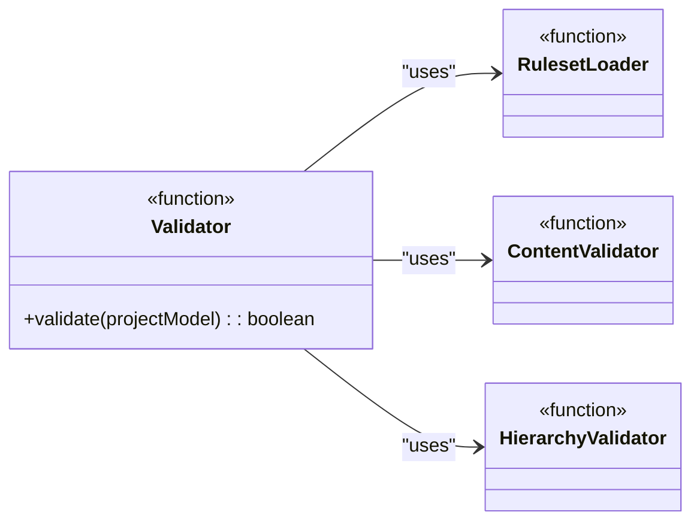

# Task: T4: Main Validator Function

---

## ✅ 1 Meta & Governance

### ✅ 1.2 Status

- **Current State:** 💡 Not Started
- **Priority:** 🟥 High
- **Progress:** 0%
- **Assignee**: @[username]
- **Planning Estimate:** 0
- **Est. Variance (pts):** 0
- **Created:** 2025-07-17 02:00
- **Implementation Started:** [YYYY-MM-DD HH:MM]
- **Completed:** [YYYY-MM-DD HH:MM]
- **Last Updated:** 2025-07-17 03:00

### ✅ 1.3 Priority Drivers

- [TEC-Dev_Productivity_Blocker](/docs/documentation-driven-development.md#tec-dev_productivity_blocker)

---

## ✅ 2 Business & Scope

### ✅ 2.1 Overview

- **Core Function**: Integrates all individual validation components (`Schema Loader`, `Content Validator`, `Hierarchy Validator`) into a single, orchestrating `validate` function.
- **Key Capability**: Provides the main entry point for the `E2: Schema Validator` epic, processing the entire `ProjectModel`.
- **Business Value**: Delivers the complete, end-to-end validation capability required by the `m1-analyzer` module, ensuring that the entire documentation structure is checked in a single, atomic operation.

### ✅ 2.4 Acceptance Criteria

| ID   | Criterion                                                                                 | Test Reference      |
| ---- | ----------------------------------------------------------------------------------------- | ------------------- |
| AC-1 | The main function successfully validates a fully compliant `ProjectModel` without errors. | `validator.test.ts` |
| AC-2 | The main function throws a `ValidationError` when any document's content is invalid.      | `validator.test.ts` |
| AC-3 | The main function throws a `ValidationError` when any document's hierarchy is invalid.    | `validator.test.ts` |
| AC-4 | The function correctly orchestrates the call sequence: Load Rules -> Validate Docs.       | `validator.test.ts` |

---

## ✅ 3 Planning & Decomposition

### ✅ 3.3 Dependencies

| ID  | Dependency On                                                     | Type     | Status         | Notes                                          |
| --- | ----------------------------------------------------------------- | -------- | -------------- | ---------------------------------------------- |
| D-1 | [T1: Schema Loader](./m1-e2-t1-schema-loader.task.md)             | Internal | 💡 Not Started | Requires the `ValidationRuleset` to be loaded. |
| D-2 | [T2: Content Validator](./m1-e2-t2-content-validator.task.md)     | Internal | 💡 Not Started | Requires the content validation logic.         |
| D-3 | [T3: Hierarchy Validator](./m1-e2-t3-hierarchy-validator.task.md) | Internal | 💡 Not Started | Requires the hierarchy validation logic.       |

---

## ✅ 4 High-Level Design

### ✅ 4.2 Target Architecture

The main validator function orchestrates the other validator components.

#### ✅ 4.2.2 Components



#### ✅ 4.2.6 Exposed API

```typescript
/**
 * Validates a project model against the canonical documentation schema.
 * @param projectModel The complete project model generated by the E1: Parser.
 * @returns A promise that resolves to `true` if the entire model is valid.
 * @throws {ValidationError} Describes the specific file, rule, and reason for the failure.
 */
export async function validate(projectModel: ProjectModel): Promise<boolean>;
```

---

## ✅ 5 Maintenance and Monitoring

### ✅ 5.2 Target Maintenance and Monitoring

#### ✅ 5.2.1 Error Handling

This function will not introduce new error types but will propagate `ValidationError` exceptions thrown by its child components.

| Error Type          | Trigger                                       | Action                   | User Feedback                                                        |
| :------------------ | :-------------------------------------------- | :----------------------- | :------------------------------------------------------------------- |
| **ValidationError** | Any validation failure from child components. | Propagate the exception. | (The specific error message from the child component will be shown.) |

---

## ✅ 6 Implementation Guidance

### ✅ 6.1 Implementation Plan

- **Approach**: Implement the main `validate` function in `src/modules/analyzer/validator/index.ts`. This function will first call the `loadRules` utility. It will then recursively traverse the `ProjectModel` (from project down to tasks) and, for each document, it will call `validateContent` and `validatePath`.

### ✅ 6.2 Implementation Log / Steps

- [ ] Create `src/modules/analyzer/validator/index.ts`.
- [ ] Implement the main `validate` function that accepts the `ProjectModel`.
- [ ] Call `loadRules` to get the `ValidationRuleset`.
- [ ] Write a recursive traversal function to iterate through every document in the `ProjectModel`.
- [ ] For each document, call `validateContent` and `validatePath`, passing the document and the ruleset.
- [ ] Wrap the calls in a try/catch block to handle `ValidationError` and ensure the process stops on the first failure.
- [ ] If the entire model is traversed without errors, return `true`.

---

## ✅ 7 Quality & Operations

### ✅ 7.1 Testing Strategy / Requirements

| AC ID | Scenario                                                               | Test Type   | Tools / Runner |
| ----- | ---------------------------------------------------------------------- | ----------- | -------------- |
| AC-1  | The main validator approves a known-good project fixture.              | Integration | Jest           |
| AC-2  | The main validator rejects a fixture with a content error.             | Integration | Jest           |
| AC-3  | The main validator rejects a fixture with a hierarchy error.           | Integration | Jest           |
| AC-4  | The test spies on child functions to ensure they are called correctly. | Integration | Jest           |

### ✅ 7.5 Local Test Commands

```bash
yarn jest src/modules/analyzer/validator/index.test.ts
```
