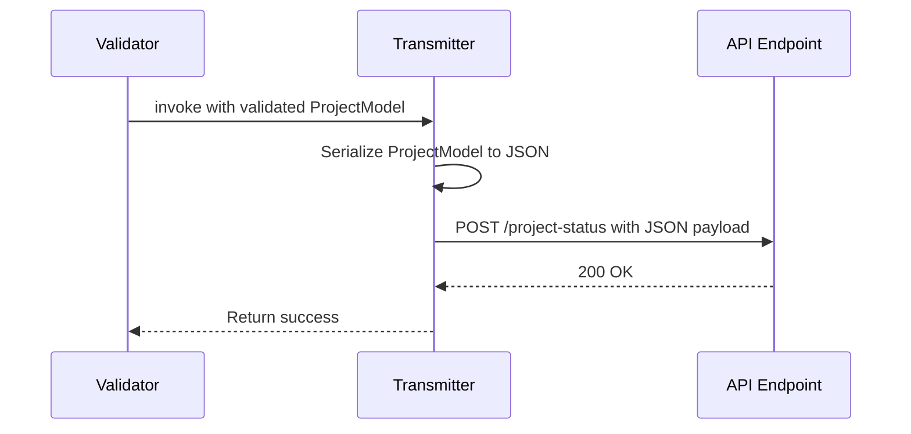
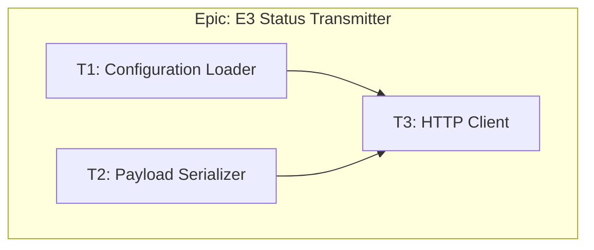
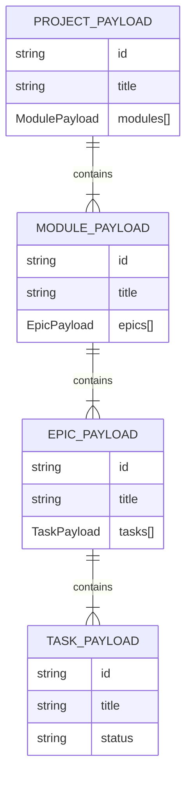
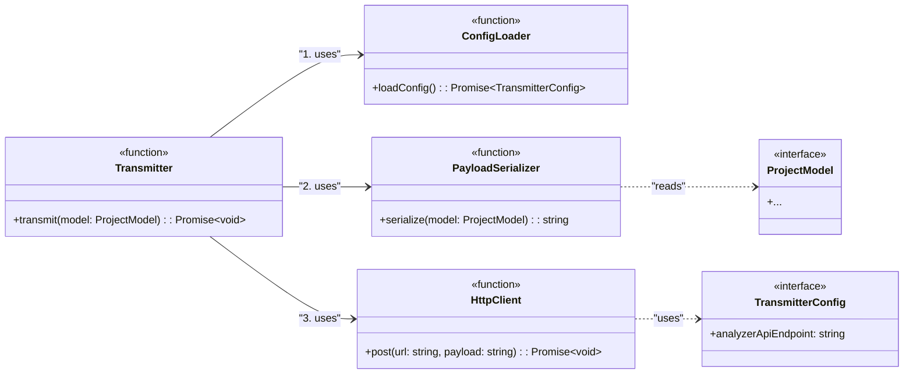
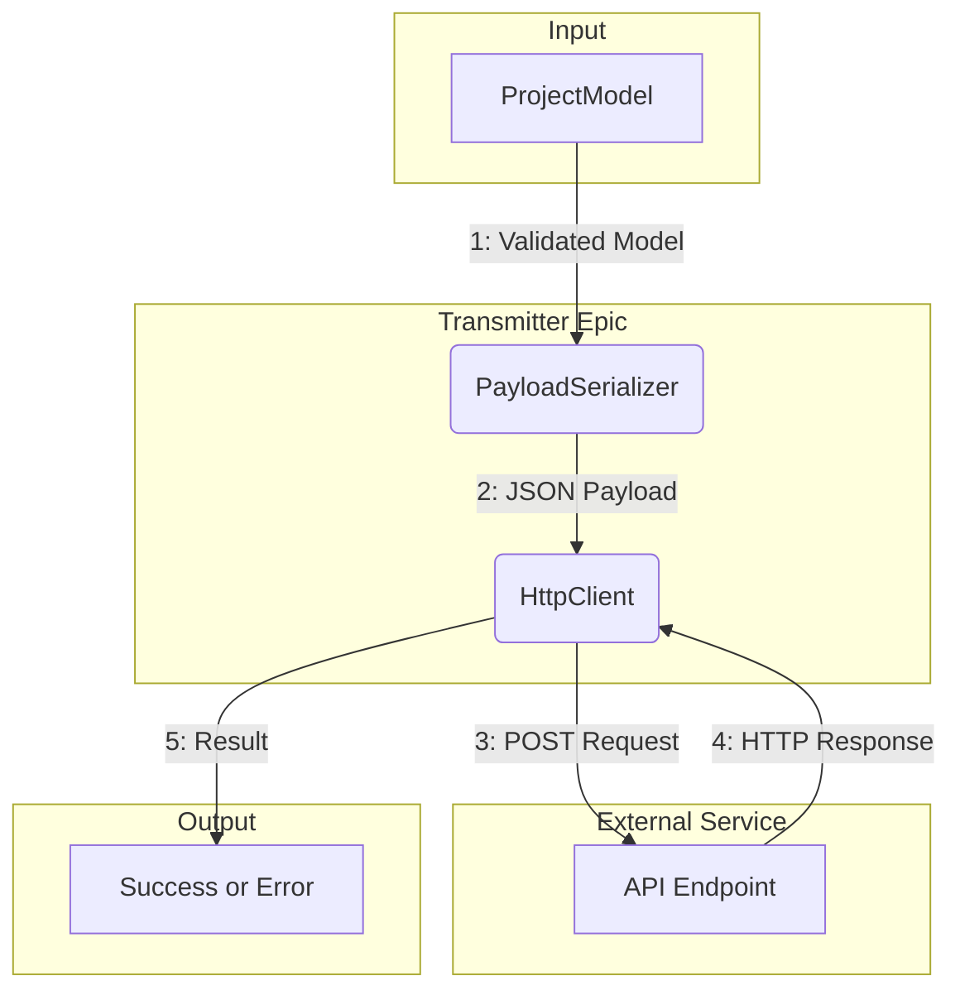
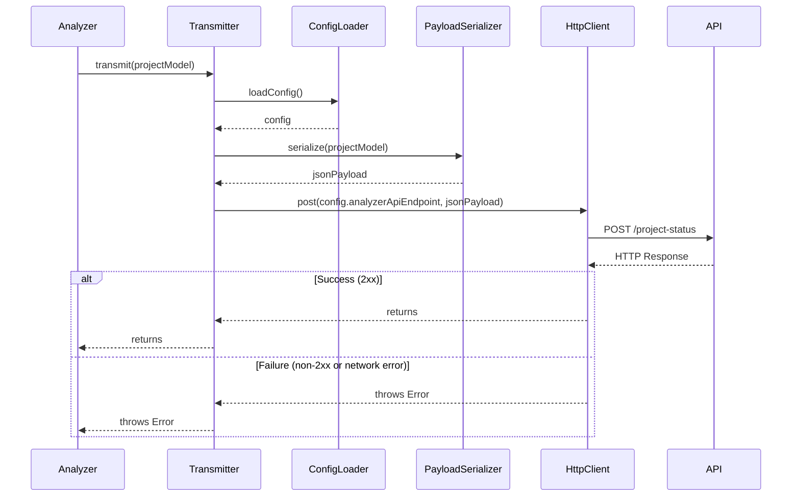

# Epic: E3: Status Transmitter

<!-- This document defines a complete, independent feature, including its business justification, architectural design, and implementation plan. It should be testable on its own, with dependencies on other epics limited to well-defined integration points. -->

---

## ✅ 1 Meta & Governance

### ✅ 1.2 Status

<!-- This section is auto-populated and updated to track the document's lifecycle. -->

- **Created:** 2025-07-16 02:00
- **Last Updated:** 2025-07-16 02:00

### ✅ 1.3 Priority Drivers

<!-- List the stable Driver IDs from the root documentation that justify this epic's priority. -->

- [TEC-Dev_Productivity_Blocker](/docs/documentation-driven-development.md#tec-dev_productivity_blocker)

---

## ✅ 2 Business & Scope

### ✅ 2.1 Overview

<!-- Provide a concise, bulleted list outlining the epic's identity, mission, and boundaries. -->

- **Core Function**: Takes the validated, in-memory `ProjectModel` and serializes it into a JSON payload for transmission.
- **Key Capability**: Implements the HTTP client logic required to securely and reliably send the project status data to the configured external API endpoint.
- **Business Value**: Completes the automated status reporting workflow by making the analyzed data available to external systems, enabling real-time project monitoring and stakeholder visibility.

### ✅ 2.2 Business Context

This epic represents the final, critical step in the automated status reporting workflow. After the `E1: Parser` has built the `ProjectModel` and the `E2: Validator` has confirmed its integrity, the `E3: Transmitter` takes over. Its sole purpose is to serialize this validated model into a JSON payload and send it to the external monitoring dashboard via an HTTP POST request.

This handoff is crucial for providing real-time visibility into project health. A failure at this stage means the central dashboard becomes stale, undermining the core value proposition of the entire toolchain. Therefore, this epic must be robust, with clear error handling and reliable network communication.

#### ✅ 2.2.1 Key Workflows

The transmitter is the final actor in the **Automated Status Reporting** workflow.



#### ✅ 2.2.3 Core Business Rules

- **Fail-Fast on Network/API Errors**: The transmitter MUST immediately abort the commit process (by throwing an error) if the external API endpoint is unreachable, returns a non-2xx status code, or the request times out. This ensures the developer is instantly aware that the central dashboard is out of sync.
- **Content-Type Header**: All outgoing requests MUST include the `Content-Type: application/json` header to ensure the receiving API correctly interprets the payload.
- **Configuration Driven**: The target API endpoint URL MUST NOT be hardcoded. It must be read from the project's configuration (`ddd.config.json` or an environment variable), allowing for different endpoints in different environments (e.g., dev, staging, prod).

#### ✅ 2.2.4 User Stories

<!-- List the user-centric goals for this epic. -->

- As a **DDD Developer**, I want the tool to automatically send the analyzed project data to our central dashboard, so that my team's progress is always visible.
- As a **DDD Developer**, I want the commit to fail if the data transmission fails, so that I know the dashboard is not up-to-date.

### ✅ 2.4 Acceptance Criteria

| ID   | Criterion                                                                                                                                     | Test Reference        |
| :--- | :-------------------------------------------------------------------------------------------------------------------------------------------- | :-------------------- |
| AC-1 | The transmitter correctly serializes the `ProjectModel` into a JSON string.                                                                   | `transmitter.test.ts` |
| AC-2 | The transmitter sends a `POST` request to the configured API endpoint with the correct JSON payload and `Content-Type` header.                | `transmitter.test.ts` |
| AC-3 | The transmitter successfully handles a 2xx response from the API and allows the commit to proceed.                                            | `transmitter.test.ts` |
| AC-4 | The transmitter throws a specific `ApiError` if the API responds with a non-2xx status code, causing the commit to fail.                      | `transmitter.test.ts` |
| AC-5 | The transmitter throws a specific `NetworkError` if the API endpoint is unreachable (e.g., DNS failure, timeout), causing the commit to fail. | `transmitter.test.ts` |
| AC-6 | The transmitter correctly reads the `analyzerApiEndpoint` from the configuration.                                                             | `config.test.ts`      |

---

## ✅ 3 Planning & Decomposition

### ✅ 3.1 Roadmap (In-Focus Items)

| ID  | Task                                                        | Priority | Priority Drivers                                                                                       | Status         | Depends On                                                                                           | Summary                                                                                           |
| :-- | :---------------------------------------------------------- | :------- | :----------------------------------------------------------------------------------------------------- | :------------- | :--------------------------------------------------------------------------------------------------- | :------------------------------------------------------------------------------------------------ |
| T1  | [Configuration Loader](./m1-e3-t1-config-loader.task.md)    | 🟥 High  | [TEC-Dev_Productivity_Blocker](/docs/documentation-driven-development.md#tec-dev_productivity_blocker) | 💡 Not Started | —                                                                                                    | Implement a utility to load the `analyzerApiEndpoint` from the configuration file or environment. |
| T2  | [Payload Serializer](./m1-e3-t2-payload-serializer.task.md) | 🟥 High  | [TEC-Dev_Productivity_Blocker](/docs/documentation-driven-development.md#tec-dev_productivity_blocker) | 💡 Not Started | —                                                                                                    | Implement the logic to convert the in-memory `ProjectModel` into a JSON string.                   |
| T3  | [HTTP Client](./m1-e3-t3-http-client.task.md)               | 🟥 High  | [TEC-Dev_Productivity_Blocker](/docs/documentation-driven-development.md#tec-dev_productivity_blocker) | T1, T2         | Implement the function to send the JSON payload to the configured API endpoint and handle responses. |

### ✅ 3.2 Backlog / Icebox

- **Task: Add a Retry Mechanism with Exponential Backoff** - Deferred for MVP. The current fail-fast approach is sufficient for the initial rollout. A retry mechanism would add resilience but also complexity.
- **Task: Implement Gzip Compression for Payloads** - Deferred. For now, the JSON payloads are expected to be small. Compression can be added later if payload size becomes a performance concern.
- **Task: Support for Authentication Tokens (e.g., Bearer Token)** - Deferred. The initial target API is assumed to be on a private network without authentication. This can be added when the tool needs to integrate with secured, public-facing APIs.

### ✅ 3.3 Dependencies

| ID  | Dependency On                                              | Type     | Status         | Notes                                                                                              |
| :-- | :--------------------------------------------------------- | :------- | :------------- | :------------------------------------------------------------------------------------------------- |
| D-1 | [E1: Documentation Parser](../m1-e1-parser/)               | Internal | 💡 Not Started | The `ProjectModel` from the parser is the primary input for this epic.                             |
| D-2 | [E2: Schema Validator](../m1-e2-validator/)                | Internal | 💡 Not Started | This epic only operates on a `ProjectModel` that has been successfully validated by the validator. |
| D-3 | External Tracking API                                      | External | ❌ Blocked     | A stable, documented, and accessible API endpoint is required to send the status data to.          |
| D-4 | [Configuration Schema](../../project.md#7.2-configuration) | Internal | ✅ Complete    | The mechanism for configuring the `analyzerApiEndpoint` is already defined at the project level.   |

### ✅ 3.4 Decomposition Graph



---

## ✅ 4 High-Level Design

### ✅ 4.1 Current Architecture

This is a new epic being developed from scratch; there is no existing system.

### ✅ 4.2 Target Architecture

<!-- Describe the proposed "to-be" state of the system after this epic is implemented. -->

#### ✅ 4.2.1 Data Models

The primary data model for this epic is the JSON payload that will be sent to the external API. This payload is a serialized representation of the `ProjectModel` created by the `E1: Parser`. The structure is hierarchical, mirroring the documentation itself.



#### ✅ 4.2.2 Components

The transmitter is designed as a set of focused, single-responsibility functions that are orchestrated by a main `transmit` function.



#### ✅ 4.2.3 Data Flow

The data flow for the transmitter is linear and straightforward, moving from internal data structures to an external service.



#### ✅ 4.2.4 Control Flow

The control flow is orchestrated by the main `transmit` function, which coordinates its dependencies to perform the data transmission.



#### ✅ 4.2.5 Integration Points

##### ✅ 4.2.5.1 Upstream Integrations

- **Trigger**: The `Transmitter` is invoked by the main `analyzer` script after the `Parser` and `Validator` epics have completed successfully.
- **Input Data**: It receives the validated `ProjectModel` object as its primary input. It also reads the `analyzerApiEndpoint` from the configuration system.

##### ✅ 4.2.5.2 Downstream Integrations

- **Completion Trigger**: The `Transmitter` makes an HTTP `POST` request to the external API.
- **Output Data**: The body of the `POST` request contains the serialized `ProjectModel` as a JSON payload.
- **Success/Failure Signal**: The function either returns successfully (on a 2xx response) or throws a specific `NetworkError` or `ApiError`, which signals the calling `analyzer` script to abort the commit.

#### ✅ 4.2.6 Exposed API

This epic exposes a single function to the main `analyzer` module.

```typescript
/**
 * Transmits the project model to the configured external API endpoint.
 *
 * This function orchestrates the configuration loading, serialization,
 * and HTTP POST request. It will throw a specific error if any part
 * of the process fails, which is then caught by the main analyzer
 * script to abort the commit.
 *
 * @param projectModel The validated project model to transmit.
 * @returns A promise that resolves when the data is successfully sent.
 * @throws {ConfigError | NetworkError | ApiError} On failure.
 */
export async function transmit(projectModel: ProjectModel): Promise<void>;
```

### ✅ 4.4 Non-Functional Requirements

#### ✅ 4.4.1 Performance

| ID      | Requirement                                                                                                | Priority  |
| :------ | :--------------------------------------------------------------------------------------------------------- | :-------- |
| PERF-01 | The HTTP POST request to the external API should have a timeout of 5 seconds to avoid blocking the commit. | 🟥 High   |
| PERF-02 | The serialization of the `ProjectModel` to a JSON string should be negligible (< 50ms).                    | 🟧 Medium |

#### ✅ 4.4.2 Security

| ID     | Requirement                                                                                                                              | Priority  |
| :----- | :--------------------------------------------------------------------------------------------------------------------------------------- | :-------- |
| SEC-01 | The transmitter must use HTTPS for all API communications to ensure data is encrypted in transit.                                        | 🟥 High   |
| SEC-02 | The tool must not log the full JSON payload by default to avoid leaking sensitive project information into CI/CD logs or local consoles. | 🟧 Medium |

#### ✅ 4.4.3 Reliability

| ID     | Requirement                                                                                                                          | Priority |
| :----- | :----------------------------------------------------------------------------------------------------------------------------------- | :------- |
| REL-01 | The transmitter must reliably fail the commit (by throwing an error) if the API returns a non-2xx status code.                       | 🟥 High  |
| REL-02 | The transmitter must reliably fail the commit if a network error (e.g., DNS failure, timeout) prevents communication with the API.   | 🟥 High  |
| REL-03 | The transmitter must fail gracefully with a `ConfigError` if the `analyzerApiEndpoint` is missing or malformed in the configuration. | 🟥 High  |

---

## ✅ 5 Maintenance and Monitoring

### ✅ 5.1 Current Maintenance and Monitoring

This is a new epic being developed from scratch; there is no existing maintenance and monitoring strategy.

### ✅ 5.2 Target Maintenance and Monitoring

<!-- Describe the proposed "to-be" internal implementation details. -->

#### ✅ 5.2.1 Error Handling

The transmitter will implement a set of custom, specific error classes to provide clear, actionable feedback to the developer in the console. All errors will cause the pre-commit hook to fail, aborting the commit.

| Error Type             | Trigger                                                                      | Action                           | User Feedback                                                               |
| :--------------------- | :--------------------------------------------------------------------------- | :------------------------------- | :-------------------------------------------------------------------------- |
| **ConfigError**        | The `analyzerApiEndpoint` is missing from the configuration or is invalid.   | Abort with `ConfigError`.        | `ERROR: Configuration invalid. Missing or malformed 'analyzerApiEndpoint'.` |
| **SerializationError** | The `ProjectModel` cannot be serialized to a JSON string.                    | Abort with `SerializationError`. | `ERROR: Failed to serialize project data. The data model may be corrupt.`   |
| **NetworkError**       | The API endpoint is unreachable due to a network issue (e.g., DNS, timeout). | Abort with `NetworkError`.       | `ERROR: Network issue. Could not connect to the API at [endpoint].`         |
| **ApiError**           | The API responds with a non-2xx status code.                                 | Abort with `ApiError`.           | `ERROR: API returned status [statusCode]. Failed to transmit project data.` |

#### ✅ 5.2.2 Logging & Monitoring

Logging provides visibility into the transmission process, especially for debugging failures. It inherits the log level from the main analyzer script.

| Level   | Condition                                                                  | Log Message Example                                                            |
| :------ | :------------------------------------------------------------------------- | :----------------------------------------------------------------------------- |
| `DEBUG` | The transmitter begins processing.                                         | `Transmitter starting. Reading configuration...`                               |
| `DEBUG` | The HTTP client is about to send the request.                              | `Sending POST request to [endpoint]...`                                        |
| `DEBUG` | The full JSON payload is logged (only if log level is explicitly `DEBUG`). | `Payload: [json_string]`                                                       |
| `INFO`  | The data is successfully transmitted (API returned 2xx).                   | `Successfully transmitted project status to [endpoint].`                       |
| `ERROR` | Any error from the `5.2.1 Error Handling` table is triggered.              | (Corresponds to the "User Feedback" column in the error handling table above.) |

---

## ✅ 6 Implementation Guidance

### ✅ 6.1 Implementation Plan

The implementation will follow the task decomposition, ensuring that foundational pieces are built and tested before the main orchestration logic.

| Phase                         | Scope / Deliverables                                                                                                                                | Key Artifacts                                                                                    | Exit Criteria                                                                                                  |
| :---------------------------- | :-------------------------------------------------------------------------------------------------------------------------------------------------- | :----------------------------------------------------------------------------------------------- | :------------------------------------------------------------------------------------------------------------- |
| **Phase 1: Core Utilities**   | - Implement the `ConfigLoader` to read the API endpoint URL.<br>- Implement the `PayloadSerializer` to convert the `ProjectModel` to a JSON string. | `src/modules/analyzer/transmitter/config.ts`<br>`src/modules/analyzer/transmitter/serializer.ts` | Both the config loader and serializer functions are fully unit-tested and working correctly in isolation.      |
| **Phase 2: HTTP Integration** | - Implement the `HttpClient` to handle the `POST` request.<br>- Implement the main `transmit` function to orchestrate all the components.           | `src/modules/analyzer/transmitter/client.ts`<br>`src/modules/analyzer/transmitter/index.ts`      | The main `transmit` function can successfully send a mock payload to a mock API endpoint and handle responses. |

### ✅ 6.2 Implementation Log / Steps

This log provides a granular, step-by-step checklist for developers, corresponding to the tasks defined in the roadmap.

- [ ] **Task T1: Configuration Loader**
  - [ ] Create `src/modules/analyzer/transmitter/config.ts`.
  - [ ] Implement `loadConfig` function to read `ddd.config.json`.
  - [ ] Add logic to allow environment variables (`DDD_ANALYZER_API_ENDPOINT`) to override the config file.
  - [ ] Throw a `ConfigError` if the endpoint URL is not found or is invalid.
- [ ] **Task T2: Payload Serializer**
  - [ ] Create `src/modules/analyzer/transmitter/serializer.ts`.
  - [ ] Implement `serialize` function that takes the `ProjectModel`.
  - [ ] Convert the model to a plain JavaScript object, stripping any class instances or complex types.
  - [ ] Use `JSON.stringify` to convert the object to a string.
- [ ] **Task T3: HTTP Client**
  - [ ] Create `src/modules/analyzer/transmitter/client.ts`.
  - [ ] Implement `post` function using a library like `axios` or the built-in `fetch`.
  - [ ] Set the `Content-Type` header to `application/json`.
  - [ ] Implement timeout handling.
  - [ ] Implement response handling to check for 2xx status codes.
  - [ ] Throw `ApiError` for non-2xx responses and `NetworkError` for connection issues.
- [ ] **Integration**
  - [ ] Create `src/modules/analyzer/transmitter/index.ts`.
  - [ ] Implement the main `transmit` function.
  - [ ] Call `loadConfig`, `serialize`, and `post` in the correct sequence.
  - [ ] Add appropriate logging for success and failure cases.

---

## ✅ 7 Quality & Operations

### ✅ 7.1 Testing Strategy / Requirements

Testing for the transmitter will rely heavily on mocking the network layer to simulate various API responses and network conditions. This allows us to verify the `HttpClient`'s behavior without making actual network calls.

| AC ID | Scenario                                                                                             | Test Type   | Tools / Runner | Notes                                                                                                                       |
| :---- | :--------------------------------------------------------------------------------------------------- | :---------- | :------------- | :-------------------------------------------------------------------------------------------------------------------------- |
| AC-1  | The `PayloadSerializer` correctly converts a mock `ProjectModel` into a valid JSON string.           | Unit        | Jest           | The test will create a sample `ProjectModel` and assert that the output of `serialize` matches the expected JSON string.    |
| AC-6  | The `ConfigLoader` correctly reads the `analyzerApiEndpoint` from a mock config file and env vars.   | Unit        | Jest           | Test both cases: reading from a fixture file and overriding with a mock environment variable.                               |
| AC-2  | The `HttpClient` sends a `POST` request with the correct payload and headers to a mock API endpoint. | Integration | Jest, MSW      | Use Mock Service Worker (MSW) to intercept the `POST` request and assert that its body and headers are correct.             |
| AC-3  | The `HttpClient` handles a successful 200 OK response from the mock API without throwing an error.   | Integration | Jest, MSW      | Configure MSW to return a 200 status and assert that the `post` function completes successfully.                            |
| AC-4  | The `HttpClient` throws an `ApiError` when the mock API returns a 500 Internal Server Error.         | Integration | Jest, MSW      | Configure MSW to return a 500 status and use `expect(...).rejects.toThrow(ApiError)` to verify the correct error is thrown. |
| AC-5  | The `HttpClient` throws a `NetworkError` when the mock API simulates a network failure.              | Integration | Jest, MSW      | Configure MSW to simulate a network error and assert that a `NetworkError` is thrown.                                       |

### ✅ 7.2 Configuration

The transmitter's behavior is controlled by the `analyzerApiEndpoint` setting, which is defined at the project level and inherited by this module. This ensures a single, consistent configuration point for the entire toolchain.

| Setting Name          | Module Dependency | Source            | Override Method                       | Notes                                                              |
| :-------------------- | :---------------- | :---------------- | :------------------------------------ | :----------------------------------------------------------------- |
| `analyzerApiEndpoint` | `m1-analyzer`     | `ddd.config.json` | `DDD_ANALYZER_API_ENDPOINT` (Env Var) | **Required**. The URL of the external API for status transmission. |

### ✅ 7.3 Alerting & Response

As a CLI tool integrated into a pre-commit hook, the primary "alerting" mechanism is immediate feedback to the developer via the console. The tool will throw specific errors, which are caught by the main `analyzer` script to provide a clear, actionable message before aborting the commit.

| Error Condition        | Response Plan                                                                                                                                                            |
| :--------------------- | :----------------------------------------------------------------------------------------------------------------------------------------------------------------------- |
| **ConfigError**        | The developer must check the `ddd.config.json` file and/or their local environment variables to ensure `analyzerApiEndpoint` is correctly defined.                       |
| **SerializationError** | This indicates a bug in the `PayloadSerializer`. The developer should investigate the `ProjectModel` being passed to it and the serialization logic itself.              |
| **NetworkError**       | The developer should check their internet connection, VPN status, and the availability of the external API endpoint.                                                     |
| **ApiError**           | The developer should check the status of the external API. The error message will include the HTTP status code, which can be used to debug the issue on the server-side. |

### ✅ 7.5 Local Test Commands

<!-- CLI commands to run tests locally for this epic. -->

```bash
yarn jest [path/to/this/epic/test.ts]
```

---

## ❓ 8 Reference

### ❓ 8.1 Appendices/Glossary

<!-- (Optional) Provide any additional information, definitions, or links to external resources. -->

- **[Term]**: [Definition of the term.]
