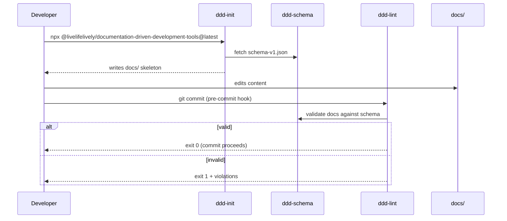
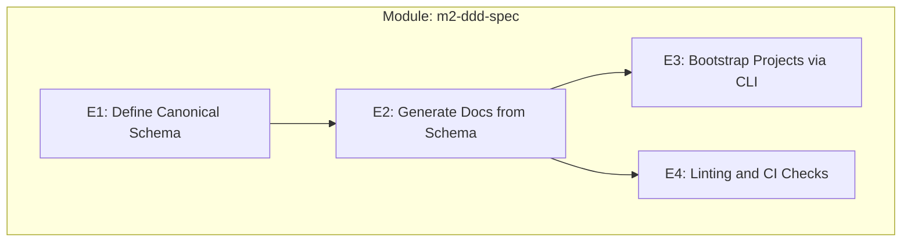
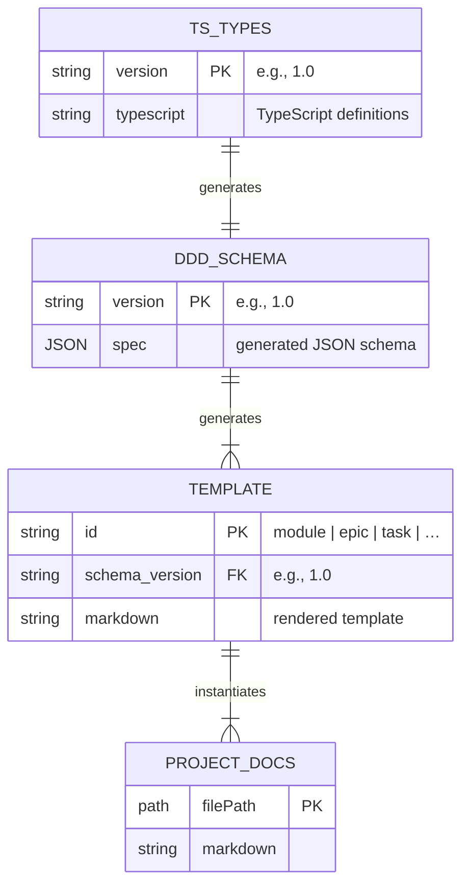
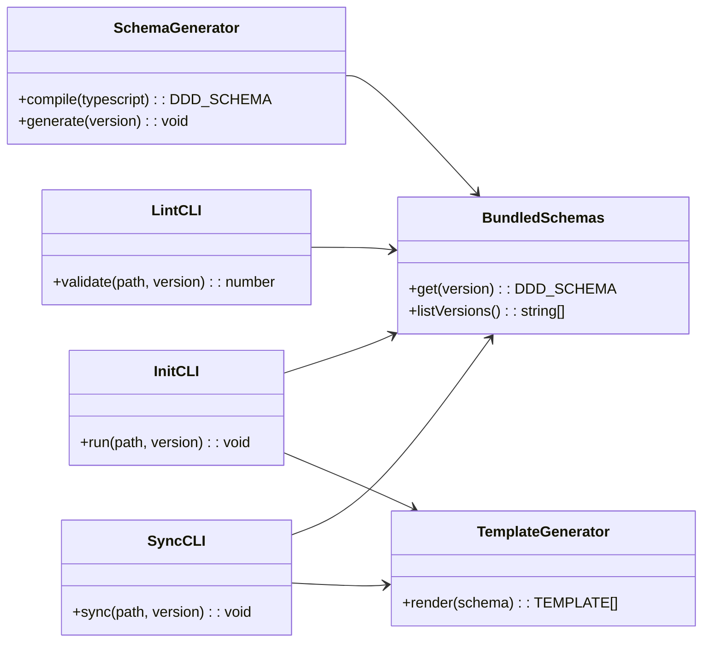
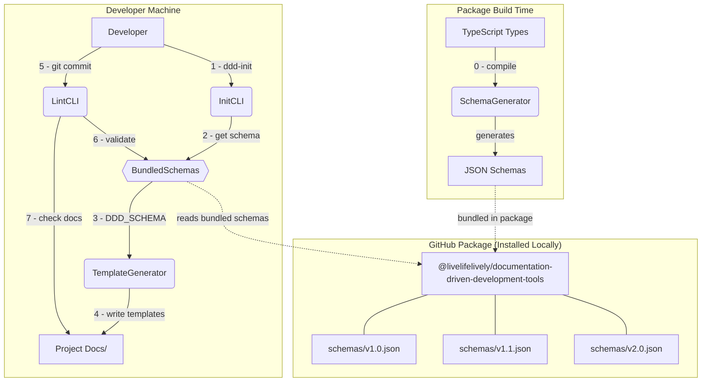
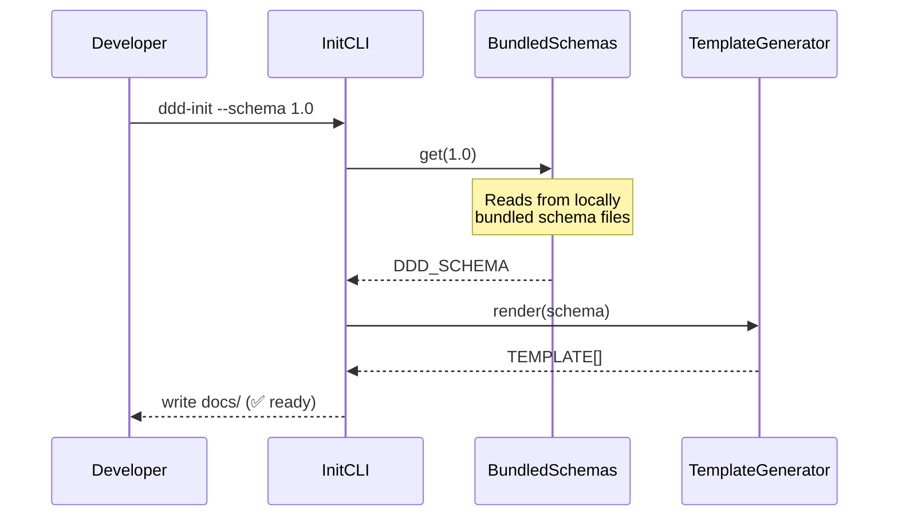

# Module: m2-ddd-spec

<!-- Canonical Specification & Generator for Documentation-Driven Development -->

---

## ✅ 1 Meta & Governance

### ✅ 1.2 Status

- **Created:** 2025-07-17 22:30
- **Last Updated:** 2025-07-17 22:30

### ✅ 1.3 Priority Drivers

- [TEC-Dev_Productivity_Blocker](/docs/documentation-driven-development.md#tec-dev_productivity_blocker)
- [TEC-Dev_Productivity_Enhancement](/docs/documentation-driven-development.md#tec-dev_productivity_enhancement)

---

## ✅ 2 Business & Scope

### ✅ 2.1 Overview

- **Core Function**: Provides the canonical specification and tooling ecosystem for Documentation-Driven Development methodology adoption.
- **Key Capability**: Authors DDD specifications as TypeScript types and generates machine-readable JSON schemas, automated generators, and enforcement tools that eliminate manual documentation overhead.
- **Business Value**: Enables teams to adopt DDD methodology with zero friction through automated initialization, validation, and maintenance of documentation standards.

### ✅ 2.2 Business Context

Current DDD adoption relies on manually edited Markdown templates, making it easy for projects to diverge. A single, machine-readable source of truth enables automation, reliable linting, and friction-free onboarding.

#### ✅ 2.2.1 User Journies

##### ✅ 2.2.1.1 Journey: Developer Onboards with DDD CLI

#### ✅ 2.2.2 User Personas

| Persona               | Goal                                                                                                |
| --------------------- | --------------------------------------------------------------------------------------------------- |
| **Platform Engineer** | Provide teams with a one-command bootstrap that yields fully compliant documentation structure.     |
| **CI Maintainer**     | Enforce documentation compliance automatically during continuous integration pipelines.             |
| **Tool Author**       | Consume a typed, versioned schema to build analysis / visualisation tools without scraping Markdown |
| **DDD Developer**     | Write docs once and rely on CLI to keep structure, headings and metadata in sync with the spec.     |

#### ✅ 2.2.3 Core Business Rules

- **Schema as Source of Truth**: JSON schema is authoritative; generated Markdown must never be manually edited.
- **Semantic Versioning**: Breaking changes require a MAJOR version bump and regeneration of all downstream artefacts.
- **Generator Idempotency**: Running `ddd-sync` multiple times on an unchanged repo produces no diff.

### ✅ 2.2.4 User Stories

- As a **Platform Engineer**, I want to initialise a new repository with the latest DDD schema in one command so that teams start fully compliant.
- As a **CI Maintainer**, I want a linter that fails builds when docs drift from the canonical schema so that documentation quality remains high.
- As a **Tool Author**, I want to consume the JSON spec directly so that I can build validators without Markdown scraping.

### ✅ 2.3 Success Criteria

- **Schema v1 Published**: `documentation-schema.json` (and typings) published to GitHub Packages as `@livelifelively/documentation-driven-development-tools`.
- **Generator CLI**: Running `npx @livelifelively/documentation-driven-development-tools@latest` in an empty repo produces a fully structured `docs/` tree that passes `ddd-lint`.
- **Round-Trip Integrity**: Converting generated Markdown back to JSON reproduces the original schema with no loss.

---

## ✅ 3 Planning & Decomposition

### ✅ 3.1 Roadmap (In-Focus Items)

| ID  | Epic                                                                                     | Priority  | Priority Drivers                                                                                               | Status         | Depends On | Summary                                                                                           |
| :-- | :--------------------------------------------------------------------------------------- | :-------- | :------------------------------------------------------------------------------------------------------------- | :------------- | :--------- | :------------------------------------------------------------------------------------------------ |
| E1  | [Define Canonical Schema](./m2-e1-schema-spec/m2-e1-schema-spec.epic.md)                 | 🟥 High   | [TEC-Dev_Productivity_Enhancement](/docs/documentation-driven-development.md#tec-dev_productivity_enhancement) | 💡 Not Started | —          | Authors DDD specification as TypeScript types and generates JSON schema with versioning strategy. |
| E2  | [Generate Docs from Schema](./m2-e2-template-generator/m2-e2-template-generator.epic.md) | 🟥 High   | [TEC-Dev_Productivity_Enhancement](/docs/documentation-driven-development.md#tec-dev_productivity_enhancement) | 💡 Not Started | E1         | Creates tooling to generate Markdown documentation from the JSON schema.                          |
| E3  | [Bootstrap Projects via CLI](./m2-e3-init-cli/m2-e3-init-cli.epic.md)                    | 🟧 Medium | [TEC-Dev_Productivity_Enhancement](/docs/documentation-driven-development.md#tec-dev_productivity_enhancement) | 💡 Not Started | E2         | Provides a CLI for initializing new projects with the DDD structure.                              |
| E4  | [Linting and CI Checks](./m2-e4-linter/m2-e4-linter.epic.md)                             | 🟧 Medium | [TEC-Dev_Productivity_Blocker](/docs/documentation-driven-development.md#tec-dev_productivity_blocker)         | 💡 Not Started | E2         | Develops a linter to enforce schema compliance in CI/CD pipelines.                                |

### ✅ 3.2 Backlog / Icebox

- **GraphQL Schema API**: Expose the spec via GraphQL for interactive tooling.
- **IDE Extensions**: VSCode/IntelliJ plugins for real-time DDD compliance checking and auto-completion.
- **Multi-Language Schema Support**: Generate schema bindings for Python, Java, and other languages beyond TypeScript.
- **Interactive CLI Mode**: `ddd-init --interactive` with guided setup wizard for complex project configurations.
- **Documentation Analytics**: Metrics and reporting on documentation completeness and quality across projects.
- **Schema Migration Tools**: Automated migration utilities when upgrading between major schema versions.

### ✅ 3.3 Dependencies

| ID  | Dependency On  | Type     | Status | Notes                                         |
| --- | -------------- | -------- | ------ | --------------------------------------------- |
| D-1 | Node.js ≥ 18   | External | ✅     | Required for ESM & native fetch.              |
| D-2 | TypeScript ≥ 4 | External | ✅     | Required for schema authoring and generation. |

### ❓ 3.4 Decomposition Graph

---

## ✅ 4 High-Level Design

### ✅ 4.0 Guiding Principles

- **TypeScript as Authoring Tool**: DDD specification is authored as TypeScript types, then compiled to JSON schema; all downstream artefacts (Markdown, templates, CLI tools) consume the generated JSON schema.
- **Bundled Distribution**: Multiple schema versions are packaged together for offline operation and backwards compatibility.
- **Language Agnostic Consumption**: Provide both JSON and TypeScript typings so that any language can consume the spec.
- **Extensibility**: Future schema versions may add fields but must preserve backward compatibility within a MAJOR version.

### ✅ 4.1 Current Architecture

This is a new module; no existing implementation.

### ✅ 4.2 Target Architecture

The following depicts the **module-level big picture**—enough detail for integration planning without drilling into epic-specific internals. Lower levels (epics/tasks) will zoom further.

#### ✅ 4.2.1 Data Models

Key points:

- **TS_TYPES** are the human-authored TypeScript definitions that define the DDD specification structure.
- **DDD_SCHEMA** is the generated JSON schema (multiple versions bundled within the package) - authoritative for all tooling.
- **TEMPLATE** records the generated Markdown skeletons per doc type, linked to specific schema versions for backwards compatibility.
- **PROJECT_DOCS** are concrete instances in downstream repos created from templates.

#### ✅ 4.2.2 Components

High-level roles:

- **SchemaGenerator** compiles TypeScript type definitions into JSON schemas and bundles them for distribution.
- **BundledSchemas** provides local access to JSON schemas bundled within the package (supports multiple versions for backwards compatibility).
- **TemplateGenerator** transforms a schema into Markdown templates.
- **InitCLI** bootstraps new projects.
- **SyncCLI** regenerates docs in existing projects.
- **LintCLI** validates docs against the spec.

#### ✅ 4.2.3 Data Flow

**Data Flow Steps:**

0. **Package Build Time**: SchemaGenerator compiles TypeScript type definitions into JSON schemas and bundles them in the package
1. Developer runs `ddd-init` to bootstrap a new project
2. InitCLI requests the specified schema version from BundledSchemas (locally bundled within the package)
3. BundledSchemas returns the generated JSON schema from local package resources
4. TemplateGenerator creates and writes Markdown templates to `docs/`
5. Developer commits changes, triggering LintCLI via git hook
6. LintCLI validates edited docs against the same locally-bundled schema version
7. Validation results determine commit success/failure

#### ✅ 4.2.4 Control Flow

**Additional CLI Command Flows:**

- **`ddd-lint`**: BundledSchemas → validate docs → exit 0/1 based on compliance
- **`ddd-sync`**: BundledSchemas → TemplateGenerator → overwrite existing docs with latest schema
- **Package consumption**: Other tools import bundled JSON schemas and TypeScript types directly from package resources

Details will be elaborated in the respective epics.

#### ✅ 4.2.5 Integration Points

##### ✅ 4.2.5.1 Upstream Integrations

- **GitHub Packages Registry**: one-time installation of `@livelifelively/documentation-driven-development-tools@<version>` package (contains bundled JSON schemas + CLI binaries).
- **Developer Workstations**: CLI tools and schemas available locally after package installation via npm/npx.

##### ✅ 4.2.5.2 Downstream Integrations

- **Project Repositories**: generates structured `docs/**` hierarchy with compliant Markdown files.
- **GitHub Actions CI**: `ddd-lint` exit codes (0=pass, 1=fail) control PR merge permissions and deployment gates.
- **Pre-commit Hooks**: `ddd-lint` validates documentation changes before code commits are allowed.
- **External Tools**: JSON schema and TypeScript types consumed by analysis/visualization tools via programmatic API.

#### ✅ 4.2.6 Exposed API

| API Surface                                    | Target Users    | Purpose                                                                | Key Options/Exports                                   |
| ---------------------------------------------- | --------------- | ---------------------------------------------------------------------- | ----------------------------------------------------- |
| `ddd-init [--schema <ver>] [--out-dir <path>]` | Developers      | Scaffold a new docs hierarchy from the canonical schema.               | `--schema`: version, `--out-dir`: target path         |
| `ddd-sync [--schema <ver>]`                    | Developers / CI | Re-generate docs to match updated schema version.                      | `--schema`: version to sync to                        |
| `ddd-lint [--config <path>]`                   | CI / pre-commit | Validate existing docs against schema; exits non-zero on violations.   | `--config`: custom validation rules                   |
| **Package: Bundled JSON Schemas**              | Other tools     | Multiple schema versions bundled in package: `schemas/v1.0.json`, etc. | Schema definitions, validation rules, version support |
| **Package: TypeScript Types**                  | TypeScript apps | Type definitions for schema structures and CLI interfaces.             | `DDDSchema`, `ProjectConfig`, CLI types               |

---

## ✅ 5 Maintenance and Monitoring

### ✅ 5.1 Current Maintenance and Monitoring

This is a new module; no existing maintenance and monitoring infrastructure.

### ✅ 5.2 Target Maintenance and Monitoring

#### ✅ 5.2.1 Error Handling

| Error Type                    | Trigger                                       | Action                  | User Feedback                                                       |
| :---------------------------- | :-------------------------------------------- | :---------------------- | :------------------------------------------------------------------ |
| **File System Error**         | Cannot read a required file or directory.     | Abort with exit code 1. | `ERROR: Cannot access [path]. Please check permissions.`            |
| **Schema Validation Error**   | A document violates the canonical schema.     | Abort with exit code 1. | `ERROR: Schema validation failed in [file]: [validation_details].`  |
| **Schema Version Error**      | Requested schema version not found in bundle. | Abort with exit code 1. | `ERROR: Schema version [version] not supported. Available: [list].` |
| **Template Generation Error** | Failed to generate template from schema.      | Abort with exit code 1. | `ERROR: Template generation failed: [error_details].`               |
| **CLI Argument Error**        | Invalid command-line arguments provided.      | Abort with exit code 1. | `ERROR: Invalid argument [arg]. Use --help for usage.`              |

#### ✅ 5.2.2 Logging & Monitoring

**Logging Strategy:**

- **Structured JSON Logs**: All CLI operations output structured JSON logs to stdout for collection by standard log aggregators (e.g., Fluentd, Logstash).
- **Log Levels**: Support configurable log levels (DEBUG, INFO, WARN, ERROR) via `--log-level` flag or `DDD_LOG_LEVEL` environment variable.
- **Operation Context**: Each log entry includes operation type, schema version used, file paths, and execution duration.

**Metrics & Monitoring:**

- **Usage Metrics**: Track CLI command usage, schema version adoption, and file generation statistics (when opt-in enabled).
- **Performance Metrics**: Monitor template generation times, validation durations, and file I/O performance.
- **Error Tracking**: Aggregate error patterns and schema validation failure types to improve user experience.

**Observability Features:**

- **Verbose Mode**: `--verbose` flag for detailed operation logging during development and troubleshooting.
- **Dry Run Mode**: `--dry-run` for all CLI commands to preview changes without file modifications.
- **Schema Version Reporting**: Built-in `ddd-info` command to show available schema versions, current project schema, and package version.

---

## ✅ 6 Implementation Guidance

### ✅ 6.1 Implementation Plan

| Phase                           | Scope / Deliverables                               | Key Artifacts                               | Exit Criteria                                                                     |
| ------------------------------- | -------------------------------------------------- | ------------------------------------------- | --------------------------------------------------------------------------------- |
| **Phase 1: Schema v1**          | Author TypeScript types + generate JSON schema.    | `src/types.ts`, `schema/ddd-schema-v1.json` | TypeScript types compile to valid JSON schema that validates against meta-schema. |
| **Phase 2: Markdown Generator** | Generate `documentation-schema.md` & templates.    | `scripts/generate-docs.ts`, generated docs  | Running generator produces files identical to committed versions.                 |
| **Phase 3: Init CLI**           | `ddd-init` scaffolds new project docs.             | `src/cli/init.ts`                           | CLI creates docs tree that passes `ddd-lint` on first run.                        |
| **Phase 4: Lint & Sync**        | `ddd-lint` validates docs; `ddd-sync` regenerates. | `src/cli/lint.ts`, `src/cli/sync.ts`        | CI job using lint exits 1 on violations.                                          |

---

## ✅ 7 Quality & Operations

### ✅ 7.1 Testing Strategy / Requirements

| Scenario                                                | Test Type | Tools                      |
| ------------------------------------------------------- | --------- | -------------------------- |
| TypeScript types compile to valid JSON schema           | Unit      | Jest + TypeScript compiler |
| CLI `ddd-init` creates a project that passes `ddd-lint` | E2E       | Jest + tmp-dirs            |

### ✅ 7.2 Configuration

| Setting Name       | Source            | Override Method                          | Notes                                                                          |
| :----------------- | :---------------- | :--------------------------------------- | :----------------------------------------------------------------------------- |
| `schema-version`   | CLI argument      | `--schema <version>`                     | Specifies which bundled schema version to use (e.g., "1.0", "1.1").            |
| `out-dir`          | CLI argument      | `--out-dir <path>`                       | Target directory for `ddd-init` command. Defaults to current directory.        |
| `log-level`        | CLI argument/env  | `--log-level <level>` or `DDD_LOG_LEVEL` | Controls logging verbosity: `debug`, `info`, `warn`, `error`. Default: `info`. |
| `package-registry` | npm configuration | `.npmrc` file                            | GitHub Packages registry URL for installation and updates.                     |
| `config-file`      | CLI argument      | `--config <path>`                        | Path to custom validation rules file for `ddd-lint` command.                   |

### ✅ 7.3 Alerting & Response

| Error Condition                     | Response Plan                                                           | Status         |
| ----------------------------------- | ----------------------------------------------------------------------- | -------------- |
| **Schema Validation Failure in CI** | Fail pipeline; highlight diff; block merge until fixed.                 | 💡 Not Started |
| **Broken Round-Trip Conversion**    | Open high-priority bug; revert offending commit or bump schema version. | 💡 Not Started |

### ✅ 7.4 Deployment Steps

1.  Publish schema & CLI package to GitHub Packages (`npm publish --registry=https://npm.pkg.github.com`).
2.  Tag Git release (`v1.0.0`).
3.  Update internal documentation to reference new version.

---

## ❓ 8 Reference

- **Schema Repo Examples**: [openapi-spec](https://github.com/OAI/OpenAPI-Specification) for versioned JSON + docs.
