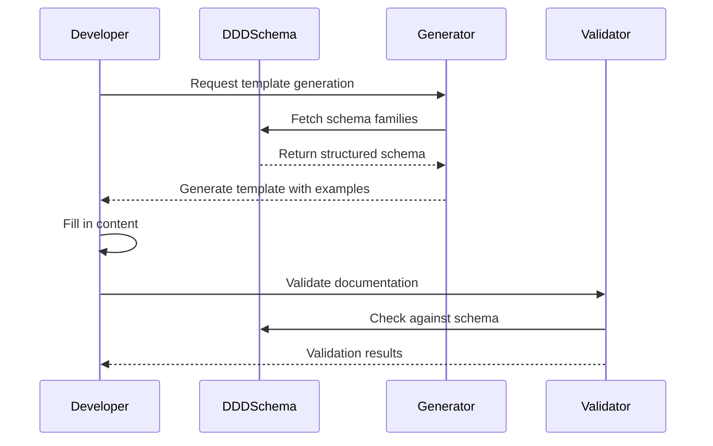
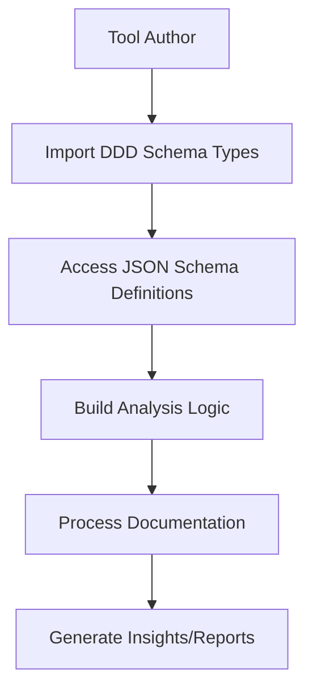
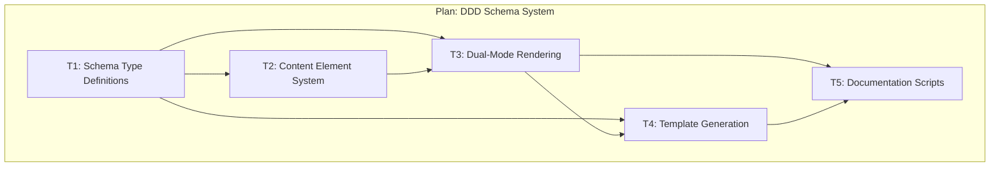
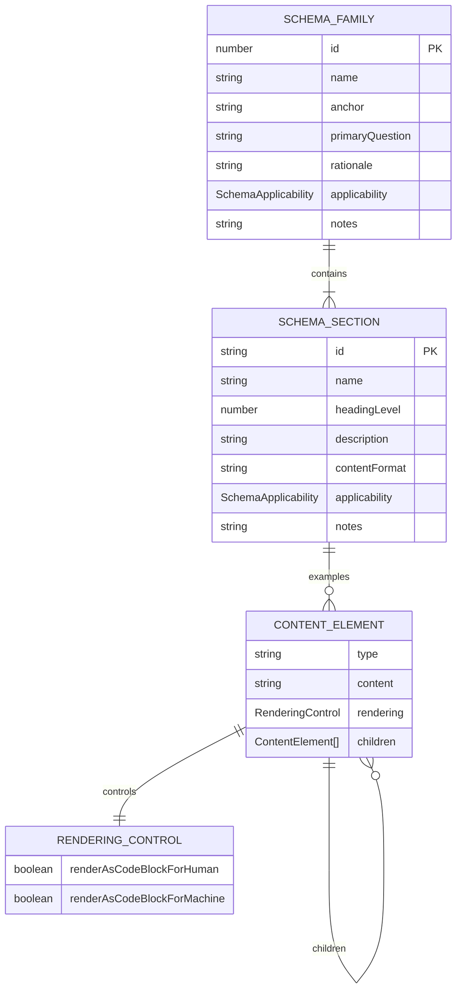
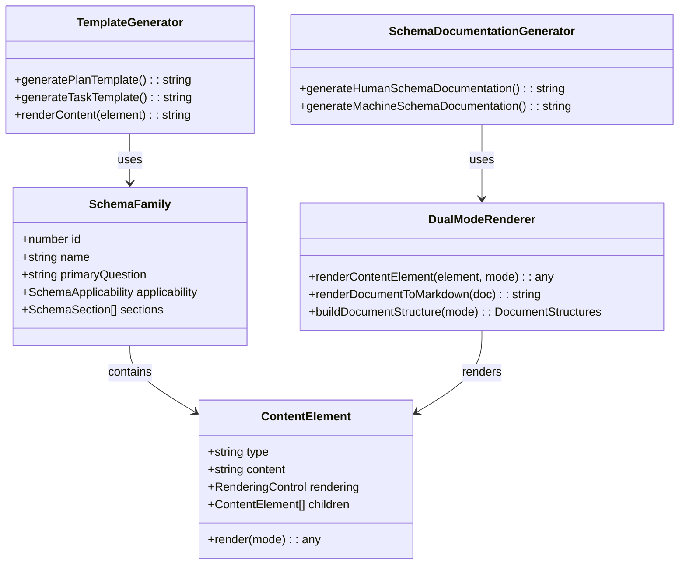
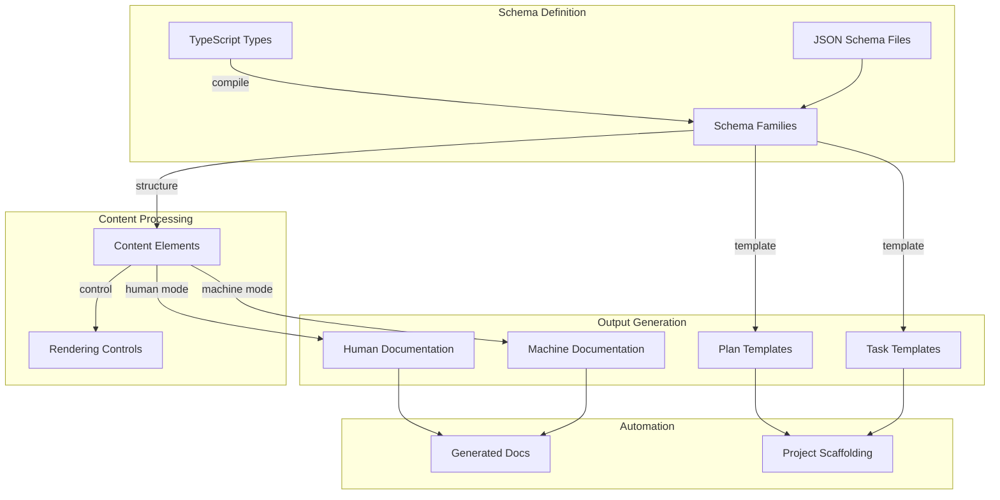
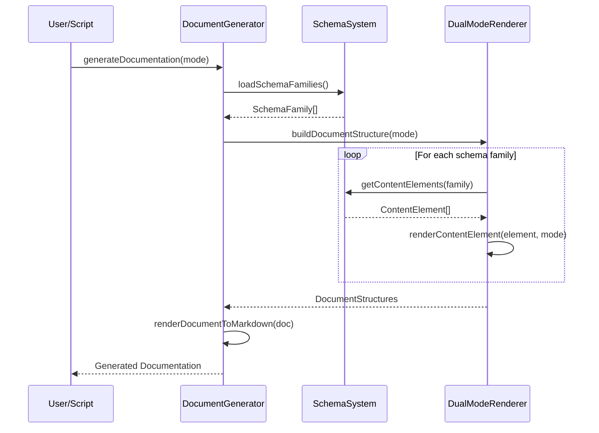

# Plan: DDD Specification & Schema System

<!-- Canonical specification and tooling ecosystem for Documentation-Driven Development methodology -->

---

## ✅ Meta & Governance

### ✅ Status

- **Created:** 2025-01-19 15:30
- **Last Updated:** 2025-01-19 15:30

### ✅ Priority Drivers

- [TEC-Dev_Productivity_Enhancement](/docs/ddd-2.md#tec-dev_productivity_enhancement)
- [TEC-Dev_Productivity_Blocker](/docs/ddd-2.md#tec-dev_productivity_blocker)

---

## ✅ Business & Scope

### ✅ Overview

- **Core Function**: Provides the canonical specification and schema system for Documentation-Driven Development methodology, enabling automated template generation and validation.
- **Key Capability**: Authors DDD specifications as TypeScript types and generates machine-readable JSON schemas with dual-mode rendering (human/machine) for comprehensive documentation automation.
- **Business Value**: Eliminates manual documentation maintenance overhead and enables teams to adopt DDD methodology with consistent, validated documentation standards.

### ✅ Business Context

Current DDD adoption relies on manually maintained templates and informal documentation standards, making it difficult for teams to maintain consistency and compliance. This plan establishes a formal schema system that serves as the single source of truth for all DDD documentation structures, enabling automation, reliable validation, and friction-free adoption.

The system bridges the gap between human-readable documentation and machine-processable schemas, ensuring that documentation can be both meaningful to developers and consumable by automated tools.

#### ✅ User Journeys

##### ✅ Journey: Developer Creates New Documentation

A developer needs to create new DDD-compliant documentation for a project component.



##### ✅ Journey: Tool Author Integrates DDD Schema

A tool author wants to build analysis tools that understand DDD documentation structure.



#### ✅ User Personas

| Persona                  | Goal                                                                                   |
| :----------------------- | :------------------------------------------------------------------------------------- |
| **Platform Engineer**    | Provide teams with consistent documentation standards and automated validation tools.  |
| **Documentation Author** | Create well-structured documentation efficiently without memorizing complex templates. |
| **Tool Developer**       | Build analysis and visualization tools that understand DDD documentation structure.    |
| **Team Lead**            | Ensure team documentation maintains quality and consistency across projects.           |

#### ✅ Core Business Rules

- **Schema as Source of Truth**: JSON schema definitions are authoritative; all generated templates and validation logic derive from schema.
- **Dual-Mode Rendering**: All content must be renderable in both human-readable and machine-processable formats.
- **Progressive Narrowing**: Schema families must support different levels of detail between Plans and Tasks.
- **Type Safety**: All schema definitions must be authored as TypeScript types to ensure compile-time validation.

#### ✅ User Stories

- As a **Platform Engineer**, I want to define documentation standards as code so that all teams follow consistent patterns automatically.
- As a **Documentation Author**, I want to generate compliant templates with examples so that I can focus on content rather than structure.
- As a **Tool Developer**, I want to consume structured schema definitions so that I can build reliable analysis tools without parsing markdown.
- As a **Team Lead**, I want automated validation of documentation so that quality standards are maintained without manual review overhead.

### ✅ Success Criteria

- **Schema Completeness**: All 8 schema families (Meta & Governance, Business & Scope, etc.) are fully defined with TypeScript types and JSON schema generation.
- **Template Generation**: System can generate both Plan and Task templates with proper examples and validation rules.
- **Dual-Mode Rendering**: Both human-readable and machine-processable outputs are generated correctly from the same schema source.
- **Round-Trip Integrity**: Generated documentation can be validated against the schema with no loss of information.

### ✅ Boundaries & Scope

#### ✅ In Scope

- Complete schema definition for all 8 DDD documentation families
- TypeScript type system for compile-time safety
- JSON schema generation for machine validation
- Dual-mode rendering system (human/machine readable)
- Template generation with embedded examples
- Content element system with rendering controls
- Documentation generation scripts and automation

#### ✅ Out of Scope

- CLI tooling for project initialization (future enhancement)
- Real-time validation during editing (future enhancement)
- Integration with external documentation platforms (future enhancement)
- Multi-language schema support beyond TypeScript (future enhancement)

### ✅ Core Business Processes

#### ✅ Process: Schema Development and Maintenance

- **Participants**: Platform Engineers, Documentation Specialists
- **Goal**: Maintain accurate and complete schema definitions that reflect DDD methodology requirements.
- **Workflow**:
  1. Author schema changes as TypeScript type definitions
  2. Generate JSON schema from TypeScript types
  3. Update examples and validation rules
  4. Generate human and machine documentation
  5. Validate generated output against test cases
  6. Deploy updated schema to production systems

#### ✅ Process: Documentation Template Generation

- **Participants**: Documentation Authors, Automated Systems
- **Goal**: Generate consistent, compliant documentation templates with appropriate examples and guidance.
- **Workflow**:
  1. Select document type (Plan or Task)
  2. Load appropriate schema family definitions
  3. Generate template structure with required/optional sections
  4. Embed relevant examples and guidance comments
  5. Apply rendering controls for target audience
  6. Output template ready for content authoring

---

## ✅ Planning & Decomposition

### ✅ Roadmap (In-Focus Items)

| ID  | Child Plan/Task                                            | Priority  | Priority Drivers                                                                    | Status      | Depends On | Summary                                         |
| :-- | :--------------------------------------------------------- | :-------- | :---------------------------------------------------------------------------------- | :---------- | :--------- | :---------------------------------------------- |
| T1  | [Schema Type Definitions](./p1-t1-schema-types.task.md)    | 🟥 High   | [TEC-Dev_Productivity_Enhancement](/docs/ddd-2.md#tec-dev_productivity_enhancement) | ✅ Complete | —          | Core TypeScript interfaces for schema families  |
| T2  | [Content Element System](./p1-t2-content-elements.task.md) | 🟥 High   | [TEC-Dev_Productivity_Enhancement](/docs/ddd-2.md#tec-dev_productivity_enhancement) | ✅ Complete | T1         | Structured content with rendering controls      |
| T3  | [Dual-Mode Rendering](./p1-t3-dual-rendering.task.md)      | 🟥 High   | [TEC-Dev_Productivity_Enhancement](/docs/ddd-2.md#tec-dev_productivity_enhancement) | ✅ Complete | T1, T2     | Human and machine readable output generation    |
| T4  | [Template Generation](./p1-t4-template-generation.task.md) | 🟧 Medium | [TEC-Dev_Productivity_Enhancement](/docs/ddd-2.md#tec-dev_productivity_enhancement) | ✅ Complete | T1, T3     | Plan and Task template generation with examples |
| T5  | [Documentation Scripts](./p1-t5-doc-scripts.task.md)       | 🟧 Medium | [TEC-Dev_Productivity_Enhancement](/docs/ddd-2.md#tec-dev_productivity_enhancement) | ✅ Complete | T3, T4     | Automation scripts for schema documentation     |

### ✅ Backlog / Icebox

- **CLI Integration**: Command-line tools for project initialization and validation (moved to separate plan)
- **Real-time Validation**: IDE extensions and real-time schema validation (future enhancement)
- **Multi-format Export**: Support for additional output formats beyond Markdown (future enhancement)
- **Schema Versioning**: Formal versioning system for schema evolution (future enhancement)
- **Performance Optimization**: Optimizations for large-scale documentation processing (future enhancement)

### ✅ Dependencies

| ID  | Dependency On     | Type     | Status      | Affected Plans/Tasks | Notes                                      |
| :-- | :---------------- | :------- | :---------- | :------------------- | :----------------------------------------- |
| D-1 | TypeScript ≥ 4.0  | External | ✅ Complete | All tasks            | Required for advanced type system features |
| D-2 | Node.js ≥ 18      | External | ✅ Complete | T5                   | Required for ESM and native fetch support  |
| D-3 | DDD-2 Methodology | Internal | ✅ Complete | All tasks            | Schema must reflect current DDD principles |

### ✅ Decomposition Graph



---

## ✅ High-Level Design

### ✅ Guiding Principles

- **Schema-Driven Architecture**: All documentation structure derives from formal schema definitions rather than ad-hoc templates.
- **Type Safety First**: TypeScript types serve as the authoritative source, with JSON schema generated for runtime validation.
- **Dual-Mode Design**: Every content element can render appropriately for both human consumption and machine processing.
- **Composable Content**: Content elements can be nested and combined to create rich, structured documentation.
- **Progressive Disclosure**: Schema supports both simple and complex use cases through optional sections and nested content.

### ✅ Current Architecture

This represents the implemented system architecture as it exists today.

#### ✅ Data Models



#### ✅ Components



#### ✅ Data Flow



#### ✅ Control Flow



#### ✅ Integration Points

##### ✅ Upstream Integrations

- **Schema JSON Files**: Read schema family definitions from JSON configuration files
- **TypeScript Compiler**: Generate JSON schema from TypeScript type definitions
- **DDD Methodology**: Implement current DDD-2 principles and structure requirements

##### ✅ Downstream Integrations

- **Documentation Generation**: Output human and machine readable documentation files
- **Template System**: Generate Plan and Task templates for project scaffolding
- **Validation Tools**: Provide schema definitions for future validation implementations
- **Analysis Tools**: Export structured data for documentation analysis and reporting

#### ✅ Exposed API

```typescript
// Main generation functions
export function generateHumanSchemaDocumentation(): string
export function generateMachineSchemaDocumentation(): string
export function generatePlanTemplate(): string
export function generateTaskTemplate(): string

// Core types and interfaces
export interface SchemaFamily { ... }
export interface ContentElement { ... }
export interface RenderingControl { ... }

// Schema data
export const fullSchema: SchemaFamily[]
```

### ✅ Target Architecture

The current implementation represents the target architecture for this plan. Future enhancements would extend this foundation with additional capabilities.

### ✅ Tech Stack & Deployment

- **Language**: TypeScript
- **Runtime**: Node.js ≥ 18
- **Module System**: ESM
- **Build Tool**: TypeScript Compiler (tsc)
- **Package Manager**: npm
- **Deployment**: npm package distribution
- **Output Formats**: Markdown, JSON

### ✅ Non-Functional Requirements

#### ✅ Performance

| ID      | Requirement                                                                           | Priority  |
| :------ | :------------------------------------------------------------------------------------ | :-------- |
| PERF-01 | Schema loading and processing must complete in < 500ms for typical documentation sets | 🟧 Medium |
| PERF-02 | Template generation must complete in < 100ms per template                             | 🟨 Low    |

#### ✅ Security

| ID     | Requirement                                                      | Priority  |
| :----- | :--------------------------------------------------------------- | :-------- |
| SEC-01 | Schema definitions must be validated against known safe patterns | 🟧 Medium |
| SEC-02 | Generated output must be sanitized to prevent injection attacks  | 🟧 Medium |

#### ✅ Reliability

| ID     | Requirement                                                  | Priority |
| :----- | :----------------------------------------------------------- | :------- |
| REL-01 | Schema validation must be deterministic and repeatable       | 🟥 High  |
| REL-02 | Generated documentation must preserve all source information | 🟥 High  |

---

## ✅ Maintenance and Monitoring

### ✅ Current Maintenance and Monitoring

#### ✅ Error Handling

| Error Type                    | Trigger                             | Action                 | User Feedback                                                    |
| :---------------------------- | :---------------------------------- | :--------------------- | :--------------------------------------------------------------- |
| **Schema Load Error**         | Cannot read schema definition files | Abort with exit code 1 | `ERROR: Cannot load schema from [path]. Check file permissions.` |
| **Type Validation Error**     | Invalid schema structure detected   | Abort with exit code 1 | `ERROR: Schema validation failed: [details]`                     |
| **Rendering Error**           | Content element rendering fails     | Abort with exit code 1 | `ERROR: Failed to render content element: [element_type]`        |
| **Template Generation Error** | Template creation fails             | Abort with exit code 1 | `ERROR: Template generation failed: [error_details]`             |

#### ✅ Logging & Monitoring

- **Console Logging**: Structured logging to console with configurable log levels
- **Progress Indicators**: Visual feedback during generation operations
- **Error Reporting**: Detailed error messages with context and suggested fixes
- **Performance Tracking**: Optional timing information for generation operations

### ✅ Target Maintenance and Monitoring

Current monitoring capabilities are adequate for the module's scope. Future enhancements may include structured logging and metrics collection.

---

## ✅ Implementation Guidance

### ✅ Implementation Plan

| Phase                                 | Scope / Deliverables                    | Key Artifacts                | Exit Criteria                                   |
| :------------------------------------ | :-------------------------------------- | :--------------------------- | :---------------------------------------------- |
| **Phase 1: Core Schema**              | TypeScript types and schema structure   | `types.ts`, `index.ts`       | All schema families defined with type safety    |
| **Phase 2: Content System**           | Content elements and rendering controls | Content element interfaces   | Rich content structures with dual-mode support  |
| **Phase 3: Rendering Engine**         | Human and machine output generation     | Rendering functions          | Both output modes generate correctly            |
| **Phase 4: Template Generation**      | Plan and Task template creation         | Template generator functions | Templates include proper examples and structure |
| **Phase 5: Documentation Automation** | Scripts and build integration           | Generation scripts           | Documentation builds automatically              |

### ✅ Prompts (LLM reuse)

For extending the schema system:

```
Add a new schema family to the DDD system with the following requirements:
- Family name: [FAMILY_NAME]
- Primary question: [QUESTION]
- Sections: [LIST_OF_SECTIONS]
- Applicability: [PLAN/TASK_RULES]

Follow the existing pattern in the schema JSON files and update the TypeScript types accordingly.
```

For creating new content elements:

```
Create a new content element type that supports:
- Element type: [TYPE_NAME]
- Data structure: [PROPERTIES]
- Rendering modes: [HUMAN/MACHINE_REQUIREMENTS]

Implement both the TypeScript interface and the rendering logic for dual-mode output.
```

---

## ✅ Quality & Operations

### ✅ Testing Strategy / Requirements

| Scenario                                           | Test Type   | Tools / Runner             | Notes                                     |
| :------------------------------------------------- | :---------- | :------------------------- | :---------------------------------------- |
| TypeScript types compile without errors            | Unit        | TypeScript compiler        | Ensures type safety of schema definitions |
| JSON schema files load correctly                   | Unit        | Jest + JSON validation     | Validates schema file structure           |
| Dual-mode rendering produces expected output       | Unit        | Jest + snapshot testing    | Compares human/machine output             |
| Template generation includes all required sections | Integration | Jest + template validation | Ensures templates follow DDD standards    |
| Documentation generation completes successfully    | Integration | Jest + file system mocking | End-to-end generation workflow            |

### ✅ Configuration

| Setting Name    | Source                | Override Method         | Notes                               |
| :-------------- | :-------------------- | :---------------------- | :---------------------------------- |
| `schema-path`   | Default relative path | Environment variable    | Path to schema JSON files           |
| `output-mode`   | Function parameter    | Command line argument   | Human or machine rendering mode     |
| `log-level`     | Default INFO          | `DDD_LOG_LEVEL` env var | Controls logging verbosity          |
| `template-path` | Default relative path | Environment variable    | Output path for generated templates |

### ✅ Alerting & Response

| Error Condition               | Response Plan                                                 | Status         |
| :---------------------------- | :------------------------------------------------------------ | :------------- |
| **Schema Validation Failure** | Log detailed error and abort operation with specific guidance | ✅ Implemented |
| **Template Generation Error** | Provide fallback template and log warning with error details  | ✅ Implemented |
| **Type Compilation Error**    | Display TypeScript errors with file and line information      | ✅ Implemented |

### ✅ Deployment Steps

1. Run TypeScript compilation: `npm run build`
2. Execute test suite: `npm test`
3. Generate documentation: `npm run generate-schema-doc`
4. Verify output files are created correctly
5. Commit generated documentation to version control

---

## ✅ Reference

### ✅ Appendices/Glossary

**Glossary:**

- **Schema Family**: A logical grouping of related documentation sections (e.g., "Business & Scope")
- **Content Element**: A structured piece of content with rendering controls (text, list, table, etc.)
- **Dual-Mode Rendering**: The ability to render content for both human reading and machine processing
- **Progressive Narrowing**: The principle that documentation becomes more specific as it moves from Plans to Tasks
- **Rendering Control**: Metadata that determines how content appears in different output modes

**References:**

- [DDD-2 Methodology Documentation](/docs/ddd-2.md)
- [Plan Template Structure](/docs/templates/plan.template.md)
- [TypeScript Handbook](https://www.typescriptlang.org/docs/) - For advanced type system features
- [JSON Schema Specification](https://json-schema.org/) - For schema validation standards

---
