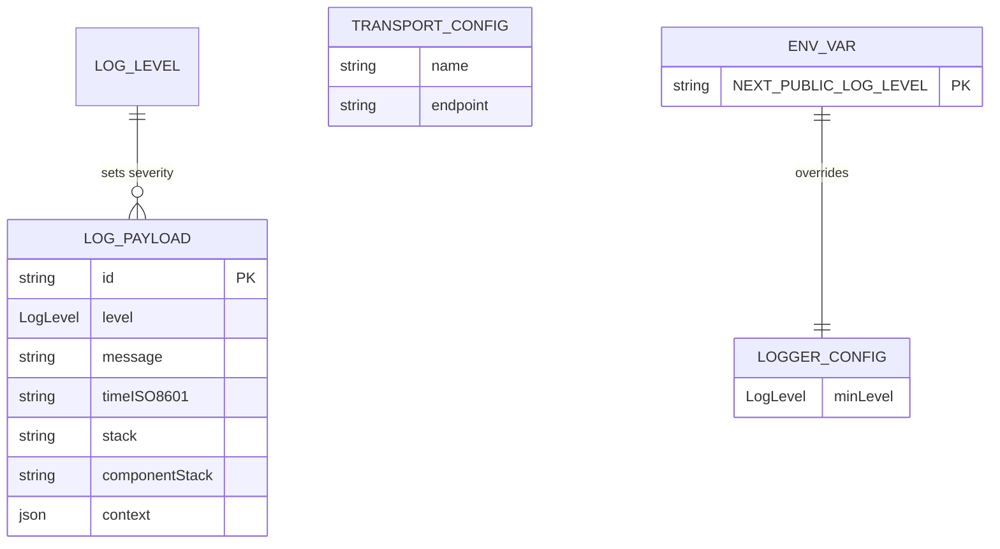

# [Plan Name]

## 1 Meta & Governance

### 1.2 Status

<!-- A section containing key status metrics for the document. The specific fields vary depending on whether it's a Plan or Task, with Tasks providing more detailed implementation tracking. -->

<!--
EXAMPLE:
- **Created:** [YYYY-MM-DD HH:MM]
- **Last Updated:** [YYYY-MM-DD HH:MM]
-->
[TODO: Add content for this section]


### 1.3 Priority Drivers

<!-- A bulleted list of stable Driver IDs that justify the priority of the artefact. -->

<!--
EXAMPLE:
- CBP-Break_Block_Revenue_Legal
- TEC-Prod_Stability_Blocker
-->
[TODO: Add content for this section]


---

## 2 Business & Scope

### 2.1 Overview

<!-- Provide a concise, bulleted list outlining what this artefact delivers and why it matters. -->

<!--
EXAMPLE:
- **Core Function**: Implements a robust, multi-level logging system for the document processing pipeline.
- **Key Capability**: Ensures both operational errors and business events are captured, categorized, and routed to monitoring tools.
- **Business Value**: Enables proactive issue resolution and performance analysis.
-->
[TODO: Add content for this section]


### 2.2 Business Context

<!-- Provides the narrative and domain-specific details behind the work. If no additional context beyond the parent level is needed, this section can contain `None (inherits from parent)`. -->

<!--
EXAMPLE:
Currently, pipeline failures are opaque, requiring developers to manually inspect logs, which slows down resolution time. This new logging system will provide structured, queryable data to our analytics dashboard, allowing support staff to diagnose issues without engineering intervention.
-->
[TODO: Add content for this section]


#### 2.2.1 User Journeys

<!-- A container for one or more `Journey` sections. This section should provide a complete overview of all primary user paths and interactions related to the document. -->

[TODO: Add content for this section]


##### 2.2.1.1 Journey: [Name]

<!-- A self-contained description of a single, specific user journey. The `[Name]` in the heading should be replaced with a descriptive title for the journey (e.g., "Analyst Processes a New Document"). This section must include a brief narrative explaining the journey's context and a diagram to visualize the flow. -->

<!--
EXAMPLE:
##### Journey: Analyst Processes a New Document

This journey describes the end-to-end path for a data analyst supervising the processing of a single document from selection to completion.
```mermaid
graph
A("Start") --&gt; B["Selects Document"];
B --&gt; C("Completes Pipeline");
```
##### Journey: DevOps Engineer Monitors Pipeline Health

This journey describes how a DevOps engineer interacts with the system's outputs to monitor for errors and performance issues.
```mermaid
sequenceDiagram
participant Pipeline
participant Logger
participant DevOps
Pipeline--&gt;>Logger: Log "Processing Failed" (ERROR)
DevOps->>Logger: Views and analyzes error
```
-->
[TODO: Add content for this section]


#### 2.2.2 User Personas

<!-- Table or list of personas involved. -->

<!--
EXAMPLE:
| Persona | Goal |
| :--- | :--- |
| **DevOps Engineer** | Monitor system health and diagnose infrastructure issues. |
| **Support Analyst** | Triage user-reported errors and identify root cause. |
-->
[TODO: Add content for this section]


#### 2.2.3 Core Business Rules

<!-- Enumerate domain rules that apply to this artefact. -->

<!--
EXAMPLE:
- All personally identifiable information (PII) must be logged at the `DEBUG` level or lower.
- Any log with a `FATAL` level must trigger an immediate PagerDuty alert.
- Log retention period is 90 days for `INFO` and 1 year for `ERROR` and above.
-->
[TODO: Add content for this section]


#### 2.2.4 User Stories

<!-- A list of user-centric stories that describe a piece of functionality from the end-user's perspective. This section is most critical for Plans but can be used at the Task level if it provides necessary context. The format "As a [persona], I want [to perform an action], so that I can [achieve a goal]" is recommended. -->

<!--
EXAMPLE:
- As a DevOps Engineer, I want to receive a real-time alert when a critical error occurs, so that I can immediately begin troubleshooting.
- As a Support Analyst, I want to filter logs by user ID, so that I can quickly investigate user-reported issues.
-->
[TODO: Add content for this section]


### 2.3 Success Criteria

<!-- Measurable or binary statements that define when a Plan is considered complete for its current phase. -->

<!--
EXAMPLE:
- All pipeline stages emit structured logs for success, failure, and key business events.
- The central dashboard can successfully ingest and display logs from all pipeline stages.
- A comprehensive set of alerts for critical failures is configured and tested.
-->
[TODO: Add content for this section]


### 2.5 Boundaries & Scope

<!-- A container heading for the explicit definition of the work's boundaries. Its content is in the child sections `2.5.1 In Scope` and `2.5.2 Out of Scope`. -->

[TODO: Add content for this section]


#### 2.5.1 In Scope

<!-- A bulleted list of functionalities, features, or outcomes that are explicitly included in the scope of the artefact. This list serves as a clear commitment of what will be delivered. -->

<!--
EXAMPLE:
- Processing of Lok Sabha Q&A documents in PDF format.
- Manual verification and correction workflows for all pipeline steps.
- Generation of a document-level knowledge graph.
-->
[TODO: Add content for this section]


#### 2.5.2 Out of Scope

<!-- A bulleted list of functionalities, features, or outcomes that are explicitly excluded from the scope of the artefact. This is critical for managing expectations and preventing future misunderstandings. It is often useful to list items that were considered but deliberately deferred. -->

<!--
EXAMPLE:
- Real-time document processing capabilities.
- Processing documents in formats other than PDF.
- Advanced user management and role-based access control.
-->
[TODO: Add content for this section]


### 2.6 Core Business Processes

<!-- A container for one or more `Process` sections. This section details the key, step-by-step business workflows that the Plan implements or affects. -->

[TODO: Add content for this section]


#### 2.6.1 Process: [Name]

<!-- A self-contained description of a single business process. The `[Name]` should be a descriptive title (e.g., "Document Ingestion and Triage"). This section should detail the participants, goals, and steps of the process. -->

<!--
EXAMPLE:
#### Process: Manual Review
- **Participants**: Data Scientist
- **Goal**: To validate the accuracy of automated text extraction from a source PDF.
- **Workflow**:
- 1. Analyst selects a document in the "Pending Review" state.
- 2. The UI displays the source PDF alongside the extracted text.
- 3. Analyst compares the two and makes corrections to the text.
- 4. Analyst approves the corrected text, advancing the document to the "Chunking" state.
-->
[TODO: Add content for this section]


---

## 3 Planning & Decomposition

### 3.1 Roadmap (In-Focus Items)

<!-- A table of direct child Plans/Tasks that are currently planned for implementation in the active cycle. -->

<!--
EXAMPLE:
| ID | Child Plan/Task | Priority | Priority Drivers | Status | Depends On | Summary |
| :--- | :--- | :--- | :--- | :--- | :--- | :--- |
| P1 | [Backend Plan](p1-backend.plan.md) | 🟥 High | [CBP-Break_Block_Revenue_Legal](/docs/documentation-driven-development.md#cbp-break_block_revenue_legal) | 💡 Not Started | — | Core backend services and APIs. |
| T1 | [Database Setup](p1-t1-database.task.md) | 🟧 Medium | [TEC-Prod_Stability_Blocker](/docs/documentation-driven-development.md#tec-prod_stability_blocker) | 💡 Not Started | — | Configure production database. |
-->
[TODO: Add content for this section]


### 3.2 Backlog / Icebox

<!-- A list of direct child Plans/Tasks that have been considered but are not scheduled for the current implementation cycle. This is crucial for capturing scope decisions. -->

<!--
EXAMPLE:
- **Reporting Plan**: Deferred to Q4 due to dependency on new analytics service.
- **Real-time Collaboration Features**: Moved to Icebox as it is outside the scope of the current MVP.
-->
[TODO: Add content for this section]


### 3.3 Dependencies

<!-- An explicit list of internal or external dependencies that must be resolved before this Plan/Task can be completed. -->

<!--
EXAMPLE:
| ID | Dependency On | Type | Status | Affected Plans/Tasks | Notes |
| :--- | :--- | :--- | :--- | :--- | :--- |
| D-1 | `shared-ui-library` v2.1+ | External | ❌ Blocked | `p1-frontend` | Awaiting release from Platform team. |
| D-2 | Plan `p2-user-profiles` | Internal | ✅ Complete | `p3-reporting` | User schema is now finalized. |
-->
[TODO: Add content for this section]


### 3.4 Decomposition Graph

<!-- A Mermaid diagram that visually represents the dependencies and sequencing of the child Plans/Tasks listed in the `3.1 Roadmap`. This graph shows the relationship between child Plans and Tasks, clarifying the critical path and helping developers understand the required order of implementation. -->

<!--
EXAMPLE:
```mermaid
graph
subgraph Plan: User Authentication
        P1["Plan: Backend Auth"]
        T1["Task: Create UI form"]
        T2["Task: Implement validation"]
        T3["Task: Add API endpoint"]
        T4["Task: Write integration tests"]
    end
    P1 --&gt; T1
    T1 --&gt; T2
    T2 --&gt; T3
    T3 --&gt; T4
```
-->
[TODO: Add content for this section]


---

## 4 High-Level Design

### 4.0 Guiding Principles

<!-- A list of high-level architectural rules, patterns, or constraints that apply to the entire artefact (e.g., "All UI components must be stateless," "All services must be idempotent"). These principles guide all subsequent design decisions. -->

<!--
EXAMPLE:
- **Stateless Services**: All backend services should be stateless to allow for horizontal scaling.
- **Event-Driven**: Communication between major components should be asynchronous and event-driven where possible.
-->
[TODO: Add content for this section]


### 4.1 Current Architecture

[TODO: Add content for this section]


#### 4.1.1 Data Models

[TODO: Add content for this section]


#### 4.1.2 Components

[TODO: Add content for this section]


#### 4.1.3 Data Flow

[TODO: Add content for this section]


#### 4.1.4 Control Flow

[TODO: Add content for this section]


#### 4.1.5 Integration Points

[TODO: Add content for this section]


##### 4.1.5.1 Upstream Integrations

[TODO: Add content for this section]


##### 4.1.5.2 Downstream Integrations

[TODO: Add content for this section]


### 4.2 Target Architecture

[TODO: Add content for this section]


#### 4.2.1 Data Models

<!-- The structure of data at a high level, often represented as an Entity-Relationship Diagram. This section defines the core data entities and their relationships before detailing the components that manage them. -->

<!--
EXAMPLE:

-->
[TODO: Add content for this section]


#### 4.2.2 Components

<!-- A diagram illustrating the main components and their relationships. The term "component" is used broadly and does not necessarily map to a class; it represents a logical block of functionality. -->

<!--
EXAMPLE:
```mermaid
classDiagram
direction LR

    class LogPayload {
        <<type>>
        +LogLevel level
        +string message
        +string timeISO8601
        +string stack
        +string componentStack
        +Record<string,any> context
    }

    class ClientLogger {
        <<interface>>
        +log(payload: LogPayload): Promise<void>
    }

    class ConsoleTransport {
        +log(payload: LogPayload): Promise<void>
    }

    class HttpTransport {
        +string endpoint
        +log(payload: LogPayload): Promise<void>
    }

    class CompositeLogger {
        +ClientLogger[] delegates
        +log(payload: LogPayload): Promise<void>
    }

    class LoggerConfig {
        +LogLevel minLevel
        +TransportConfig[] transports
    }

    class TransportConfig {
        +string name
        +string endpoint
    }

    class LoggerFactory {
        +create(config: LoggerConfig): ClientLogger
    }

    class BuildLogPayload {
        <<function>>
    }

    class SingleCallGuard {
        <<function>>
    }

    class AppErrorBoundary {
        +ClientLogger logger
        +componentDidCatch(error, info): void
    }

    %% Inheritance / Implementation
    ClientLogger <|.. ConsoleTransport
    ClientLogger <|.. HttpTransport
    ClientLogger <|.. CompositeLogger

    %% Associations / Composition
    CompositeLogger o-- ClientLogger : delegates
    LoggerFactory --&gt; LoggerConfig
    LoggerFactory --&gt; ClientLogger : returns
    LoggerFactory --&gt; TransportConfig
    AppErrorBoundary --&gt; ClientLogger : uses
    AppErrorBoundary --&gt; SingleCallGuard : guards
    BuildLogPayload --&gt; LogPayload : returns
    AppErrorBoundary ..> BuildLogPayload : builds
```
-->
[TODO: Add content for this section]


#### 4.2.3 Data Flow

<!-- A diagram showing how data moves between components, with numbered steps to indicate the sequence of actions. -->

<!--
EXAMPLE:
```mermaid
graph
TD
    subgraph "Input"
        A[Component A]
    end

    subgraph "System"
        B(Component B)
        C(Component C)
    end

    subgraph "External Resource"
        D[Database]
    end

    subgraph "Output"
        E[Component D]
    end

    A -- "1 - Invoke with" --&gt; B
    B -- "2 - Process" --&gt; C
    C -- "3 - Write to" --&gt; D
    C -- "4 - Return" --&gt; E
```
-->
[TODO: Add content for this section]


#### 4.2.4 Control Flow

<!-- A diagram showing the sequence of interactions between components. -->

<!--
EXAMPLE:
```mermaid
sequenceDiagram
participant User
    participant API
    participant AuthSvc
    User->>API: POST /login
    API->>AuthSvc: ValidateCredentials(user, pass)
    AuthSvc--&gt;>API: JWT
    API--&gt;>User: { token: "..." }
```
-->
[TODO: Add content for this section]


#### 4.2.5 Integration Points

<!-- A container for defining all systems, services, or APIs that this component interacts with, broken down into `Upstream` and `Downstream` sections. -->

[TODO: Add content for this section]


##### 4.2.5.1 Upstream Integrations

<!-- Defines how this artefact is triggered and what data it receives from other systems. -->

<!--
EXAMPLE:
- **Trigger**: User action via UI button click.
- **Input Data**: Receives `documentId` and `userId` from the client.
-->
[TODO: Add content for this section]


##### 4.2.5.2 Downstream Integrations

<!-- Defines what happens when this artefact completes its work and what data it sends to other systems. -->

<!--
EXAMPLE:
- **Completion Trigger**: Emits a `DOCUMENT_PROCESSED` event to the message queue.
- **Output Data**: The event payload includes `documentId` and `status: 'COMPLETED'`.
-->
[TODO: Add content for this section]


#### 4.2.6 Exposed API

<!-- The API surface this component exposes to consumers. -->

<!--
EXAMPLE:
```yaml
paths:
  /users/{userId}:
    get:
      summary: Get user by ID
      parameters:
        - name: userId
          in: path
          required: true
          schema:
            type: string
```
-->
[TODO: Add content for this section]


### 4.3 Tech Stack & Deployment

<!-- A list of the primary technologies, frameworks, or libraries foundational to this artefact, along with the deployment strategy. -->

<!--
EXAMPLE:
- **Language**: TypeScript
- **Framework**: Next.js
- **Deployment**: Vercel
-->
[TODO: Add content for this section]


### 4.4 Non-Functional Requirements

<!-- A container for the high-level, non-functional requirements (NFRs) or quality attributes that the system must meet. This section defines what the requirements are, while the `7. Quality & Operations` family describes how they will be tested and monitored. -->

[TODO: Add content for this section]


#### 4.4.1 Performance

<!-- Defines the performance-related NFRs, such as response times, throughput, and resource utilization, in a prioritized table. -->

<!--
EXAMPLE:
| ID | Requirement | Priority |
| :--- | :--- | :--- |
| PERF-01 | API endpoints must respond in < 200ms (95th percentile). | 🟥 High |
| PERF-02 | The system must support 100 concurrent users without degradation. | 🟧 Medium |
-->
[TODO: Add content for this section]


#### 4.4.2 Security

<!-- Defines the security-related NFRs, such as data encryption, access control, and vulnerability standards, in a prioritized table. -->

<!--
EXAMPLE:
| ID | Requirement | Priority |
| :--- | :--- | :--- |
| SEC-01 | All sensitive user data must be encrypted at rest using AES-256. | 🟥 High |
| SEC-02 | Access to admin endpoints must be restricted to users with 'Admin' role. | 🟥 High |
-->
[TODO: Add content for this section]


#### 4.4.3 Reliability

<!-- Defines the reliability-related NFRs, such as uptime, data integrity, and disaster recovery, in a prioritized table. -->

<!--
EXAMPLE:
| ID | Requirement | Priority |
| :--- | :--- | :--- |
| REL-01 | The service must maintain 99.9% uptime, measured monthly. | 🟥 High |
| REL-02 | All database transactions must be atomic and durable. | 🟥 High |
-->
[TODO: Add content for this section]


#### 4.4.4 Permission Model

<!-- Defines the access control rules, user roles, and permissions for the system. This section should clearly outline who can access what and perform which actions. The mechanism for assigning these roles in each environment should be detailed in the `7.2 Configuration` section. -->

<!--
EXAMPLE:
| Role | Permissions | Notes |
| :--- | :--- | :--- |
| **Admin** | - Full CRUD access to all documents<br>- Can assign roles | For system administrators only. |
| **Analyst** | - Read/Write access to assigned documents<br>- Cannot delete | The primary user role. |
| **Viewer** | - Read-only access to completed documents | For stakeholders or external users. |
-->
[TODO: Add content for this section]


---

## 5 Maintenance and Monitoring

### 5.1 Current Maintenance and Monitoring

[TODO: Add content for this section]


#### 5.1.1 Error Handling

[TODO: Add content for this section]


#### 5.1.2 Logging & Monitoring

[TODO: Add content for this section]


### 5.2 Target Maintenance and Monitoring

[TODO: Add content for this section]


#### 5.2.1 Error Handling

<!-- The strategy for managing and communicating errors, often best represented as a table detailing the condition, trigger, action, and feedback. -->

<!--
EXAMPLE:
| Error Type | Trigger | Action | User Feedback |
| :--- | :--- | :--- | :--- |
| **File System Error** | Cannot read a required file or directory. | Abort with exit code 1. | `ERROR: Cannot access [path]. Please check permissions.` |
| **Schema Validation Error** | A document violates the canonical schema. | Abort with exit code 1. | `ERROR: Schema validation failed in [file]: [validation_details].` |
| **API/Network Error** | External API is unreachable or returns > 299. | Abort with exit code 1. | `ERROR: Failed to transmit status to [endpoint]: [HTTP_status_or_error].` |
-->
[TODO: Add content for this section]


#### 5.2.2 Logging & Monitoring

<!-- The strategy for system observability. -->

<!--
EXAMPLE:
- **Metrics**: Prometheus endpoint `/metrics` will be exposed.
- **Logs**: Structured JSON logs sent to stdout for collection by Fluentd.
- **Tracing**: OpenTelemetry SDK will be used for distributed tracing.
-->
[TODO: Add content for this section]


---

## 6 Implementation Guidance

### 6.1 Implementation Plan

<!-- A detailed, step-by-step log of the implementation process for a Task. -->

[TODO: Add content for this section]


### 6.2 Prompts (LLM reuse)

<!-- A collection of prompts that can be used with an LLM to assist in the implementation. -->

<!--
EXAMPLE:
Generate a Jest test for this function:
```md
export const add = (a: number, b: number): number => a + b;
```
-->
[TODO: Add content for this section]


---

## 7 Quality & Operations

### 7.1 Testing Strategy / Requirements

<!-- The overall strategy for testing, and a list of specific tests that must pass, often mapping to Acceptance Criteria. -->

<!--
EXAMPLE:
| AC | Scenario | Test Type | Tools / Runner | Notes |
| :--- | :--- | :--- | :--- | :--- |
| 1 | Default dev logger = console only | Unit | Jest + RTL (spy on console) | Set `process.env.NODE_ENV='development'` |
| 2 | Prod logger fan-out to console + HTTP, minLevel respected | Unit | Jest + fetch-mock + console spy | `NODE_ENV='production'` |
| 7 | Successful POST to `/api/log/client` | Integration | Jest + MSW | Assert JSON body and 2xx handling |
-->
[TODO: Add content for this section]


### 7.2 Configuration

<!-- How the system is configured in different environments (e.g., production, development). -->

<!--
EXAMPLE:
| Setting Name | Plan Dependency | Source | Override Method | Notes |
| :--- | :--- | :--- | :--- | :--- |
| `analyzerApiEndpoint` | `p1-analyzer` | `ddd.config.json` | `DDD_ANALYZER_API_ENDPOINT` (Environment Var) | (Required) The URL of the external service for status reporting. |
| `logLevel` | (All) | `ddd.config.json` | `DDD_LOG_LEVEL` (Environment Variable) | `info` (default), `debug`, `warn`, `error`. Controls logging verbosity. |
| `NODE_ENV` | (All) | Environment Variable | Not overrideable | `development` or `production`. Determines the operational mode. |
-->
[TODO: Add content for this section]


### 7.3 Alerting & Response

<!-- How to respond to alerts and operational logs, especially errors, and how they are integrated with alerting systems. -->

<!--
EXAMPLE:
| Error Condition | Relevant Plans | Response Plan | Status |
| :--- | :--- | :--- | :--- |
| **Internal Script Failure** | All | Abort the `git commit` with a non-zero exit code. Print the error stack trace directly to the console. | 💡 Not Started |
| **External API Non-2xx Response** | `p1-analyzer` | Abort the `git commit` with a non-zero exit code. Log the API's error response to the console. | 💡 Not Started |
| **CI/CD Pipeline Failure** | All | Fail the corresponding pipeline step. The tool's non-zero exit code will be surfaced in the CI/CD interface. | 💡 Not Started |
-->
[TODO: Add content for this section]


### 7.4 Deployment Steps

<!-- Any manual steps required to deploy the component. -->

<!--
EXAMPLE:
- Run database migrations: `yarn db:migrate`
- Update environment variables in Vercel dashboard.
- Promote the build to production.
-->
[TODO: Add content for this section]


---

## 8 Reference

### 8.1 Appendices/Glossary

<!-- A place for glossaries, appendices, or links to external resources. -->

<!--
EXAMPLE:
**Glossary:**
- **PII**: Personally Identifiable Information.
- **SSO**: Single Sign-On.
-->
[TODO: Add content for this section]


---
