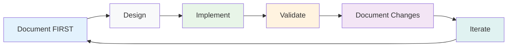
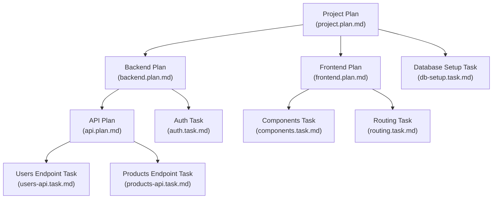

# ContextEngine - Documentation Driven Development Workflow

<!-- WHY: Core Philosophy and Motivation -->

## Document Objective

This document establishes the **Documentation Driven Development (DDD) methodology** for software development projects. It defines the principles, structure, and implementation approach where **documentation drives all development decisions** and serves as the single source of truth for the entire project.

**Terminology Note**: Throughout this document, "Documentation Driven Development", "Documentation-Driven Development", and "Documentation-First" all refer to the same core methodology where documentation creation precedes and drives all implementation activities.

**Primary Goals:**

- Establish documentation as the primary driver of all development activities
- Define a flexible hierarchical structure using two document types: Plans and Tasks
- Provide practical templates and guidelines for documentation-first implementation
- Enable efficient knowledge sharing through comprehensive, authoritative documentation

<!-- WHAT: ContextEngine Product Definition -->

## ContextEngine Integration

**ContextEngine** is the premier implementation of Documentation Driven Development methodology. It provides the tools, frameworks, and infrastructure needed to execute DDD principles effectively across any software development project. This document serves as both the methodology definition and the implementation guide for ContextEngine-powered development workflows.

**Key ContextEngine Capabilities:**

- **Intelligent Documentation Parsing**: Advanced markdown parsing with semantic understanding
- **Hierarchical Context Management**: Automated context inheritance and validation across Plan/Task hierarchies
- **Schema-Driven Validation**: Built-in validation against the DDD documentation schema
- **Implementation Readiness Gates**: Automated checks ensuring documentation completeness before code generation
- **LLM-Native Workflows**: Optimized for AI-assisted development with clear context boundaries

## Table of Contents

- [Core Methodology & Principles](#core-methodology--principles)
  - [Development Philosophy](#development-philosophy)
  - [Fundamental Principles](#fundamental-principles)
- [Why Documentation-First for Software Development](#why-documentation-first-for-software-development)
  - [Project Complexity Drivers](#project-complexity-drivers)
  - [Expected Benefits](#expected-benefits)
- [Documentation-Driven Development Workflow](#documentation-driven-development-workflow)
  - [Mandatory Documentation-First Process](#mandatory-documentation-first-process)
  - [Documentation Creation Phase](#1-documentation-creation-phase)
  - [Implementation Phase](#2-implementation-phase)
  - [Validation Phase](#3-validation-phase)
  - [Documentation Evolution Phase](#4-documentation-evolution-phase)
- [Implementation Approach](#implementation-approach)
  - [Plan/Task Hierarchical Structure](#plan-task-hierarchical-structure)
  - [Documentation-Driven Development Sequence](#documentation-driven-development-sequence)
    - [Start with Plans (Strategic Direction)](#1-start-with-plans-strategic-direction)
    - [Decompose Plans Based on Complexity](#2-decompose-plans-based-on-complexity)
    - [Create Tasks for Implementation Work](#3-create-tasks-for-implementation-work)
    - [Maintain Hierarchical Consistency](#4-maintain-hierarchical-consistency)
- [Living Documentation Process](#living-documentation-process)
  - [Documentation-First Change Management](#documentation-first-change-management)
    - [Documentation-First Change Workflow](#documentation-first-change-workflow)
    - [No-Exception Scenarios](#no-exception-scenarios)
    - [Implementation Discovery Protocol](#implementation-discovery-protocol)
- [The Documentation Schema](#the-documentation-schema)
  - [Schema-Driven Structure](#schema-driven-structure)
  - [Information Families](#information-families)
  - [Progressive Narrowing](#progressive-narrowing)
- [Documentation Standards](#documentation-standards)
  - [Documentation-First Enforcement](#documentation-first-enforcement)
  - [Common Principles Across All Levels](#common-principles-across-all-levels)
  - [Document-Type Implementation Gates](#document-type-implementation-gates)
  - [Documentation Quality Standards](#documentation-quality-standards)
  - [File and Directory Naming Convention](#file-and-directory-naming-convention)
  - [Common Iconography and Status Keys](#common-iconography-and-status-keys)
  - [Priority Levels](#priority-levels)
  - [Category-Specific Priority Matrix](#category-specific-priority-matrix)
  - [Practical Implementation Guidelines](#practical-implementation-guidelines)
  - [Practical Application Guide](#practical-application-guide)
- [Documentation-Native Project Management (Status Tracking)](#documentation-native-project-management-status-tracking)

<!-- WHAT: Core Methodology Definition -->

## Core Methodology & Principles

### Development Philosophy



**ContextEngine Powered Approach:** ALL decisions, designs, changes, and implementations MUST begin with comprehensive documentation updates. ContextEngine ensures no code is written without corresponding documentation being completed first, providing intelligent validation and context management throughout the development lifecycle.

### Fundamental Principles

**1. Documentation Before Code (PRIMARY PRINCIPLE)**
**ZERO code changes occur without corresponding documentation updates happening FIRST.** Documentation is the authoritative source of truth that drives all implementation decisions.

**2. Business Context First**
Every document starts with business justification and user value before diving into technical details.

**3. Self-Sufficient Documents**
Each document contains sufficient context to understand its scope without requiring extensive cross-referencing, while maintaining clear links to related decisions.

**4. Structured Decision Documentation**
Decisions are documented at the appropriate level of scope and detail, distributed between Plans (high-level decisions) and Tasks (implementation decisions).

**5. Documentation as Source of Truth**
When documentation and code conflict, documentation is correct by definition. Code must be updated to match documentation.

**6. Actionable Content**
Each section must enable decision-making or implementation, with specific acceptance criteria and concrete examples.

**7. Flexible Hierarchical Structure**
This methodology uses a flexible hierarchical approach where Plans can contain other Plans, Tasks, or a mix of both. This allows the documentation structure to scale naturally with project complexity - simple projects can use just Plans with Tasks, while complex projects can nest Plans to create deeper hierarchies as needed.

<!-- WHY: Business Justification and Value Proposition -->

## Why Documentation-First for Software Development

### Project Complexity Drivers

**Complex Domain:** Modern software systems involve multiple interconnected components where requirements must be fully understood and documented before any implementation begins.

**Stakeholder Alignment:** Complex user workflows require crystal-clear definition in documentation before implementation to ensure user acceptance.

**System Integration:** Multiple system components require well-defined, documented interfaces and data contracts before any connections are built.

**Quality Assurance:** Complex business processes need clear oversight with documented decision criteria and audit trails established before implementation.

### Expected Benefits

- **Eliminated Development Risk:** Complete requirements and decisions documented and validated before any implementation
- **Structured Complexity Management:** Plan/Task documentation approach manages complexity by separating high-level direction from implementation details
- **Predictable Development Flow:** Documentation completeness drives implementation readiness
- **Superior Maintenance:** All decisions and trade-offs documented before they're built into code
- **User-Centered Design:** User workflows fully documented and validated before development begins
- **ContextEngine Acceleration:** Automated context management and validation reduces cognitive overhead and ensures consistency
- **LLM-Optimized Workflows:** Structured documentation enables more effective AI-assisted development

<!-- HOW: Process and Workflow Implementation -->

## Documentation-Driven Development Workflow

### Mandatory Documentation-First Process

**Core Rule: NO IMPLEMENTATION WITHOUT COMPLETE DOCUMENTATION**

**Primary Workflow (4-Step Process):**

1. Document Requirement
2. Review Documentation
3. Implement to Documentation
4. Validate Against Documentation

**Process Relationship Clarification:**

- **6-Step Philosophy Cycle**: High-level continuous improvement cycle (Document FIRST → Design → Implement → Validate → Document Changes → Iterate)
- **4-Step Operational Workflow**: Specific workflow for each Plan or Task (Document → Review → Implement → Validate)
- **Plan/Task Hierarchical Structure**: Flexible recursive organization where Plans contain strategic decisions and can hold other Plans, Tasks, or both, creating adaptable hierarchies that scale naturally with project complexity
- **Task Implementation Focus**: Tasks contain implementation details, test cases, artifacts, and implementation logs
- **Development Phases**: Project lifecycle phases (Creation → Implementation → Validation → Evolution)

Each serves a different purpose: the Philosophy Cycle drives continuous improvement, the Operational Workflow manages individual work items, and the Plan/Task Structure provides flexible organization that scales with complexity.

### 1. **Documentation Creation Phase**

- Document all requirements, designs, and decisions BEFORE any code
- Complete documentation review and approval process
- Validate documentation completeness and consistency
- NO implementation begins until documentation is complete

### 2. **Implementation Phase**

- Code written to exactly match approved documentation
- Implementation follows documentation specifications precisely
- Any discovered gaps require STOPPING implementation and updating documentation first

### 3. **Validation Phase**

- Verify implementation matches documentation exactly
- Document any approved variations from original specification
- Update documentation if implementation reveals better approaches (documentation-first)

### 4. **Documentation Evolution Phase**

- When changes are needed, update documentation FIRST
- Re-approve updated documentation before implementing changes
- Maintain documentation as the authoritative source of truth

<!-- HOW: Implementation Strategy and Structure -->

## Implementation Approach

### Composable Plan/Task Flexible Hierarchicy

Our documentation follows a flexible hierarchical structure using two document types that scale naturally with project complexity:



### Documentation-Driven Development Sequence

#### **1. Start with Plans (Strategic Direction)**

- Create a top-level Plan documenting system architecture, technology decisions, and business requirements
- Document comprehensive user journeys and business processes
- Establish project-wide standards and quality gates
- **No implementation begins until the foundational Plan is complete**

#### **2. Decompose Plans Based on Complexity**

- **For Simple Areas:** Plans can directly contain Tasks for straightforward implementation work
- **For Complex Areas:** Plans can contain sub-Plans to break down complexity further
- **Mixed Approach:** Plans can contain both sub-Plans and Tasks as appropriate
- Define clear boundaries and integration points between components
- Document design decisions and trade-offs at the appropriate level
- **No work begins on any component until its Plan is complete**

#### **3. Create Tasks for Implementation Work**

- Tasks contain detailed implementation requirements and specifications
- Document specific technical decisions, algorithms, and step-by-step guidance
- Include test cases, artifacts to be created, and implementation logs
- **No coding begins until Task documentation is complete**

#### **4. Maintain Hierarchical Consistency**

- Higher-level Plans define strategic direction and constraints
- Lower-level Plans inherit context and refine details
- Tasks implement within the constraints defined by their parent Plan
- **All documentation must be complete before implementation at any level**

<!-- HOW: Change Management and Evolution Process -->

## Living Documentation Process

### Documentation-First Change Management

**Principle:** ALL changes begin with documentation updates, regardless of size or urgency.

#### **Documentation-First Change Workflow**

```
Change Request → Update Documentation → Review → Implement → Validate
```

**Mandatory Steps:**

1. **Document the Change:** Update relevant documentation with all proposed changes
2. **Design Review:** Validate documentation changes for completeness and consistency
3. **Implementation:** Code updated to match the approved documentation exactly
4. **Validation:** Verify implementation matches updated documentation precisely

#### **No-Exception Scenarios**

**Architecture Changes:**

- Document new component relationships FIRST, then build
- Update integration patterns FIRST, then implement connections
- Define data models FIRST, then write data handling code

**Feature Development:**

- Document user stories and acceptance criteria FIRST, then code
- Update API specifications FIRST, then implement endpoints
- Define state management patterns FIRST, then write state logic

**Bug Fixes:**

- Document root cause analysis FIRST, then fix
- Update business rules if bug reveals incorrect assumptions FIRST
- Document the fix approach FIRST, then implement

**Quick Changes:**

- Even "trivial" changes require documentation updates FIRST
- No "emergency" exceptions to documentation-first rule
- All changes, regardless of size, follow documentation-first process

#### **Implementation Discovery Protocol**

When implementation work reveals new requirements or constraints:

1. **IMMEDIATELY STOP ALL IMPLEMENTATION**
2. **UPDATE DOCUMENTATION** with discovered requirements
3. **REVIEW** documentation changes
4. **RESUME IMPLEMENTATION** only after documentation is complete

**Enforcement:** No implementation continues until documentation accurately reflects all discovered requirements.

<!-- WHAT: Schema and Structure Definition -->

## The Documentation Schema

While the Plan/Task hierarchical structure defines the organizational framework of our documentation, the _content_ within each document is governed by a formal schema. This ensures a consistent, predictable, and machine-readable flow of information from high-level strategic direction down to granular implementation details.

**The canonical definition for this schema is maintained in [docs/requirements/documentation-schema.md](./requirements/documentation-schema.md).** That document is the single source of truth for all document templates and content requirements.

**ContextEngine Schema Integration:** The documentation schema is natively supported by ContextEngine, which provides automated validation, intelligent parsing, and context-aware suggestions to ensure all documentation meets the required standards before implementation begins.

### Schema-Driven Structure

Instead of relying on informal templates, all `*.plan.md` and `*.task.md` files are now structured according to a shared information architecture. This architecture is built around two core concepts: **Information Families** and **Progressive Narrowing**.

### Information Families

The schema groups all documentation content into seven distinct "families," each answering a primary question:

1.  **Meta & Governance**: How critical is this work and what is its status?
2.  **Business & Scope**: Why are we doing this?
3.  **Planning & Decomposition**: What are we building and in what order?
4.  **Architecture & Design**: How does it work under the hood?
5.  **Implementation Guidance**: What are the practical steps?
6.  **Quality & Operations**: How do we validate and run it?
7.  **Reference**: What other information might we need?

These families provide a consistent vocabulary and structure across all levels of the documentation hierarchy.

### Progressive Narrowing

The schema uses a "Depth Matrix" for each family to explicitly define which sections are required, optional, or omitted for Plans versus Tasks. This enforces **progressive narrowing**, where high-level concepts introduced in top-level Plans are progressively refined and detailed as they move down through sub-Plans to Tasks.

- **Plans**: Focus on strategic direction, business context, and architectural decisions
- **Tasks**: Focus on implementation details, test cases, artifacts, and execution logs

This approach ensures that context is inherited and built upon, not repeated. It provides a clear and efficient path for both human developers and LLMs to gather the full context required for any given implementation work. ContextEngine automates this context inheritance process, ensuring that all relevant information is automatically available at the appropriate level of detail.

<!-- HOW: Standards and Quality Gates -->

## Documentation Standards

### **Documentation-First Enforcement**

**Absolute Documentation Priority:** Documentation is the authoritative source of truth that drives ALL development decisions
**Complete Before Implementation:** Every document must be 100% complete before any implementation begins
**Implementation Follows Documentation:** Code must exactly match documented specifications
**Documentation Drives Changes:** All changes begin with documentation updates, never with code changes

### **Common Principles Across All Levels**

**Business Context First:** Every document starts with business justification and user value
**Documentation Before Implementation:** Complete documentation created and approved before any coding
**Self-Sufficient Content:** Each document contains sufficient context to drive implementation without gaps
**Clear Implementation Rules:** Explicit links to related decisions and precise implementation requirements

### **Document-Type Implementation Gates**

**Plan Documentation:** Complete strategic decisions, architectural choices, and business requirements BEFORE any implementation or sub-component work
**Task Documentation:** Complete implementation specifics, technical details, test cases, and development guidance BEFORE any coding
**Hierarchical Consistency:** Parent Plans must be complete BEFORE child Plans or Tasks begin
**Implementation Readiness:** All documentation in the dependency chain must be complete BEFORE coding starts

### **Documentation Quality Standards**

**Implementation-Ready Content:** Each section must provide complete specifications for immediate implementation
**Consistent Structure:** All documents of the same type follow identical section structure for predictable implementation
**Complete Specifications:** No ambiguity or gaps that would require implementation decisions
**Authoritative Source:** When documentation and code conflict, documentation is correct by definition

### **File and Directory Naming Convention**

To ensure consistency and predictability, all documentation-related files and directories **MUST** follow a standardized naming convention that reflects the Plan/Task hierarchy.

**Pattern for Plans:** `[parent-chain].[p{id}-{name}].plan.md`
**Pattern for Tasks:** `[parent-chain].[t{id}-{name}].task.md`

- **`parent-chain`**: Dash-joined list of plan IDs for all ancestors (e.g., `p1-p2`). Omitted for top-level Plans/Tasks.
- The dot (`.`) separates the parent chain from the current plan/task.
- The first dash in the right part separates the ID from the name.
- The extension (`plan.md` or `task.md`) indicates the type.

#### Examples

| Type     | Example Parent Chain | Example Name | File Name                    |
| -------- | -------------------- | ------------ | ---------------------------- |
| Top Plan | (none)               | backend      | `p1-backend.plan.md`         |
| Sub Plan | p1                   | api          | `p1.p2-api.plan.md`          |
| Sub Plan | p1-p2                | endpoints    | `p1-p2.p3-endpoints.plan.md` |
| Task     | p1-p2                | endpoints    | `p1-p2.t1-endpoints.task.md` |

This structure ensures that every file is self-describing and its location in the project hierarchy can be determined from its name alone.

### **Common Iconography and Status Keys**

To ensure consistency and at-a-glance readability across all documentation (Plans and Tasks), the following standardized set of icons and status keys should be used. This central key serves as the single source of truth for all status indicators.

#### **Status Keys**

- 💡 **Not Started:** The Plan or Task has been identified but no work has begun.
- ⏳ **In Progress:** Active development or documentation work is currently underway.
- 🔍 **Under Review:** The work has been completed and is pending review and approval from stakeholders or peers.
- ✅ **Complete:** The work has been reviewed, approved, and merged. No further action is needed.
- ❌ **Blocked:** The work cannot proceed due to an external dependency, a required decision, or an unresolved issue.

### **Priority Levels**

The priority assigned to a project artefact (Plan, Task, bug, etc.) reflects a combination of **business / user impact** _and_ **urgency / time-risk**. Use the matrix below when deciding which bucket applies. This shared definition ensures humans and AI assistants interpret priority cues identically.

| Level         | Definition                                                                                                                 | Typical Handling                                                                       |
| ------------- | -------------------------------------------------------------------------------------------------------------------------- | -------------------------------------------------------------------------------------- |
| 🟥 **High**   | Blocking or business-critical work. Delay introduces material risk to launch dates, SLAs, compliance, or downstream teams. | Address in the **very next** working cycle. Surface in daily stand-ups until resolved. |
| 🟧 **Medium** | Important but not currently blocking. Provides clear value or unblocks future High items.                                  | Schedule within the next normal iteration. Escalate if it slips more than one cycle.   |
| 🟨 **Low**    | Nice-to-have, polish, or tech debt with no near-term risk.                                                                 | Tackle opportunistically during buffer / cleanup periods.                              |

**How to choose:**

1. Estimate the _impact_ of leaving the item undone (customer pain, revenue, compliance, team unblockers).
2. Estimate the _urgency_ (deadlines, external dependencies, risk of knowledge loss, time sensitivity).
3. Pick the highest applicable bucket — when in doubt, err on the side of **Medium** and revisit during grooming.
4. **Dependency Rule:** A 🟥 **High**-priority item cannot have an unresolved dependency on any 🟧 Medium or 🟨 Low item. If a High item relies on lower-priority work, either (a) immediately raise that dependency to 🟥 High as well, or (b) decouple the blocking relationship. This prevents hidden blockers from undermining MVP or deadline-critical scope.

### **Category-Specific Priority Matrix**

Here are canonical **Priority Drivers**. Each driver has a stable, human-readable ID (prefix = category) that can be referenced in Plans and Tasks.

#### Core-Business Process (CBP)

##### CBP-Break_Block_Revenue_Legal

- **Priority:** 🟥 High
- **Description:** Breaks or blocks a revenue-generating or legally required workflow; stops frontline staff.
- **Detailed Description:** Any outage or defect that halts a money-making operation (checkout, subscription renewal) or prevents the organisation from meeting a statutory obligation (regulatory filings, mandatory disclosures). The impact is immediate revenue loss or legal exposure, so these issues are always treated as the single highest priority.

##### CBP-SLA_Breach

- **Priority:** 🟥 High
- **Description:** Service-Level Agreement (SLA) breach.
- **Detailed Description:** The system has failed to meet a contractual uptime or response-time commitment. Although a temporary workaround may exist, continued breach carries financial penalties and reputational damage. Work to return service within SLA takes precedence over feature delivery.

##### CBP-Partial_Degradation_KPI

- **Priority:** 🟧 Medium
- **Description:** Partial degradation with workaround; Key Performance Indicator (KPI) dip < 20 %.
- **Detailed Description:** Core functionality still works, but a measurable business metric (conversion, processing throughput) is below target yet above the "critical" threshold. Work is scheduled in the next normal sprint unless a trend indicates worsening performance.

##### CBP-Incremental_Improvement

- **Priority:** 🟨 Low
- **Description:** Incremental efficiency or quality improvements; nice-to-have automation.
- **Detailed Description:** Optimisations that shorten operator workflow or improve data quality without affecting revenue or compliance if delayed. Often bundled into "buffer" sprints or addressed alongside related medium-priority items.

#### Security / Compliance (SEC)

##### SEC-Critical_Vulnerability

- **Priority:** 🟥 High
- **Description:** Exploitable vulnerability (Common Vulnerability Scoring System, CVSS ≥ 7).
- **Detailed Description:** Any security finding rated High/Critical, including but not limited to remote-code execution, privilege escalation, or data exfiltration. Immediate remediation or mitigation is mandatory to protect customer data and organisational reputation.

##### SEC-Data_Leak

- **Priority:** 🟥 High
- **Description:** Confirmed data leak or exposure of sensitive information.
- **Detailed Description:** Evidence shows protected data has been or could be accessed by unauthorised parties. Requires incident response, forensics, disclosure, and patching—treated with the highest urgency.

##### SEC-Upcoming_Compliance

- **Priority:** 🟧 Medium
- **Description:** Upcoming compliance requirement (≥ 30 days lead).
- **Detailed Description:** A new regulation or audit-check will apply in the near future. Work must be completed before the effective date but can be scheduled thoughtfully within the next sprint cycle.

##### SEC-Hardening_Low_Risk

- **Priority:** 🟨 Low
- **Description:** Security hardening / best-practice alignment / low-risk library upgrade.
- **Detailed Description:** Routine defence-in-depth improvements such as adding HTTP security headers or bumping non-critical dependencies. Addressed opportunistically or when touching adjacent code.

#### User Experience (UX)

##### UX-Task_Abandonment

- **Priority:** 🟥 High
- **Description:** Causes task abandonment or major accessibility blocker.
- **Detailed Description:** Users cannot complete a primary job to be done, or an accessibility (a11y) defect blocks assistive-technology users. Resolving these directly ties to customer satisfaction and legal accessibility obligations.

##### UX-Severe_Usability

- **Priority:** 🟥 High
- **Description:** Severe usability frustration or misleading flow.
- **Detailed Description:** The UI misleads users into incorrect actions or requires unreasonable effort, leading to support calls or churn. Must be fixed promptly to protect product reputation.

##### UX-Noticeable_Friction

- **Priority:** 🟧 Medium
- **Description:** Noticeable friction, confusing copy, minor a11y issue.
- **Detailed Description:** Issues degrade the experience but have workarounds. Scheduled alongside other front-end work in the upcoming sprint.

##### UX-Cosmetic_Polish

- **Priority:** 🟨 Low
- **Description:** Cosmetic polish, micro-interaction tweak, visual refinement.
- **Detailed Description:** Pure UI aesthetics that do not block user goals. Batched into UI-polish iterations or addressed during low-load periods.

#### Marketing / Growth (MKT)

##### MKT-Launch_Critical

- **Priority:** 🟥 High
- **Description:** Launch-critical campaign asset or time-boxed opportunity.
- **Detailed Description:** Work is tied to a public launch date or promotional window. Missing the window nullifies the marketing spend; therefore prioritised over normal feature work.

##### MKT-Brand_Risk

- **Priority:** 🟥 High
- **Description:** Significant brand-risk mitigation.
- **Detailed Description:** Corrects messaging or visuals that could damage brand perception (offensive copy, legal trademark misuse). Addressed immediately ahead of user-visible releases.

##### MKT-Campaign_Optimisation

- **Priority:** 🟧 Medium
- **Description:** Campaign optimisation, secondary channel, moderate traffic driver.
- **Detailed Description:** Enhancements that improve conversion rates or extend reach but are not single-point failures. Planned in normal marketing-engineering cycles.

##### MKT-Long_Tail_SEO

- **Priority:** 🟨 Low
- **Description:** Long-tail SEO initiative, exploratory experiment, backlog idea.
- **Detailed Description:** Experiments or content updates aimed at incremental organic growth. Slotted into backlog grooming and tackled when bandwidth exists.

#### Technical Foundation / Infrastructure (TEC)

##### TEC-Prod_Stability_Blocker

- **Priority:** 🟥 High
- **Description:** Production stability or data-loss bug; scaling bottleneck; Continuous Integration (CI) is red.
- **Detailed Description:** Failures that jeopardise uptime, data integrity, or the ability to merge code safely. These are addressed before any feature release proceeds.

##### TEC-Dev_Productivity_Blocker

- **Priority:** 🟥 High
- **Description:** Critical performance optimisation or blocking developer productivity issue.
- **Detailed Description:** Build times, tooling failures, or environmental issues that materially slow down the team. Fast mitigation prevents cascading schedule slips.

##### TEC-Dev_Productivity_Enhancement

- **Priority:** 🟧 Medium
- **Description:** Proactive tooling or process improvements that accelerate development workflows.
- **Detailed Description:** Initiatives that reduce boilerplate, streamline local development, or improve CI/CD cycle times without fixing an active blocker. These are quality-of-life improvements that compound over time.

##### TEC-Flaky_Test

- **Priority:** 🟧 Medium
- **Description:** Flaky test; non-blocking performance improvement.
- **Detailed Description:** Intermittent test failures or optimisations that improve quality but have a workaround (rerun, retries). Bundled into maintenance sprints.

##### TEC-Tech_Debt_Refactor

- **Priority:** 🟨 Low
- **Description:** Code hygiene / refactor; technical debt payoff; low-risk upgrade.
- **Detailed Description:** Architectural clean-ups and low-risk library upgrades that improve long-term maintainability without immediate business impact.

> **Tip:** List all applicable Driver IDs in your plan; the highest default priority determines the headline priority.

### **Practical Implementation Guidelines**

#### **Definition of "Complete Documentation"**

Documentation is considered complete when:

- All required sections (per document templates) are filled with specific, actionable content
- No placeholders, TODOs, or "TBD" items remain
- Business context and technical requirements are fully specified
- Acceptance criteria are clearly defined and measurable
- All dependencies and integration points are documented
- Implementation steps are detailed enough for immediate execution

#### **Guidance on Defining Success Criteria**

- **Phase-Appropriate Metrics:** Success criteria should be tailored to the project's current maturity. For initial phases or proofs-of-concept, success may be defined by system completion and functional correctness. Quantitative performance benchmarks and business KPIs should be explicitly deferred to later, iterative phases.

#### **Review and Approval Process**

1. **Self-Review**: Author checks completeness against template requirements
2. **Peer Review**: Technical review for accuracy and implementability
3. **Stakeholder Review**: Business validation of requirements and approach
4. **Approval**: Formal sign-off required before implementation begins
5. **Version Control**: Approved version tagged and protected from changes

#### **Implementation Validation Criteria**

Code "exactly matches" documentation when:

- All documented interfaces are implemented as specified
- Business logic follows documented rules precisely
- Error handling matches documented scenarios
- Performance meets documented requirements
- Security measures implement documented controls
- Integration points work as documented

#### **Quality Gates**

- **Entry Gate**: Documentation complete and approved
- **Progress Gates**: Implementation matches documentation at checkpoints
- **Exit Gate**: Full validation confirms implementation matches documentation
- **Maintenance Gate**: Documentation updated before any code changes

#### **Enforcement Mechanisms**

- **Code Review**: Implementation must reference and match documentation
- **Automated Checks**: CI/CD pipeline validates documentation exists and is current
- **Definition of Done**: Documentation update required for all changes
- **Escalation Path**: Implementation blockers escalated to documentation review

### **Practical Application Guide**

#### **For LLMs Implementing This Methodology**

When processing requests under Documentation Driven Development with ContextEngine:

1. **Prioritize Interactive Dialogue**: Before generating substantial content or code, engage in a dialogue to clarify requirements and context. Ask clarifying questions to avoid making assumptions, especially for complex or ambiguous requests. Do not "jump the gun" by providing a complete solution without sufficient interaction.
2. **Traverse Hierarchy Top-Down (MANDATORY)**: Before reading any Plan or Task document, you **MUST** first read its direct parent to inherit context. The reading order must follow the hierarchy: top-level `*.plan.md` → sub-Plans `*.plan.md` → `*.task.md`. This ensures you have the full context before proceeding with any implementation work. ContextEngine provides automated context inheritance to streamline this process.
3. **Always Check Documentation First**: Before writing any code, verify complete documentation exists using ContextEngine's validation capabilities
4. **Refuse Implementation Without Documentation**: Do not generate code if documentation is incomplete - ContextEngine will enforce this gate
5. **Follow Exact Specifications**: Implement exactly as documented, no interpretation or improvisation
6. **Document First, Then Code**: When changes are needed, update documentation before code generation
7. **Validate Against Documentation**: Ensure generated code matches documented specifications precisely using ContextEngine's validation tools
8. **Adopt the Correct Tone and Audience Focus**: All documentation should be written for a technical audience. The tone must be objective, fact-based, and precise. Avoid marketing language, hyperbole, or overly narrative styles. The goal is to produce clear, professional, and reliable technical documentation. Emojis may be used sparingly to convey status (e.g., ✅, ❌) or a calibrated, positive tone grounded in technical success.

#### **For Human Developers Implementing This Methodology**

**Embrace Collaborative Authoring with ContextEngine:**

- Use the documentation process as an interactive workshop, not a static writing exercise.
- Engage in dialogue, ask clarifying questions, and use the shared document as a tool to achieve a mutual understanding _before_ seeking formal review. This surfaces misunderstandings early and leads to a more accurate final specification.
- Leverage ContextEngine's intelligent suggestions and validation to ensure documentation quality and completeness.

Daily workflow checklist:

1. **Morning Review**: Check that today's tasks have complete documentation using ContextEngine's validation
2. **Implementation Gate**: Before coding, verify documentation completeness against template requirements with ContextEngine's automated checks
3. **Validation Points**: Regular checks that implementation matches documentation using ContextEngine's comparison tools
4. **Change Protocol**: Stop coding and update documentation when gaps are discovered - ContextEngine will flag incomplete documentation
5. **Completion Criteria**: Code review must verify implementation matches documentation with ContextEngine's validation suite

#### **Red Flags - Stop Implementation Immediately**

- Documentation contains "TODO", "TBD", or similar placeholders
- Requirements are ambiguous or open to interpretation
- Technical specifications are missing critical details
- Integration points are not fully defined
- Acceptance criteria are vague or unmeasurable
- Dependencies are not documented or unavailable

<!-- HOW: Project Management and Tracking Implementation -->

## Documentation-Native Project Management (Status Tracking)

We have codified a lightweight project-management process, and all related documents live in this repository. All planning and tracking happen here—no external boards needed. ContextEngine provides automated status tracking and progress monitoring to ensure project visibility and accountability.

### Status Files & Naming

| Level          | File                                     | Cadence          |
| -------------- | ---------------------------------------- | ---------------- |
| Top-Level Plan | `docs/requirements/project-status.md`    | Weekly & Monthly |
| Major Plans    | `docs/requirements/.../<plan>-status.md` | Weekly           |
| Sub-Plans      | `docs/requirements/.../<plan>-status.md` | Daily            |
| Tasks          | `*.task.md` header bullets               | Daily            |

### Section Structure

Each **month** lives in its own block in the project status file:

```
## 2025-07 Progress

### Month-to-Date Summary
- Points Completed This Month: X
- Cumulative Completed: X / Y → Z %

### Weekly Progress
#### 2025-07-02 – 2025-07-08 (Tue→Mon)
| ... | ... |
```

Guidelines:

1. **Tuesday→Monday weeks** keep sprints aligned and avoid weekend gaps.
2. Archive a weekly table at week-end; archive the whole month block when the calendar flips.
3. Always compute velocity from **active days** to avoid inflated numbers.
4. Use the standard iconography (🟥, 🟧, 🟨, ✅, ⏳, 💡, ❌).
5. Track high-priority scope separately: include **High-Priority Points**, **High-Priority Done Points**, **High-Priority Completion Ratio**, and high-priority velocity metrics in Summary and Velocity sections for every status file.

### Standard Column Definitions for Status Tables

| Column              | Description                                                                                     |
| ------------------- | ----------------------------------------------------------------------------------------------- |
| Priority            | Priority indicator (🟥 High, 🟧 Medium, 🟨 Low)                                                 |
| Item (Task/Plan)    | Markdown link to the artefact                                                                   |
| Planning Points     | Initial story-point estimate before implementation begins                                       |
| Est. Variance (pts) | Net change in points relative to planning; positive = scope increase, negative = scope decrease |
| Done Points         | Points counted once item is completed (planning points + Est. Variance)                         |
| Tasks / Items Done  | Progress indicator e.g., `7 / 14` tasks completed                                               |
| High Pts            | High-priority subset of planning points                                                         |
| High Done           | High-priority subset completed                                                                  |
| High %              | High Done ÷ High Pts                                                                            |
| HP State            | ✅ if all High-priority scope done, blank otherwise                                             |
| Progress %          | Overall completion percentage                                                                   |
| State               | Status key (💡, ⏳, 🔍, ✅, ❌)                                                                 |
| Created             | Creation date                                                                                   |
| Started             | Implementation start date                                                                       |
| Completed           | Completion date                                                                                 |

> All status tables (top-level Plan, sub-Plans) must use these standard columns in this exact order. Omit columns that are not applicable at a given level (e.g., High-\* columns can be left blank if no high-priority items exist).

> **Usage Guidance:** Status tables at different hierarchy levels include a _subset_ of these columns tailored to their scope. Use the order above as a reference, but omit columns that are not meaningful at that level. For example:
> • **Top-level Plan / Major Plan** tables often include `Tasks / Items Done`, `High-*` metrics, and `Progress %` because they aggregate many items.
> • **Sub-Plan** tables typically list `Planning Points`, `Est. Variance`, `Done Points`, and omit `High-*` columns unless high-priority tracking is needed at the task level.
> • **Task** headers may include only `Status`, `Planning Points`, and dates.
>
> Maintain column order _within_ the subset you choose so automated tools can parse tables consistently.

### Update Cadence

- **Tasks / Sub-Plans:** update bullets the day work happens.
- **Major Plans:** add/append weekly table rows every Monday evening.
- **Top-Level Plan:** update weekly table + month-to-date bullets every Monday; roll over month block on the 1st.

### Rationale

• **Noise Reduction:** Higher levels change less frequently, so weekly/monthly snapshots suffice.
• **Single Source of Truth:** Everything lives in Git—easy diff, code review, historical audit.
• **Scalable Reporting:** LLMs can parse these tables to answer stand-up and planning queries.
• **ContextEngine Integration:** Automated parsing and analysis of status data enables intelligent project insights and predictive analytics.

<!-- HOW: Getting Started and Onboarding -->

## Getting Started with ContextEngine

**ContextEngine** transforms Documentation Driven Development from a manual process into an intelligent, automated workflow. To begin implementing DDD with ContextEngine:

1. **Install ContextEngine**: Set up the ContextEngine CLI and development environment
2. **Initialize Project**: Use ContextEngine's project initialization to create the proper documentation structure
3. **Configure Schema**: Set up the documentation schema validation for your project
4. **Start Documenting**: Begin with top-level Plans and let ContextEngine guide you through the hierarchy
5. **Enable Validation**: Activate ContextEngine's automated validation gates
6. **Integrate with Workflow**: Connect ContextEngine to your existing development tools and CI/CD pipeline

**ContextEngine** ensures that every development decision is properly documented, validated, and contextualized, making Documentation Driven Development not just a methodology, but a powerful, intelligent system for building better software.

---
