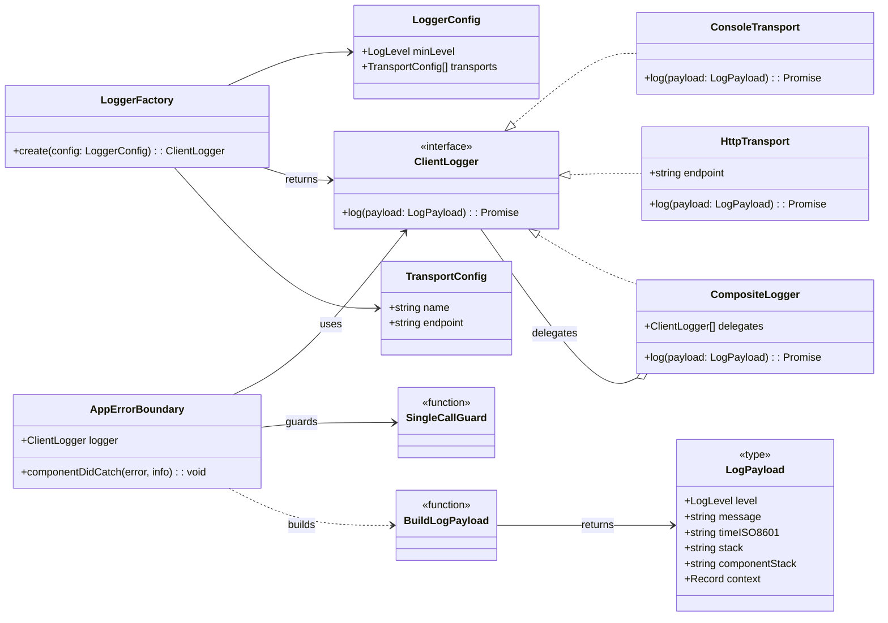

# Documentation Schema (Project → Module → Epic → Task)

> This file defines **which information appears where** in our Documentation-Driven Development (DDD) hierarchy and **why**.
> Use it as the canonical source when updating templates or building automation.

---

## Legend

| Symbol | Meaning                |
| ------ | ---------------------- |
| ✅     | Required               |
| ❓     | Optional (recommended) |
| ➖     | Not applicable / omit  |

> **Note on Usage in Document Headings:**
> In addition to their meaning in the schema tables below, these icons are used in the headings of the actual `*.md` files to indicate the **completion status** of a section.
>
> - `## ✅ [Section Name]`: Indicates the section is considered **complete**.
> - `## ❓ [Section Name]`: Indicates the section is **incomplete, a placeholder, or needs review**.
> - `## ➖ [Section Name]`: Indicates the section is **not applicable** and has been intentionally omitted.

---

## Family Index

| #   | Family (Anchor)                                           | Primary Question Answered                                        | Project | Module | Epic | Task |
| --- | --------------------------------------------------------- | ---------------------------------------------------------------- | :-----: | :----: | :--: | :--: |
| 1   | [Meta & Governance](#meta--governance)                    | How critical is this work, what is its current status?           |   ✅    |   ✅   |  ✅  |  ✅  |
| 2   | [Business & Scope](#business--scope)                      | Why are we doing this?                                           |   ✅    |   ✅   |  ✅  |  ✅  |
| 3   | [Planning & Decomposition](#planning--decomposition)      | What are we building, in what order?                             |   ✅    |   ✅   |  ✅  |  ❓  |
| 4   | [High-Level Design](#high-level-design)                   | What are the high-level components and interactions? (Black-Box) |   ✅    |   ✅   |  ✅  |  ✅  |
| 5   | [Maintenance and Monitoring](#maintenance-and-monitoring) | What are the internal details needed to build it? (White-Box)    |   ❓    |   ✅   |  ✅  |  ✅  |
| 6   | [Implementation Guidance](#implementation--guidance)      | What are the practical steps?                                    |   ❓    |   ✅   |  ✅  |  ✅  |
| 7   | [Quality & Operations](#quality--operations)              | How do we validate & run it?                                     |   ✅    |   ✅   |  ✅  |  ✅  |
| 8   | [Reference](#reference)                                   | What other info might we need?                                   |   ❓    |   ❓   |  ❓  |  ❓  |

Each plan document now begins with a **family heading** (`## Business & Scope`, etc.). An artefact includes a family only if it has relevant content; otherwise the heading may read `None (inherits from parent)`.

---

## Context Inheritance Protocol

The 4-tier hierarchy is not just an organizational tool; it is a strict protocol for context inheritance. To correctly interpret any document, it is **mandatory** to have first processed its parent.

- To understand a **Module**, you must first read the **Project**.
- To understand an **Epic**, you must first read its parent **Module** (and by extension, the **Project**).
- To understand a **Task**, you must first read its parent **Epic**.

This top-down traversal is the only way to gather the complete context required for implementation, as information is progressively narrowed and not repeated at lower levels. Automated tools and LLMs **MUST** enforce this reading order.

---

## 1 Meta & Governance <a id="meta--governance"></a>

### 1.1 Rationale

Keeps humans **and** CI aware of health, urgency, and blockers at any zoom level without polluting design content. Static plan docs carry only a _pointer_; live status tables sit in dedicated `*-status.md` companions (and inside each Task doc).

### 1.2 Depth Matrix

| ID    | Parent ID | Section Name      | Heading | Project | Module | Epic | Task | Notes                                                                                              |
| :---- | :-------- | :---------------- | :-----: | :-----: | :----: | :--: | :--: | :------------------------------------------------------------------------------------------------- |
| **1** | `null`    | Meta & Governance |  `##`   |   ✅    |   ✅   |  ✅  |  ✅  | The main family heading.                                                                           |
| 1.1   | 1         | Status Tracking   |  `###`  |   ✅    |   ✅   |  ✅  |  ➖  | Heading named _Status Tracking_ containing only the relative link to status file.                  |
| 1.2   | 1         | Status            |  `###`  |   ➖    |   ➖   |  ➖  |  ✅  | A block with key metrics. This is distinct from the `1.1 Status Tracking` link in other documents. |
| 1.3   | 1         | Priority Drivers  |  `###`  |   ✅    |   ✅   |  ✅  |  ✅  | Justification IDs; inherited unless overridden.                                                    |

### 1.3 Field Details

#### 1.1 Status Tracking

- **Description**: A single relative markdown link to the companion status file.
- **Content Format**: Markdown link.
- **Notes**: Plan documents **do not** embed live tables; they only point to them.
- **Example**: `[Module Status](m1-module-status.md)`

#### 1.2 Status (Task only)

- **Description**: A section containing key status metrics for a task. This is the primary source of truth for status roll-ups.
- **Content Format**: Markdown `###` heading followed by a bulleted list.
- **Reference**: See `docs/templates/task.template.md`.
- **Example**:
  ```md
  - **Current State:** 💡 Not Started
  - **Priority:** 🟨 Medium
  - **Progress:** 0%
  - **Assignee**: @[username]
  - **Planning Estimate:** 0
  - **Est. Variance (pts):** 0
  - **Created:** [YYYY-MM-DD]
  - **Implementation Started:** [YYYY-MM-DD]
  - **Completed:** [YYYY-MM-DD]
  - **Last Updated:** [YYYY-MM-DD]
  ```
- **Sub-Field Details**:
  - **Current State**: The operational status of the task (e.g., `✅ Done`, `⏳ In Progress`). See the standard status keys.
  - **Priority**: The task's priority level (e.g., `🟥 High`).
  - **Progress**: A percentage representing the completion of the task.
  - **Assignee**: The person responsible for the task.
  - **Planning Estimate**: The initial story point estimate assigned during planning. This should not change after work begins.
  - **Est. Variance (pts)**: The difference between the final completed points and the `Planning Estimate`. A positive number indicates scope creep or underestimation; a negative number indicates overestimation.
  - **Created**: The date the task document was created.
  - **Implementation Started**: The date a developer began working on the task.
  - **Completed**: The date the task was marked as `✅ Done`.
  - **Last Updated**: The date this status block was last modified.

#### 1.3 Priority Drivers

- **Description**: A bulleted list of stable Driver IDs that justify the priority of the artefact.
- **Content Format**: Markdown bulleted list.
- **Notes**: A child artefact may append drivers but should not silently delete inherited ones.
- **Example**:

  ```md
  - CBP-Break_Block_Revenue_Legal
  - TEC-Prod_Stability_Blocker
  ```

## 2 Business & Scope <a id="business--scope"></a>

### 2.1 Rationale

Explains **why** the artefact exists, who it serves, and what success looks like. As we zoom in from Project to Task, the narrative narrows from company-level goals to a single acceptance criterion.

### 2.2 Depth Matrix

| ID      | Parent ID | Section Name            | Heading | Project | Module | Epic | Task | Notes                                                                                       |
| :------ | :-------- | :---------------------- | :-----: | :-----: | :----: | :--: | :--: | :------------------------------------------------------------------------------------------ |
| **2**   | `null`    | Business & Scope        |  `##`   |   ✅    |   ✅   |  ✅  |  ✅  | The main family heading.                                                                    |
| 2.1     | 2         | Overview                |  `###`  |   ✅    |   ✅   |  ✅  |  ✅  | One–three-sentence identity & value proposition.                                            |
| 2.2     | 2         | Business Context        |  `###`  |   ✅    |   ✅   |  ✅  |  ❓  | May include Key Workflows, User Personas, Core Business Rules (`####` headings).            |
| 2.2.1   | 2.2       | User Journeys           | `####`  |   ✅    |   ✅   |  ✅  |  ❓  | Container for one or more User Journey definitions.                                         |
| 2.2.1.1 | 2.2.1     | Journey: [Name]         | `#####` |   ✅    |   ✅   |  ✅  |  ❓  | A repeatable section for a single, named user journey, including a description and diagram. |
| 2.2.2   | 2.2       | User Personas           | `####`  |   ✅    |   ✅   |  ❓  |  ➖  | Table or list of personas involved.                                                         |
| 2.2.3   | 2.2       | Core Business Rules     | `####`  |   ✅    |   ✅   |  ✅  |  ❓  | Enumerate domain rules that apply to this artefact.                                         |
| 2.2.4   | 2.2       | User Stories            | `####`  |   ➖    |   ❓   |  ✅  |  ❓  | A list of user-centric goals for this artefact.                                             |
| 2.3     | 2         | Success Criteria        |  `###`  |   ✅    |   ❓   |  ❓  |  ➖  | How we know the artefact’s _phase_ (project/module/epic) is DONE.                           |
| 2.4     | 2         | Acceptance Criteria     |  `###`  |   ➖    |   ➖   |  ❓  |  ✅  | Verifiable bullet list for Tasks (can also appear at Epic if needed).                       |
| 2.5     | 2         | Boundaries & Scope      |  `###`  |   ✅    |   ❓   |  ❓  |  ➖  | Container heading for scope definitions.                                                    |
| 2.5.1   | 2.5       | In Scope                | `####`  |   ✅    |   ❓   |  ❓  |  ➖  | A bulleted list of items that are explicitly included.                                      |
| 2.5.2   | 2.5       | Out of Scope            | `####`  |   ✅    |   ❓   |  ❓  |  ➖  | A bulleted list of items that are explicitly excluded.                                      |
| 2.6     | 2         | Core Business Processes |  `###`  |   ✅    |   ❓   |  ➖  |  ➖  | Container for detailed business process descriptions.                                       |
| 2.6.1   | 2.6       | Process: [Name]         | `####`  |   ✅    |   ❓   |  ➖  |  ➖  | A repeatable section for a single, named business process.                                  |

### 2.3 Field Details

#### 2.1 Overview

- **Description**: Provide a concise, bulleted list outlining _what_ this artefact delivers and _why it matters_.
- **Content Format**: Markdown bulleted list.
- **Example**:

  ```md
  - **Core Function**: Implements a robust, multi-level logging system for the document processing pipeline.
  - **Key Capability**: Ensures both operational errors and business events are captured, categorized, and routed to monitoring tools.
  - **Business Value**: Enables proactive issue resolution and performance analysis.
  ```

#### 2.2 Business Context

- **Description**: Provides the narrative and domain-specific details behind the work. If no additional context beyond the parent level is needed, this section can contain `None (inherits from parent)`.
- **Content Format**: Markdown text, with optional `####` sub-headings for child sections (Key Workflows, etc.).
- **Example**:

  ```md
  Currently, pipeline failures are opaque, requiring developers to manually inspect logs, which slows down resolution time. This new logging system will provide structured, queryable data to our analytics dashboard, allowing support staff to diagnose issues without engineering intervention.
  ```

#### 2.2.1 User Journeys

- **Description**: A container for one or more `Journey` sections. This section should provide a complete overview of all primary user paths and interactions related to the artefact.

#### 2.2.1.1 Journey: [Name]

- **Description**: A self-contained description of a single, specific user journey. The `[Name]` in the heading should be replaced with a descriptive title for the journey (e.g., "Analyst Processes a New Document"). This section must include a brief narrative explaining the journey's context and a diagram to visualize the flow.
- **Content Format**: A `#####` heading, a brief narrative description, and a Mermaid `graph` or `sequenceDiagram`. This section can be repeated as many times as necessary to document all relevant journeys.
- **Example**:

  ```md
  ##### Journey: Analyst Processes a New Document

  This journey describes the end-to-end path for a data analyst supervising the processing of a single document from selection to completion.

  graph LR
  A("Start") --> B["Selects Document"];
  B --> C("Completes Pipeline");

  ##### Journey: DevOps Engineer Monitors Pipeline Health

  This journey describes how a DevOps engineer interacts with the system's outputs to monitor for errors and performance issues.

  sequenceDiagram
  participant Pipeline
  participant Logger
  participant DevOps
  Pipeline-->>Logger: Log "Processing Failed" (ERROR)
  DevOps->>Logger: Views and analyzes error
  ```

#### 2.2.2 User Personas

- **Description**: Table or list of personas involved.
- **Content Format**: Markdown table or list.
- **Example**:

  ```md
  | Persona             | Goal                                                      |
  | ------------------- | --------------------------------------------------------- |
  | **DevOps Engineer** | Monitor system health and diagnose infrastructure issues. |
  | **Support Analyst** | Triage user-reported errors and identify root cause.      |
  ```

#### 2.2.3 Core Business Rules

- **Description**: Enumerate domain rules that apply to this artefact.
- **Content Format**: Markdown list.
- **Example**:

  ```md
  - All personally identifiable information (PII) must be logged at the `DEBUG` level or lower.
  - Any log with a `FATAL` level must trigger an immediate PagerDuty alert.
  - Log retention period is 90 days for `INFO` and 1 year for `ERROR` and above.
  ```

#### 2.2.4 User Stories

- **Description**: A list of user-centric stories that describe a piece of functionality from the end-user's perspective. This section is most critical at the Epic level but can be used at the Module or Task level if it provides necessary context. The format "As a [persona], I want [to perform an action], so that I can [achieve a goal]" is recommended.
- **Content Format**: Markdown list.
- **Example**:
  ```md
  - As a DevOps Engineer, I want to receive a real-time alert when a critical error occurs, so that I can immediately begin troubleshooting.
  - As a Support Analyst, I want to filter logs by user ID, so that I can quickly investigate user-reported issues.
  ```

#### 2.3 Success Criteria

- **Description**: Measurable or binary statements that define when a Project, Module, or Epic is considered complete for its current phase.
- **Content Format**: Markdown list.
- **Example**:

  ```md
  - All pipeline stages emit structured logs for success, failure, and key business events.
  - The central dashboard can successfully ingest and display logs from all pipeline stages.
  - A comprehensive set of alerts for critical failures is configured and tested.
  ```

#### 2.4 Acceptance Criteria

- **Description**: A verifiable, tabular list of conditions that a Task (or occasionally an Epic) must satisfy to be considered complete.
- **Content Format**: Markdown table.
- **Example**:

  ```md
  | ID   | Criterion                                           | Test Reference      |
  | ---- | --------------------------------------------------- | ------------------- |
  | AC-1 | Logger correctly filters messages below `minLevel`. | `logger.test.ts`    |
  | AC-2 | `FATAL` level logs trigger a PagerDuty alert.       | `alerting.int.test` |
  | AC-3 | Log output is valid JSON.                           | `formatter.test.ts` |
  ```

#### 2.5 Boundaries & Scope

- **Description**: A container heading for the explicit definition of the work's boundaries. Its content is in the child sections `2.5.1 In Scope` and `2.5.2 Out of Scope`.

#### 2.5.1 In Scope

- **Description**: A bulleted list of functionalities, features, or outcomes that are explicitly included in the scope of the artefact. This list serves as a clear commitment of what will be delivered.
- **Content Format**: Markdown bulleted list.
- **Example**:

  ```md
  - Processing of Lok Sabha Q&A documents in PDF format.
  - Manual verification and correction workflows for all pipeline steps.
  - Generation of a document-level knowledge graph.
  ```

#### 2.5.2 Out of Scope

- **Description**: A bulleted list of functionalities, features, or outcomes that are explicitly excluded from the scope of the artefact. This is critical for managing expectations and preventing future misunderstandings. It is often useful to list items that were considered but deliberately deferred.
- **Content Format**: Markdown bulleted list.
- **Example**:

  ```md
  - Real-time document processing capabilities.
  - Processing documents in formats other than PDF.
  - Advanced user management and role-based access control.
  ```

#### 2.6 Core Business Processes

- **Description**: A container for one or more `Process` sections. This section details the key, step-by-step business workflows that the project implements or affects.

#### 2.6.1 Process: [Name]

- **Description**: A self-contained description of a single business process. The `[Name]` should be a descriptive title (e.g., "Document Ingestion and Triage"). This section should detail the participants, goals, and steps of the process.
- **Content Format**: A `####` heading, followed by narrative text, bullet points, or a Mermaid diagram to illustrate the process flow.
- **Example**:

  ```md
  #### Process: Manual Review

  - **Participants**: Data Scientist
  - **Goal**: To validate the accuracy of automated text extraction from a source PDF.
  - **Workflow**:
    1. Analyst selects a document in the "Pending Review" state.
    2. The UI displays the source PDF alongside the extracted text.
    3. Analyst compares the two and makes corrections to the text.
    4. Analyst approves the corrected text, advancing the document to the "Chunking" state.
  ```

## 3 Planning & Decomposition <a id="planning--decomposition"></a>

### 3.1 Rationale

This family answers **what** we are building and in **what order**. It provides a clear breakdown of the work, defines the sequence of implementation, and explicitly lists any dependencies that could block progress. This ensures a predictable development flow and helps in resource allocation.

### 3.2 Depth Matrix

| ID    | Parent ID | Section Name             | Heading | Project | Module | Epic | Task | Notes                                                           |
| :---- | :-------- | :----------------------- | :-----: | :-----: | :----: | :--: | :--: | :-------------------------------------------------------------- |
| **3** | `null`    | Planning & Decomposition |  `##`   |   ✅    |   ✅   |  ✅  |  ❓  | The main family heading. Optional for Tasks if no dependencies. |
| 3.1   | 3         | Roadmap (In-Focus Items) |  `###`  |   ✅    |   ✅   |  ✅  |  ➖  | Lists the immediate child artefacts being actively worked on.   |
| 3.2   | 3         | Backlog / Icebox         |  `###`  |   ✅    |   ✅   |  ✅  |  ➖  | Lists considered but de-scoped or deferred child artefacts.     |
| 3.3   | 3         | Dependencies             |  `###`  |   ✅    |   ✅   |  ✅  |  ✅  | Lists blocking items at the appropriate scope.                  |
| 3.4   | 3         | Decomposition Graph      |  `###`  |   ➖    |   ❓   |  ✅  |  ➖  | A visual graph of dependencies between the child artefacts.     |

### 3.3 Field Details

#### 3.1 Roadmap (In-Focus Items)

- **Description**: A table of direct child artefacts (Modules for a Project, Epics for a Module, Tasks for an Epic) that are currently planned for implementation in the active cycle.
- **Content Format**: Markdown table.
- **Column Applicability Matrix**:

  | Column           | Project | Module | Epic | Notes                                                                |
  | ---------------- | :-----: | :----: | :--: | :------------------------------------------------------------------- |
  | ID               |   ✅    |   ✅   |  ✅  | Unique identifier for the child artefact (M1, E1, T1).               |
  | Child Artefact   |   ✅    |   ✅   |  ✅  | Name of the child artefact (Module, Epic, or Task) with a link.      |
  | Priority         |   ✅    |   ✅   |  ✅  | Priority level of the child artefact.                                |
  | Priority Drivers |   ✅    |   ✅   |  ✅  | Links to drivers justifying the priority.                            |
  | Status           |   ✅    |   ✅   |  ✅  | Current status of the child artefact.                                |
  | Depends On       |   ✅    |   ✅   |  ✅  | ID of any dependencies.                                              |
  | Summary          |   ✅    |   ✅   |  ✅  | A brief, one-sentence description of the child artefact's objective. |

- **Example**:
  ```md
  | ID  | Task                               | Priority  | Priority Drivers                                                                                         | Status         | Depends On | Summary                          |
  | :-- | :--------------------------------- | :-------- | :------------------------------------------------------------------------------------------------------- | :------------- | :--------- | :------------------------------- |
  | T1  | [Example Task 1](path/to/task1.md) | 🟥 High   | [CBP-Break_Block_Revenue_Legal](/docs/documentation-driven-development.md#cbp-break_block_revenue_legal) | 💡 Not Started | —          | A brief description of the task. |
  | T2  | [Example Task 2](path/to/task2.md) | 🟧 Medium | [UX-Noticeable_Friction](/docs/documentation-driven-development.md#ux-noticeable_friction)               | 💡 Not Started | T1         | Another brief description.       |
  ```
- **Column Definitions**:
  - **ID**: A unique identifier for the child artefact (e.g., T1, E1, M1).
  - **Task/Epic/Module**: A descriptive name for the artefact, linked to its plan document.
  - **Priority**: The priority level of the artefact.
  - **Priority Drivers**: Links to the specific business or technical drivers that justify the priority.
  - **Status**: The current state of the artefact.
  - **Depends On**: The ID of any artefact(s) that must be completed before this one can start.
  - **Summary**: A brief, one-sentence description of the artefact's objective.

#### 3.2 Backlog / Icebox

- **Description**: A list of direct child artefacts that have been considered but are not scheduled for the current implementation cycle. This is crucial for capturing scope decisions.
- **Content Format**: Markdown list.
- **Example**:

  ```md
  - **Reporting Module**: Deferred to Q4 due to dependency on new analytics service.
  - **Real-time Collaboration Features**: Moved to Icebox as it is outside the scope of the current MVP.
  ```

#### 3.3 Dependencies

- **Description**: An explicit list of internal or external dependencies that must be resolved before this artefact can be completed.
- **Content Format**: Markdown table or list.
- **Example**:

  ```md
  | ID  | Dependency On             | Type     | Status      | Affected Modules | Notes                                |
  | --- | ------------------------- | -------- | ----------- | ---------------- | ------------------------------------ |
  | D-1 | `shared-ui-library` v2.1+ | External | ❌ Blocked  | `m1-analyzer`    | Awaiting release from Platform team. |
  | D-2 | Epic `e3-user-profiles`   | Internal | ✅ Complete | `m2-reporting`   | User schema is now finalized.        |
  ```

#### 3.4 Decomposition Graph

- **Description**: A Mermaid diagram that visually represents the dependencies and sequencing of the child artefacts listed in the `3.1 Roadmap`. At the Module level, this graph shows the relationship between its Epics. At the Epic level, it shows the relationship between its Tasks. This graph clarifies the critical path and helps developers understand the required order of implementation.
- **Content Format**: Mermaid `graph` diagram.
- **Example (for an Epic):**
  ```mermaid
  graph TD
      subgraph Epic: User Authentication
          T1["Task: Create UI form"]
          T2["Task: Implement validation"]
          T3["Task: Add API endpoint"]
          T4["Task: Write integration tests"]
      end
      T1 --> T2
      T2 --> T3
      T3 --> T4
  ```

## 4 High-Level Design <a id="high-level-design"></a>

### 4.1 Rationale

This family answers **how** the system works from a high-level, **black-box perspective**. It describes the major components and their interactions without detailing their internal implementation. This allows for a clear understanding of the system's structure and boundaries.

### 4.2 Depth Matrix

| ID      | Parent ID | Section Name                | Heading | Project | Module | Epic | Task | Notes                                                                    |
| :------ | :-------- | :-------------------------- | :-----: | :-----: | :----: | :--: | :--: | :----------------------------------------------------------------------- |
| **4**   | `null`    | Architecture & Design       |  `##`   |   ✅    |   ✅   |  ✅  |  ✅  | The main family heading.                                                 |
| 4.0     | 4         | Guiding Principles          |  `###`  |   ❓    |   ❓   |  ➖  |  ➖  | High-level architectural rules or constraints that govern the artefact.  |
| 4.1     | 4         | Current Architecture        |  `###`  |   ✅    |   ✅   |  ✅  |  ❓  | Describes the existing system. Optional for new ("greenfield") projects. |
| 4.1.1   | 4.1       | Data Models                 | `####`  |   ❓    |   ✅   |  ✅  |  ✅  | "As-is" data structures (ER diagrams).                                   |
| 4.1.2   | 4.1       | Components                  | `####`  |   ✅    |   ✅   |  ✅  |  ✅  | "As-is" component diagram (class, graph, or C4).                         |
| 4.1.3   | 4.1       | Data Flow                   | `####`  |   ❓    |   ✅   |  ✅  |  ✅  | "As-is" data flow diagram.                                               |
| 4.1.4   | 4.1       | Control Flow                | `####`  |   ❓    |   ✅   |  ✅  |  ✅  | "As-is" sequence of interactions.                                        |
| 4.1.5   | 4.1       | Integration Points          | `####`  |   ❓    |   ✅   |  ✅  |  ✅  | "As-is" key integration points.                                          |
| 4.1.5.1 | 4.1.5     | Upstream Integrations       | `#####` |   ❓    |   ✅   |  ✅  |  ✅  | "As-is" Systems/data this artefact consumes.                             |
| 4.1.5.2 | 4.1.5     | Downstream Integrations     | `#####` |   ❓    |   ✅   |  ✅  |  ✅  | "As-is" Systems/data this artefact produces.                             |
| 4.2     | 4         | Target Architecture         |  `###`  |   ✅    |   ✅   |  ✅  |  ✅  | Describes the proposed "to-be" state.                                    |
| 4.2.1   | 4.2       | Data Models                 | `####`  |   ❓    |   ✅   |  ✅  |  ✅  | "To-be" data structures (ER diagrams).                                   |
| 4.2.2   | 4.2       | Components                  | `####`  |   ✅    |   ✅   |  ✅  |  ✅  | "To-be" component diagram (class).                                       |
| 4.2.3   | 4.2       | Data Flow                   | `####`  |   ❓    |   ✅   |  ✅  |  ✅  | "To-be" data flow diagram.                                               |
| 4.2.4   | 4.2       | Control Flow                | `####`  |   ❓    |   ✅   |  ✅  |  ✅  | "To-be" sequence of interactions.                                        |
| 4.2.5   | 4.2       | Integration Points          | `####`  |   ❓    |   ✅   |  ✅  |  ✅  | Container for Upstream/Downstream definitions.                           |
| 4.2.5.1 | 4.2.5     | Upstream Integrations       | `#####` |   ❓    |   ✅   |  ✅  |  ✅  | Systems/data this artefact consumes.                                     |
| 4.2.5.2 | 4.2.5     | Downstream Integrations     | `#####` |   ❓    |   ✅   |  ✅  |  ✅  | Systems/data this artefact produces.                                     |
| 4.2.6   | 4.2       | Exposed API                 | `####`  |   ❓    |   ✅   |  ✅  |  ✅  | "To-be" exposed API surface.                                             |
| 4.3     | 4         | Tech Stack & Deployment     |  `###`  |   ✅    |   ❓   |  ❓  |  ❓  | Key technologies and deployment strategy.                                |
| 4.4     | 4         | Non-Functional Requirements |  `###`  |   ❓    |   ❓   |  ✅  |  ✅  | Container for high-level quality attributes and constraints.             |
| 4.4.1   | 4.4       | Performance                 | `####`  |   ❓    |   ❓   |  ✅  |  ✅  | Defines performance-related NFRs.                                        |
| 4.4.2   | 4.4       | Security                    | `####`  |   ❓    |   ❓   |  ✅  |  ✅  | Defines security-related NFRs.                                           |
| 4.4.3   | 4.4       | Reliability                 | `####`  |   ❓    |   ❓   |  ✅  |  ✅  | Defines reliability-related NFRs.                                        |
| 4.4.4   | 4.4       | Permission Model            | `####`  |   ❓    |   ❓   |  ❓  |  ➖  | Defines the roles and access control rules for the artefact.             |

### 4.3 Field Details

> **Note**: The fields for `Current Architecture` (4.1.x) and `Target Architecture` (4.2.x) are identical in format. The examples below use the `Target` sections, but apply equally to the `Current` sections.

#### 4.0 Guiding Principles

- **Description**: A list of high-level architectural rules, patterns, or constraints that apply to the entire artefact (e.g., "All UI components must be stateless," "All services must be idempotent"). These principles guide all subsequent design decisions.
- **Content Format**: Markdown list.
- **Example**:
  ```md
  - **Stateless Services**: All backend services should be stateless to allow for horizontal scaling.
  - **Event-Driven**: Communication between major components should be asynchronous and event-driven where possible.
  ```

#### 4.x.1 Data Models

- **Description**: The structure of data at a high level, often represented as an Entity-Relationship Diagram. This section defines the core data entities and their relationships before detailing the components that manage them.
- **Content Format**: Mermaid `erDiagram`.
- **Example**:
  ```mermaid
  erDiagram
  LOG_LEVEL ||--o{ LOG_PAYLOAD : "sets severity"
  LOG_PAYLOAD {
    string id PK
    LogLevel level
    string message
    string timeISO8601
    string stack
    string componentStack
    json context
  }
  LOGGER_CONFIG {
    LogLevel minLevel
  }
  TRANSPORT_CONFIG {
    string name
    string endpoint
  }
  ENV_VAR {
    string NEXT_PUBLIC_LOG_LEVEL PK
  }
  ENV_VAR ||--|| LOGGER_CONFIG : "overrides"
  ```

#### 4.x.2 Components

- **Description**: A diagram illustrating the main components and their relationships. The term "component" is used broadly and does not necessarily map to a class; it represents a logical block of functionality.
- **Content Format**: Mermaid `classDiagram` diagram.
- **Example**:



#### 4.x.3 Data Flow

- **Description**: A diagram showing how data moves between components.
- **Content Format**: Mermaid `graph` or `sequenceDiagram`.
- **Example**:
  ```mermaid
  graph LR
      User --"JSON payload"--> ServiceA
      ServiceA --"Writes to"--> DB1[(Database)]
      ServiceA --"Publishes event"--> MessageQueue
      MessageQueue --"Event consumed by"--> ServiceB
  ```

#### 4.x.4 Control Flow

- **Description**: A diagram showing the sequence of interactions between components.
- **Content Format**: Mermaid `sequenceDiagram`.
- **Example**:
  ```mermaid
  sequenceDiagram
      participant User
      participant API
      participant AuthSvc
      User->>API: POST /login
      API->>AuthSvc: ValidateCredentials(user, pass)
      AuthSvc-->>API: JWT
      API-->>User: { token: "..." }
  ```

#### 4.x.5 Integration Points

- **Description**: A container for defining all systems, services, or APIs that this component interacts with, broken down into `Upstream` and `Downstream` sections.
- **Content Format**: Container section; content is in child sections.

##### 4.x.5.1 Upstream Integrations

- **Description**: Defines how this artefact is triggered and what data it receives from other systems.
- **Content Format**: Markdown list or table.
- **Example**:
  ```md
  - **Trigger**: User action via UI button click.
  - **Input Data**: Receives `documentId` and `userId` from the client.
  ```

##### 4.x.5.2 Downstream Integrations

- **Description**: Defines what happens when this artefact completes its work and what data it sends to other systems.
- **Content Format**: Markdown list or table.
- **Example**:
  ```md
  - **Completion Trigger**: Emits a `DOCUMENT_PROCESSED` event to the message queue.
  - **Output Data**: The event payload includes `documentId` and `status: 'COMPLETED'`.
  ```

#### 4.x.6 Exposed API

- **Description**: The API surface this component exposes to consumers.
- **Content Format**: OpenAPI/Swagger snippet, or a Markdown table.
- **Example**:
  ```yaml
  paths:
    /users/{userId}:
      get:
        summary: Get user by ID
        parameters:
          - name: userId
            in: path
            required: true
            schema:
              type: string
  ```

#### 4.3 Tech Stack & Deployment

- **Description**: A list of the primary technologies, frameworks, or libraries foundational to this artefact, along with the deployment strategy.
- **Content Format**: Markdown list or table.
- **Example**:
  ```md
  - **Language**: TypeScript
  - **Framework**: Next.js
  - **Deployment**: Vercel
  ```

#### 4.4 Non-Functional Requirements

- **Description**: A container for the high-level, non-functional requirements (NFRs) or quality attributes that the system must meet. This section defines _what_ the requirements are, while the `7. Quality & Operations` family describes _how_ they will be tested and monitored.
- **Content Format**: Container section; content is in child sections.

##### 4.4.1 Performance

- **Description**: Defines the performance-related NFRs, such as response times, throughput, and resource utilization.
- **Content Format**: Markdown list.
- **Example**:
  ```md
  - The user login API endpoint must respond in < 200ms under normal load (95th percentile).
  - The system must support 100 concurrent users without performance degradation.
  ```

##### 4.4.2 Security

- **Description**: Defines the security-related NFRs, such as data encryption, access control, and vulnerability standards.
- **Content Format**: Markdown list.
- **Example**:
  ```md
  - All sensitive user data must be encrypted at rest using AES-256.
  - Access to administrative endpoints must be restricted to users with the 'Admin' role.
  ```

##### 4.4.3 Reliability

- **Description**: Defines the reliability-related NFRs, such as uptime, data integrity, and disaster recovery.
- **Content Format**: Markdown list.
- **Example**:
  ```md
  - The service must maintain 99.9% uptime, measured monthly.
  - All database transactions must be atomic and durable.
  ```

#### 4.4.4 Permission Model

- **Description**: Defines the access control rules, user roles, and permissions for the system. This section should clearly outline who can access what and perform which actions. The mechanism for _assigning_ these roles in each environment should be detailed in the `7.2 Configuration` section.
- **Content Format**: A Markdown table or bulleted list describing the roles and their associated permissions.
- **Example**:

  ```md
  | Role        | Permissions                                                  | Notes                               |
  | ----------- | ------------------------------------------------------------ | ----------------------------------- |
  | **Admin**   | - Full CRUD access to all documents<br>- Can assign roles    | For system administrators only.     |
  | **Analyst** | - Read/Write access to assigned documents<br>- Cannot delete | The primary user role.              |
  | **Viewer**  | - Read-only access to completed documents                    | For stakeholders or external users. |
  ```

## 5 Maintenance and Monitoring <a id="maintenance-and-monitoring"></a>

### 5.1 Rationale

This family answers **how** the system is maintained and monitored. It provides the internal implementation details necessary for developers to build the components defined in the High-Level Design.

### 5.2 Depth Matrix

| ID    | Parent ID | Section Name                       | Heading | Project | Module | Epic | Task | Notes                                                                    |
| :---- | :-------- | :--------------------------------- | :-----: | :-----: | :----: | :--: | :--: | :----------------------------------------------------------------------- |
| **5** | `null`    | Maintenance and Monitoring         |  `##`   |   ❓    |   ✅   |  ✅  |  ✅  | The main family heading.                                                 |
| 5.1   | 5         | Current Maintenance and Monitoring |  `###`  |   ❓    |   ✅   |  ✅  |  ❓  | Describes the existing system. Optional for new ("greenfield") projects. |
| 5.1.1 | 5.1       | Error Handling                     | `####`  |   ❓    |   ✅   |  ✅  |  ✅  | "As-is" error handling strategy.                                         |
| 5.1.2 | 5.1       | Logging & Monitoring               | `####`  |   ❓    |   ✅   |  ✅  |  ✅  | "As-is" observability strategy.                                          |
| 5.2   | 5         | Target Maintenance and Monitoring  |  `###`  |   ❓    |   ✅   |  ✅  |  ✅  | Describes the proposed "to-be" state.                                    |
| 5.2.1 | 5.2       | Error Handling                     | `####`  |   ❓    |   ✅   |  ✅  |  ✅  | "To-be" error handling strategy.                                         |
| 5.2.2 | 5.2       | Logging & Monitoring               | `####`  |   ❓    |   ✅   |  ✅  |  ✅  | "To-be" observability strategy.                                          |

### 5.3 Field Details

> **Note**: The fields for `Current Detailed Design` (5.1.x) and `Target Detailed Design` (5.2.x) are identical in format. The examples below use the `Target` sections, but apply equally to the `Current` sections.

#### 5.x.1 Error Handling

- **Description**: The strategy for managing and communicating errors, often best represented as a table detailing the condition, trigger, action, and feedback.
- **Content Format**: Markdown table.
- **Example**:
  ```md
  | Error Type                  | Trigger                                       | Action                  | User Feedback                                                             |
  | :-------------------------- | :-------------------------------------------- | :---------------------- | :------------------------------------------------------------------------ |
  | **File System Error**       | Cannot read a required file or directory.     | Abort with exit code 1. | `ERROR: Cannot access [path]. Please check permissions.`                  |
  | **Schema Validation Error** | A document violates the canonical schema.     | Abort with exit code 1. | `ERROR: Schema validation failed in [file]: [validation_details].`        |
  | **API/Network Error**       | External API is unreachable or returns > 299. | Abort with exit code 1. | `ERROR: Failed to transmit status to [endpoint]: [HTTP_status_or_error].` |
  ```

#### 5.x.2 Logging & Monitoring

- **Description**: The strategy for system observability.
- **Content Format**: Markdown list or table.
- **Example**:
  ```md
  - **Metrics**: Prometheus endpoint `/metrics` will be exposed.
  - **Logs**: Structured JSON logs sent to stdout for collection by Fluentd.
  - **Tracing**: OpenTelemetry SDK will be used for distributed tracing.
  ```

## 6 Implementation Guidance <a id="implementation--guidance"></a>

### 6.1 Rationale

This family provides the practical, step-by-step instructions for building the component. It translates the "what" from the planning sections and the "how" from the architecture sections into a concrete "to-do" list. This is where design becomes action.

### 6.2 Depth Matrix

| ID    | Parent ID | Section Name               | Heading | Project | Module | Epic | Task | Notes                                                          |
| :---- | :-------- | :------------------------- | :-----: | :-----: | :----: | :--: | :--: | :------------------------------------------------------------- |
| **6** | `null`    | Implementation Guidance    |  `##`   |   ❓    |   ✅   |  ✅  |  ✅  | The main family heading.                                       |
| 6.1   | 6         | Implementation Plan        |  `###`  |   ❓    |   ✅   |  ✅  |  ✅  | High-level approach and sequence of steps.                     |
| 6.2   | 6         | Implementation Log / Steps |  `###`  |   ➖    |   ➖   |  ❓  |  ✅  | Detailed, ordered list of steps for a Task.                    |
| 6.2.1 | 6.2       | Initial Situation          | `####`  |   ➖    |   ➖   |  ➖  |  ✅  | Table capturing the objective baseline before work begins.     |
| 6.2.2 | 6.2       | Files Change Log           | `####`  |   ➖    |   ➖   |  ➖  |  ✅  | Table tracking file modifications as the task progresses.      |
| 6.3   | 6         | Prompts (LLM reuse)        |  `###`  |   ❓    |   ❓   |  ❓  |  ❓  | Reusable prompts for generating code, tests, or documentation. |

### 6.3 Field Details

#### 6.1 Implementation Plan

- **Description**: A description of the implementation approach, tailored to the artefact's level.
  - **At the Module/Epic level**: This should be a high-level, potentially phased rollout strategy for its children (e.g., "Phase 1: Implement core authentication epics. Phase 2: Add social login epics.").
  - **At the Task level**: This should be a more direct, "one-shot" overview of the technical approach for the specific work item (e.g., "Create a new React hook to fetch user data and manage loading/error states.").
- **Content Format**: Markdown table.
- **Column Applicability Matrix**:

  | Column               | Project | Module | Epic | Task | Notes                                             |
  | -------------------- | :-----: | :----: | :--: | :--: | :------------------------------------------------ |
  | Phase                |   ✅    |   ✅   |  ✅  |  ➖  | The name of the implementation phase.             |
  | Scope / Deliverables |   ✅    |   ✅   |  ✅  |  ➖  | A description of what will be built in the phase. |
  | Key Artifacts        |   ✅    |   ✅   |  ✅  |  ➖  | The files or code that will be produced.          |
  | Exit Criteria        |   ✅    |   ✅   |  ✅  |  ➖  | The measurable criteria for completing the phase. |

- **Column Definitions**:
  - **Phase**: The name of the implementation phase.
  - **Scope / Deliverables**: A description of what will be built in the phase.
  - **Key Artifacts**: The files or code that will be produced.
  - **Exit Criteria**: The measurable criteria for completing the phase.
- **Example**:
  ```md
  | Phase               | Scope / Deliverables                   | Key Artifacts    | Exit Criteria                              |
  | ------------------- | -------------------------------------- | ---------------- | ------------------------------------------ |
  | **Phase 1: [Name]** | - [Deliverable 1]<br>- [Deliverable 2] | `[file-or-code]` | [A measurable exit criterion for Phase 1.] |
  | **Phase 2: [Name]** | - [Deliverable 3]                      | `[another-file]` | [A measurable exit criterion for Phase 2.] |
  ```

#### 6.2 Implementation Log / Steps

- **Description**: A detailed, step-by-step log of the implementation process for a Task. This is often updated as the task progresses.
- **Content Format**: Markdown list.
- **Example**:
  ```md
  1.  [x] Create `logger/types.ts` with core interfaces.
  2.  [x] Implement `ConsoleTransport`.
  3.  [ ] Implement `HttpTransport`.
  4.  [ ] Write unit tests for transports.
  ```

#### 6.3 Prompts (LLM reuse)

- **Description**: A collection of prompts that can be used with an LLM to assist in the implementation.
- **Content Format**: Markdown code blocks.
- **Example**:

  ````md
  **Generate a Jest test for this function:**

  ```typescript
  export const add = (a: number, b: number): number => a + b;
  ```
  ````

## 7 Quality & Operations <a id="quality--operations"></a>

### 7.1 Rationale

This family defines how we ensure the system is correct, reliable, and observable. It covers everything from testing strategies to monitoring in production.

### 7.2 Depth Matrix

| ID    | Parent ID | Section Name                    | Heading | Project | Module | Epic | Task | Notes                                                      |
| :---- | :-------- | :------------------------------ | :-----: | :-----: | :----: | :--: | :--: | :--------------------------------------------------------- |
| **7** | `null`    | Quality & Operations            |  `##`   |   ✅    |   ✅   |  ✅  |  ✅  | The main family heading.                                   |
| 7.1   | 7         | Testing Strategy / Requirements |  `###`  |   ✅    |   ✅   |  ✅  |  ✅  | The approach to testing and specific testing requirements. |
| 7.2   | 7         | Configuration                   |  `###`  |   ✅    |   ✅   |  ✅  |  ✅  | How the system is configured in different environments.    |
| 7.3   | 7         | Alerting & Response             |  `###`  |   ✅    |   ✅   |  ✅  |  ✅  | How to respond to alerts and operational logs.             |
| 7.4   | 7         | Deployment Steps                |  `###`  |   ✅    |   ✅   |  ➖  |  ➖  | Manual steps required for deployment, if any.              |
| 7.5   | 7         | Local Test Commands             |  `###`  |   ➖    |   ➖   |  ✅  |  ✅  | CLI commands to run tests locally.                         |

### 7.3 Field Details

#### 7.1 Testing Strategy / Requirements

- **Description**: The overall strategy for testing, and a list of specific tests that must pass, often mapping to Acceptance Criteria.
- **Content Format**: Markdown table.
- **Example**:

  | AC  | Scenario                                                  | Test Type   | Tools / Runner                  | Notes                                    |
  | --- | --------------------------------------------------------- | ----------- | ------------------------------- | ---------------------------------------- |
  | 1   | Default dev logger = console only                         | Unit        | Jest + RTL (spy on console)     | Set `process.env.NODE_ENV='development'` |
  | 2   | Prod logger fan-out to console + HTTP, minLevel respected | Unit        | Jest + fetch-mock + console spy | `NODE_ENV='production'`                  |
  | 7   | Successful POST to `/api/log/client`                      | Integration | Jest + MSW                      | Assert JSON body and 2xx handling        |

#### 7.2 Configuration

- **Description**: How the system is configured in different environments (e.g., production, development).
- **Content Format**: Markdown list or table.
- **Example**:

  | Setting Name          | Module Dependency | Source               | Override Method                               | Notes                                                                   |
  | --------------------- | ----------------- | -------------------- | --------------------------------------------- | ----------------------------------------------------------------------- |
  | `analyzerApiEndpoint` | `m1-analyzer`     | `ddd.config.json`    | `DDD_ANALYZER_API_ENDPOINT` (Environment Var) | (Required) The URL of the external service for status reporting.        |
  | `logLevel`            | (All)             | `ddd.config.json`    | `DDD_LOG_LEVEL` (Environment Variable)        | `info` (default), `debug`, `warn`, `error`. Controls logging verbosity. |
  | `NODE_ENV`            | (All)             | Environment Variable | Not overrideable                              | `development` or `production`. Determines the operational mode.         |

#### 7.3 Alerting & Response

- **Description**: How to respond to alerts and operational logs, especially errors, and how they are integrated with alerting systems.
- **Content Format**: Markdown list or table.
- **Example**:

  | Error Condition                   | Relevant Modules | Response Plan                                                                                                | Status         |
  | --------------------------------- | ---------------- | ------------------------------------------------------------------------------------------------------------ | -------------- |
  | **Internal Script Failure**       | All              | Abort the `git commit` with a non-zero exit code. Print the error stack trace directly to the console.       | 💡 Not Started |
  | **External API Non-2xx Response** | `m1-analyzer`    | Abort the `git commit` with a non-zero exit code. Log the API's error response to the console.               | 💡 Not Started |
  | **CI/CD Pipeline Failure**        | All              | Fail the corresponding pipeline step. The tool's non-zero exit code will be surfaced in the CI/CD interface. | 💡 Not Started |

#### 7.4 Deployment Steps

- **Description**: Any manual steps required to deploy the component.
- **Content Format**: Markdown list.
- **Example**:
  ```md
  1.  Run database migrations: `yarn db:migrate`
  2.  Update environment variables in Vercel dashboard.
  3.  Promote the build to production.
  ```

## 8 Reference <a id="reference"></a>

### 8.1 Rationale

This family is a catch-all for supplementary information that doesn't fit into the other categories but is still relevant to the artefact.

### 8.2 Depth Matrix

| ID    | Parent ID | Section Name        | Heading | Project | Module | Epic | Task | Notes                                  |
| :---- | :-------- | :------------------ | :-----: | :-----: | :----: | :--: | :--: | :------------------------------------- |
| **8** | `null`    | Reference           |  `##`   |   ❓    |   ❓   |  ❓  |  ❓  | The main family heading.               |
| 8.1   | 8         | Appendices/Glossary |  `###`  |   ❓    |   ❓   |  ❓  |  ❓  | Additional information or definitions. |

### 8.3 Field Details

#### 8.1 Appendices/Glossary

- **Description**: A place for glossaries, appendices, or links to external resources.
- **Content Format**: Markdown list or text.
- **Example**:

  ```md
  **Glossary:**

  - **PII**: Personally Identifiable Information.
  - **SSO**: Single Sign-On.
  ```
