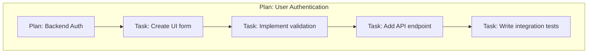

# Documentation Schema (Plan/Task Composable Hierarchy) - Human Version

This file defines **which information appears where** in our Documentation-Driven Development (DDD) Plan/Task Composable Hierarchy and **why**. Use it as the canonical source when updating templates or building automation.

**Methodology Overview**: The Plan/Task Composable Hierarchy is a flexible documentation structure where Plans define strategic direction and can contain other Plans or Tasks based on complexity. This composable approach allows documentation architecture to scale naturally with project needs, from simple single-level structures to complex multi-level hierarchies.

---

## Legend

| Symbol | Meaning                |
| :----- | :--------------------- |
| ✅     | Required               |
| ❓     | Optional (recommended) |
| ➖     | Not applicable / omit  |

**Note on Usage in Document Headings:** In addition to their meaning in the schema tables below, these icons are used in the headings of the actual `*.md` files to indicate the **completion status** of a section.

```md
- `## ✅ [Section Name]`: Indicates the section is considered **complete**.
- `## ❓ [Section Name]`: Indicates the section is **incomplete, a placeholder, or needs review**.
- `## ➖ [Section Name]`: Indicates the section is **not applicable** and has been intentionally omitted.
```

---

## Family Index

| #   | Family (Anchor)                                           | Primary Question Answered                                        | Plan | Task | Notes                                                                             |
| :-- | :-------------------------------------------------------- | :--------------------------------------------------------------- | :--- | :--- | :-------------------------------------------------------------------------------- |
| 1   | [Meta & Governance](#meta--governance)                    | How critical is this work, what is its current status?           | ✅   | ✅   | Required at all levels; Task-level includes detailed progress tracking            |
| 2   | [Business & Scope](#business--scope)                      | Why are we doing this?                                           | ✅   | ✅   | Plans focus on strategic context; Tasks focus on acceptance criteria              |
| 3   | [Planning & Decomposition](#planning--decomposition)      | What are we building, in what order?                             | ✅   | ❓   | Essential for Plans (roadmap of children); Optional for Tasks (dependencies only) |
| 4   | [High-Level Design](#high-level-design)                   | What are the high-level components and interactions? (Black-Box) | ✅   | ✅   | Plans show architectural decisions; Tasks show interface details                  |
| 5   | [Maintenance and Monitoring](#maintenance-and-monitoring) | What are the internal details needed to build it? (White-Box)    | ❓   | ✅   | Optional for high-level Plans; Required for implementation Tasks                  |
| 6   | [Implementation Guidance](#implementation--guidance)      | What are the practical steps?                                    | ❓   | ✅   | Optional for Plans (phased approach); Required for Tasks (step-by-step)           |
| 7   | [Quality & Operations](#quality--operations)              | How do we validate & run it?                                     | ✅   | ✅   | Plans define strategy; Tasks define specific tests and deployment                 |
| 8   | [Reference](#reference)                                   | What other info might we need?                                   | ❓   | ❓   | Optional at all levels for supplementary information                              |

Each document begins with relevant **family headings** (`## Business & Scope`, etc.). A document includes a family only if it has relevant content; otherwise the heading may read `None (inherits from parent)`.

---

## Context Inheritance Protocol

The Plan/Task Composable Hierarchy uses a strict protocol for context inheritance through **progressive narrowing**. To correctly interpret any document, you must gather context by reading from the top-level Plan downward.

### Traversal Process:

- **Identify the hierarchy chain** for your target document
- **Read top-down** starting from the root Plan, progressively narrowing scope
- **Each Plan adds specificity** to the context established by its parent
- **Tasks inherit** the complete context chain from their parent Plan

### Examples:

For `p1-p2-t1-user-endpoints.task.md`:

- Read `project.plan.md` (broadest strategic context)
- Read `p1-backend.plan.md` (backend-specific context)
- Read `p1-p2-api.plan.md` (API-specific context)
- Read `p1-p2-t1-user-endpoints.task.md` (implementation details)

For `p1-t1-database-setup.task.md`:

- Read `project.plan.md` (strategic context)
- Read `p1-backend.plan.md` (backend context)
- Read `p1-t1-database-setup.task.md` (implementation details)

This top-down traversal ensures each document receives progressively narrowed, inherited context. Information is never repeated - it flows downward through the hierarchy. Automated tools and LLMs **MUST** enforce this reading order.

---

## 1 Meta & Governance <a id="meta--governance"></a>

### Rationale

Keeps humans and CI aware of health, urgency, and blockers at any zoom level without polluting design content. Static plan docs carry only a pointer; live status tables sit in dedicated \*-status.md companions (and inside each Task doc).

### Depth Matrix

| ID    | Parent ID | Section Name      | Heading | Plan | Task | Notes                                                                                          |
| :---- | :-------- | :---------------- | :------ | :--- | :--- | :--------------------------------------------------------------------------------------------- |
| **1** | `null`    | Meta & Governance | `##`    | ✅   | ✅   | The main family heading.                                                                       |
| 1.2   | 1         | Status            | `###`   | ✅   | ✅   | Plan: Document lifecycle + strategic phase. Task: Implementation tracking + execution metrics. |
| 1.3   | 1         | Priority Drivers  | `###`   | ✅   | ✅   | Plan: Business/strategic drivers. Task: Inherited drivers + technical execution drivers.       |

### Field Details

#### 1.2 Status

- **Description**: A section containing key status metrics for the document. The specific fields vary depending on whether it's a Plan or Task, with Tasks providing more detailed implementation tracking.
- **Content Format**: Markdown `###` heading followed by a bulleted list.
- **Reference**: See the corresponding template file (e.g., `docs/templates/task.template.md`).
- **Notes**: Plan: Document lifecycle + strategic phase. Task: Implementation tracking + execution metrics.

##### Sub-Field Applicability Matrix

| Field                      | Plan | Task | Notes                                                                                                                                                                                  |
| :------------------------- | :--- | :--- | :------------------------------------------------------------------------------------------------------------------------------------------------------------------------------------- |
| **Created**                | ✅   | ✅   | The timestamp when the document was created (e.g., `2023-10-27 14:30`).                                                                                                                |
| **Last Updated**           | ✅   | ✅   | The timestamp when this status block was last modified (e.g., `2023-10-27 15:00`).                                                                                                     |
| **Current State**          | ➖   | ✅   | The operational status of the task (e.g., `✅ Done`, `⏳ In Progress`). See the standard status keys.                                                                                  |
| **Priority**               | ➖   | ✅   | The task's priority level (e.g., `🟥 High`).                                                                                                                                           |
| **Progress**               | ➖   | ✅   | A percentage representing the completion of the task.                                                                                                                                  |
| **Planning Estimate**      | ➖   | ✅   | The initial story point estimate assigned during planning. This should not change after work begins.                                                                                   |
| **Est. Variance (pts)**    | ➖   | ✅   | The difference between the final completed points and the `Planning Estimate`. A positive number indicates scope creep or underestimation; a negative number indicates overestimation. |
| **Implementation Started** | ➖   | ✅   | The timestamp when a developer began working on the task.                                                                                                                              |
| **Completed**              | ➖   | ✅   | The timestamp when the task was marked as `✅ Done`.                                                                                                                                   |

##### Example for Plan

- **Created:** [YYYY-MM-DD HH:MM]
- **Last Updated:** [YYYY-MM-DD HH:MM]

##### Example for Task

- **Current State:** 💡 Not Started
- **Priority:** 🟨 Medium
- **Progress:** 0%
- **Planning Estimate:** 0
- **Est. Variance (pts):** 0
- **Created:** [YYYY-MM-DD HH:MM]
- **Implementation Started:** [YYYY-MM-DD HH:MM]
- **Completed:** [YYYY-MM-DD HH:MM]
- **Last Updated:** [YYYY-MM-DD HH:MM]

#### 1.3 Priority Drivers

- **Description**: A bulleted list of stable Driver IDs that justify the priority of the artefact.
- **Content Format**: Markdown bulleted list.
- **Notes**: Plan: Business/strategic drivers. Task: Inherited drivers + technical execution drivers.

- **Example**:

> - CBP-Break_Block_Revenue_Legal
> - TEC-Prod_Stability_Blocker

---

## 2 Business & Scope <a id="business--scope"></a>

### Rationale

Explains why the document exists, who it serves, and what success looks like. As we move from Plans to Tasks, the narrative narrows from strategic business goals to specific implementation acceptance criteria.

### Depth Matrix

| ID      | Parent ID | Section Name            | Heading | Plan | Task | Notes                                                                                                |
| :------ | :-------- | :---------------------- | :------ | :--- | :--- | :--------------------------------------------------------------------------------------------------- |
| **2**   | `null`    | Business & Scope        | `##`    | ✅   | ✅   | The main family heading.                                                                             |
| 2.1     | 2         | Overview                | `###`   | ✅   | ✅   | Plan: Strategic identity & value proposition. Task: Specific deliverable & implementation objective. |
| 2.2     | 2         | Business Context        | `###`   | ✅   | ➖   | Strategic context including User Journeys, User Personas, Core Business Rules.                       |
| 2.2.1   | 2.2       | User Journeys           | `####`  | ✅   | ➖   | Container for one or more User Journey definitions.                                                  |
| 2.2.1.1 | 2.2.1     | Journey: [Name]         | `#####` | ✅   | ➖   | A repeatable section for a single, named user journey, including a description and diagram.          |
| 2.2.2   | 2.2       | User Personas           | `####`  | ✅   | ➖   | Table or list of personas involved.                                                                  |
| 2.2.3   | 2.2       | Core Business Rules     | `####`  | ✅   | ❓   | Plan: Domain rules that govern this scope. Task: Implementation-specific business constraints.       |
| 2.2.4   | 2.2       | User Stories            | `####`  | ✅   | ➖   | User-centric goals and workflows relevant to this Plan scope.                                        |
| 2.3     | 2         | Success Criteria        | `###`   | ✅   | ➖   | How we know this Plan's strategic objectives are achieved.                                           |
| 2.4     | 2         | Acceptance Criteria     | `###`   | ➖   | ✅   | Verifiable conditions that define when this Task is complete.                                        |
| 2.5     | 2         | Boundaries & Scope      | `###`   | ✅   | ➖   | Container heading for scope definitions.                                                             |
| 2.5.1   | 2.5       | In Scope                | `####`  | ✅   | ➖   | A bulleted list of items that are explicitly included in this Plan scope.                            |
| 2.5.2   | 2.5       | Out of Scope            | `####`  | ✅   | ➖   | A bulleted list of items that are explicitly excluded from this Plan scope.                          |
| 2.6     | 2         | Core Business Processes | `###`   | ✅   | ➖   | Container for detailed business process descriptions.                                                |
| 2.6.1   | 2.6       | Process: [Name]         | `####`  | ✅   | ➖   | A repeatable section for a single, named business process.                                           |

### Field Details

#### 2.1 Overview

- **Description**: Provide a concise, bulleted list outlining what this artefact delivers and why it matters.
- **Content Format**: Markdown bulleted list.
- **Notes**: Plan: Strategic identity & value proposition. Task: Specific deliverable & implementation objective.

- **Example**:

> - **Core Function**: Implements a robust, multi-level logging system for the document processing pipeline.
> - **Key Capability**: Ensures both operational errors and business events are captured, categorized, and routed to monitoring tools.
> - **Business Value**: Enables proactive issue resolution and performance analysis.

#### 2.2 Business Context

- **Description**: Provides the narrative and domain-specific details behind the work. If no additional context beyond the parent level is needed, this section can contain `None (inherits from parent)`.
- **Content Format**: Markdown text, with optional `####` sub-headings for child sections (Key Workflows, etc.).
- **Notes**: Strategic context including User Journeys, User Personas, Core Business Rules.

- **Example**:

> Currently, pipeline failures are opaque, requiring developers to manually inspect logs, which slows down resolution time. This new logging system will provide structured, queryable data to our analytics dashboard, allowing support staff to diagnose issues without engineering intervention.

#### 2.2.1 User Journeys

- **Description**: A container for one or more `Journey` sections. This section should provide a complete overview of all primary user paths and interactions related to the document.
- **Notes**: Container for one or more User Journey definitions.

#### 2.2.1.1 Journey: [Name]

- **Description**: A self-contained description of a single, specific user journey. The `[Name]` in the heading should be replaced with a descriptive title for the journey (e.g., "Analyst Processes a New Document"). This section must include a brief narrative explaining the journey's context and a diagram to visualize the flow.
- **Content Format**: A `#####` heading, a brief narrative description, and a Mermaid `graph` or `sequenceDiagram`. This section can be repeated as many times as necessary to document all relevant journeys.
- **Notes**: A repeatable section for a single, named user journey, including a description and diagram.

- **Example**:

> ##### Journey: Analyst Processes a New Document
>
> This journey describes the end-to-end path for a data analyst supervising the processing of a single document from selection to completion.

> ```mermaid
> graph
> A("Start") --> B["Selects Document"];
> B --> C("Completes Pipeline");
> ```

> ##### Journey: DevOps Engineer Monitors Pipeline Health
>
> This journey describes how a DevOps engineer interacts with the system's outputs to monitor for errors and performance issues.

> ```mermaid
> sequenceDiagram
> participant Pipeline
> participant Logger
> participant DevOps
> Pipeline-->>Logger: Log "Processing Failed" (ERROR)
> DevOps->>Logger: Views and analyzes error
> ```

#### 2.2.2 User Personas

- **Description**: Table or list of personas involved.
- **Content Format**: Markdown table or list.
- **Notes**: Table or list of personas involved.

- **Example**:

> | Persona             | Goal                                                      |
> | :------------------ | :-------------------------------------------------------- |
> | **DevOps Engineer** | Monitor system health and diagnose infrastructure issues. |
> | **Support Analyst** | Triage user-reported errors and identify root cause.      |

#### 2.2.3 Core Business Rules

- **Description**: Enumerate domain rules that apply to this artefact.
- **Content Format**: Markdown list.
- **Notes**: Plan: Domain rules that govern this scope. Task: Implementation-specific business constraints.

- **Example**:

> - All personally identifiable information (PII) must be logged at the `DEBUG` level or lower.
> - Any log with a `FATAL` level must trigger an immediate PagerDuty alert.
> - Log retention period is 90 days for `INFO` and 1 year for `ERROR` and above.

#### 2.2.4 User Stories

- **Description**: A list of user-centric stories that describe a piece of functionality from the end-user's perspective. This section is most critical for Plans but can be used at the Task level if it provides necessary context. The format "As a [persona], I want [to perform an action], so that I can [achieve a goal]" is recommended.
- **Content Format**: Markdown list.
- **Notes**: User-centric goals and workflows relevant to this Plan scope.

- **Example**:

> - As a DevOps Engineer, I want to receive a real-time alert when a critical error occurs, so that I can immediately begin troubleshooting.
> - As a Support Analyst, I want to filter logs by user ID, so that I can quickly investigate user-reported issues.

#### 2.3 Success Criteria

- **Description**: Measurable or binary statements that define when a Plan is considered complete for its current phase.
- **Content Format**: Markdown list.
- **Notes**: How we know this Plan's strategic objectives are achieved.

- **Example**:

> - All pipeline stages emit structured logs for success, failure, and key business events.
> - The central dashboard can successfully ingest and display logs from all pipeline stages.
> - A comprehensive set of alerts for critical failures is configured and tested.

#### 2.4 Acceptance Criteria

- **Description**: A verifiable, tabular list of conditions that a Task must satisfy to be considered complete.
- **Content Format**: Markdown table.
- **Notes**: Verifiable conditions that define when this Task is complete.

- **Example**:

> | ID   | Criterion                                           | Test Reference      |
> | :--- | :-------------------------------------------------- | :------------------ |
> | AC-1 | Logger correctly filters messages below `minLevel`. | `logger.test.ts`    |
> | AC-2 | `FATAL` level logs trigger a PagerDuty alert.       | `alerting.int.test` |
> | AC-3 | Log output is valid JSON.                           | `formatter.test.ts` |

#### 2.5 Boundaries & Scope

- **Description**: A container heading for the explicit definition of the work's boundaries. Its content is in the child sections `2.5.1 In Scope` and `2.5.2 Out of Scope`.
- **Notes**: Container heading for scope definitions.

#### 2.5.1 In Scope

- **Description**: A bulleted list of functionalities, features, or outcomes that are explicitly included in the scope of the artefact. This list serves as a clear commitment of what will be delivered.
- **Content Format**: Markdown bulleted list.
- **Notes**: A bulleted list of items that are explicitly included in this Plan scope.

- **Example**:

> - Processing of Lok Sabha Q&A documents in PDF format.
> - Manual verification and correction workflows for all pipeline steps.
> - Generation of a document-level knowledge graph.

#### 2.5.2 Out of Scope

- **Description**: A bulleted list of functionalities, features, or outcomes that are explicitly excluded from the scope of the artefact. This is critical for managing expectations and preventing future misunderstandings. It is often useful to list items that were considered but deliberately deferred.
- **Content Format**: Markdown bulleted list.
- **Notes**: A bulleted list of items that are explicitly excluded from this Plan scope.

- **Example**:

> - Real-time document processing capabilities.
> - Processing documents in formats other than PDF.
> - Advanced user management and role-based access control.

#### 2.6 Core Business Processes

- **Description**: A container for one or more `Process` sections. This section details the key, step-by-step business workflows that the Plan implements or affects.
- **Notes**: Container for detailed business process descriptions.

#### 2.6.1 Process: [Name]

- **Description**: A self-contained description of a single business process. The `[Name]` should be a descriptive title (e.g., "Document Ingestion and Triage"). This section should detail the participants, goals, and steps of the process.
- **Content Format**: A `####` heading, followed by narrative text, bullet points, or a Mermaid diagram to illustrate the process flow.
- **Notes**: A repeatable section for a single, named business process.

- **Example**:

> #### Process: Manual Review

> - **Participants**: Data Scientist
> - **Goal**: To validate the accuracy of automated text extraction from a source PDF.
> - **Workflow**:
> - 1. Analyst selects a document in the "Pending Review" state.
> - 2. The UI displays the source PDF alongside the extracted text.
> - 3. Analyst compares the two and makes corrections to the text.
> - 4. Analyst approves the corrected text, advancing the document to the "Chunking" state.

---

## 3 Planning & Decomposition <a id="planning--decomposition"></a>

### Rationale

This family answers what we are building and in what order. It provides a clear breakdown of the work, defines the sequence of implementation, and explicitly lists any dependencies that could block progress. This ensures a predictable development flow and helps in resource allocation.

### Depth Matrix

| ID    | Parent ID | Section Name             | Heading | Plan | Task | Notes                                                                                                     |
| :---- | :-------- | :----------------------- | :------ | :--- | :--- | :-------------------------------------------------------------------------------------------------------- |
| **3** | `null`    | Planning & Decomposition | `##`    | ✅   | ❓   | The main family heading.                                                                                  |
| 3.1   | 3         | Roadmap (In-Focus Items) | `###`   | ✅   | ➖   | Plan: Lists the immediate child Plans/Tasks being actively worked on.                                     |
| 3.2   | 3         | Backlog / Icebox         | `###`   | ✅   | ➖   | Plan: Lists considered but de-scoped or deferred child Plans/Tasks.                                       |
| 3.3   | 3         | Dependencies             | `###`   | ✅   | ✅   | Plan: External dependencies affecting this scope. Task: Other Tasks/Plans this implementation depends on. |
| 3.4   | 3         | Decomposition Graph      | `###`   | ✅   | ➖   |                                                                                                           |

### Field Details

#### 3.1 Roadmap (In-Focus Items)

- **Description**: A table of direct child Plans/Tasks that are currently planned for implementation in the active cycle.
- **Content Format**: Markdown table.
- **Notes**: Plan: Lists the immediate child Plans/Tasks being actively worked on.

- **Example**:

> | ID  | Child Plan/Task                          | Priority  | Priority Drivers                                                                                         | Status         | Depends On | Summary                         |
> | :-- | :--------------------------------------- | :-------- | :------------------------------------------------------------------------------------------------------- | :------------- | :--------- | :------------------------------ |
> | P1  | [Backend Plan](p1-backend.plan.md)       | 🟥 High   | [CBP-Break_Block_Revenue_Legal](/docs/documentation-driven-development.md#cbp-break_block_revenue_legal) | 💡 Not Started | —          | Core backend services and APIs. |
> | T1  | [Database Setup](p1-t1-database.task.md) | 🟧 Medium | [TEC-Prod_Stability_Blocker](/docs/documentation-driven-development.md#tec-prod_stability_blocker)       | 💡 Not Started | —          | Configure production database.  |

#### 3.2 Backlog / Icebox

- **Description**: A list of direct child Plans/Tasks that have been considered but are not scheduled for the current implementation cycle. This is crucial for capturing scope decisions.
- **Content Format**: Markdown list.
- **Notes**: Plan: Lists considered but de-scoped or deferred child Plans/Tasks.

- **Example**:

> - **Reporting Plan**: Deferred to Q4 due to dependency on new analytics service.
> - **Real-time Collaboration Features**: Moved to Icebox as it is outside the scope of the current MVP.

#### 3.3 Dependencies

- **Description**: An explicit list of internal or external dependencies that must be resolved before this Plan/Task can be completed.
- **Content Format**: Markdown table or list.
- **Notes**: Plan: External dependencies affecting this scope. Task: Other Tasks/Plans this implementation depends on.

- **Example**:

> | ID  | Dependency On             | Type     | Status      | Affected Plans/Tasks | Notes                                |
> | :-- | :------------------------ | :------- | :---------- | :------------------- | :----------------------------------- |
> | D-1 | `shared-ui-library` v2.1+ | External | ❌ Blocked  | `p1-frontend`        | Awaiting release from Platform team. |
> | D-2 | Plan `p2-user-profiles`   | Internal | ✅ Complete | `p3-reporting`       | User schema is now finalized.        |

#### 3.4 Decomposition Graph

- **Description**: A Mermaid diagram that visually represents the dependencies and sequencing of the child Plans/Tasks listed in the `3.1 Roadmap`. This graph shows the relationship between child Plans and Tasks, clarifying the critical path and helping developers understand the required order of implementation.
- **Content Format**: Mermaid `graph` diagram.

##### Example for Plan



---

## 4 High-Level Design <a id="high-level-design"></a>

### Rationale

This family answers how the system works from a high-level, black-box perspective. It describes the major components and their interactions without detailing their internal implementation. This allows for a clear understanding of the system's structure and boundaries.

### Depth Matrix

| ID      | Parent ID | Section Name                | Heading | Plan | Task | Notes                                                                                                            |
| :------ | :-------- | :-------------------------- | :------ | :--- | :--- | :--------------------------------------------------------------------------------------------------------------- |
| **4**   | `null`    | High-Level Design           | `##`    | ✅   | ✅   | The main family heading.                                                                                         |
| 4.0     | 4         | Guiding Principles          | `###`   | ✅   | ➖   | Plan: High-level architectural rules that govern this scope.                                                     |
| 4.1     | 4         | Current Architecture        | `###`   | ✅   | ➖   | Plan: Existing system analysis for planning. Task: Not applicable (inherits context from Plan).                  |
| 4.1.1   | 4.1       | Data Models                 | `####`  | ✅   | ➖   | Plan: Current entity relationships analysis. Task: Not applicable.                                               |
| 4.1.2   | 4.1       | Components                  | `####`  | ✅   | ➖   | Plan: Current component relationships analysis. Task: Not applicable.                                            |
| 4.1.3   | 4.1       | Data Flow                   | `####`  | ✅   | ➖   | Plan: Current data movement analysis. Task: Not applicable.                                                      |
| 4.1.4   | 4.1       | Control Flow                | `####`  | ✅   | ➖   | Plan: Current system interactions analysis. Task: Not applicable.                                                |
| 4.1.5   | 4.1       | Integration Points          | `####`  | ✅   | ➖   | Plan: Current external system boundaries analysis. Task: Not applicable.                                         |
| 4.1.5.1 | 4.1.5     | Upstream Integrations       | `#####` | ✅   | ➖   | Plan: Current systems this scope consumes analysis. Task: Not applicable.                                        |
| 4.1.5.2 | 4.1.5     | Downstream Integrations     | `#####` | ✅   | ➖   | Plan: Current systems this scope serves analysis. Task: Not applicable.                                          |
| 4.2     | 4         | Target Architecture         | `###`   | ✅   | ✅   | Plan: Proposed system design. Task: Implementation architecture requirements.                                    |
| 4.2.1   | 4.2       | Data Models                 | `####`  | ✅   | ✅   | Plan: Target entity relationships. Task: Implementation data structures.                                         |
| 4.2.2   | 4.2       | Components                  | `####`  | ✅   | ✅   | Plan: Target component architecture. Task: Implementation component interfaces.                                  |
| 4.2.3   | 4.2       | Data Flow                   | `####`  | ✅   | ✅   | Plan: Target data movement patterns. Task: Implementation data transformations.                                  |
| 4.2.4   | 4.2       | Control Flow                | `####`  | ✅   | ✅   | Plan: Target interaction patterns. Task: Implementation operation sequences.                                     |
| 4.2.5   | 4.2       | Integration Points          | `####`  | ✅   | ✅   | Plan: Target integration strategy. Task: Implementation integration contracts.                                   |
| 4.2.5.1 | 4.2.5     | Upstream Integrations       | `#####` | ✅   | ✅   | Plan: Target upstream systems. Task: Implementation upstream dependencies.                                       |
| 4.2.5.2 | 4.2.5     | Downstream Integrations     | `#####` | ✅   | ✅   | Plan: Target downstream systems. Task: Implementation downstream contracts.                                      |
| 4.2.6   | 4.2       | Exposed API                 | `####`  | ✅   | ✅   | Plan: Public API strategy. Task: Specific API implementation specification.                                      |
| 4.3     | 4         | Tech Stack & Deployment     | `###`   | ✅   | ❓   | Plan: Technology choices and deployment strategy. Task: Implementation-specific tech requirements (if relevant). |
| 4.4     | 4         | Non-Functional Requirements | `###`   | ✅   | ✅   | Plan: Quality attributes strategy. Task: Implementation-specific NFR targets.                                    |
| 4.4.1   | 4.4       | Performance                 | `####`  | ✅   | ✅   | Plan: Performance strategy. Task: Specific performance targets.                                                  |
| 4.4.2   | 4.4       | Security                    | `####`  | ✅   | ✅   | Plan: Security approach. Task: Implementation security requirements.                                             |
| 4.4.3   | 4.4       | Reliability                 | `####`  | ✅   | ✅   | Plan: Reliability strategy. Task: Implementation reliability targets.                                            |
| 4.4.4   | 4.4       | Permission Model            | `####`  | ✅   | ❓   | Plan: Access control strategy. Task: Implementation-specific permissions (if relevant).                          |

### Field Details

#### 4.0 Guiding Principles

- **Description**: A list of high-level architectural rules, patterns, or constraints that apply to the entire artefact (e.g., "All UI components must be stateless," "All services must be idempotent"). These principles guide all subsequent design decisions.
- **Content Format**: Markdown list.
- **Notes**: Plan: High-level architectural rules that govern this scope.

- **Example**:

> - **Stateless Services**: All backend services should be stateless to allow for horizontal scaling.
> - **Event-Driven**: Communication between major components should be asynchronous and event-driven where possible.

#### 4.1 Current Architecture

- **Notes**: Plan: Existing system analysis for planning. Task: Not applicable (inherits context from Plan).

#### 4.1.1 Data Models

- **Notes**: Plan: Current entity relationships analysis. Task: Not applicable.

#### 4.1.2 Components

- **Notes**: Plan: Current component relationships analysis. Task: Not applicable.

#### 4.1.3 Data Flow

- **Notes**: Plan: Current data movement analysis. Task: Not applicable.

#### 4.1.4 Control Flow

- **Notes**: Plan: Current system interactions analysis. Task: Not applicable.

#### 4.1.5 Integration Points

- **Notes**: Plan: Current external system boundaries analysis. Task: Not applicable.

#### 4.1.5.1 Upstream Integrations

- **Notes**: Plan: Current systems this scope consumes analysis. Task: Not applicable.

#### 4.1.5.2 Downstream Integrations

- **Notes**: Plan: Current systems this scope serves analysis. Task: Not applicable.

#### 4.2 Target Architecture

- **Notes**: Plan: Proposed system design. Task: Implementation architecture requirements.

#### 4.2.1 Data Models

- **Description**: The structure of data at a high level, often represented as an Entity-Relationship Diagram. This section defines the core data entities and their relationships before detailing the components that manage them.
- **Content Format**: Mermaid `erDiagram`.
- **Notes**: Plan: Target entity relationships. Task: Implementation data structures.

- **Example**:

> ```mermaid
> erDiagram
> LOG_LEVEL ||--o{ LOG_PAYLOAD : "sets severity"
> LOG_PAYLOAD {
>   string id PK
>   LogLevel level
>   string message
>   string timeISO8601
>   string stack
>   string componentStack
>   json context
> }
> LOGGER_CONFIG {
>   LogLevel minLevel
> }
> TRANSPORT_CONFIG {
>   string name
>   string endpoint
> }
> ENV_VAR {
>   string NEXT_PUBLIC_LOG_LEVEL PK
> }
> ENV_VAR ||--|| LOGGER_CONFIG : "overrides"
> ```

#### 4.2.2 Components

- **Description**: A diagram illustrating the main components and their relationships. The term "component" is used broadly and does not necessarily map to a class; it represents a logical block of functionality.
- **Content Format**: Mermaid `classDiagram` diagram.
- **Notes**: Plan: Target component architecture. Task: Implementation component interfaces.

- **Example**:

> ```mermaid
> classDiagram
> direction LR
>
>     class LogPayload {
>         <<type>>
>         +LogLevel level
>         +string message
>         +string timeISO8601
>         +string stack
>         +string componentStack
>         +Record<string,any> context
>     }
>
>     class ClientLogger {
>         <<interface>>
>         +log(payload: LogPayload): Promise<void>
>     }
>
>     class ConsoleTransport {
>         +log(payload: LogPayload): Promise<void>
>     }
>
>     class HttpTransport {
>         +string endpoint
>         +log(payload: LogPayload): Promise<void>
>     }
>
>     class CompositeLogger {
>         +ClientLogger[] delegates
>         +log(payload: LogPayload): Promise<void>
>     }
>
>     class LoggerConfig {
>         +LogLevel minLevel
>         +TransportConfig[] transports
>     }
>
>     class TransportConfig {
>         +string name
>         +string endpoint
>     }
>
>     class LoggerFactory {
>         +create(config: LoggerConfig): ClientLogger
>     }
>
>     class BuildLogPayload {
>         <<function>>
>     }
>
>     class SingleCallGuard {
>         <<function>>
>     }
>
>     class AppErrorBoundary {
>         +ClientLogger logger
>         +componentDidCatch(error, info): void
>     }
>
>     %% Inheritance / Implementation
>     ClientLogger <|.. ConsoleTransport
>     ClientLogger <|.. HttpTransport
>     ClientLogger <|.. CompositeLogger
>
>     %% Associations / Composition
>     CompositeLogger o-- ClientLogger : delegates
>     LoggerFactory --> LoggerConfig
>     LoggerFactory --> ClientLogger : returns
>     LoggerFactory --> TransportConfig
>     AppErrorBoundary --> ClientLogger : uses
>     AppErrorBoundary --> SingleCallGuard : guards
>     BuildLogPayload --> LogPayload : returns
>     AppErrorBoundary ..> BuildLogPayload : builds
> ```

#### 4.2.3 Data Flow

- **Description**: A diagram showing how data moves between components, with numbered steps to indicate the sequence of actions.
- **Content Format**: Mermaid `graph` diagram. The labels on the connectors should be numbered (e.g., `"1 - Action"`).
- **Notes**: Plan: Target data movement patterns. Task: Implementation data transformations.

- **Example**:

> ```mermaid
> graph
> TD
>     subgraph "Input"
>         A[Component A]
>     end
>
>     subgraph "System"
>         B(Component B)
>         C(Component C)
>     end
>
>     subgraph "External Resource"
>         D[Database]
>     end
>
>     subgraph "Output"
>         E[Component D]
>     end
>
>     A -- "1 - Invoke with" --> B
>     B -- "2 - Process" --> C
>     C -- "3 - Write to" --> D
>     C -- "4 - Return" --> E
> ```

#### 4.2.4 Control Flow

- **Description**: A diagram showing the sequence of interactions between components.
- **Content Format**: Mermaid `sequenceDiagram`.
- **Notes**: Plan: Target interaction patterns. Task: Implementation operation sequences.

- **Example**:

> ```mermaid
> sequenceDiagram
> participant User
>     participant API
>     participant AuthSvc
>     User->>API: POST /login
>     API->>AuthSvc: ValidateCredentials(user, pass)
>     AuthSvc-->>API: JWT
>     API-->>User: { token: "..." }
> ```

#### 4.2.5 Integration Points

- **Description**: A container for defining all systems, services, or APIs that this component interacts with, broken down into `Upstream` and `Downstream` sections.
- **Notes**: Plan: Target integration strategy. Task: Implementation integration contracts.

#### 4.2.5.1 Upstream Integrations

- **Description**: Defines how this artefact is triggered and what data it receives from other systems.
- **Content Format**: Markdown list or table.
- **Notes**: Plan: Target upstream systems. Task: Implementation upstream dependencies.

- **Example**:

> - **Trigger**: User action via UI button click.
> - **Input Data**: Receives `documentId` and `userId` from the client.

#### 4.2.5.2 Downstream Integrations

- **Description**: Defines what happens when this artefact completes its work and what data it sends to other systems.
- **Content Format**: Markdown list or table.
- **Notes**: Plan: Target downstream systems. Task: Implementation downstream contracts.

- **Example**:

> - **Completion Trigger**: Emits a `DOCUMENT_PROCESSED` event to the message queue.
> - **Output Data**: The event payload includes `documentId` and `status: 'COMPLETED'`.

#### 4.2.6 Exposed API

- **Description**: The API surface this component exposes to consumers.
- **Content Format**: OpenAPI/Swagger snippet, or a Markdown table.
- **Notes**: Plan: Public API strategy. Task: Specific API implementation specification.

- **Example**:

> ```yaml
> paths:
>   /users/{userId}:
>     get:
>       summary: Get user by ID
>       parameters:
>         - name: userId
>           in: path
>           required: true
>           schema:
>             type: string
> ```

#### 4.3 Tech Stack & Deployment

- **Description**: A list of the primary technologies, frameworks, or libraries foundational to this artefact, along with the deployment strategy.
- **Content Format**: Markdown list or table.
- **Notes**: Plan: Technology choices and deployment strategy. Task: Implementation-specific tech requirements (if relevant).

- **Example**:

> - **Language**: TypeScript
> - **Framework**: Next.js
> - **Deployment**: Vercel

#### 4.4 Non-Functional Requirements

- **Description**: A container for the high-level, non-functional requirements (NFRs) or quality attributes that the system must meet. This section defines what the requirements are, while the `7. Quality & Operations` family describes how they will be tested and monitored.
- **Notes**: Plan: Quality attributes strategy. Task: Implementation-specific NFR targets.

#### 4.4.1 Performance

- **Description**: Defines the performance-related NFRs, such as response times, throughput, and resource utilization, in a prioritized table.
- **Content Format**: Markdown table.
- **Notes**: Plan: Performance strategy. Task: Specific performance targets.

- **Example**:

> | ID      | Requirement                                                       | Priority  |
> | :------ | :---------------------------------------------------------------- | :-------- |
> | PERF-01 | API endpoints must respond in < 200ms (95th percentile).          | 🟥 High   |
> | PERF-02 | The system must support 100 concurrent users without degradation. | 🟧 Medium |

#### 4.4.2 Security

- **Description**: Defines the security-related NFRs, such as data encryption, access control, and vulnerability standards, in a prioritized table.
- **Content Format**: Markdown table.
- **Notes**: Plan: Security approach. Task: Implementation security requirements.

- **Example**:

> | ID     | Requirement                                                              | Priority |
> | :----- | :----------------------------------------------------------------------- | :------- |
> | SEC-01 | All sensitive user data must be encrypted at rest using AES-256.         | 🟥 High  |
> | SEC-02 | Access to admin endpoints must be restricted to users with 'Admin' role. | 🟥 High  |

#### 4.4.3 Reliability

- **Description**: Defines the reliability-related NFRs, such as uptime, data integrity, and disaster recovery, in a prioritized table.
- **Content Format**: Markdown table.
- **Notes**: Plan: Reliability strategy. Task: Implementation reliability targets.

- **Example**:

> | ID     | Requirement                                               | Priority |
> | :----- | :-------------------------------------------------------- | :------- |
> | REL-01 | The service must maintain 99.9% uptime, measured monthly. | 🟥 High  |
> | REL-02 | All database transactions must be atomic and durable.     | 🟥 High  |

#### 4.4.4 Permission Model

- **Description**: Defines the access control rules, user roles, and permissions for the system. This section should clearly outline who can access what and perform which actions. The mechanism for assigning these roles in each environment should be detailed in the `7.2 Configuration` section.
- **Content Format**: A Markdown table or bulleted list describing the roles and their associated permissions.
- **Notes**: Plan: Access control strategy. Task: Implementation-specific permissions (if relevant).

- **Example**:

> | Role        | Permissions                                                  | Notes                               |
> | :---------- | :----------------------------------------------------------- | :---------------------------------- |
> | **Admin**   | - Full CRUD access to all documents<br>- Can assign roles    | For system administrators only.     |
> | **Analyst** | - Read/Write access to assigned documents<br>- Cannot delete | The primary user role.              |
> | **Viewer**  | - Read-only access to completed documents                    | For stakeholders or external users. |

---

## 5 Maintenance and Monitoring <a id="maintenance-and-monitoring"></a>

### Rationale

This family answers how the system is maintained and monitored. It provides the internal implementation details necessary for developers to build the components defined in the High-Level Design.

### Depth Matrix

| ID    | Parent ID | Section Name                       | Heading | Plan | Task | Notes                                                                                                  |
| :---- | :-------- | :--------------------------------- | :------ | :--- | :--- | :----------------------------------------------------------------------------------------------------- |
| **5** | `null`    | Maintenance and Monitoring         | `##`    | ❓   | ✅   | The main family heading.                                                                               |
| 5.1   | 5         | Current Maintenance and Monitoring | `###`   | ✅   | ➖   | Plan: Existing observability analysis for planning. Task: Not applicable (inherits context from Plan). |
| 5.1.1 | 5.1       | Error Handling                     | `####`  | ✅   | ➖   | Plan: Current error handling analysis. Task: Not applicable.                                           |
| 5.1.2 | 5.1       | Logging & Monitoring               | `####`  | ✅   | ➖   | Plan: Current observability analysis. Task: Not applicable.                                            |
| 5.2   | 5         | Target Maintenance and Monitoring  | `###`   | ✅   | ✅   | Plan: Target observability strategy. Task: Implementation requirements.                                |
| 5.2.1 | 5.2       | Error Handling                     | `####`  | ✅   | ✅   | Plan: Target error handling strategy. Task: Specific error scenarios and implementation requirements.  |
| 5.2.2 | 5.2       | Logging & Monitoring               | `####`  | ✅   | ✅   | Plan: Target observability strategy. Task: Specific logging/monitoring implementation requirements.    |

### Field Details

#### 5.1 Current Maintenance and Monitoring

- **Notes**: Plan: Existing observability analysis for planning. Task: Not applicable (inherits context from Plan).

#### 5.1.1 Error Handling

- **Notes**: Plan: Current error handling analysis. Task: Not applicable.

#### 5.1.2 Logging & Monitoring

- **Notes**: Plan: Current observability analysis. Task: Not applicable.

#### 5.2 Target Maintenance and Monitoring

- **Notes**: Plan: Target observability strategy. Task: Implementation requirements.

#### 5.2.1 Error Handling

- **Description**: The strategy for managing and communicating errors, often best represented as a table detailing the condition, trigger, action, and feedback.
- **Content Format**: Markdown table.
- **Notes**: Plan: Target error handling strategy. Task: Specific error scenarios and implementation requirements.

- **Example**:

> | Error Type                  | Trigger                                       | Action                  | User Feedback                                                             |
> | :-------------------------- | :-------------------------------------------- | :---------------------- | :------------------------------------------------------------------------ |
> | **File System Error**       | Cannot read a required file or directory.     | Abort with exit code 1. | `ERROR: Cannot access [path]. Please check permissions.`                  |
> | **Schema Validation Error** | A document violates the canonical schema.     | Abort with exit code 1. | `ERROR: Schema validation failed in [file]: [validation_details].`        |
> | **API/Network Error**       | External API is unreachable or returns > 299. | Abort with exit code 1. | `ERROR: Failed to transmit status to [endpoint]: [HTTP_status_or_error].` |

#### 5.2.2 Logging & Monitoring

- **Description**: The strategy for system observability.
- **Content Format**: Markdown list or table.
- **Notes**: Plan: Target observability strategy. Task: Specific logging/monitoring implementation requirements.

- **Example**:

> - **Metrics**: Prometheus endpoint `/metrics` will be exposed.
> - **Logs**: Structured JSON logs sent to stdout for collection by Fluentd.
> - **Tracing**: OpenTelemetry SDK will be used for distributed tracing.

---

## 6 Implementation Guidance <a id="implementation--guidance"></a>

### Rationale

This family provides the practical, step-by-step instructions for building the component. It translates the "what" from the planning sections and the "how" from the architecture sections into a concrete "to-do" list. This is where design becomes action.

### Depth Matrix

| ID    | Parent ID | Section Name               | Heading | Plan | Task | Notes                                                                                                   |
| :---- | :-------- | :------------------------- | :------ | :--- | :--- | :------------------------------------------------------------------------------------------------------ |
| **6** | `null`    | Implementation Guidance    | `##`    | ❓   | ✅   | The main family heading.                                                                                |
| 6.1   | 6         | Implementation Plan        | `###`   | ✅   | ❓   | Plan: Phased rollout strategy for child Plans/Tasks. Task: Direct implementation approach (if complex). |
| 6.1   | 6         | Implementation Log / Steps | `###`   | ➖   | ✅   | Plan: Not applicable (Plans don't implement). Task: Detailed step-by-step execution log.                |
| 6.1.1 | 6.1       | Initial Situation          | `####`  | ➖   | ✅   | Plan: Not applicable. Task: Baseline state before implementation begins.                                |
| 6.1.2 | 6.1       | Files Change Log           | `####`  | ➖   | ✅   | Plan: Not applicable. Task: File modifications tracking during implementation.                          |
| 6.2   | 6         | Prompts (LLM reuse)        | `###`   | ❓   | ❓   | Plan: Strategic prompts for planning. Task: Implementation-specific prompts.                            |

### Field Details

#### 6.1 Implementation Plan

- **Description**: A detailed, step-by-step log of the implementation process for a Task.
- **Content Format**: Markdown list.
- **Notes**: Plan: Phased rollout strategy for child Plans/Tasks. Task: Direct implementation approach (if complex).

#### 6.1 Implementation Log / Steps

- **Description**: A detailed, step-by-step log of the implementation process for a Task. This is often updated as the task progresses.
- **Content Format**: Markdown list.
- **Notes**: Plan: Not applicable (Plans don't implement). Task: Detailed step-by-step execution log.

- **Example**:

> - [x] Create `logger/types.ts` with core interfaces.
> - [x] Implement `ConsoleTransport`.
> - [ ] Implement `HttpTransport`.
> - [ ] Write unit tests for transports.

#### 6.1.1 Initial Situation

- **Notes**: Plan: Not applicable. Task: Baseline state before implementation begins.

#### 6.1.2 Files Change Log

- **Notes**: Plan: Not applicable. Task: File modifications tracking during implementation.

#### 6.2 Prompts (LLM reuse)

- **Description**: A collection of prompts that can be used with an LLM to assist in the implementation.
- **Content Format**: Markdown code blocks.
- **Notes**: Plan: Strategic prompts for planning. Task: Implementation-specific prompts.

- **Example**:

> Generate a Vitest test for this function:

> ```md
> export const add = (a: number, b: number): number => a + b;
> ```

---

## 7 Quality & Operations <a id="quality--operations"></a>

### Rationale

This family defines how we ensure the system is correct, reliable, and observable. It covers everything from testing strategies to monitoring in production.

### Depth Matrix

| ID    | Parent ID | Section Name                    | Heading | Plan | Task | Notes                                                                                                  |
| :---- | :-------- | :------------------------------ | :------ | :--- | :--- | :----------------------------------------------------------------------------------------------------- |
| **7** | `null`    | Quality & Operations            | `##`    | ✅   | ✅   | The main family heading.                                                                               |
| 7.1   | 7         | Testing Strategy / Requirements | `###`   | ✅   | ✅   | Plan: Overall testing approach and strategy. Task: Specific tests and requirements for implementation. |
| 7.2   | 7         | Configuration                   | `###`   | ✅   | ✅   | Plan: Configuration strategy and approach. Task: Implementation-specific configuration requirements.   |
| 7.3   | 7         | Alerting & Response             | `###`   | ✅   | ✅   | Plan: Alerting strategy and response protocols. Task: Implementation-specific alerts and responses.    |
| 7.4   | 7         | Deployment Steps                | `###`   | ✅   | ➖   | Plan: Deployment strategy and approach. Task: Not applicable (Tasks don't handle deployment).          |
| 7.5   | 7         | Local Test Commands             | `###`   | ➖   | ✅   | Plan: Not applicable (Plans don't execute tests). Task: CLI commands to run tests locally.             |

### Field Details

#### 7.1 Testing Strategy / Requirements

- **Description**: The overall strategy for testing, and a list of specific tests that must pass, often mapping to Acceptance Criteria.
- **Content Format**: Markdown table.
- **Notes**: Plan: Overall testing approach and strategy. Task: Specific tests and requirements for implementation.

- **Example**:

> | AC  | Scenario                                                  | Test Type   | Tools / Runner                    | Notes                                    |
> | :-- | :-------------------------------------------------------- | :---------- | :-------------------------------- | :--------------------------------------- |
> | 1   | Default dev logger = console only                         | Unit        | Vitest + RTL (spy on console)     | Set `process.env.NODE_ENV='development'` |
> | 2   | Prod logger fan-out to console + HTTP, minLevel respected | Unit        | Vitest + fetch-mock + console spy | `NODE_ENV='production'`                  |
> | 7   | Successful POST to `/api/log/client`                      | Integration | Vitest + MSW                      | Assert JSON body and 2xx handling        |

#### 7.2 Configuration

- **Description**: How the system is configured in different environments (e.g., production, development).
- **Content Format**: Markdown list or table.
- **Notes**: Plan: Configuration strategy and approach. Task: Implementation-specific configuration requirements.

- **Example**:

> | Setting Name          | Plan Dependency | Source               | Override Method                               | Notes                                                                   |
> | :-------------------- | :-------------- | :------------------- | :-------------------------------------------- | :---------------------------------------------------------------------- |
> | `analyzerApiEndpoint` | `p1-analyzer`   | `ddd.config.json`    | `DDD_ANALYZER_API_ENDPOINT` (Environment Var) | (Required) The URL of the external service for status reporting.        |
> | `logLevel`            | (All)           | `ddd.config.json`    | `DDD_LOG_LEVEL` (Environment Variable)        | `info` (default), `debug`, `warn`, `error`. Controls logging verbosity. |
> | `NODE_ENV`            | (All)           | Environment Variable | Not overrideable                              | `development` or `production`. Determines the operational mode.         |

#### 7.3 Alerting & Response

- **Description**: How to respond to alerts and operational logs, especially errors, and how they are integrated with alerting systems.
- **Content Format**: Markdown list or table.
- **Notes**: Plan: Alerting strategy and response protocols. Task: Implementation-specific alerts and responses.

- **Example**:

> | Error Condition                   | Relevant Plans | Response Plan                                                                                                | Status         |
> | :-------------------------------- | :------------- | :----------------------------------------------------------------------------------------------------------- | :------------- |
> | **Internal Script Failure**       | All            | Abort the `git commit` with a non-zero exit code. Print the error stack trace directly to the console.       | 💡 Not Started |
> | **External API Non-2xx Response** | `p1-analyzer`  | Abort the `git commit` with a non-zero exit code. Log the API's error response to the console.               | 💡 Not Started |
> | **CI/CD Pipeline Failure**        | All            | Fail the corresponding pipeline step. The tool's non-zero exit code will be surfaced in the CI/CD interface. | 💡 Not Started |

#### 7.4 Deployment Steps

- **Description**: Any manual steps required to deploy the component.
- **Content Format**: Markdown list.
- **Notes**: Plan: Deployment strategy and approach. Task: Not applicable (Tasks don't handle deployment).

- **Example**:

> - Run database migrations: `yarn db:migrate`
> - Update environment variables in Vercel dashboard.
> - Promote the build to production.

#### 7.5 Local Test Commands

- **Description**: CLI commands to run tests locally.
- **Content Format**: Markdown code blocks.
- **Notes**: Plan: Not applicable (Plans don't execute tests). Task: CLI commands to run tests locally.

---

## 8 Reference <a id="reference"></a>

### Rationale

This family is a catch-all for supplementary information that doesn't fit into the other categories but is still relevant to the artefact.

### Depth Matrix

| ID    | Parent ID | Section Name        | Heading | Plan | Task | Notes                                  |
| :---- | :-------- | :------------------ | :------ | :--- | :--- | :------------------------------------- |
| **8** | `null`    | Reference           | `##`    | ❓   | ❓   | The main family heading.               |
| 8.1   | 8         | Appendices/Glossary | `###`   | ❓   | ❓   | Additional information or definitions. |

### Field Details

#### 8.1 Appendices/Glossary

- **Description**: A place for glossaries, appendices, or links to external resources.
- **Content Format**: Markdown list or text.
- **Notes**: Additional information or definitions.

- **Example**:

> **Glossary:**

> - **PII**: Personally Identifiable Information.
> - **SSO**: Single Sign-On.

---
