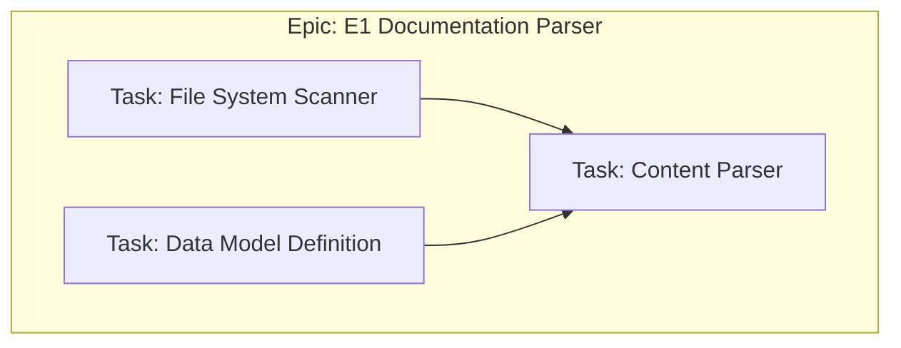
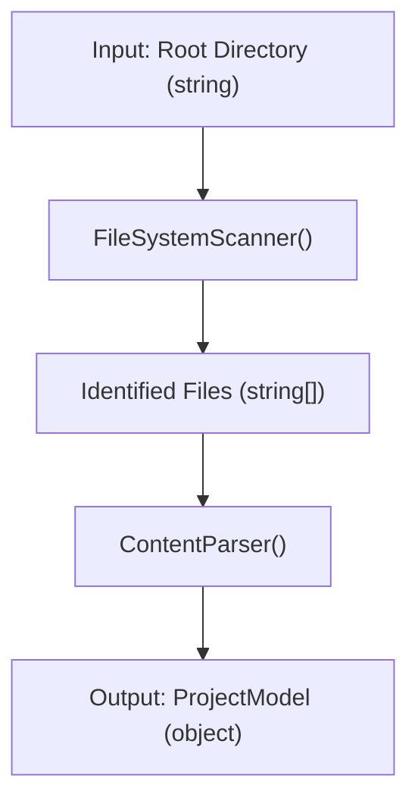

# Epic: E1: Documentation Parser

<!-- This document defines a complete, independent feature, including its business justification, architectural design, and implementation plan. It should be testable on its own, with dependencies on other epics limited to well-defined integration points. -->

---

## ✅ 1 Meta & Governance

### ✅ 1.1 Status Tracking

<!-- Link to the live status document for this epic. -->

[Link to Epic Status File](./m1-e1-parser-status.md)

### ✅ 1.3 Priority Drivers

<!-- List the stable Driver IDs from the root documentation that justify this epic's priority. -->

- [TEC-Dev_Productivity_Blocker](/docs/documentation-driven-development.md#tec-dev_productivity_blocker)

---

## ✅ 2 Business & Scope

### ✅ 2.1 Overview

- **Core Function**: Implements the core logic for finding, reading, and parsing all DDD documentation files (`.md`) into a structured, in-memory model.
- **Key Capability**: This epic provides the foundational data structure that all other analyzer epics will depend on.
- **Business Value**: By creating a reliable and accurate in-memory representation of the project's documentation, this epic enables all subsequent automation and analysis, directly contributing to developer productivity.

### ✅ 2.2.4 User Stories

- As a **DDD Developer**, I want the tool to recursively scan the `docs/` directory and identify all valid documentation files (`project.md`, `*.module.md`, `*.epic.md`, `*.task.md`), so that the system has a complete inventory of the project's state.
- As a **DDD Developer**, I want the tool to parse the content of each documentation file into a structured, in-memory data model, so that other tools can easily access and manipulate the information.

### ❓ 2.4 Acceptance Criteria

| ID   | Criterion                                                                                | Test Reference   |
| ---- | ---------------------------------------------------------------------------------------- | ---------------- |
| AC-1 | The parser correctly identifies all documentation files in a nested directory structure. | `parser.test.ts` |
| AC-2 | The parser creates a hierarchical in-memory model that reflects the file structure.      | `parser.test.ts` |
| AC-3 | Each parsed document in the model contains the raw Markdown content.                     | `parser.test.ts` |

---

## ✅ 3 Planning & Decomposition

### ✅ 3.1 Roadmap (In-Focus Items)

| ID  | Task                                                   | Priority | Priority Drivers                                                                                       | Status         | Depends On | Summary                                                                            |
| :-- | :----------------------------------------------------- | :------- | :----------------------------------------------------------------------------------------------------- | :------------- | :--------- | :--------------------------------------------------------------------------------- |
| T1  | [File System Scanner](./m1-e1-t1-fs-scanner.task.md)   | 🟥 High  | [TEC-Dev_Productivity_Blocker](/docs/documentation-driven-development.md#tec-dev_productivity_blocker) | 💡 Not Started | —          | Implement a function to recursively find all `.md` files in the `docs/` directory. |
| T2  | [Data Model Definition](./m1-e1-t2-data-model.task.md) | 🟥 High  | [TEC-Dev_Productivity_Blocker](/docs/documentation-driven-development.md#tec-dev_productivity_blocker) | 💡 Not Started | —          | Define the TypeScript interfaces for the in-memory project model.                  |
| T3  | [Content Parser](./m1-e1-t3-content-parser.task.md)    | 🟥 High  | [TEC-Dev_Productivity_Blocker](/docs/documentation-driven-development.md#tec-dev_productivity_blocker) | 💡 Not Started | T1, T2     | Implement the logic to read file contents and populate the data model.             |

### ✅ 3.4 Decomposition Graph



---

## ✅ 4 High-Level Design

### ❓ 4.1 Current Architecture

None (Greenfield).

### ✅ 4.2 Target Architecture

The parser will be a pure function that takes a root directory path as input and returns a promise that resolves to an in-memory representation of the documentation hierarchy.

#### ✅ 4.2.1 Components



---

## ✅ 5 Detailed Design

### ✅ 5.2 Target Detailed Design

#### ✅ 5.2.1 Data Models

```typescript
// In-memory representation of the documentation hierarchy
interface ProjectModel {
  path: string;
  project: Document;
  modules: ModuleModel[];
}

interface ModuleModel {
  path: string;
  module: Document;
  epics: EpicModel[];
}

interface EpicModel {
  path: string;
  epic: Document;
  tasks: TaskModel[];
}

interface TaskModel {
  path: string;
  task: Document;
}

interface Document {
  path: string;
  rawContent: string;
}
```

---

## ✅ 7 Quality & Operations

### ✅ 7.1 Testing Strategy / Requirements

- Unit tests will cover the file system scanner and the content parser.
- Mocks will be used for the file system to ensure tests are fast and reliable.
- Integration tests will verify the end-to-end parsing of a fixture directory.
