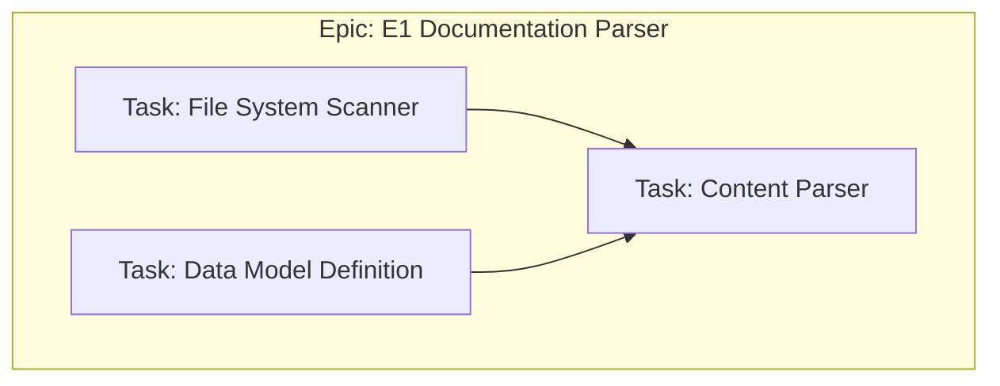
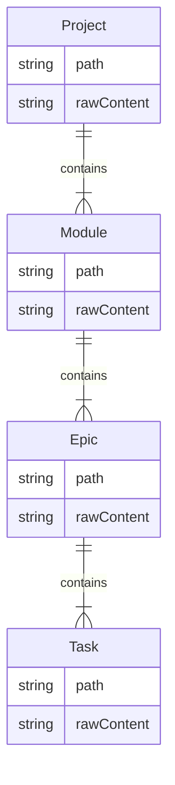
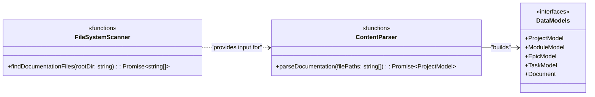
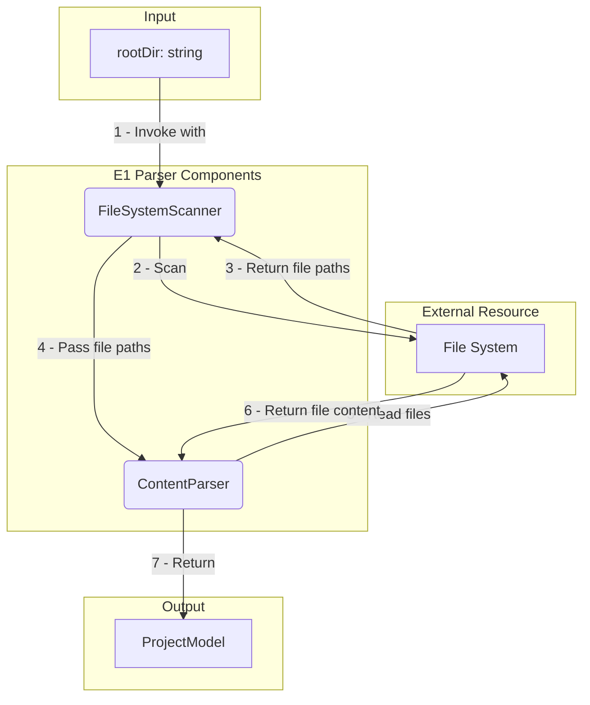
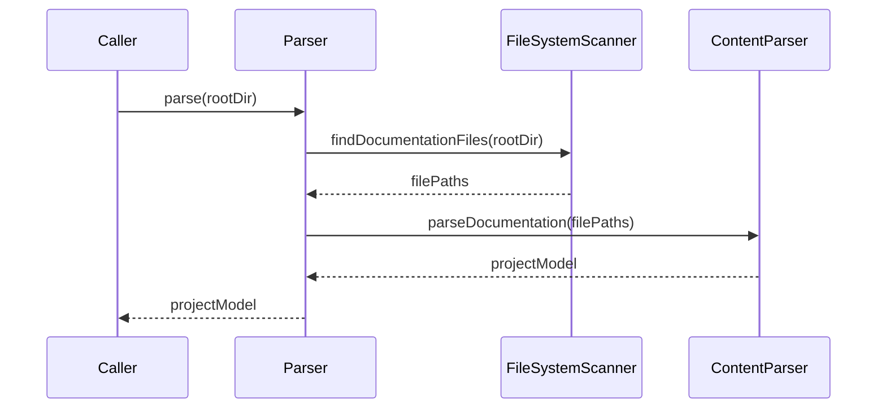

# Epic: E1: Documentation Parser

<!-- This document defines a complete, independent feature, including its business justification, architectural design, and implementation plan. It should be testable on its own, with dependencies on other epics limited to well-defined integration points. -->

---

## ✅ 1 Meta & Governance

### ✅ 1.1 Status Tracking

<!-- Link to the live status document for this epic. -->

[Link to Epic Status File](./m1-e1-parser-status.md)

### ✅ 1.3 Priority Drivers

<!-- List the stable Driver IDs from the root documentation that justify this epic's priority. -->

- [TEC-Dev_Productivity_Blocker](/docs/documentation-driven-development.md#tec-dev_productivity_blocker)

---

## ✅ 2 Business & Scope

### ✅ 2.1 Overview

<!-- Provide a concise, bulleted list outlining the epic's identity, mission, and boundaries. -->

- **Core Function**: Implements the core logic for finding, reading, and parsing all DDD documentation files (e.g., `project.md`, `*.module.md`, `*.epic.md`, `*.task.md`) into a structured, in-memory model.
- **Key Capability**: This epic provides the foundational data structure that all other analyzer epics will depend on.
- **Business Value**: By creating a reliable and accurate in-memory representation of the project's documentation, this epic enables all subsequent automation and analysis, directly contributing to developer productivity.

### ✅ 2.2.4 User Stories

<!-- List the user-centric goals for this epic. -->

- As a **DDD Developer**, I want the tool to recursively scan the `docs/` directory and identify all valid documentation files (`project.md`, `*.module.md`, `*.epic.md`, `*.task.md`), so that the system has a complete inventory of the project's state.
- As a **DDD Developer**, I want the tool to parse the content of each documentation file into a structured, in-memory data model, so that other tools can easily access and manipulate the information.

### ❓ 2.4 Acceptance Criteria

<!-- (Optional) A verifiable, tabular list of conditions that this epic must satisfy to be considered complete. -->

| ID   | Criterion                                                                                                                                            | Test Reference   |
| ---- | ---------------------------------------------------------------------------------------------------------------------------------------------------- | ---------------- |
| AC-1 | The parser correctly identifies all documentation files (`project.md`, `*.module.md`, `*.epic.md`, `*.task.md`) within a nested directory structure. | `parser.test.ts` |
| AC-2 | The parser constructs a hierarchical `ProjectModel` object that mirrors the parent-child relationships of the documentation files.                   | `parser.test.ts` |
| AC-3 | Each `Document` object within the model contains the full, unmodified Markdown content from the corresponding file.                                  | `parser.test.ts` |
| AC-4 | The parser ignores `.md` files that do not match the defined DDD file naming conventions (e.g., `README.md`).                                        | `parser.test.ts` |

---

## ✅ 3 Planning & Decomposition

### ✅ 3.1 Roadmap (In-Focus Items)

<!-- List the tasks that are actively planned for the current implementation cycle. -->

| ID  | Task                                                   | Priority | Priority Drivers                                                                                       | Status         | Depends On | Summary                                                                            |
| :-- | :----------------------------------------------------- | :------- | :----------------------------------------------------------------------------------------------------- | :------------- | :--------- | :--------------------------------------------------------------------------------- |
| T1  | [File System Scanner](./m1-e1-t1-fs-scanner.task.md)   | 🟥 High  | [TEC-Dev_Productivity_Blocker](/docs/documentation-driven-development.md#tec-dev_productivity_blocker) | 💡 Not Started | —          | Implement a function to recursively find all `.md` files in the `docs/` directory. |
| T2  | [Data Model Definition](./m1-e1-t2-data-model.task.md) | 🟥 High  | [TEC-Dev_Productivity_Blocker](/docs/documentation-driven-development.md#tec-dev_productivity_blocker) | 💡 Not Started | —          | Define the TypeScript interfaces for the in-memory project model.                  |
| T3  | [Content Parser](./m1-e1-t3-content-parser.task.md)    | 🟥 High  | [TEC-Dev_Productivity_Blocker](/docs/documentation-driven-development.md#tec-dev_productivity_blocker) | 💡 Not Started | T1, T2     | Implement the logic to read file contents and populate the data model.             |

### ✅ 3.4 Decomposition Graph

<!-- A visual graph of dependencies between the child tasks. -->



---

## ✅ 4 High-Level Design

### ❓ 4.1 Current Architecture

<!-- (Optional) Describe the existing system before the changes in this epic are implemented. -->

None (Greenfield).

### ✅ 4.2 Target Architecture

<!-- Describe the proposed "to-be" state of the system after this epic is implemented. -->

The parser will be a pure function that takes a root directory path as input and returns a promise that resolves to an in-memory representation of the documentation hierarchy.

#### ✅ 4.2.1 Data Models

<!-- "To-be" data structures (ER diagrams). -->



#### ✅ 4.2.2 Components

<!-- "To-be" component diagram. -->



#### ✅ 4.2.3 Data Flow

<!-- This epic is a pure function; data flows from input to output directly. -->



#### ✅ 4.2.4 Control Flow

<!-- This epic is a pure function; control flow is linear. -->



#### ✅ 4.2.5 Integration Points

- **Trigger**: The `Parser` is invoked by the main `analyzer` script, which passes the root directory of the documentation to be parsed.
- **Input Data**: The `Parser` receives a single `string` argument, `rootDir`, which is the path to the `docs/` directory.
- **Output Data**: The `Parser` returns a `Promise` that resolves with a `ProjectModel` object, representing the entire documentation hierarchy in memory. This model is then passed to the `Validator` epic.

#### ✅ 4.2.6 Exposed API

The parser epic exposes a single function to the `analyzer` module.

```typescript
/**
 * Parses all documentation files within a given directory and returns a structured model.
 * @param rootDir The root directory to scan for documentation files.
 * @returns A promise that resolves to a ProjectModel.
 */
export async function parse(rootDir: string): Promise<ProjectModel>;
```

### ✅ 4.4 Non-Functional Requirements

#### ✅ 4.4.1 Performance

| ID      | Requirement                                                                                                   | Priority  |
| :------ | :------------------------------------------------------------------------------------------------------------ | :-------- |
| PERF-01 | The entire `parse` function should complete in under 500ms for a project with ~100 documentation files.       | 🟥 High   |
| PERF-02 | The initial file system scan should complete in under 200ms for a project with up to 500 documentation files. | 🟧 Medium |
| PERF-03 | Parsing of individual file contents into the in-memory model should average less than 5ms per file.           | 🟧 Medium |

#### ✅ 4.4.2 Security

| ID     | Requirement                                                                                                                    | Priority |
| :----- | :----------------------------------------------------------------------------------------------------------------------------- | :------- |
| SEC-01 | The file system scanner must be strictly confined to the `rootDir` and prevent any path traversal vulnerabilities.             | 🟥 High  |
| SEC-02 | The parser should handle large files gracefully, avoiding excessive memory consumption that could lead to a denial-of-service. | 🟨 Low   |

#### ✅ 4.4.3 Reliability

| ID     | Requirement                                                                                                                    | Priority  |
| :----- | :----------------------------------------------------------------------------------------------------------------------------- | :-------- |
| REL-01 | The parser must not crash on encountering an empty directory or a directory with no valid documentation files.                 | 🟥 High   |
| REL-02 | Executing the parser multiple times on the same set of files must produce an identical `ProjectModel` each time (Idempotency). | 🟥 High   |
| REL-03 | The parser must not fail if document content violates the schema; this is the Validator's role.                                | 🟧 Medium |
| REL-04 | The parser must throw a specific, catchable error for file system access issues or malformed file content.                     | 🟧 Medium |

---

## ✅ 5 Maintenance and Monitoring

### ✅ 5.2 Target Maintenance and Monitoring

#### ✅ 5.2.1 Error Handling

| Error Type                  | Trigger                                                                         | Action                  | User Feedback                                                                     |
| :-------------------------- | :------------------------------------------------------------------------------ | :---------------------- | :-------------------------------------------------------------------------------- |
| **Directory Not Found**     | The specified `rootDir` does not exist.                                         | Abort with exit code 1. | `ERROR: Root directory not found at [path].`                                      |
| **File System Read Error**  | A file or directory within `rootDir` cannot be read due to permissions.         | Abort with exit code 1. | `ERROR: Cannot access [path]. Please check permissions.`                          |
| **Orphaned Document Error** | A documentation file's path does not match the expected parent-child hierarchy. | Abort with exit code 1. | `ERROR: Orphaned document found at [path]. It does not belong to a valid parent.` |

#### ✅ 5.2.2 Logging & Monitoring

The parser's logging provides crucial visibility into the file discovery and model-building process. It uses the centralized logger from the main `analyzer` script.

| Level   | Condition                                                               | Log Message Example                                                     |
| :------ | :---------------------------------------------------------------------- | :---------------------------------------------------------------------- |
| `DEBUG` | A documentation file is discovered by the file system scanner.          | `Found potential document: [path]`                                      |
| `DEBUG` | A file is successfully read and its content is added to the model.      | `Parsed content from [path]`                                            |
| `INFO`  | The entire parsing process (scanning and model building) is complete.   | `Parser finished. Found and processed [count] documents.`               |
| `WARN`  | A non-DDD `.md` file (e.g., `README.md`) is found and skipped.          | `Skipping non-standard markdown file: [path]`                           |
| `ERROR` | Any error condition from the `5.2.1 Error Handling` table is triggered. | (Corresponds to the "User Feedback" column in the error handling table) |

---

## ✅ 6 Implementation Guidance

### ✅ 6.1 Implementation Plan

The implementation of the `E1: Documentation Parser` epic is broken into two distinct phases to ensure foundational components are stable before building dependent logic.

| Phase                       | Scope / Deliverables                                                                                                                                                         | Key Artifacts                                                                | Exit Criteria                                                                                                  |
| :-------------------------- | :--------------------------------------------------------------------------------------------------------------------------------------------------------------------------- | :--------------------------------------------------------------------------- | :------------------------------------------------------------------------------------------------------------- |
| **Phase 1: Core Utilities** | - Implement the `FileSystemScanner` to find all valid documentation files.<br>- Define all necessary TypeScript interfaces for the `ProjectModel` and its constituent parts. | `src/modules/analyzer/parser/scanner.ts`<br>`src/modules/analyzer/models.ts` | The `scanner` correctly identifies all valid documentation files and the `models` are fully defined and typed. |
| **Phase 2: Parsing Logic**  | - Implement the `ContentParser` to read file contents.<br>- Build the logic to assemble the hierarchical `ProjectModel` from the individual file contents.                   | `src/modules/analyzer/parser/content-parser.ts`                              | The `ContentParser` can take an array of file paths and return a complete, structured `ProjectModel`.          |

### ✅ 6.2 Implementation Log / Steps

This log provides a granular, step-by-step checklist for developers.

- [ ] **Task T2: Data Model Definition**
  - [ ] Create `src/modules/analyzer/models.ts`.
  - [ ] Define `Document` base interface.
  - [ ] Define `TaskModel`, `EpicModel`, `ModuleModel`, and `ProjectModel` interfaces, ensuring they extend `Document` and include their respective child arrays.
- [ ] **Task T1: File System Scanner**
  - [ ] Create `src/modules/analyzer/parser/scanner.ts`.
  - [ ] Implement `findDocumentationFiles` function to recursively scan a directory.
  - [ ] Add logic to filter for files matching the DDD naming convention (`project.md`, `*.module.md`, etc.).
  - [ ] Ensure the function returns a sorted array of absolute file paths.
- [ ] **Task T3: Content Parser**
  - [ ] Create `src/modules/analyzer/parser/content-parser.ts`.
  - [ ] Implement `parseDocumentation` function that takes file paths from the scanner.
  - [ ] Read the content of each file.
  - [ ] Implement the logic to stitch the documents together into a hierarchical `ProjectModel` based on their file paths.
  - [ ] Return the fully assembled `ProjectModel`.

---

## ✅ 7 Quality & Operations

### ✅ 7.1 Testing Strategy / Requirements

The testing strategy for the parser relies on **test fixtures**. A `fixtures` directory will be created within the test suite to store mock documentation structures that simulate various real-world scenarios. This approach provides a consistent and repeatable environment for testing the parser's logic end-to-end, from file scanning to model construction.

| AC ID | Scenario                                                                                            | Test Fixture               | Test Type   | Notes                                                                                      |
| :---- | :-------------------------------------------------------------------------------------------------- | :------------------------- | :---------- | :----------------------------------------------------------------------------------------- |
| AC-1  | The parser correctly identifies all valid DDD files in a nested directory structure.                | `fixtures/valid/`          | Integration | The test should assert that the returned file list matches the expected count and paths.   |
| AC-4  | The parser ignores non-DDD markdown files (e.g., `README.md`).                                      | `fixtures/mixed/`          | Integration | Assert that the file list does not include ignored files.                                  |
| AC-2  | The parser correctly constructs a hierarchical `ProjectModel` from a valid directory structure.     | `fixtures/valid/`          | Integration | The test should traverse the returned model and assert correct parent-child relationships. |
| AC-3  | Each `Document` in the model contains the raw, unmodified content from its corresponding file.      | `fixtures/valid/`          | Integration | Compare the `rawContent` property of a document in the model with the actual file content. |
| N/A   | The parser throws a `Directory Not Found` error when given a path to a non-existent directory.      | N/A                        | Integration | Use `expect(...).rejects.toThrow()` to verify the correct error is thrown.                 |
| N/A   | The parser throws an `Orphaned Document Error` when a file is misplaced (e.g., a task in a module). | `fixtures/invalid-orphan/` | Integration | Create a fixture with a misplaced file and assert that the specific error is thrown.       |

### ✅ 7.2 Configuration

The parser is designed as a pure function and does not require any external configuration files or environment variables. Its entire behavior is controlled by the `rootDir` argument passed to the `parse` function at runtime. This ensures that the component is self-contained, predictable, and easy to test in isolation.

### ✅ 7.3 Alerting & Response

The parser itself does not perform any alerting. Its responsibility is to fail predictably by throwing specific, catchable errors when it encounters a problem (as defined in the `5.2.1 Error Handling` section).

The **calling script** (the main `analyzer` process) is responsible for catching these errors and implementing the response plan. For a developer running the tool locally in a pre-commit hook, the "alert" is the immediate failure of their commit, and the "response" is reading the error message in their terminal to diagnose and fix the issue in the documentation.

### ✅ 7.5 Local Test Commands

To run the integration tests for this epic, use the following command from the project root:

```bash
# Run all tests for the parser epic once
yarn jest src/modules/analyzer/parser/

# Run tests in watch mode for active development
yarn jest src/modules/analyzer/parser/ --watch
```

---

## ❓ 8 Reference

### ❓ 8.1 Appendices/Glossary

- **Parser**: A component that reads data in one format and translates it into another.
