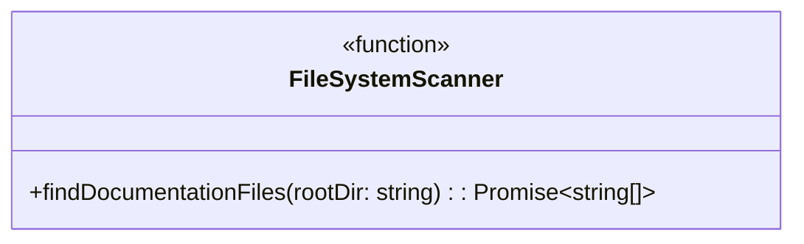
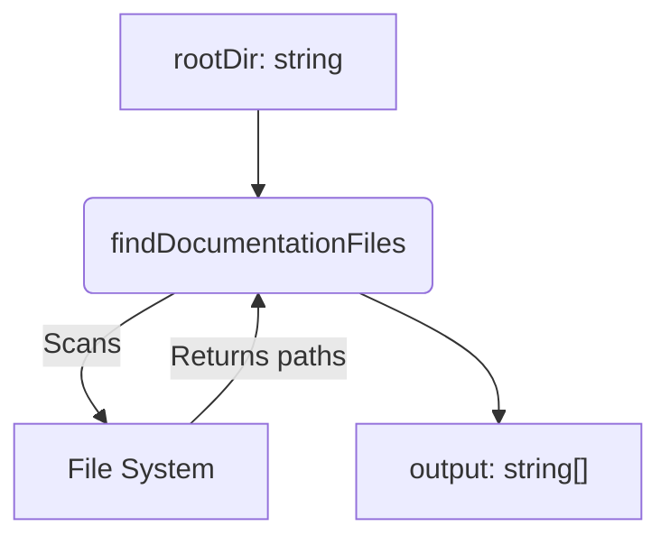
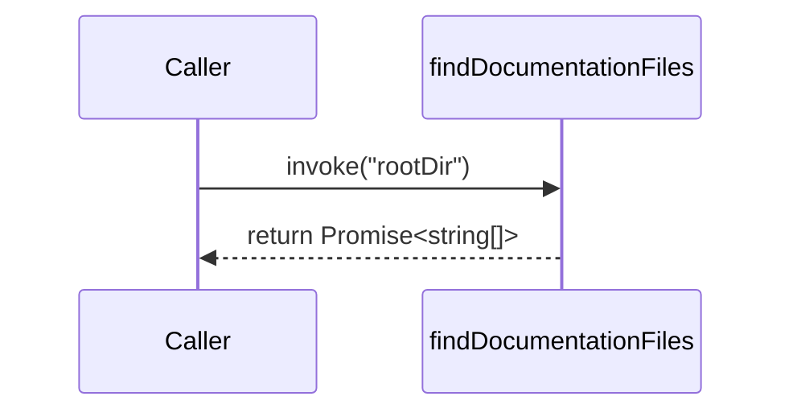

# Task: T1: File System Scanner

<!-- This document provides the detailed implementation requirements for a single, focused unit of work. -->

---

## ✅ 1 Meta & Governance

### ✅ 1.2 Status

<!-- This section is auto-populated and updated by the developer as the task progresses. -->

- **Current State:** � Not Started
- **Priority:** 🟥 High
- **Progress:** 0%
- **Assignee**: @[username]
- **Planning Estimate:** 2
- **Est. Variance (pts):** 0
- **Created:** 2025-07-17 02:00
- **Implementation Started:** [YYYY-MM-DD HH:MM]
- **Completed:** [YYYY-MM-DD HH:MM]
- **Last Updated:** 2025-07-17 03:00

### ✅ 1.3 Priority Drivers

<!-- List the stable Driver IDs that justify this task's priority. These are inherited from the parent Epic unless overridden. -->

- [TEC-Dev_Productivity_Blocker](/docs/documentation-driven-development.md#tec-dev_productivity_blocker)

---

## ✅ 2 Business & Scope

### ✅ 2.1 Overview

<!-- Provide a concise, bulleted list outlining what this task delivers and why it matters. -->

- **Core Function**: Implements a function to recursively scan a directory and identify all valid DDD documentation files.
- **Key Capability**: Provides the `ContentParser` with a definitive list of files to parse, serving as the entry point for the entire analysis process.
- **Business Value**: Automates the discovery of documentation files, eliminating the need for manual tracking and ensuring that no document is missed during the analysis.

### ✅ 2.4 Acceptance Criteria

<!-- A verifiable, tabular list of conditions that this task must satisfy to be considered complete. -->

| ID   | Criterion                                                                                                                                       | Test Reference    |
| ---- | ----------------------------------------------------------------------------------------------------------------------------------------------- | ----------------- |
| AC-1 | The scanner function correctly identifies all files matching the DDD naming convention (`project.md`, `*.module.md`, `*.epic.md`, `*.task.md`). | `scanner.test.ts` |
| AC-2 | The scanner recursively searches through all subdirectories within the given root directory.                                                    | `scanner.test.ts` |
| AC-3 | The scanner ignores `.md` files that do not match the DDD naming convention (e.g., `README.md`, `CONTRIBUTING.md`).                             | `scanner.test.ts` |
| AC-4 | The function returns an array of absolute file paths, sorted alphabetically.                                                                    | `scanner.test.ts` |
| AC-5 | The function throws a specific error if the provided root directory does not exist.                                                             | `scanner.test.ts` |

---

## ❓ 3 Planning & Decomposition

### ✅ 3.3 Dependencies

<!-- List any internal or external dependencies that could block the progress of this task. -->

This task has no dependencies.

---

## ✅ 4 High-Level Design

### ❓ 4.1 Current Architecture

None (Greenfield).

### ✅ 4.2 Target Architecture

This task implements a single, pure function.

#### ✅ 4.2.1 Data Models

This task does not directly interact with or define data models; it produces a primitive `string[]`. The data models it helps build are defined in `m1-e1-t2-data-model.task.md`.

#### ✅ 4.2.2 Components

<!-- "To-be" component diagram. -->



#### ✅ 4.2.3 Data Flow



#### ✅ 4.2.4 Control Flow



#### ✅ 4.2.5 Integration Points

- **Trigger**: Invoked by the `ContentParser`.
- **Input Data**: `rootDir: string`.
- **Output Data**: `Promise<string[]>` containing absolute paths.

#### ✅ 4.2.6 Exposed API

The task will implement and export a single function.

```typescript
/**
 * Recursively scans a directory to find all valid DDD documentation files.
 * @param rootDir The absolute path to the directory to scan.
 * @returns A promise that resolves to an alphabetically sorted array of absolute file paths.
 * @throws If the rootDir does not exist.
 */
export async function findDocumentationFiles(rootDir: string): Promise<string[]>;
```

---

## ✅ 5 Maintenance and Monitoring

### ✅ 5.2 Target Maintenance and Monitoring

#### ✅ 5.2.1 Error Handling

| Error Type              | Trigger                            | Action                  | User Feedback                                |
| :---------------------- | :--------------------------------- | :---------------------- | :------------------------------------------- |
| **Directory Not Found** | The specified `rootDir` not exist. | Abort with exit code 1. | `ERROR: Root directory not found at [path].` |

#### ✅ 5.2.2 Logging & Monitoring

| Level   | Condition                                       | Log Message Example                            |
| :------ | :---------------------------------------------- | :--------------------------------------------- |
| `DEBUG` | A potential documentation file is found.        | `Found potential document: [path]`             |
| `WARN`  | A non-standard `.md` file is found and skipped. | `Skipping non-standard markdown file: [path]`  |
| `INFO`  | The file scan is complete.                      | `File scan complete. Found [count] documents.` |

---

## ✅ 6 Implementation Guidance

### ✅ 6.1 Implementation Plan

<!-- A direct, "one-shot" overview of the technical approach for this work item. -->

Create a new file, `src/modules/analyzer/parser/scanner.ts`, and implement the `findDocumentationFiles` function. This function will use a library like `glob` to recursively find all `.md` files and then filter them based on the DDD naming conventions.

### ✅ 6.2 Implementation Log / Steps

<!-- A detailed, step-by-step log of the implementation process for this task. -->

1.  [ ] Create the file `src/modules/analyzer/parser/scanner.ts`.
2.  [ ] Add a dependency for a file-matching library (e.g., `glob`).
3.  [ ] Implement the `findDocumentationFiles` function.
4.  [ ] Add logic to check if the `rootDir` exists and throw an error if it doesn't.
5.  [ ] Use the library to find all `.md` files within the `rootDir`.
6.  [ ] Implement a regex or filter function to select only files that match the DDD naming conventions.
7.  [ ] Ensure the returned array of file paths is sorted alphabetically.

---

## ✅ 7 Quality & Operations

### ✅ 7.1 Testing Strategy / Requirements

<!-- The approach to testing and specific testing requirements for this task. -->

| AC ID | Scenario                                              | Test Fixture      | Test Type | Notes                                                             |
| :---- | :---------------------------------------------------- | :---------------- | :-------- | :---------------------------------------------------------------- |
| AC-1  | Scanner finds all valid DDD files.                    | `fixtures/valid/` | Unit      | Assert that the returned array contains the expected file paths.  |
| AC-2  | Scanner correctly searches nested directories.        | `fixtures/valid/` | Unit      | The fixture should have files at multiple directory levels.       |
| AC-3  | Scanner ignores non-DDD markdown files.               | `fixtures/mixed/` | Unit      | Assert that files like `README.md` are not in the returned array. |
| AC-4  | Scanner returns a sorted list of absolute paths.      | `fixtures/valid/` | Unit      | Verify the sorting and that paths are absolute.                   |
| AC-5  | Scanner throws an error for a non-existent directory. | N/A               | Unit      | Use `expect(...).rejects.toThrow()`.                              |

### ✅ 7.5 Local Test Commands

<!-- CLI commands to run tests locally. -->

```bash
yarn jest src/modules/analyzer/parser/scanner.test.ts
```

---

## ❓ 8 Reference

N/A
