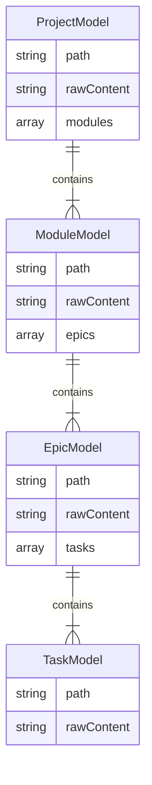
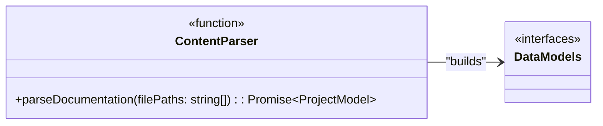
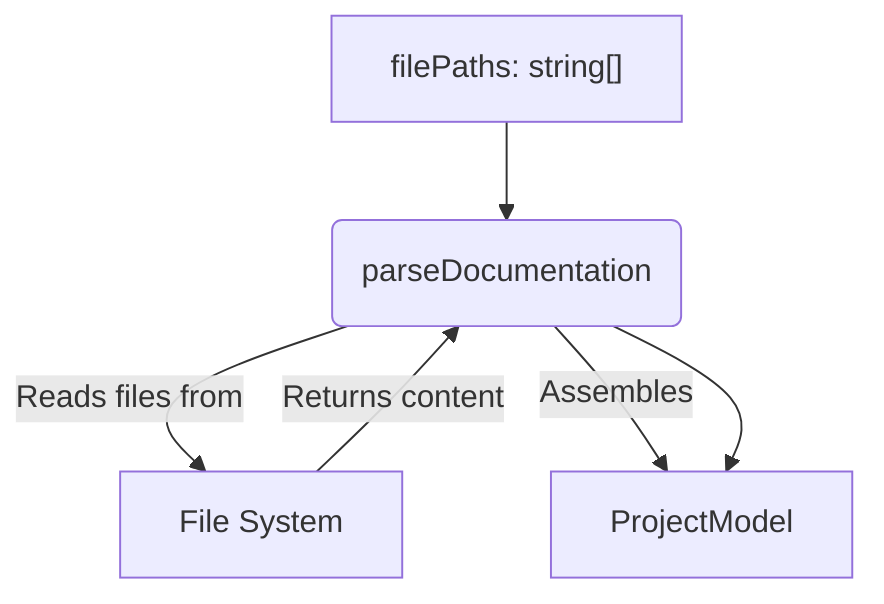
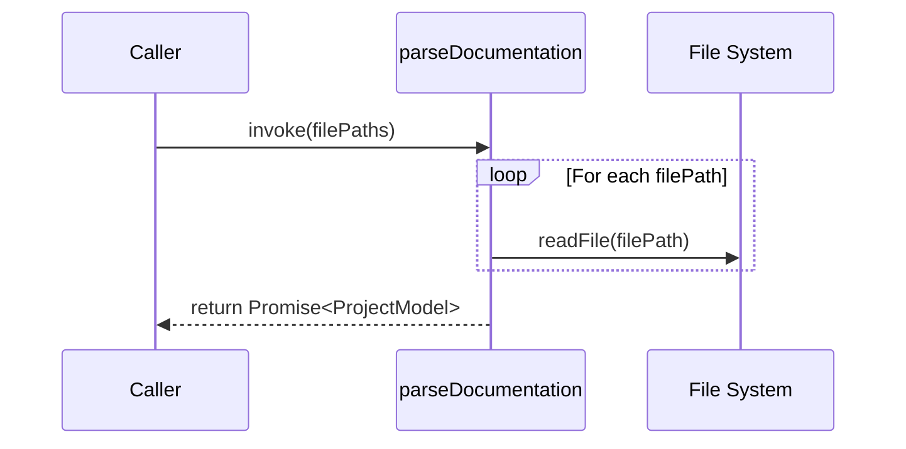

# Task: T3: Content Parser

<!-- This document provides the detailed implementation requirements for a single, focused unit of work. -->

---

## ✅ 1 Meta & Governance

### ✅ 1.2 Status

<!-- This section is auto-populated and updated by the developer as the task progresses. -->

- **Current State:** 💡 Not Started
- **Priority:** 🟥 High
- **Progress:** 0%
- **Assignee**: @[username]
- **Planning Estimate:** 3
- **Est. Variance (pts):** 0
- **Created:** 2025-07-17 02:00
- **Implementation Started:** [YYYY-MM-DD HH:MM]
- **Completed:** [YYYY-MM-DD HH:MM]
- **Last Updated:** 2025-07-17 03:00

### ✅ 1.3 Priority Drivers

<!-- List the stable Driver IDs that justify this task's priority. These are inherited from the parent Epic unless overridden. -->

- [TEC-Dev_Productivity_Blocker](/docs/documentation-driven-development.md#tec-dev_productivity_blocker)

---

## ✅ 2 Business & Scope

### ✅ 2.1 Overview

<!-- Provide a concise, bulleted list outlining what this task delivers and why it matters. -->

- **Core Function**: Implements the main parsing logic that reads the content of documentation files and assembles them into a hierarchical, in-memory `ProjectModel`.
- **Key Capability**: This is the core of the parser epic, transforming a flat list of file paths into a structured, relational data model.
- **Business Value**: Creates the complete, queryable data model of the project's documentation, which is the essential input for all downstream consumers like the schema validator and status transmitter.

### ✅ 2.4 Acceptance Criteria

<!-- A verifiable, tabular list of conditions that this task must satisfy to be considered complete. -->

| ID   | Criterion                                                                                                                                  | Test Reference           |
| ---- | ------------------------------------------------------------------------------------------------------------------------------------------ | ------------------------ |
| AC-1 | The parser correctly reads the `rawContent` from each file path provided by the `FileSystemScanner`.                                       | `content-parser.test.ts` |
| AC-2 | The parser correctly constructs a hierarchical `ProjectModel` that mirrors the parent-child relationships implied by the file paths.       | `content-parser.test.ts` |
| AC-3 | The parser correctly identifies the root `project.md` file and places it at the top of the hierarchy.                                      | `content-parser.test.ts` |
| AC-4 | The parser throws a specific `OrphanedDocumentError` if a documentation file cannot be placed in the hierarchy (e.g., a task in a module). | `content-parser.test.ts` |

---

## ✅ 3 Planning & Decomposition

### ✅ 3.3 Dependencies

<!-- List any internal or external dependencies that could block the progress of this task. -->

| ID  | Dependency On                                                   | Type     | Status         | Notes                                                     |
| --- | --------------------------------------------------------------- | -------- | -------------- | --------------------------------------------------------- |
| D-1 | [Task T1: File System Scanner](./m1-e1-t1-fs-scanner.task.md)   | Internal | 💡 Not Started | This task consumes the file list produced by the scanner. |
| D-2 | [Task T2: Data Model Definition](./m1-e1-t2-data-model.task.md) | Internal | 💡 Not Started | This task implements the interfaces defined in T2.        |

---

## ✅ 4 High-Level Design

### ❓ 4.1 Current Architecture

None (Greenfield).

### ✅ 4.2 Target Architecture

This task implements a single, pure function that orchestrates file reading and model assembly.

#### ✅ 4.2.1 Data Models

This task implements the `ProjectModel` and its constituent interfaces, which are defined in `m1-e1-t2-data-model.task.md`.



#### ✅ 4.2.2 Components



#### ✅ 4.2.3 Data Flow



#### ✅ 4.2.4 Control Flow



#### ✅ 4.2.5 Integration Points

- **Trigger**: Invoked by the main `Parser` function.
- **Input Data**: `filePaths: string[]`.
- **Output Data**: `Promise<ProjectModel>`.

#### ✅ 4.2.6 Exposed API

```typescript
/**
 * Given a list of documentation file paths, reads their content and assembles them
 * into a hierarchical ProjectModel.
 * @param filePaths An array of absolute paths to documentation files.
 * @returns A promise that resolves to the fully assembled ProjectModel.
 * @throws If a file cannot be read or if an orphaned document is found.
 */
export async function parseDocumentation(filePaths: string[]): Promise<ProjectModel>;
```

---

## ✅ 5 Maintenance and Monitoring

### ✅ 5.2 Target Maintenance and Monitoring

#### ✅ 5.2.1 Error Handling

| Error Type                  | Trigger                                                                         | Action                  | User Feedback                                                                     |
| :-------------------------- | :------------------------------------------------------------------------------ | :---------------------- | :-------------------------------------------------------------------------------- |
| **File System Read Error**  | A file path from the input array cannot be read.                                | Abort with exit code 1. | `ERROR: Cannot read file [path]. Please check permissions.`                       |
| **Orphaned Document Error** | A documentation file's path does not match the expected parent-child hierarchy. | Abort with exit code 1. | `ERROR: Orphaned document found at [path]. It does not belong to a valid parent.` |

#### ✅ 5.2.2 Logging & Monitoring

| Level   | Condition                              | Log Message Example                                 |
| :------ | :------------------------------------- | :-------------------------------------------------- |
| `DEBUG` | A file is being read and parsed.       | `Parsing content from [path]`                       |
| `INFO`  | The entire model assembly is complete. | `Content parsing complete. Assembled ProjectModel.` |

---

## ✅ 6 Implementation Guidance

### ✅ 6.1 Implementation Plan

Create a new file, `src/modules/analyzer/parser/content-parser.ts`, and implement the `parseDocumentation` function. This function will iterate through the provided file paths, read each file's content, and build the hierarchical `ProjectModel` by associating parent and child documents based on their paths.

### ✅ 6.2 Implementation Log / Steps

1.  [ ] Create the file `src/modules/analyzer/parser/content-parser.ts`.
2.  [ ] Implement the `parseDocumentation` function that accepts `filePaths: string[]`.
3.  [ ] Read the content of each file asynchronously.
4.  [ ] Create a map or dictionary to hold document models keyed by their path for easy lookup.
5.  [ ] Implement the logic to determine parent-child relationships based on file paths (e.g., `.../m1-e1-parser/m1-e1-t3-content-parser.task.md` is a child of `.../m1-e1-parser/m1-e1-parser.epic.md`).
6.  [ ] Stitch the individual document models together into the final `ProjectModel`.
7.  [ ] Throw an `OrphanedDocumentError` if a document cannot be linked to a parent.
8.  [ ] Return the completed `ProjectModel`.

---

## ✅ 7 Quality & Operations

### ✅ 7.1 Testing Strategy / Requirements

| AC ID | Scenario                                                              | Test Fixture               | Test Type   | Notes                                                                                     |
| :---- | :-------------------------------------------------------------------- | :------------------------- | :---------- | :---------------------------------------------------------------------------------------- |
| AC-1  | The parser correctly reads and stores `rawContent` for each document. | `fixtures/valid/`          | Integration | Assert that the `rawContent` property of each model matches the file content on disk.     |
| AC-2  | The parser correctly builds the parent-child hierarchy.               | `fixtures/valid/`          | Integration | Traverse the returned model and assert that children are correctly nested within parents. |
| AC-3  | The parser correctly identifies the `project.md` as the root.         | `fixtures/valid/`          | Integration | Assert that the top-level object in the model corresponds to the `project.md` file.       |
| AC-4  | The parser throws an `OrphanedDocumentError` for a misplaced file.    | `fixtures/invalid-orphan/` | Integration | Use `expect(...).rejects.toThrow()` to verify the specific error is thrown.               |

### ✅ 7.5 Local Test Commands

```bash
yarn jest src/modules/analyzer/parser/content-parser.test.ts
```

---

## ❓ 8 Reference

N/A
