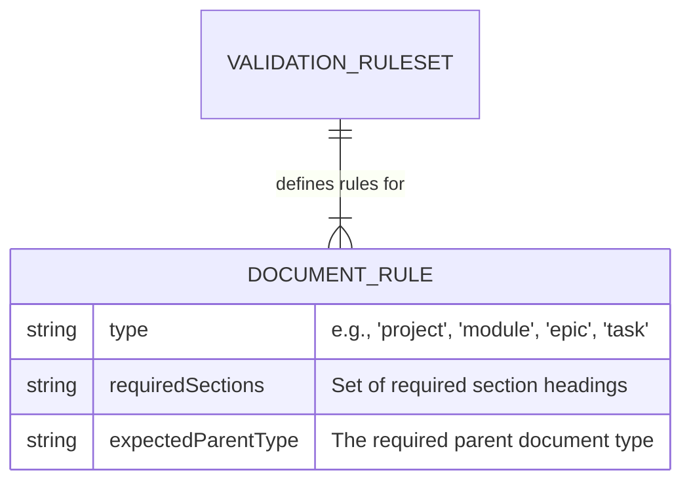
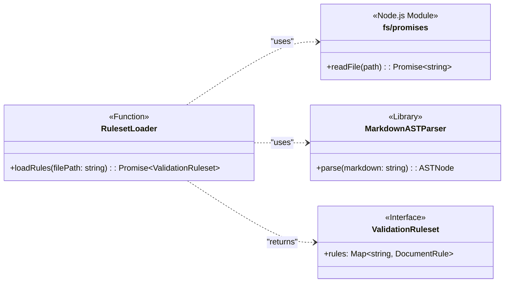
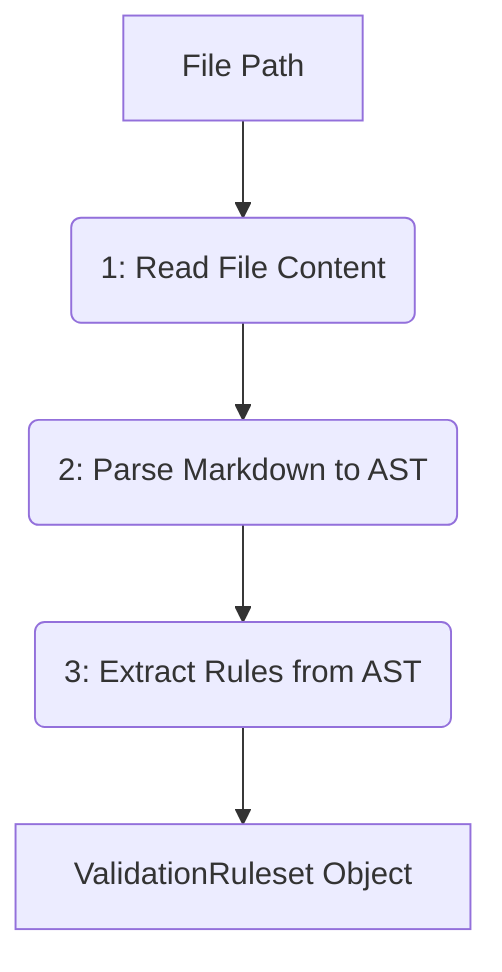
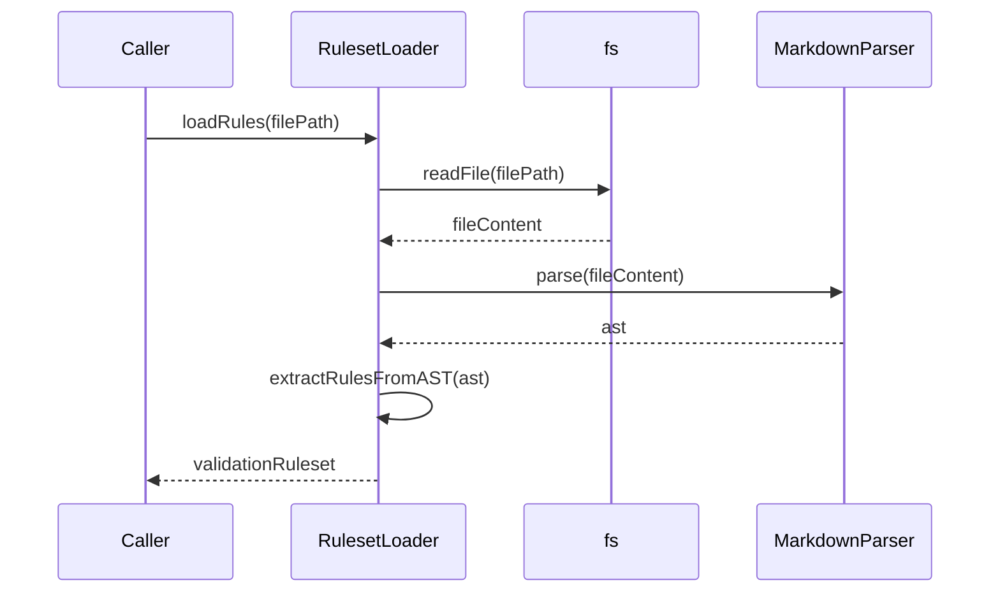

# Task: T1: Schema Loader

<!-- This document provides the detailed implementation requirements for a single, focused unit of work. -->

---

## ✅ 1 Meta & Governance

### ✅ 1.2 Status

<!-- This section is auto-populated and updated by the developer as the task progresses. -->

- **Current State:** 💡 Not Started
- **Priority:** 🟥 High
- **Progress:** 0%
- **Assignee**: @[username]
- **Planning Estimate:** 0
- **Est. Variance (pts):** 0
- **Created:** 2025-07-17 02:00
- **Implementation Started:** [YYYY-MM-DD HH:MM]
- **Completed:** [YYYY-MM-DD HH:MM]
- **Last Updated:** 2025-07-17 03:00

### ✅ 1.3 Priority Drivers

<!-- List the stable Driver IDs that justify this task's priority. These are inherited from the parent Epic unless overridden. -->

- [TEC-Dev_Productivity_Blocker](/docs/documentation-driven-development.md#tec-dev_productivity_blocker)

---

## ✅ 2 Business & Scope

### ✅ 2.1 Overview

<!-- Provide a concise, bulleted list outlining what this task delivers and why it matters. -->

- **Core Function**: Implements the `loadRules` utility, which reads and parses the canonical `documentation-schema.md` file.
- **Key Capability**: This function is responsible for transforming the Markdown-based schema definition into a structured, in-memory `ValidationRuleset` object that can be consumed by other validator components.
- **Business Value**: By centralizing the schema parsing logic, this task provides the foundational, authoritative ruleset that all other validation tasks depend on. This ensures that validation logic is consistently driven by the single source of truth.

### ✅ 2.4 Acceptance Criteria

<!-- A verifiable, tabular list of conditions that this task must satisfy to be considered complete. -->

| ID   | Criterion                                                                                                                              | Test Reference         |
| ---- | -------------------------------------------------------------------------------------------------------------------------------------- | ---------------------- |
| AC-1 | The `loadRules` function successfully reads the `docs/documentation-schema.md` file from the file system.                              | `rules-loader.test.ts` |
| AC-2 | The function correctly parses the "Depth Matrix" tables within the schema and constructs a `ValidationRuleset` object in memory.       | `rules-loader.test.ts` |
| AC-3 | The function throws a specific `SchemaError` if the `documentation-schema.md` file cannot be found, read, or is syntactically invalid. | `rules-loader.test.ts` |
| AC-4 | The returned `ValidationRuleset` object accurately reflects the hierarchical rules and required fields defined in the schema file.     | `rules-loader.test.ts` |

---

## ✅ 3 Planning & Decomposition

### ✅ 3.3 Dependencies

<!-- List any internal or external dependencies that could block the progress of this task. -->

| ID  | Dependency On                                            | Type     | Status      | Notes                                                                                                                                                    |
| --- | -------------------------------------------------------- | -------- | ----------- | -------------------------------------------------------------------------------------------------------------------------------------------------------- |
| D-1 | [documentation-schema.md](../../documentation-schema.md) | Internal | ✅ Complete | The `loadRules` function directly consumes this file. Any changes to the schema's structure or content will require updates to this task's parser logic. |

---

## ✅ 4 High-Level Design

### ✅ 4.2 Target Architecture

The Schema Loader will be a pure function that takes a file path and returns a structured object representing the validation rules.

#### ✅ 4.2.1 Data Models

The primary output of this task is the `ValidationRuleset` object. This model captures all the rules parsed from the `documentation-schema.md` file in a structured format.



#### ✅ 4.2.2 Components

The `RulesetLoader` function acts as an orchestrator for its dependencies. It consumes the file path, uses external libraries to process it, and produces the `ValidationRuleset` data structure.



#### ✅ 4.2.3 Data Flow

The data flow for this task is linear: a file path is the input, the file content is read and parsed, and a structured data object is the output.



#### ✅ 4.2.4 Control Flow

The control flow for this task is a sequence of asynchronous operations orchestrated by the main `loadRules` function.



#### ✅ 4.2.5 Integration Points

- **Upstream (Input)**: The `loadRules` function is triggered by the main `Validator` function, which provides the file path to the `documentation-schema.md` file.
- **Downstream (Output)**: The function returns a `Promise` that resolves with the `ValidationRuleset` object. This object is then consumed by the `ContentValidator` and `HierarchyValidator` tasks.

#### ✅ 4.2.6 Exposed API

This task contributes a single function, `loadRules`, to the internal API of the `E2: Schema Validator` epic. This function is the designated entry point for accessing the validation rules.

```typescript
// Defined in: src/modules/analyzer/validator/rules-model.ts
export interface DocumentRule {
  type: string;
  requiredSections: Set<string>;
  expectedParentType: string;
}

export interface ValidationRuleset {
  rules: Map<string, DocumentRule>;
}

// Defined in: src/modules/analyzer/validator/rules-loader.ts
/**
 * Loads and parses the documentation schema from the specified file path.
 * @param filePath The path to the documentation-schema.md file.
 * @returns A promise that resolves to a ValidationRuleset object.
 * @throws {SchemaError} If the file cannot be read or parsed.
 */
export async function loadRules(filePath: string): Promise<ValidationRuleset>;
```

---

## ✅ 5 Maintenance and Monitoring

### ✅ 5.2 Target Maintenance and Monitoring

#### ✅ 5.2.1 Error Handling

The `loadRules` function must be robust and provide clear feedback for failure scenarios. It will define and throw a custom `SchemaError` to be caught by the main validator process.

| Error Type      | Trigger                                                              | Action               | User Feedback                                                                               |
| :-------------- | :------------------------------------------------------------------- | :------------------- | :------------------------------------------------------------------------------------------ |
| **SchemaError** | File not found at the specified path.                                | Throw `SchemaError`. | `ERROR: Schema definition not found at [path]. Please ensure the file exists.`              |
| **SchemaError** | File content is not valid Markdown and cannot be parsed into an AST. | Throw `SchemaError`. | `ERROR: Failed to parse schema at [path]. Check for Markdown syntax errors.`                |
| **SchemaError** | The parsed AST is missing the required "Depth Matrix" tables.        | Throw `SchemaError`. | `ERROR: Schema at [path] is malformed. Could not find required "Depth Matrix" definitions.` |

---

## ✅ 5 Maintenance and Monitoring

### ✅ 5.2 Target Maintenance and Monitoring

#### ✅ 5.2.2 Logging & Monitoring

As a core utility running early in the validation process, the `RulesetLoader`'s logging provides essential diagnostic information. It inherits its log level from the main `analyzer` process.

| Level   | Condition                                                               | Log Message Example                                                     |
| :------ | :---------------------------------------------------------------------- | :---------------------------------------------------------------------- |
| `DEBUG` | The `loadRules` function is invoked.                                    | `Loading validation rules from '[path]'...`                             |
| `DEBUG` | The schema file is successfully read and parsed into an AST.            | `Successfully parsed schema file. Extracting rules...`                  |
| `INFO`  | The entire process completes successfully.                              | `Validation ruleset loaded successfully.`                               |
| `ERROR` | Any error condition from the `5.2.1 Error Handling` table is triggered. | (Corresponds to the "User Feedback" column in the error handling table) |

## ✅ 6 Implementation Guidance

### ✅ 6.1 Implementation Plan

The implementation will be a single function, `loadRules`, located in `src/modules/analyzer/validator/rules-loader.ts`. The approach is as follows:

1.  **Read the File**: Asynchronously read the content of the `documentation-schema.md` file using the Node.js `fs/promises` module.
2.  **Parse to AST**: Use a Markdown parsing library (e.g., `unified` with `remark-parse`) to convert the raw Markdown content into an Abstract Syntax Tree (AST). This provides a structured representation of the document.
3.  **Traverse the AST**: Walk through the AST to find the `##` headings for each "Family" (e.g., "Meta & Governance").
4.  **Extract from Tables**: Within each family section, locate the "Depth Matrix" table. Iterate through the rows of each table.
5.  **Build the Ruleset**: For each row in the tables, extract the rule details (e.g., `ID`, `Section Name`, `Project`, `Module`, `Epic`, `Task` requirements) and populate the in-memory `ValidationRuleset` object.
6.  **Return or Throw**: If the process is successful, return the populated `ValidationRuleset`. If the file cannot be read, parsed, or the required tables are not found, throw a specific `SchemaError`.

### ✅ 6.2 Implementation Log / Steps

#### ✅ 6.2.1 Initial Situation

| Aspect                   | Current Code/State                                     | Gap vs. Task Goal                                                                  | Key Files to Change                                              |
| ------------------------ | ------------------------------------------------------ | ---------------------------------------------------------------------------------- | ---------------------------------------------------------------- |
| **Schema Definition**    | `docs/documentation-schema.md` exists and is stable.   | N/A                                                                                | `docs/documentation-schema.md` (read-only)                       |
| **Ruleset Model**        | No model exists to represent the schema rules in code. | A new set of TypeScript interfaces is required.                                    | `src/modules/analyzer/validator/rules-model.ts` (new file)       |
| **Schema Loading Logic** | No logic exists to read or parse the schema file.      | A new function (`loadRules`) is needed to perform the file I/O and parsing.        | `src/modules/analyzer/validator/rules-loader.ts` (new file)      |
| **Unit Tests**           | No tests exist for the schema loading functionality.   | New unit tests are required to validate the `loadRules` function's implementation. | `src/modules/analyzer/validator/rules-loader.test.ts` (new file) |

#### ✅ 6.2.2 Files Change Log

| File / Path                                           | Change Type (ADD/MOD/DEL) | Summary of Change                                                               |
| ----------------------------------------------------- | ------------------------- | ------------------------------------------------------------------------------- |
| `src/modules/analyzer/validator/rules-model.ts`       | ADD                       | Defines the `ValidationRuleset` and `DocumentRule` interfaces.                  |
| `src/modules/analyzer/validator/rules-loader.ts`      | ADD                       | Implements the `loadRules` function to read and parse the schema file.          |
| `src/modules/analyzer/validator/rules-loader.test.ts` | ADD                       | Adds unit tests for the `loadRules` function, covering success and error cases. |

#### ✅ 6.2.3 Implementation Steps

- [ ] **Step 1: Define Data Models**
  - [ ] Create `src/modules/analyzer/validator/rules-model.ts`.
  - [ ] Define and export the `DocumentRule` and `ValidationRuleset` interfaces based on the data model in section 4.2.1.
- [ ] **Step 2: Implement `loadRules` Function**
  - [ ] Create `src/modules/analyzer/validator/rules-loader.ts`.
  - [ ] Implement the `async function loadRules(filePath: string): Promise<ValidationRuleset>`.
  - [ ] Inside a `try...catch` block, read the file content from `filePath` using `fs/promises.readFile`.
  - [ ] Use a Markdown AST parser to convert the content into a traversable node tree.
  - [ ] Implement a private helper function, `extractRulesFromAST`, to walk the tree, find the "Depth Matrix" tables, and parse their rows.
  - [ ] Populate and return the `ValidationRuleset` object.
- [ ] **Step 3: Add Error Handling**
  - [ ] In the `catch` block of `loadRules`, wrap any exceptions (file not found, parsing error) in a custom `SchemaError` that includes the original error message.
  - [ ] Add a check within `extractRulesFromAST` to throw a `SchemaError` if the required tables are not found in the AST.
- [ ] **Step 4: Write Unit Tests**
  - [ ] Create `src/modules/analyzer/validator/rules-loader.test.ts`.
  - [ ] Write a test case for the success path, using a mock schema file and asserting that the returned `ValidationRuleset` matches a snapshot.
  - [ ] Write a test case that asserts a `SchemaError` is thrown if the file path is invalid.
  - [ ] Write a test case that asserts a `SchemaError` is thrown if the mock schema file is malformed.

---

## ✅ 7 Quality & Operations

### ✅ 7.1 Testing Strategy / Requirements

The testing strategy for this task is to use unit tests with mock file system interactions to validate the `loadRules` function's logic in isolation.

| AC ID | Scenario                                                                                                                              | Test Type | Tools / Runner | Notes                                                                                                                              |
| :---- | :------------------------------------------------------------------------------------------------------------------------------------ | :-------- | :------------- | :--------------------------------------------------------------------------------------------------------------------------------- |
| AC-1  | **Happy Path:** Given a valid path to a well-formed `documentation-schema.md`, the function reads and parses it without errors.       | Unit      | Jest           | Use `jest.spyOn` to mock `fs/promises.readFile` to return the content of a valid mock schema file.                                 |
| AC-2  | **Correctness of Parsing:** The `ValidationRuleset` object returned by the function accurately reflects the rules in the mock schema. | Unit      | Jest           | Assert that the returned object has the correct number of rules and that a specific rule's properties match the mock data exactly. |
| AC-3  | **File Not Found:** The function throws a `SchemaError` when the file path does not exist.                                            | Unit      | Jest           | Mock `fs/promises.readFile` to throw a `ENOENT` error and assert that `loadRules` catches it and throws a `SchemaError`.           |
| AC-3  | **Malformed Markdown:** The function throws a `SchemaError` if the file content is not valid Markdown.                                | Unit      | Jest           | Provide invalid Markdown content and assert that the underlying parser error is caught and re-thrown as a `SchemaError`.           |
| AC-4  | **Snapshot Test:** The structure of the returned `ValidationRuleset` matches a stored snapshot.                                       | Unit      | Jest           | Use Jest's snapshot testing (`toMatchSnapshot()`) to ensure the output structure remains consistent across changes.                |

### ✅ 7.2 Configuration

This task implements a pure utility function, `loadRules`, which is self-contained and does not require any external configuration files or environment variables. Its behavior is controlled entirely by the `filePath` argument passed to it at runtime.

### ✅ 7.3 Alerting & Response

This task is a utility function and does not generate alerts directly. It signals failure by throwing a `SchemaError`. The calling process is responsible for catching this error and initiating the response.

| Error Condition             | Relevant Modules | Response Plan                                                                                                   | Status         |
| :-------------------------- | :--------------- | :-------------------------------------------------------------------------------------------------------------- | :------------- |
| **`SchemaError` is thrown** | `m1-analyzer`    | The main `analyzer` script will catch the error, log its message to the console, and exit with a non-zero code. | 💡 Not Started |

### ✅ 7.5 Local Test Commands

```bash
yarn jest src/modules/analyzer/validator/rules-loader.test.ts
```
