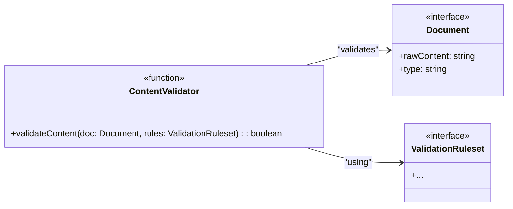

# Task: T2: Content Validator

---

## ✅ 1 Meta & Governance

### ✅ 1.2 Status

- **Current State:** 💡 Not Started
- **Priority:** 🟥 High
- **Progress:** 0%
- **Assignee**: @[username]
- **Planning Estimate:** 0
- **Est. Variance (pts):** 0
- **Created:** 2025-07-17
- **Implementation Started:** [YYYY-MM-DD]
- **Completed:** [YYYY-MM-DD]
- **Last Updated:** 2025-07-17

### ✅ 1.3 Priority Drivers

- [TEC-Dev_Productivity_Blocker](/docs/documentation-driven-development.md#tec-dev_productivity_blocker)

---

## ✅ 2 Business & Scope

### ✅ 2.1 Overview

- **Core Function**: Implements the logic to validate the content of a single document model against the loaded schema rules.
- **Key Capability**: Ensures that each document contains all required sections and fields as specified in the `ValidationRuleset`.
- **Business Value**: Acts as the primary quality gate for document content, preventing incomplete or structurally unsound documentation from being committed.

### ✅ 2.4 Acceptance Criteria

| ID   | Criterion                                                                                                       | Test Reference              |
| ---- | --------------------------------------------------------------------------------------------------------------- | --------------------------- |
| AC-1 | The validator correctly identifies when a document is missing a required section (e.g., `## Business & Scope`). | `content-validator.test.ts` |
| AC-2 | The validator successfully approves a document that contains all required sections.                             | `content-validator.test.ts` |
| AC-3 | The validator throws a `ValidationError` with a specific message for the first content violation found.         | `content-validator.test.ts` |

---

## ✅ 3 Planning & Decomposition

### ✅ 3.3 Dependencies

| ID  | Dependency On                                         | Type     | Status         | Notes                                          |
| --- | ----------------------------------------------------- | -------- | -------------- | ---------------------------------------------- |
| D-1 | [T1: Schema Loader](./m1-e2-t1-schema-loader.task.md) | Internal | 💡 Not Started | Requires the `ValidationRuleset` to be loaded. |
| D-2 | E1: Parser                                            | Internal | 💡 Not Started | Requires the `ProjectModel` to be available.   |

---

## ✅ 4 High-Level Design

### ✅ 4.2 Target Architecture

The Content Validator will be a pure function that takes a document object and the ruleset, returning `true` or throwing an error.

#### ✅ 4.2.2 Components



#### ✅ 4.2.6 Exposed API

```typescript
/**
 * Validates the content of a single document against the loaded schema rules.
 * @param doc The document model to validate.
 * @param rules The validation ruleset loaded from the schema.
 * @returns True if the content is valid.
 * @throws {ValidationError} If the content violates a rule.
 */
export function validateContent(doc: Document, rules: ValidationRuleset): boolean;
```

---

## ✅ 5 Maintenance and Monitoring

### ✅ 5.2 Target Maintenance and Monitoring

#### ✅ 5.2.1 Error Handling

| Error Type          | Trigger                                         | Action                   | User Feedback                                                                       |
| :------------------ | :---------------------------------------------- | :----------------------- | :---------------------------------------------------------------------------------- |
| **ValidationError** | A required section is missing from the content. | Throw `ValidationError`. | `ERROR in [file]: Missing required section: '[sectionName]'`                        |
| **ValidationError** | A required field within a section is missing.   | Throw `ValidationError`. | `ERROR in [file]: Missing required field: '[fieldName]' in section '[sectionName]'` |

---

## ✅ 6 Implementation Guidance

### ✅ 6.1 Implementation Plan

- **Approach**: Implement a `validateContent` function in `src/modules/analyzer/validator/content-validator.ts`. This function will parse the `rawContent` of the document to check for the existence of required `##` and `###` headings as defined in the `ValidationRuleset` for that document type.

### ✅ 6.2 Implementation Log / Steps

- [ ] Create `src/modules/analyzer/validator/content-validator.ts`.
- [ ] Implement the `validateContent` function.
- [ ] Get the rules for the document's type (e.g., 'epic') from the `ValidationRuleset`.
- [ ] Parse the `rawContent` to identify all `##` and `###` headings.
- [ ] Compare the list of found headings against the list of required headings from the rules.
- [ ] If a required heading is missing, throw a `ValidationError` with a precise message.
- [ ] If all required headings are present, return `true`.

---

## ✅ 7 Quality & Operations

### ✅ 7.1 Testing Strategy / Requirements

| AC ID | Scenario                                                                | Test Type | Tools / Runner |
| ----- | ----------------------------------------------------------------------- | --------- | -------------- |
| AC-1  | The validator rejects a document missing a required `##` heading.       | Unit      | Jest           |
| AC-2  | The validator approves a fully compliant document.                      | Unit      | Jest           |
| AC-3  | The validator's error message correctly identifies the missing section. | Unit      | Jest           |

### ✅ 7.5 Local Test Commands

```bash
yarn jest src/modules/analyzer/validator/content-validator.test.ts
```
