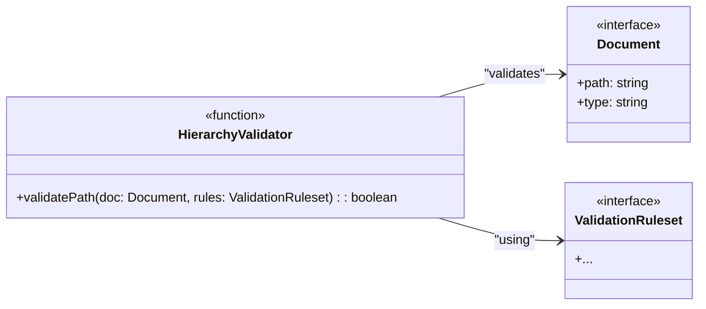

# Task: T3: Hierarchy Validator

---

## ✅ 1 Meta & Governance

### ✅ 1.2 Status

- **Current State:** 💡 Not Started
- **Priority:** 🟥 High
- **Progress:** 0%
- **Assignee**: @[username]
- **Planning Estimate:** 0
- **Est. Variance (pts):** 0
- **Created:** 2025-07-17
- **Implementation Started:** [YYYY-MM-DD]
- **Completed:** [YYYY-MM-DD]
- **Last Updated:** 2025-07-17

### ✅ 1.3 Priority Drivers

- [TEC-Dev_Productivity_Blocker](/docs/documentation-driven-development.md#tec-dev_productivity_blocker)

---

## ✅ 2 Business & Scope

### ✅ 2.1 Overview

- **Core Function**: Implements the logic to validate a document's file path against the project's hierarchical naming convention.
- **Key Capability**: Ensures that every documentation file is located in its correct parent directory (e.g., a task must be inside an epic's directory).
- **Business Value**: Prevents structural errors in the documentation repository, which could break parsing logic and lead to an incomplete or incorrect project model.

### ✅ 2.4 Acceptance Criteria

| ID   | Criterion                                                                                                 | Test Reference                |
| ---- | --------------------------------------------------------------------------------------------------------- | ----------------------------- |
| AC-1 | The validator correctly identifies a misplaced file (e.g., a `.task.md` file in a module directory).      | `hierarchy-validator.test.ts` |
| AC-2 | The validator successfully approves a document with a correctly structured file path.                     | `hierarchy-validator.test.ts` |
| AC-3 | The validator throws a `ValidationError` with a specific message for the first hierarchy violation found. | `hierarchy-validator.test.ts` |

---

## ✅ 3 Planning & Decomposition

### ✅ 3.3 Dependencies

| ID  | Dependency On                                         | Type     | Status         | Notes                                          |
| --- | ----------------------------------------------------- | -------- | -------------- | ---------------------------------------------- |
| D-1 | [T1: Schema Loader](./m1-e2-t1-schema-loader.task.md) | Internal | 💡 Not Started | Requires the `ValidationRuleset` to be loaded. |
| D-2 | E1: Parser                                            | Internal | 💡 Not Started | Requires the `ProjectModel` to be available.   |

---

## ✅ 4 High-Level Design

### ✅ 4.2 Target Architecture

The Hierarchy Validator will be a pure function that takes a document object and the ruleset, returning `true` or throwing an error.

#### ✅ 4.2.2 Components



#### ✅ 4.2.6 Exposed API

```typescript
/**
 * Validates the file path of a single document against the hierarchical naming conventions.
 * @param doc The document model to validate.
 * @param rules The validation ruleset loaded from the schema.
 * @returns True if the path is valid.
 * @throws {ValidationError} If the path violates a rule.
 */
export function validatePath(doc: Document, rules: ValidationRuleset): boolean;
```

---

## ✅ 5 Maintenance and Monitoring

### ✅ 5.2 Target Maintenance and Monitoring

#### ✅ 5.2.1 Error Handling

| Error Type          | Trigger                                      | Action                   | User Feedback                                                                               |
| :------------------ | :------------------------------------------- | :----------------------- | :------------------------------------------------------------------------------------------ |
| **ValidationError** | A document is in the wrong parent directory. | Throw `ValidationError`. | `ERROR in [file]: Invalid location. A '[docType]' cannot be a child of a '[parentDocType]'` |

---

## ✅ 6 Implementation Guidance

### ✅ 6.1 Implementation Plan

- **Approach**: Implement a `validatePath` function in `src/modules/analyzer/validator/hierarchy-validator.ts`. This function will analyze the `path` property of the document. It will parse the directory structure from the path and compare it against the parent-child rules defined in the `ValidationRuleset`.

### ✅ 6.2 Implementation Log / Steps

- [ ] Create `src/modules/analyzer/validator/hierarchy-validator.ts`.
- [ ] Implement the `validatePath` function.
- [ ] Get the hierarchy rules for the document's type from the `ValidationRuleset`.
- [ ] Parse the document's file path to determine its parent directory and type.
- [ ] Compare the actual parent type with the expected parent type from the rules.
- [ ] If they do not match, throw a `ValidationError`.
- [ ] If they match, return `true`.

---

## ✅ 7 Quality & Operations

### ✅ 7.1 Testing Strategy / Requirements

| AC ID | Scenario                                                                 | Test Type | Tools / Runner |
| ----- | ------------------------------------------------------------------------ | --------- | -------------- |
| AC-1  | The validator rejects a document with an incorrect parent directory.     | Unit      | Jest           |
| AC-2  | The validator approves a correctly placed document.                      | Unit      | Jest           |
| AC-3  | The validator's error message correctly identifies the invalid location. | Unit      | Jest           |

### ✅ 7.5 Local Test Commands

```bash
yarn jest src/modules/analyzer/validator/hierarchy-validator.test.ts
```
