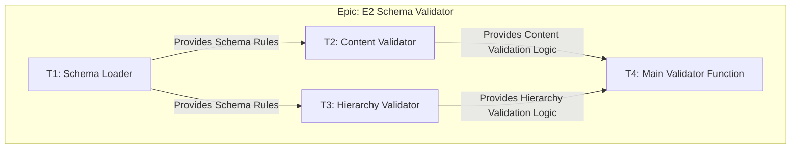
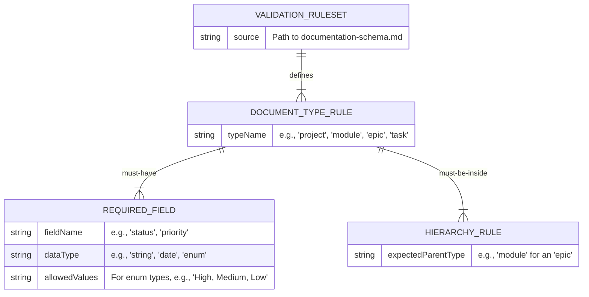
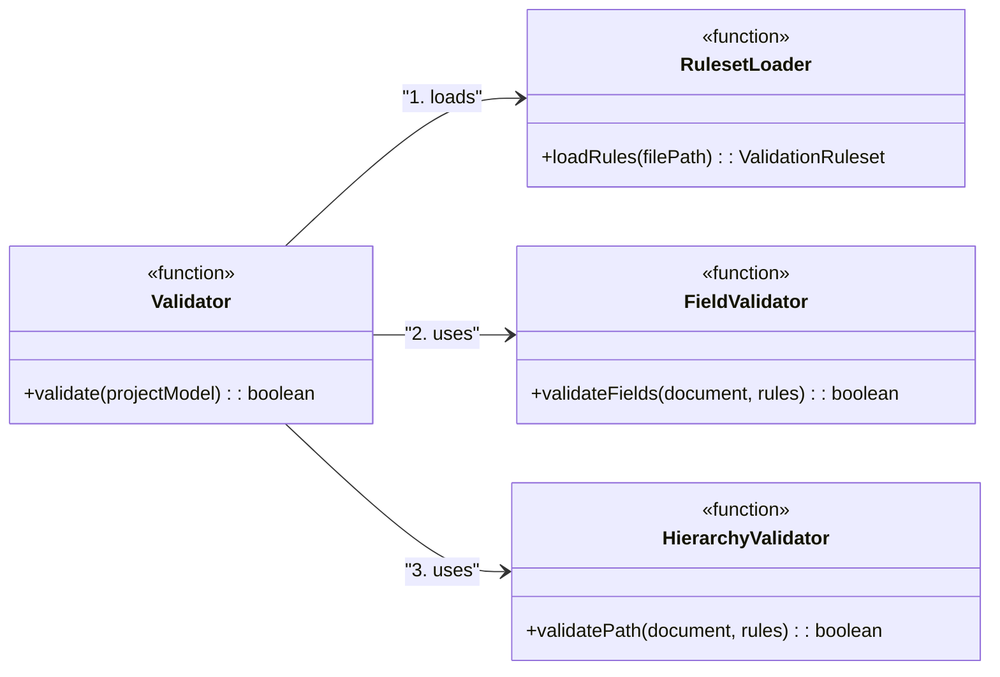
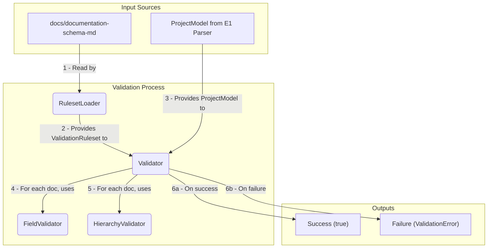
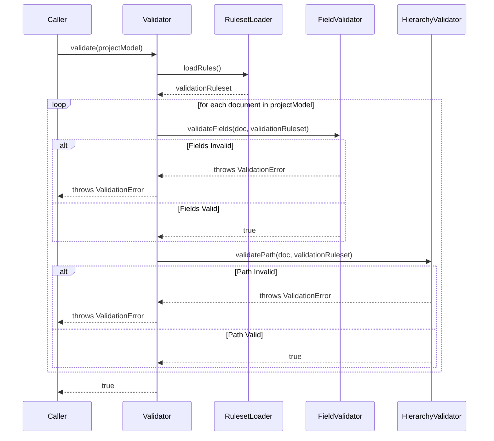

# Epic: E2: Schema Validator

<!-- This document defines a complete, independent feature, including its business justification, architectural design, and implementation plan. It should be testable on its own, with dependencies on other epics limited to well-defined integration points. -->

---

## ✅ 1 Meta & Governance

### ✅ 1.2 Status

<!-- This section is auto-populated and updated to track the document's lifecycle. -->

- **Created:** 2025-07-16 02:00
- **Last Updated:** 2025-07-16 02:00

### ✅ 1.3 Priority Drivers

<!-- List the stable Driver IDs from the root documentation that justify this epic's priority. -->

- [TEC-Dev_Productivity_Blocker](/docs/documentation-driven-development.md#tec-dev_productivity_blocker)

---

## ✅ 2 Business & Scope

### ✅ 2.1 Overview

- **Core Function**: Validates the in-memory `ProjectModel` (from the Parser epic) against the rules defined in the canonical `documentation-schema.md`.
- **Key Capability**: Acts as a strict quality gate, ensuring that all documentation artifacts are structurally sound and complete before being used by downstream tools.
- **Business Value**: Guarantees the integrity and reliability of the data fed into the monitoring dashboard. By enforcing standards at the commit level, it prevents "garbage in, garbage out" and builds trust in the automated reporting.

### ✅ 2.2.4 User Stories

- As a **DDD Developer**, I want the tool to validate that every document's content (e.g., required sections) conforms to the rules in `documentation-schema.md`, so that I can be confident the data is structured correctly.
- As a **DDD Developer**, I want the tool to validate that every document's file path conforms to the project's hierarchical naming convention, so that files are not misplaced.
- As a **DDD Developer**, I want the commit to fail instantly upon the first validation error, so that I am forced to fix issues immediately and prevent bad data from being committed.
- As a **DDD Developer**, I want to receive a precise error message telling me exactly which file and which rule failed, so I can fix the problem quickly without guesswork.

### ✅ 2.4 Acceptance Criteria

| ID   | Corresponds to User Story                                                                                                                                       | Criterion                                                                                                                                    | Test Reference      |
| :--- | :-------------------------------------------------------------------------------------------------------------------------------------------------------------- | :------------------------------------------------------------------------------------------------------------------------------------------- | :------------------ |
| AC-1 | As a **DDD Developer**, I want the tool to validate that every document's content (e.g., required sections) conforms to the rules in `documentation-schema.md`. | The validator correctly identifies a document that is missing a required section as defined in the `documentation-schema.md`.                | `validator.test.ts` |
| AC-2 | As a **DDD Developer**, I want the tool to validate that every document's file path conforms to the project's hierarchical naming convention.                   | The validator correctly identifies a document with a malformed file path (e.g., an epic inside the root `docs/` folder).                     | `validator.test.ts` |
| AC-3 | As a **DDD Developer**, I want the commit to fail instantly upon the first validation error.                                                                    | The validator throws a specific, catchable error upon finding the first validation violation, which will cause the commit to abort.          | `validator.test.ts` |
| AC-4 | As a **DDD Developer**, I want to receive a precise error message telling me exactly which file and which rule failed.                                          | The error message thrown upon validation failure contains the full file path and a human-readable description of the rule that was violated. | `validator.test.ts` |
| AC-5 | As a **DDD Developer**, I want the tool to validate that every document's content. and file path conforms to the rules.                                         | The validator successfully approves a `ProjectModel` that is fully compliant with all content and path rules.                                | `validator.test.ts` |

---

## ✅ 3 Planning & Decomposition

### ✅ 3.1 Roadmap (In-Focus Items)

<!-- List the tasks that are actively planned for the current implementation cycle. -->

| ID  | Task                                                                  | Priority | Priority Drivers                                                                                       | Status         | Depends On                                                                                               | Summary                                                                        |
| :-- | :-------------------------------------------------------------------- | :------- | :----------------------------------------------------------------------------------------------------- | :------------- | :------------------------------------------------------------------------------------------------------- | :----------------------------------------------------------------------------- |
| T1  | [Schema Loader](./m1-e2-t1-schema-loader.task.md)                     | 🟥 High  | [TEC-Dev_Productivity_Blocker](/docs/documentation-driven-development.md#tec-dev_productivity_blocker) | 💡 Not Started | —                                                                                                        | Create a utility to parse `documentation-schema.md` into an in-memory ruleset. |
| T2  | [Content Validator](./m1-e2-t2-content-validator.task.md)             | 🟥 High  | [TEC-Dev_Productivity_Blocker](/docs/documentation-driven-development.md#tec-dev_productivity_blocker) | T1             | Implement logic to check a document's content against the loaded schema rules (e.g., required sections). |
| T3  | [Hierarchy Validator](./m1-e2-t3-hierarchy-validator.task.md)         | 🟥 High  | [TEC-Dev_Productivity_Blocker](/docs/documentation-driven-development.md#tec-dev_productivity_blocker) | T1             | Implement logic to check a document's file path against the hierarchical naming conventions.             |
| T4  | [Main Validator Function](./m1-e2-t4-main-validator-function.task.md) | 🟥 High  | [TEC-Dev_Productivity_Blocker](/docs/documentation-driven-development.md#tec-dev_productivity_blocker) | T2, T3         | Integrate all validation logic into a single function that processes the `ProjectModel`.                 |

### ✅ 3.2 Backlog / Icebox

<!-- List tasks that have been considered but are not scheduled for the current cycle. -->

- [Task: A future feature idea] - [Brief justification for deferral.]

### ✅ 3.3 Dependencies

<!-- List any internal or external dependencies that could block the progress of this epic. -->

| ID  | Dependency On                                            | Type     | Status         | Notes                                                                                |
| --- | -------------------------------------------------------- | -------- | -------------- | ------------------------------------------------------------------------------------ |
| D-1 | [E1: Documentation Parser](../m1-e1-parser/)             | Internal | 💡 Not Started | This epic cannot start until the Parser is complete and provides the `ProjectModel`. |
| D-2 | [documentation-schema.md](../../documentation-schema.md) | Internal | ✅ Complete    | The canonical schema definition is required as the source of truth for all rules.    |

### ✅ 3.4 Decomposition Graph

<!-- A visual graph of dependencies between the child tasks. -->



---

## ✅ 4 High-Level Design

### ❓ 4.1 Current Architecture

<!-- (Optional) Describe the existing system before the changes in this epic are implemented. -->

This is a greenfield epic; there is no current architecture.

### ✅ 4.2 Target Architecture

<!-- Describe the proposed "to-be" state of the system after this epic is implemented. -->

The validator will be implemented as a set of pure functions that receive the `ProjectModel` and the parsed schema rules, returning a boolean result or throwing a specific error upon failure.

#### ✅ 4.2.1 Data Models

While the `ProjectModel` from the parser provides the raw content, the **Validator's** key responsibility is to ensure specific, structured data points exist within that content. This epic is concerned with the schema of the _extracted data_, not just the document structure. The following model represents the data that must be validated and extracted.



#### ✅ 4.2.2 Components

The component design reflects the schema-driven approach. The core `Validator` orchestrates a set of specialized sub-components, each responsible for a specific type of validation based on the loaded ruleset.



#### ✅ 4.2.3 Data Flow

The data flow is sequential: the rules are loaded first, then the main `Validator` iterates through the `ProjectModel`, applying the rules using its specialized sub-validators.



#### ✅ 4.2.4 Control Flow

The control flow is orchestrated by the main `Validator` function, which coordinates the loading of rules and the execution of the specialized validators.



#### ✅ 4.2.5 Integration Points

- **Upstream (Input)**: The main `Validator` function is triggered by the `analyzer` script and receives the `ProjectModel` from the `E1: Parser`.
- **Internal (Input)**: The `RulesetLoader` component reads the `docs/documentation-schema.md` file from the file system to build the `ValidationRuleset`.
- **Downstream (Success)**: On successful validation of the entire `ProjectModel`, the function returns `true`, allowing the `analyzer` to proceed to the `E3: Transmitter` epic.
- **Downstream (Failure)**: On the first validation failure, the function throws a `ValidationError`. This exception is caught by the `analyzer`'s main process, which then aborts the `git commit` and logs the specific error to the developer's console.

#### ✅ 4.2.6 Exposed API

This epic exposes a single, focused function to the main `analyzer` process.

```typescript
/**
 * Validates a project model against the canonical documentation schema.
 *
 * This function orchestrates the loading of validation rules and applies them
 * to the entire project model. It will throw a specific `ValidationError`
 * on the first rule violation it encounters.
 *
 * @param projectModel The complete project model generated by the E1: Parser.
 * @returns A promise that resolves to `true` if the entire model is valid.
 * @throws {ValidationError} Describes the specific file, rule, and reason for the failure.
 */
export async function validate(projectModel: ProjectModel): Promise<boolean>;
```

### ✅ 4.4 Non-Functional Requirements

#### ✅ 4.4.1 Performance

| ID      | Requirement                                                                                                                            | Priority  |
| :------ | :------------------------------------------------------------------------------------------------------------------------------------- | :-------- |
| PERF-01 | The entire validation process (including schema loading) for a 100-document project should complete in under 200ms.                    | 🟥 High   |
| PERF-02 | The `RulesetLoader` must parse the `documentation-schema.md` in under 50ms to avoid adding significant overhead to the commit process. | 🟧 Medium |

#### ✅ 4.4.2 Security

| ID     | Requirement                                                                                                                             | Priority |
| :----- | :-------------------------------------------------------------------------------------------------------------------------------------- | :------- |
| SEC-01 | The `RulesetLoader` must not be vulnerable to injection attacks when parsing the schema file. It should only read, not execute content. | 🟥 High  |
| SEC-02 | The validator must not execute any code or macros embedded within the documentation files being validated.                              | 🟥 High  |

#### ✅ 4.4.3 Reliability

| ID     | Requirement                                                                                                                                          | Priority  |
| :----- | :--------------------------------------------------------------------------------------------------------------------------------------------------- | :-------- |
| REL-01 | The validator must be deterministic. Given the same `ProjectModel` and `documentation-schema.md`, it must produce the exact same outcome every time. | 🟥 High   |
| REL-02 | The validator must fail gracefully with a `ValidationError` if the `documentation-schema.md` file is missing, malformed, or cannot be parsed.        | 🟥 High   |
| REL-03 | The validator must correctly handle empty documents or documents with missing (but optional) sections without crashing.                              | 🟧 Medium |

---

## ✅ 5 Maintenance and Monitoring

### ❓ 5.1 Current Maintenance and Monitoring

<!-- (Optional) Describe the existing internal implementation details. -->

This is a greenfield epic; there is no current maintenance and monitoring strategy.

### ✅ 5.2 Target Maintenance and Monitoring

<!-- Describe the proposed "to-be" internal implementation details. -->

#### ✅ 5.2.1 Error Handling

The validator's primary role is to find errors, so its own error handling must be robust. It will throw a custom `ValidationError` to provide specific, actionable feedback to the developer.

| Error Type                      | Trigger                                                                        | Action                        | User Feedback                                                                                                 |
| :------------------------------ | :----------------------------------------------------------------------------- | :---------------------------- | :------------------------------------------------------------------------------------------------------------ |
| **Schema Not Found**            | The `docs/documentation-schema.md` file cannot be read.                        | Abort with `ValidationError`. | `ERROR: Cannot find or read 'docs/documentation-schema.md'. Please ensure the file exists.`                   |
| **Malformed Schema**            | The `docs/documentation-schema.md` file is not valid markdown or is corrupted. | Abort with `ValidationError`. | `ERROR: Failed to parse 'docs/documentation-schema.md'. Check for syntax errors.`                             |
| **Content Validation Failed**   | A document is missing a required field or has an invalid value.                | Abort with `ValidationError`. | `ERROR in [file]: Missing required field '[fieldName]'` or `ERROR in [file]: Invalid value for '[fieldName]'` |
| **Hierarchy Validation Failed** | A document is in the wrong location (e.g., a task inside a project).           | Abort with `ValidationError`. | `ERROR in [file]: Invalid location. A '[docType]' cannot be a child of a '[parentDocType]'`                   |

#### ✅ 5.2.2 Logging & Monitoring

As a CLI tool running in a pre-commit hook, logging is the primary observability mechanism. All logs will be directed to the console.

| Level   | Condition                                                               | Log Message Example                                                            |
| :------ | :---------------------------------------------------------------------- | :----------------------------------------------------------------------------- |
| `DEBUG` | The `RulesetLoader` begins parsing the schema file.                     | `Loading validation rules from 'docs/documentation-schema.md'...`              |
| `DEBUG` | The `Validator` begins processing a specific document.                  | `Validating document: [filePath]`                                              |
| `INFO`  | The entire validation process completes successfully for all documents. | `Validation successful. All [count] documents conform to the schema.`          |
| `ERROR` | Any error condition from the `5.2.1 Error Handling` table is triggered. | (Corresponds to the "User Feedback" column in the error handling table above.) |

---

## ✅ 6 Implementation Guidance

### ✅ 6.1 Implementation Plan

The implementation will be phased to ensure foundational components are built and tested before dependent logic is created.

| Phase                        | Scope / Deliverables                                                                                                                                          | Key Artifacts                                                                                                  | Exit Criteria                                                                                                                            |
| :--------------------------- | :------------------------------------------------------------------------------------------------------------------------------------------------------------ | :------------------------------------------------------------------------------------------------------------- | :--------------------------------------------------------------------------------------------------------------------------------------- |
| **Phase 1: Rule Foundation** | - Implement the `RulesetLoader` to parse the `documentation-schema.md`.<br>- Define the `ValidationRuleset` and related interfaces.                           | `src/modules/analyzer/validator/rules-loader.ts`<br>`src/modules/analyzer/validator/rules-model.ts`            | The loader can successfully parse the schema file and create a structured `ValidationRuleset` object without errors.                     |
| **Phase 2: Core Validators** | - Implement the `FieldValidator` to check for required fields and data types.<br>- Implement the `HierarchyValidator` to check file paths.                    | `src/modules/analyzer/validator/field-validator.ts`<br>`src/modules/analyzer/validator/hierarchy-validator.ts` | Both validators correctly identify valid and invalid documents when tested in isolation with a mock `ValidationRuleset`.                 |
| **Phase 3: Orchestration**   | - Implement the main `Validator` function.<br>- Integrate the `RulesetLoader`, `FieldValidator`, and `HierarchyValidator` to process the full `ProjectModel`. | `src/modules/analyzer/validator/index.ts`                                                                      | The main `validate` function correctly processes a full `ProjectModel` and returns `true` for a valid model or throws on an invalid one. |

### ✅ 6.2 Implementation Log / Steps

This log provides a granular, step-by-step checklist for developers, corresponding to the tasks defined in the roadmap.

- [ ] **Task T1: Schema Loader**
  - [ ] Create `src/modules/analyzer/validator/rules-model.ts` to define the `ValidationRuleset` interfaces.
  - [ ] Create `src/modules/analyzer/validator/rules-loader.ts`.
  - [ ] Implement the `loadRules` function to read `docs/documentation-schema.md`.
  - [ ] Add logic to parse the markdown and populate the `ValidationRuleset` object.
- [ ] **Task T2: Content Validator**
  - [ ] Create `src/modules/analyzer/validator/field-validator.ts`.
  - [ ] Implement the `validateFields` function that takes a document and the `ValidationRuleset`.
  - [ ] Add logic to check for the presence of required fields based on the rules.
  - [ ] Add logic to validate data types (e.g., `date`, `enum`) for required fields.
- [ ] **Task T3: Hierarchy Validator**
  - [ ] Create `src/modules/analyzer/validator/hierarchy-validator.ts`.
  - [ ] Implement the `validatePath` function that takes a document and the `ValidationRuleset`.
  - [ ] Add logic to check the document's file path against the parent-child rules in the ruleset.
- [ ] **Task T4: Main Validator Function**
  - [ ] Create `src/modules/analyzer/validator/index.ts`.
  - [ ] Implement the main `validate` function.
  - [ ] Call `loadRules` to get the validation rules.
  - [ ] Iterate through the `ProjectModel` and call `validateFields` and `validatePath` for each document.
  - [ ] Ensure the function throws a `ValidationError` on the first failure.

---

## ✅ 7 Quality & Operations

### ✅ 7.1 Testing Strategy / Requirements

The testing strategy for the `E2: Schema Validator` epic is centered around creating a comprehensive set of test fixtures. These fixtures will represent various states of a documentation project: fully compliant, missing required sections, containing misplaced files, etc. By running the validator against these fixtures, we can assert that it correctly identifies both valid and invalid states, ensuring its reliability as a quality gate.

| AC ID      | Scenario                                                                                                                                   | Test Fixture                  | Test Type   | Notes                                                                                                                                                                  |
| :--------- | :----------------------------------------------------------------------------------------------------------------------------------------- | :---------------------------- | :---------- | :--------------------------------------------------------------------------------------------------------------------------------------------------------------------- |
| AC-5       | Validator successfully processes a fully compliant `ProjectModel` without throwing any errors.                                             | `fixtures/valid/`             | Integration | The test will parse a known-good fixture and assert that the `validate` function returns `true`.                                                                       |
| AC-1       | Validator rejects a model where a document is missing a required section (e.g., an epic without a `Business & Scope` section).             | `fixtures/invalid-content/`   | Integration | The test will parse the fixture, run the validator, and assert that it throws a `ValidationError` with a message specifying the missing section.                       |
| AC-2       | Validator rejects a model where a document is hierarchically misplaced (e.g., a `.task.md` file directly inside a `.module.md` directory). | `fixtures/invalid-hierarchy/` | Integration | The test will parse the fixture and assert that the validator throws a `ValidationError` with a message about the incorrect file path.                                 |
| AC-3, AC-4 | Validator throws a `ValidationError` with a precise, human-readable error message upon failure.                                            | `fixtures/invalid-content/`   | Integration | This will be tested alongside AC-1 and AC-2. The test will inspect the thrown error to ensure it contains the file path and a clear description of the rule violation. |

### ✅ 7.2 Configuration

The `E2: Schema Validator` is designed as a pure, self-contained component. It has no independent configuration settings.

Its behavior is entirely determined by two inputs:

1.  The `ProjectModel` provided by the `E1: Parser`.
2.  The validation rules it loads from the canonical `docs/documentation-schema.md`.

The operational context, such as log levels (`INFO`, `DEBUG`), is inherited from the main `analyzer` script that invokes it. This design ensures that the validator is predictable, deterministic, and easy to test in isolation.

### ✅ 7.3 Alerting & Response

<!-- Define how to respond to alerts and operational logs originating from this epic. -->

| Error Condition                 | Relevant Modules | Response Plan                                                                                                                                                                 | Status         |
| :------------------------------ | :--------------- | :---------------------------------------------------------------------------------------------------------------------------------------------------------------------------- | :------------- |
| **Schema Not Found/Malformed**  | `m1-analyzer`    | The developer must ensure `docs/documentation-schema.md` exists, is not corrupted, and is committed. The commit will be aborted until the file is accessible and parsable.    | 💡 Not Started |
| **Content Validation Failed**   | `m1-analyzer`    | The developer must read the error message in the console, which will specify the exact file and rule that failed (e.g., missing section), and correct the documentation file. | 💡 Not Started |
| **Hierarchy Validation Failed** | `m1-analyzer`    | The developer must read the error message, which will indicate an incorrectly placed file, and move the file to its correct parent directory in the documentation hierarchy.  | 💡 Not Started |

---

## ❓ 8 Reference

### ❓ 8.1 Appendices/Glossary

<!-- (Optional) Provide any additional information, definitions, or links to external resources. -->

- **[Term]**: [Definition of the term.]
