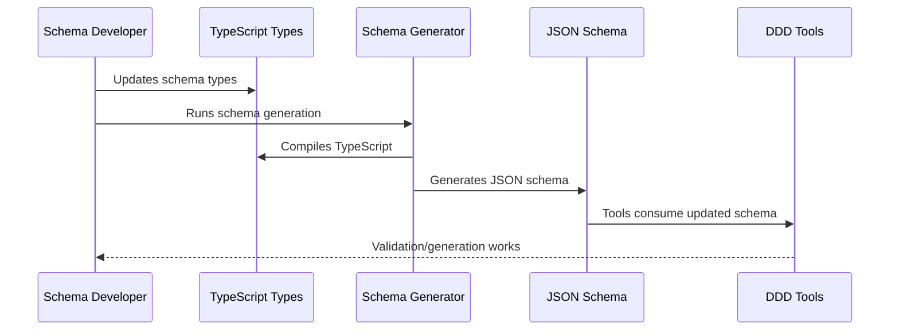
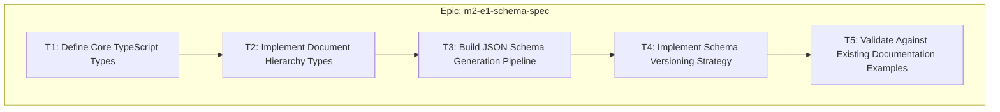
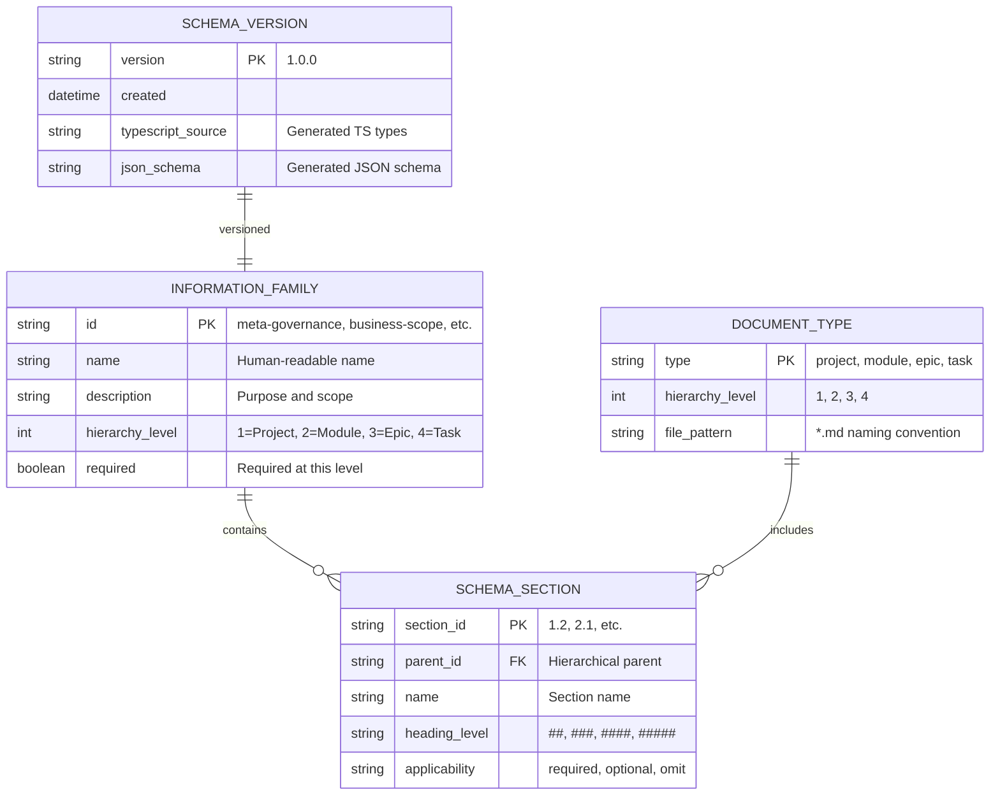
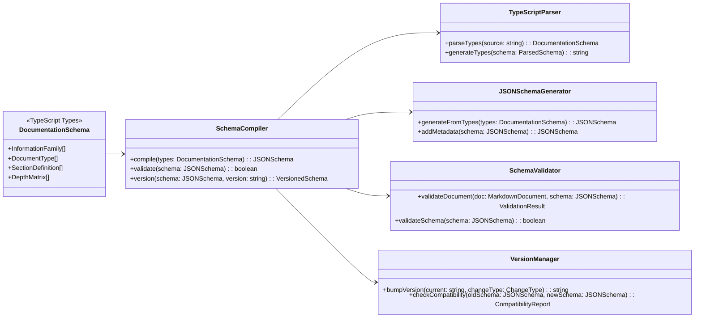
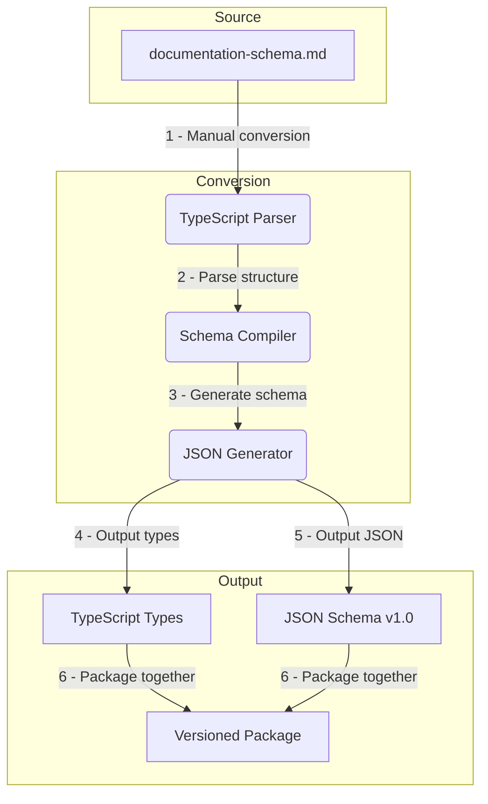
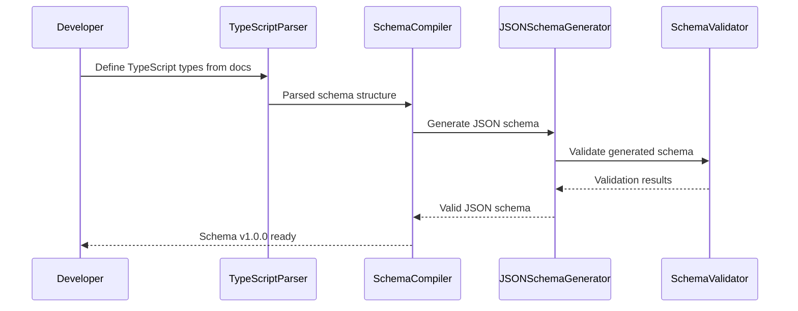

# Epic: m2-e1-schema-spec

<!-- Authors DDD specification as TypeScript types and generates JSON schema with versioning strategy -->

---

## ✅ 1 Meta & Governance

### ✅ 1.2 Status

- **Created:** 2025-07-17 22:30
- **Last Updated:** 2025-07-17 22:30

### ✅ 1.3 Priority Drivers

- [TEC-Dev_Productivity_Enhancement](/docs/documentation-driven-development.md#tec-dev_productivity_enhancement)

---

## ✅ 2 Business & Scope

### ✅ 2.1 Overview

- **Core Function**: Converts the existing `documentation-schema.md` specification into formal TypeScript types and generates corresponding JSON schema with semantic versioning.
- **Key Capability**: Transforms human-readable documentation schema into machine-readable TypeScript definitions that enable automated validation, code generation, and tooling integration.
- **Business Value**: Enables automated DDD tooling by providing a typed, versioned schema that eliminates manual template maintenance and enables robust validation workflows.

### ✅ 2.2 Business Context

The current DDD methodology relies on the comprehensive `documentation-schema.md` document that defines the 8 information families and 4-tier hierarchy structure. However, this schema exists only as human-readable documentation, making it impossible to build automated tools for validation, generation, or enforcement. By converting this specification to TypeScript types and JSON schema, we enable the entire DDD toolchain to operate programmatically against a single source of truth.

#### ✅ 2.2.1 User Journeys

##### ✅ 2.2.1.1 Journey: Schema Developer Updates DDD Specification

This journey describes how changes to the DDD methodology flow from TypeScript types through to distributed tooling.



#### ✅ 2.2.3 Core Business Rules

- **Schema Derivation**: TypeScript types must be directly derived from the existing `documentation-schema.md` specification - no arbitrary changes or interpretations.
- **Semantic Versioning**: Any breaking changes to the schema structure require a MAJOR version bump; additive changes require MINOR version bump.
- **Backward Compatibility**: Within a MAJOR version, all changes must maintain backward compatibility with existing documentation files.
- **Source of Truth**: Once implemented, TypeScript types become the canonical source; `documentation-schema.md` will be generated from types, not manually maintained.

#### ✅ 2.2.4 User Stories

- As a **Tool Developer**, I want strongly-typed interfaces for all DDD document structures so that I can build reliable parsers and validators without manual schema interpretation.
- As a **Schema Maintainer**, I want semantic versioning of schema changes so that I can evolve the DDD specification without breaking existing projects.
- As a **CLI User**, I want JSON schema validation so that my documents are checked against the exact specification without ambiguity.

### ✅ 2.3 Success Criteria

- **Complete Type Coverage**: TypeScript types capture 100% of the structure defined in `documentation-schema.md`, including all 8 information families and 4-tier hierarchy.
- **Valid JSON Schema Generation**: Generated JSON schema validates successfully against JSON Schema meta-schema and can validate example DDD documents.
- **Version 1.0 Release**: Schema types are published as version 1.0.0 with full semantic versioning support for future changes.

---

## ✅ 3 Planning & Decomposition

### ✅ 3.1 Roadmap (In-Focus Items)

| ID  | Task                                                                                    | Priority  | Priority Drivers                                                                                               | Status         | Depends On | Summary                                                          |
| :-- | :-------------------------------------------------------------------------------------- | :-------- | :------------------------------------------------------------------------------------------------------------- | :------------- | :--------- | :--------------------------------------------------------------- |
| T1  | [Define Core TypeScript Types](m2-e1-t1-core-typescript-types.task.md)                  | 🟥 High   | [TEC-Dev_Productivity_Enhancement](/docs/documentation-driven-development.md#tec-dev_productivity_enhancement) | 💡 Not Started | —          | Create TypeScript interfaces for the 8 information families.     |
| T2  | [Implement Document Hierarchy Types](m2-e1-t2-document-hierarchy-types.task.md)         | 🟥 High   | [TEC-Dev_Productivity_Enhancement](/docs/documentation-driven-development.md#tec-dev_productivity_enhancement) | 💡 Not Started | T1         | Define Project, Module, Epic, and Task document type structures. |
| T3  | [Build JSON Schema Generation Pipeline](m2-e1-t3-json-schema-generation.task.md)        | 🟧 Medium | [TEC-Dev_Productivity_Enhancement](/docs/documentation-driven-development.md#tec-dev_productivity_enhancement) | 💡 Not Started | T2         | Create tooling to generate JSON schema from TypeScript types.    |
| T4  | [Implement Schema Versioning Strategy](m2-e1-t4-schema-versioning.task.md)              | 🟧 Medium | [TEC-Dev_Productivity_Enhancement](/docs/documentation-driven-development.md#tec-dev_productivity_enhancement) | 💡 Not Started | T3         | Add semantic versioning support for schema evolution.            |
| T5  | [Validate Against Existing Documentation Examples](m2-e1-t5-validation-testing.task.md) | 🟨 Low    | [TEC-Dev_Productivity_Enhancement](/docs/documentation-driven-development.md#tec-dev_productivity_enhancement) | 💡 Not Started | T4         | Test generated schema against current project documentation.     |

### ✅ 3.2 Backlog / Icebox

- **Multi-Language Schema Bindings**: Generate schema definitions for Python, Java, and other languages beyond TypeScript.
- **Interactive Schema Explorer**: Web-based tool for browsing and understanding the schema structure.
- **Schema Migration Tools**: Automated utilities for upgrading documents between schema versions.

### ✅ 3.3 Dependencies

| ID  | Dependency On                    | Type     | Status | Notes                                            |
| --- | -------------------------------- | -------- | ------ | ------------------------------------------------ |
| D-1 | `docs/documentation-schema.md`   | Internal | ✅     | Source specification for TypeScript conversion.  |
| D-2 | TypeScript Compiler ≥ 4.9        | External | ✅     | Required for advanced type features.             |
| D-3 | `typescript-json-schema` package | External | ❓     | Tool for generating JSON schema from TypeScript. |

### ✅ 3.4 Decomposition Graph



---

## ✅ 4 High-Level Design

### ✅ 4.1 Current Architecture

This is a new epic; no existing implementation.

### ✅ 4.2 Target Architecture

#### ✅ 4.2.1 Data Models



#### ✅ 4.2.2 Components



#### ✅ 4.2.3 Data Flow



#### ✅ 4.2.4 Control Flow



#### ✅ 4.2.5 Integration Points

##### ✅ 4.2.5.1 Upstream Integrations

- **Source Documentation**: Reads structure from existing `docs/documentation-schema.md`
- **TypeScript Compiler**: Leverages TSC for type checking and compilation
- **JSON Schema Standards**: Adheres to JSON Schema Draft 7 specification

##### ✅ 4.2.5.2 Downstream Integrations

- **Package Registry**: Publishes versioned schema to GitHub Packages
- **Template Generator**: Provides schema for Markdown template generation
- **CLI Tools**: Supplies validation schema for `ddd-lint` and `ddd-init`
- **Documentation Tools**: Enables automated validation of DDD documents

#### ✅ 4.2.6 Exposed API

| API Surface                 | Target Users    | Purpose                                              | Key Options/Exports                                 |
| --------------------------- | --------------- | ---------------------------------------------------- | --------------------------------------------------- |
| **TypeScript Types Export** | Tool Developers | Strongly-typed interfaces for all DDD document types | `ProjectDocument`, `ModuleDocument`, `EpicDocument` |
| **JSON Schema Bundle**      | Validators      | Machine-readable validation schema                   | `ddd-schema-v1.json`, metadata, version info        |
| **Schema Compiler API**     | Build Tools     | Programmatic schema generation and validation        | `compile()`, `validate()`, `version()`              |

### ✅ 4.4 Non-Functional Requirements

#### ✅ 4.4.1 Performance

| ID      | Requirement                                                          | Priority  |
| :------ | :------------------------------------------------------------------- | :-------- |
| PERF-01 | JSON schema generation must complete in < 5 seconds for full schema. | 🟧 Medium |
| PERF-02 | Schema validation of a typical document must complete in < 100ms.    | 🟧 Medium |

#### ✅ 4.4.2 Security

| ID     | Requirement                                                       | Priority |
| :----- | :---------------------------------------------------------------- | :------- |
| SEC-01 | Generated schema must not expose internal build paths or secrets. | 🟥 High  |

#### ✅ 4.4.3 Reliability

| ID     | Requirement                                                             | Priority |
| :----- | :---------------------------------------------------------------------- | :------- |
| REL-01 | Schema compilation must be deterministic (same input = same output).    | 🟥 High  |
| REL-02 | Generated JSON schema must be valid according to JSON Schema meta-spec. | 🟥 High  |

---

## ✅ 5 Maintenance and Monitoring

### ✅ 5.1 Current Maintenance and Monitoring

This is a new epic; no existing maintenance and monitoring infrastructure.

### ✅ 5.2 Target Maintenance and Monitoring

#### ✅ 5.2.1 Error Handling

| Error Type                    | Trigger                                 | Action                       | User Feedback                                                |
| :---------------------------- | :-------------------------------------- | :--------------------------- | :----------------------------------------------------------- |
| **TypeScript Compilation**    | Invalid types or syntax errors.         | Fail build with exit code 1. | `ERROR: TypeScript compilation failed: [compilation_errors]` |
| **JSON Schema Generation**    | Unable to generate valid JSON schema.   | Fail build with exit code 1. | `ERROR: JSON schema generation failed: [generation_errors]`  |
| **Schema Validation Failure** | Generated schema fails meta-validation. | Fail build with exit code 1. | `ERROR: Generated schema is invalid: [validation_errors]`    |
| **Version Conflict**          | Semantic version calculation conflicts. | Fail build with exit code 1. | `ERROR: Version conflict detected: [conflict_details]`       |

#### ✅ 5.2.2 Logging & Monitoring

- **Build Logs**: Structured JSON logs for schema compilation process with timestamps and operation details.
- **Validation Metrics**: Track schema generation success rate, validation timing, and error patterns.
- **Version Tracking**: Log all schema version changes with justification and compatibility impact.

---

## ✅ 6 Implementation Guidance

### ✅ 6.1 Implementation Plan

| Phase                            | Scope / Deliverables                                    | Key Artifacts                       | Exit Criteria                                      |
| -------------------------------- | ------------------------------------------------------- | ----------------------------------- | -------------------------------------------------- |
| **Phase 1: Core Type Structure** | Define TypeScript interfaces for 8 information families | `src/types/schema-core.ts`          | All families represented as TypeScript interfaces. |
| **Phase 2: Document Hierarchy**  | Implement Project/Module/Epic/Task document types       | `src/types/document-types.ts`       | Complete type coverage for all 4 document levels.  |
| **Phase 3: Schema Generation**   | Build JSON schema compilation pipeline                  | `scripts/generate-schema.ts`        | Valid JSON schema generated from TypeScript types. |
| **Phase 4: Versioning System**   | Add semantic versioning and compatibility checking      | `src/versioning/`, version metadata | Schema v1.0.0 published with versioning strategy.  |

---

## ✅ 7 Quality & Operations

### ✅ 7.1 Testing Strategy / Requirements

| Scenario                                            | Test Type   | Tools                           |
| --------------------------------------------------- | ----------- | ------------------------------- |
| TypeScript types compile without errors             | Unit        | TypeScript compiler + Jest      |
| Generated JSON schema validates against meta-schema | Unit        | ajv validator + Jest            |
| Schema validates existing project documentation     | Integration | Generated schema + real docs    |
| Version bumping follows semantic versioning rules   | Unit        | Jest + semantic version library |
| Schema round-trip conversion preserves all data     | Integration | TypeScript → JSON → validation  |

### ✅ 7.2 Configuration

| Setting Name        | Source          | Override Method                | Notes                                                |
| ------------------- | --------------- | ------------------------------ | ---------------------------------------------------- |
| `schema-version`    | `package.json`  | `--version <ver>` CLI argument | Semantic version for generated schema.               |
| `output-dir`        | CLI argument    | `--output <path>`              | Directory for generated schema files.                |
| `typescript-config` | `tsconfig.json` | `--tsconfig <path>`            | TypeScript compiler configuration.                   |
| `validation-strict` | CLI argument    | `--strict` / `--no-strict`     | Enable strict validation mode for schema generation. |

### ✅ 7.3 Alerting & Response

| Error Condition               | Response Plan                                              | Status         |
| ----------------------------- | ---------------------------------------------------------- | -------------- |
| **Schema Generation Failure** | Fail CI build; alert maintainers; revert breaking changes. | 💡 Not Started |
| **Type Compilation Error**    | Block PR merge; require fix before proceeding.             | 💡 Not Started |
| **Backward Compatibility**    | Require manual review; may need MAJOR version bump.        | 💡 Not Started |

### ✅ 7.5 Local Test Commands

```bash
# Compile TypeScript types
npm run build:types

# Generate JSON schema
npm run generate:schema

# Validate generated schema
npm run validate:schema

# Run all schema tests
npm test -- --testPathPattern="schema"

# Test schema against existing docs
npm run test:integration
```

---

## ❓ 8 Reference

- **JSON Schema Specification**: [Draft 7](https://json-schema.org/draft-07/schema#)
- **TypeScript JSON Schema**: [typescript-json-schema](https://github.com/YousefED/typescript-json-schema)
- **Semantic Versioning**: [semver.org](https://semver.org/)
- **Source Documentation**: [docs/documentation-schema.md](../../documentation-schema.md)
