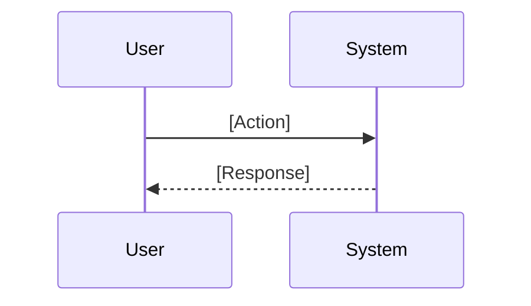
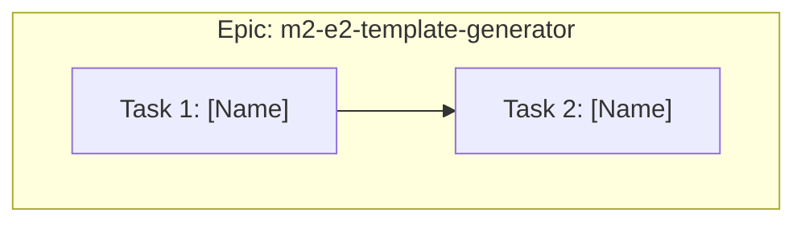
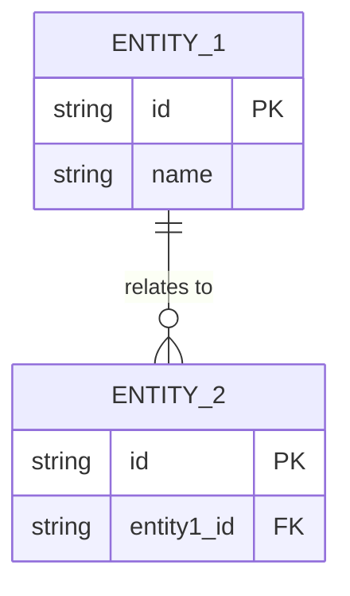
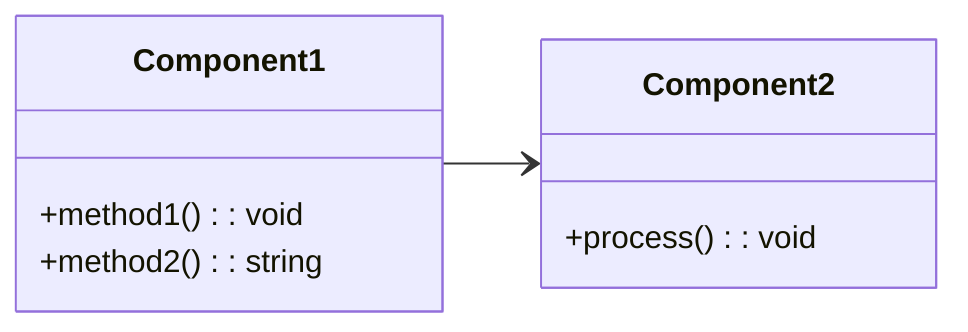
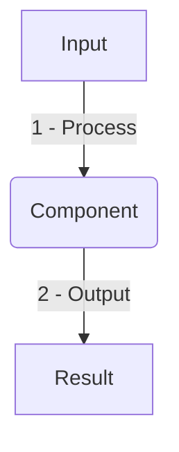
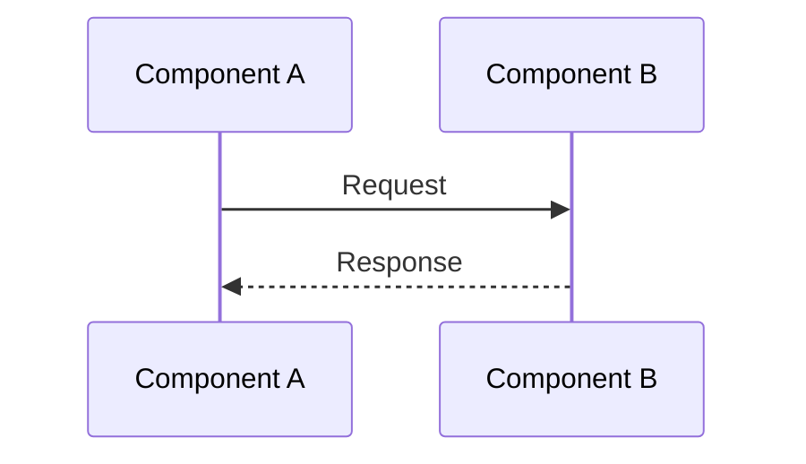

# Epic: m2-e2-template-generator

<!-- Creates tooling to generate Markdown documentation from the JSON schema -->

---

## ✅ 1 Meta & Governance

### ✅ 1.2 Status

- **Created:** [YYYY-MM-DD HH:MM]
- **Last Updated:** [YYYY-MM-DD HH:MM]

### ✅ 1.3 Priority Drivers

- [TEC-Dev_Productivity_Enhancement](/docs/documentation-driven-development.md#tec-dev_productivity_enhancement)

---

## ✅ 2 Business & Scope

### ✅ 2.1 Overview

- **Core Function**: [Define the core function of this epic]
- **Key Capability**: [Describe the key capability this epic provides]
- **Business Value**: [Explain the business value this epic delivers]

### ✅ 2.2 Business Context

[Provide context for why this epic is needed and how it fits into the larger system]

#### ✅ 2.2.1 User Journeys

##### ✅ 2.2.1.1 Journey: [Journey Name]

[Description of the user journey]



#### ✅ 2.2.3 Core Business Rules

- [Business Rule 1]
- [Business Rule 2]
- [Business Rule 3]

#### ✅ 2.2.4 User Stories

- As a [persona], I want [goal], so that [benefit].
- As a [persona], I want [goal], so that [benefit].

---

## ✅ 3 Planning & Decomposition

### ✅ 3.1 Roadmap (In-Focus Items)

| ID  | Task                            | Priority  | Priority Drivers                                                                                               | Status         | Depends On | Summary                         |
| :-- | :------------------------------ | :-------- | :------------------------------------------------------------------------------------------------------------- | :------------- | :--------- | :------------------------------ |
| T1  | [Task Name](./path/to/task1.md) | 🟥 High   | [TEC-Dev_Productivity_Enhancement](/docs/documentation-driven-development.md#tec-dev_productivity_enhancement) | 💡 Not Started | —          | [Brief description of the task] |
| T2  | [Task Name](./path/to/task2.md) | 🟧 Medium | [TEC-Dev_Productivity_Enhancement](/docs/documentation-driven-development.md#tec-dev_productivity_enhancement) | 💡 Not Started | T1         | [Brief description of the task] |

### ✅ 3.2 Backlog / Icebox

- [Deferred item 1]: [Reason for deferral]
- [Deferred item 2]: [Reason for deferral]

### ✅ 3.3 Dependencies

| ID  | Dependency On | Type     | Status         | Notes                        |
| --- | ------------- | -------- | -------------- | ---------------------------- |
| D-1 | Epic E1       | Internal | 💡 Not Started | Requires JSON schema from E1 |

### ✅ 3.4 Decomposition Graph



---

## ✅ 4 High-Level Design

### ✅ 4.1 Current Architecture

This is a new epic; no existing implementation.

### ✅ 4.2 Target Architecture

#### ✅ 4.2.1 Data Models



#### ✅ 4.2.2 Components



#### ✅ 4.2.3 Data Flow



#### ✅ 4.2.4 Control Flow



#### ✅ 4.2.5 Integration Points

##### ✅ 4.2.5.1 Upstream Integrations

- [Upstream integration details]

##### ✅ 4.2.5.2 Downstream Integrations

- [Downstream integration details]

#### ✅ 4.2.6 Exposed API

| API Surface | Target Users | Purpose   | Key Options/Exports |
| ----------- | ------------ | --------- | ------------------- |
| [API Name]  | [Users]      | [Purpose] | [Options]           |

### ✅ 4.4 Non-Functional Requirements

#### ✅ 4.4.1 Performance

| ID      | Requirement               | Priority |
| :------ | :------------------------ | :------- |
| PERF-01 | [Performance requirement] | 🟥 High  |

#### ✅ 4.4.2 Security

| ID     | Requirement            | Priority |
| :----- | :--------------------- | :------- |
| SEC-01 | [Security requirement] | 🟥 High  |

#### ✅ 4.4.3 Reliability

| ID     | Requirement               | Priority |
| :----- | :------------------------ | :------- |
| REL-01 | [Reliability requirement] | 🟥 High  |

---

## ✅ 5 Maintenance and Monitoring

### ✅ 5.1 Current Maintenance and Monitoring

This is a new epic; no existing maintenance and monitoring infrastructure.

### ✅ 5.2 Target Maintenance and Monitoring

#### ✅ 5.2.1 Error Handling

| Error Type   | Trigger             | Action         | User Feedback      |
| :----------- | :------------------ | :------------- | :----------------- |
| [Error Type] | [Trigger condition] | [Action taken] | [Feedback message] |

#### ✅ 5.2.2 Logging & Monitoring

- [Logging strategy]
- [Monitoring approach]

---

## ✅ 6 Implementation Guidance

### ✅ 6.1 Implementation Plan

| Phase               | Scope / Deliverables | Key Artifacts | Exit Criteria |
| ------------------- | -------------------- | ------------- | ------------- |
| **Phase 1: [Name]** | [Deliverables]       | [Artifacts]   | [Criteria]    |

---

## ✅ 7 Quality & Operations

### ✅ 7.1 Testing Strategy / Requirements

| Scenario        | Test Type | Tools |
| --------------- | --------- | ----- |
| [Test scenario] | Unit      | Jest  |

### ✅ 7.2 Configuration

| Setting Name | Source   | Override Method | Notes   |
| ------------ | -------- | --------------- | ------- |
| [Setting]    | [Source] | [Override]      | [Notes] |

### ✅ 7.3 Alerting & Response

| Error Condition | Response Plan | Status         |
| --------------- | ------------- | -------------- |
| [Error]         | [Response]    | 💡 Not Started |

### ✅ 7.5 Local Test Commands

```bash
# Run tests
npm test

# Run specific test
npm test -- --testNamePattern="[test name]"
```

---

## ❓ 8 Reference

- [Reference link or resource]
