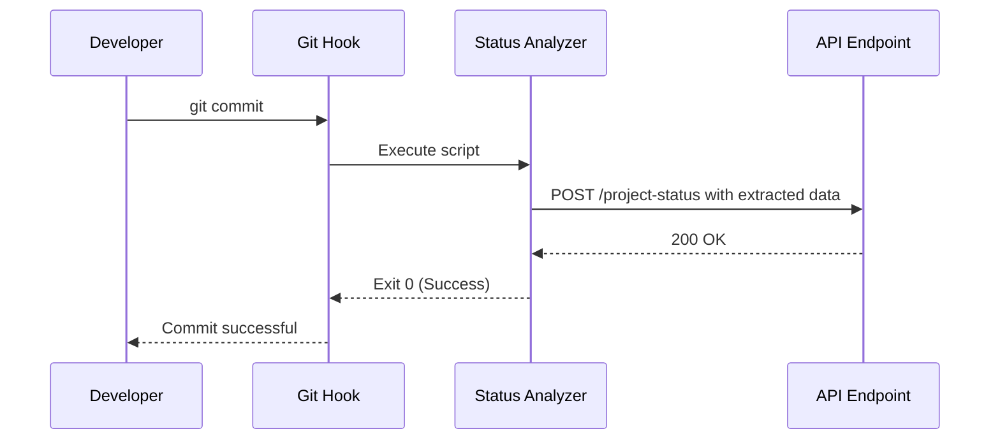
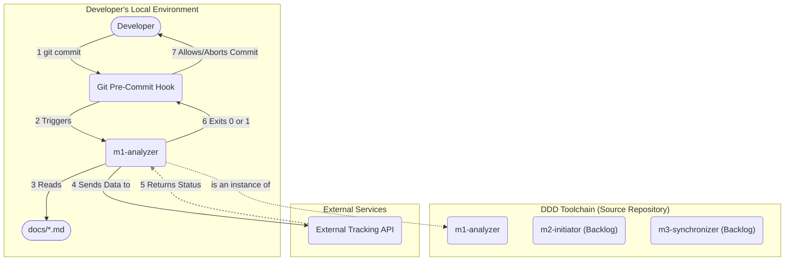

# Project: Documentation-Driven-Development Tools

<!-- This document is the single source of truth for the entire project. It defines the strategic goals, system-wide architecture, and overall plan. -->

---

## ✅ 1 Meta & Governance

### ✅ 1.2 Status

<!-- This section is auto-populated and updated to track the document's lifecycle. -->

- **Created:** 2025-07-16 02:00
- **Last Updated:** 2025-07-16 02:00

### ✅ 1.3 Priority Drivers

<!-- List the stable Driver IDs from the root documentation that justify this project's priority. -->

- [TEC-Dev_Productivity_Blocker](/docs/documentation-driven-development.md#tec-dev_productivity_blocker)
- [TEC-Dev_Productivity_Enhancement](/docs/documentation-driven-development.md#tec-dev_productivity_enhancement)
- [UX-Noticeable_Friction](/docs/documentation-driven-development.md#ux-noticeable_friction)

---

## ✅ 2 Business & Scope

### ✅ 2.1 Overview

This repository is the central hub for all tools supporting our Documentation-Driven Development (DDD) methodology. Its primary objectives are to:

- **Automate Documentation Tasks:** Provide a suite of scripts to automate tasks such as computing project status, updating templates, and initializing new projects.
- **Enforce DDD Structure:** Offer tools that impose and maintain the standardized documentation structure across all projects.
- **Centralize Development Practices:** Serve as the single, authoritative source for managing and evolving our DDD toolchain, allowing for consistent improvements.

### ✅ 2.2 Business Context

- **Internal Platform Engineering**: This project is a platform engineering initiative to build and maintain a dedicated toolkit for our internal Documentation-Driven Development (DDD) process.
- **Automate and Enforce**: The primary goal is to automate manual documentation tasks and enforce the standardized DDD structure across all projects.
- **Developer Experience**: By providing a reliable toolchain, we aim to improve the developer experience, reduce friction, and allow teams to focus on feature development instead of documentation overhead.

#### ✅ 2.2.1 User Journeys

##### ✅ 2.2.1.1 Journey: Developer Commits Status-Impacting Changes

This journey describes the automated process that occurs when a developer commits changes to any documentation file. The goal is to capture the state of the project at the time of the commit and send it to an external service for tracking and analysis. This is triggered by a pre-commit hook to ensure that the data is always synchronized with the codebase.

#### ✅ 2.2.2 User Personas

<!-- Define the target user(s) for this project. -->

| Persona               | Goal                                                                                                                                                             |
| --------------------- | ---------------------------------------------------------------------------------------------------------------------------------------------------------------- |
| **The DDD Developer** | To automate repetitive documentation and project management tasks, ensuring consistency and allowing them to focus on implementation rather than manual updates. |

#### ✅ 2.2.3 Core Business Rules

<!-- Enumerate the critical, overarching business rules that govern this project's behavior. -->

- **Schema Compliance**: All generated or updated documentation must be 100% compliant with the structure defined in `docs/documentation-schema.md`. The tools should fail with a clear error if a document is not compliant.
- **Idempotency**: All automation scripts must be idempotent. Running a script multiple times should produce the same result as running it once, without causing errors or unintended side effects.
- **Fail-Fast on Errors**: The pre-commit hook must abort the commit immediately if the status analysis script fails to execute or if the API endpoint returns an error. This prevents broken or out-of-sync data from entering the repository.

### ✅ 2.3 Success Criteria

<!-- Define the measurable outcomes that indicate this project is complete for its current phase. -->

- **Automated Workflow Adoption**: At least one core development workflow (e.g., status reporting) is fully automated by the toolchain and is actively used by the development team.
- **Documentation Consistency**: The toolchain successfully enforces the standard DDD structure, and all new modules created using the tools are 100% compliant with the documentation schema.
- **Centralized Toolchain**: The repository is established as the single source of truth for all DDD-related tooling, and all developers use it for managing and evolving the toolset.

### ✅ 2.5 Boundaries & Scope

#### ✅ 2.5.1 In Scope

- **Documentation Lifecycle Tools**: Building and maintaining a suite of command-line tools that automate and support the entire Documentation-Driven Development (DDD) lifecycle.
- **Schema Enforcement & Validation**: Tools that read and validate documentation files against the canonical schema defined in `docs/documentation-schema.md`.
- **Process Automation**: Scripts that automate repetitive developer workflows, such as status aggregation, documentation linting, and data extraction for external systems.
- **Developer-Focused Tooling**: All tools will be designed for a technical audience (developers) and run in a local development environment or a CI/CD pipeline.

#### ✅ 2.5.2 Out of Scope

- **Business-Specific Logic**: The toolkit will remain agnostic to any specific business domain. Its only concern is the structure and process of the DDD methodology itself.
- **External System Implementation**: The project is not responsible for building or maintaining any of the external systems (e.g., API endpoints, dashboards) that the tools might integrate with.
- **Graphical User Interfaces (GUIs)**: The entire toolchain will be command-line-based. No resources will be allocated to building web or desktop interfaces.
- **Non-DDD Processes**: The tools will be built exclusively to support our specific DDD methodology. They will not be designed for general-purpose documentation or project management.

### ✅ 2.6 Core Business Processes

#### ✅ 2.6.1 Process: Automated Status Reporting

- **Participants**: The DDD Developer, Git, CI/CD Pipeline.
- **Goal**: To automatically extract and transmit project status data upon every code change without manual intervention.
- **Workflow**:
  1. A developer finishes a task and runs `git commit`.
  2. A pre-commit hook automatically triggers the `analyzer` script.
  3. The script scans the entire `docs/` directory, parsing all documentation files to build a complete, hierarchical model of the project's state.
  4. The script sends this data model as a JSON payload to a pre-configured API endpoint.
  5. If the endpoint returns a success status (e.g., 200 OK), the commit is allowed to proceed.
  6. If the script fails or the endpoint returns an error, the commit is aborted, preventing out-of-sync data.

---

## ✅ 3 Planning & Decomposition

### ✅ 3.1 Roadmap (In-Focus Items)

<!-- List the modules that are actively planned for the current implementation cycle. -->

- [Module: Analyzer](./m1-analyzer/m1-analyzer.module.md)

### ✅ 3.2 Backlog / Icebox

<!-- List modules that have been considered but are not scheduled for the current cycle. -->

- **DDD Initiator and Sync**: A tool to initialize a new project with the standard DDD structure and sync core documentation files. Deferred to prioritize the core `analyzer` module.

### ✅ 3.3 Dependencies

<!-- List any internal or external dependencies that could block the progress of this project. -->

| ID  | Dependency On         | Type     | Status | Affected Modules | Notes                                                                               |
| --- | --------------------- | -------- | ------ | ---------------- | ----------------------------------------------------------------------------------- |
| D-1 | External Tracking API | External | ❌     | `m1-analyzer`    | The toolchain depends on a defined and accessible API endpoint to send status data. |

---

## ✅ 4 High-Level Design

### ✅ 4.0 Guiding Principles

<!-- Document any high-level architectural rules or constraints that apply to the entire project. -->

- **Stateless & Idempotent CLI Tools**: All tools must be stateless and idempotent. Running a tool multiple times should produce the same result as running it once, making them predictable and safe for automation.
- **Single Responsibility Principle**: Each tool will be designed to do one job well. For example, the `analyzer` analyzes, and the future `initiator` will only initialize projects.
- **Schema-Compliant Design**: All tools must operate on documentation that adheres to the structure defined in `docs/documentation-schema.md`. The content of these documents serves as the contract for implementation.

### ✅ 4.1 Current Architecture

<!-- Describe the existing system before the changes in this project are implemented. Optional for "greenfield" work. -->

This project is being developed from scratch; there is no existing system.

### ✅ 4.2 Target Architecture

<!-- Describe the proposed "to-be" state of the system after this project is implemented. -->

#### ✅ 4.2.1 Components

<!-- Provide a diagram of the main "to-be" components and their relationships. -->

### ✅ 4.3 Tech Stack & Deployment

<!-- Document the key technologies and deployment strategy for this project. -->

- **Language**: TypeScript
- **Runtime**: Node.js
- **Deployment**: GitHub Packages

### ✅ 4.4.4 Permission Model

<!-- Defines the access control rules, user roles, and permissions for the system. -->

The toolchain operates under the permission context of the developer's local environment.

| Principal     | Permissions                                                                                              | Notes                                                                         |
| ------------- | -------------------------------------------------------------------------------------------------------- | ----------------------------------------------------------------------------- |
| **Developer** | - Read/Write access to the local file system within the repository. - Git permissions to commit code. | The toolchain runs with the same permissions as the developer who invokes it. |

---

## ✅ 5 Maintenance and Monitoring

### ✅ 5.1 Error Handling

- [Error handling strategy for the project.]

### ✅ 5.2 Logging & Monitoring

- [Logging and monitoring strategy for the project.]

---

## ✅ 7 Quality & Operations

### ✅ 7.1 Testing Strategy / Requirements

<!-- Describe the overall approach for testing the project. -->

- **Unit Testing**: All individual tools, modules, and utility functions must be accompanied by unit tests. A project-wide code coverage target of >80% is required.
- **Integration Testing**: The toolchain must include integration tests that verify the interactions between its components, such as ensuring the `analyzer` can correctly parse all document types defined in the templates.
- **End-to-End (E2E) Testing**: The project will include E2E tests that simulate the full developer workflow. This includes invoking the tool via a mock pre-commit hook, analyzing a fixture of the `docs/` directory, and asserting that the correct data is sent to a mock API endpoint.
- **Schema Validation Testing**: A dedicated suite of tests will ensure that all tools correctly validate documentation against `docs/documentation-schema.md` and handle non-compliant files gracefully.

### ✅ 7.2 Configuration

<!-- Detail how the project is configured in different environments. -->

The toolchain is configured via a `ddd.config.json` file in the project root, with environment variables available for overrides.

| Setting Name          | Module Dependency | Source               | Override Method                               | Notes                                                                   |
| --------------------- | ----------------- | -------------------- | --------------------------------------------- | ----------------------------------------------------------------------- |
| `analyzerApiEndpoint` | `m1-analyzer`     | `ddd.config.json`    | `DDD_ANALYZER_API_ENDPOINT` (Environment Var) | (Required) The URL of the external service for status reporting.        |
| `logLevel`            | (All)             | `ddd.config.json`    | `DDD_LOG_LEVEL` (Environment Variable)        | `info` (default), `debug`, `warn`, `error`. Controls logging verbosity. |
| `NODE_ENV`            | (All)             | Environment Variable | Not overrideable                              | `development` or `production`. Determines the operational mode.         |

### ✅ 7.3 Alerting & Response

The toolchain's primary method of "alerting" is providing immediate, clear feedback to the developer within their terminal.

| Error Condition                   | Relevant Modules | Response Plan                                                                                                | Status         |
| --------------------------------- | ---------------- | ------------------------------------------------------------------------------------------------------------ | -------------- |
| **Internal Script Failure**       | All              | Abort the `git commit` with a non-zero exit code. Print the error stack trace directly to the console.       | 💡 Not Started |
| **External API Non-2xx Response** | `m1-analyzer`    | Abort the `git commit` with a non-zero exit code. Log the API's error response to the console.               | 💡 Not Started |
| **CI/CD Pipeline Failure**        | All              | Fail the corresponding pipeline step. The tool's non-zero exit code will be surfaced in the CI/CD interface. | 💡 Not Started |

---

## ❓ 8 Reference

### ❓ 8.1 Appendices/Glossary

<!-- Provide any additional information, definitions, or links to external resources. -->

- **[Term]**: [Definition of the term.]
