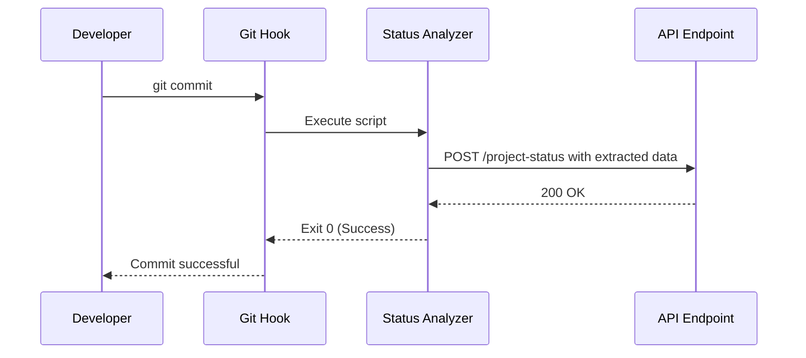
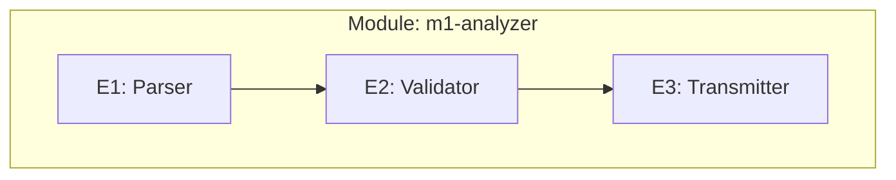
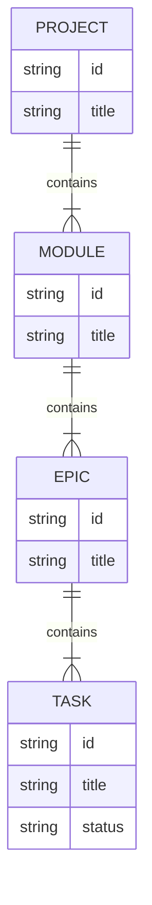
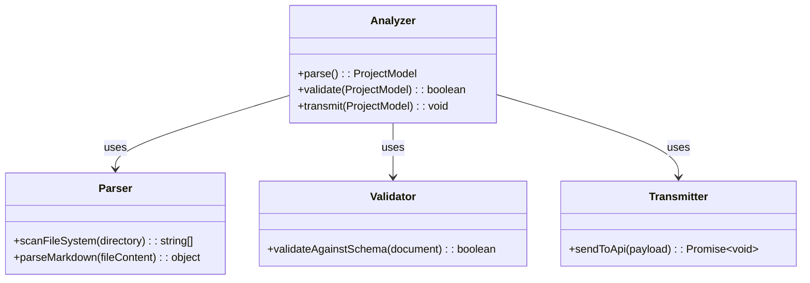
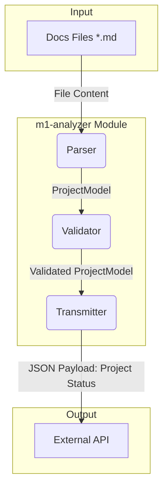

# Module: m1-analyzer

<!-- This document defines a functional area of the project. It outlines the business goals, architecture, and decomposition of work for a collection of related epics. -->

---

## ✅ 1 Meta & Governance

### ✅ 1.2 Status

<!-- This section is auto-populated and updated to track the document's lifecycle. -->

- **Created:** 2025-07-16 02:00
- **Last Updated:** 2025-07-16 02:00

### ✅ 1.3 Priority Drivers

<!-- List the stable Driver IDs from the root documentation that justify this module's priority. -->

- [TEC-Dev_Productivity_Blocker](/docs/documentation-driven-development.md#tec-dev_productivity_blocker)
- [TEC-Dev_Productivity_Enhancement](/docs/documentation-driven-development.md#tec-dev_productivity_enhancement)
- [UX-Noticeable_Friction](/docs/documentation-driven-development.md#ux-noticeable_friction)

---

## ✅ 2 Business & Scope

### ✅ 2.1 Overview

- **Parses Documentation**: This module parses all documentation files (`*.md`) within the project.
- **Extracts Dynamic Data**: It extracts dynamic data that indicates project progress and status, such as task completion, priority changes, and dependency updates.
- **Transmits for Monitoring**: The extracted data is then transmitted to an external dashboard system, enabling the team to monitor progress across all projects.

### ✅ 2.2 Business Context

This module addresses the manual effort and potential for inconsistency inherent in tracking project status across multiple documentation files. By automating the extraction and transmission of status data, it aims to improve developer productivity, reduce friction, and provide a reliable, real-time view of project health for all stakeholders.

#### ✅ 2.2.1 Key Workflows

The primary workflow for this module is the **Automated Status Reporting** process triggered on a `git commit`. This is detailed in the project-level documentation.

#### ✅ 2.2.2 User Personas

| Persona               | Goal                                                                                                                                                             |
| --------------------- | ---------------------------------------------------------------------------------------------------------------------------------------------------------------- |
| **The DDD Developer** | To automate repetitive documentation and project management tasks, ensuring consistency and allowing them to focus on implementation rather than manual updates. |

#### ✅ 2.2.3 Core Business Rules

- **Schema Compliance**: The analyzer MUST validate all parsed documentation against the canonical schema. It MUST fail if a document is not compliant.
- **Idempotency**: The analyzer script MUST be idempotent.
- **Fail-Fast on Errors**: The analyzer MUST abort the commit if it fails to execute or if the external API returns an error.

#### ❓ 2.2.4 User Stories

- As a **DDD Developer**, I want the system to automatically analyze my documentation files when I commit, so that I don't have to manually trigger a status update.
- As a **DDD Developer**, I want the commit to fail if the documentation is not compliant with the schema, so that I can fix it immediately and maintain consistency.
- As a **DDD Developer**, I want the commit to fail if the status cannot be sent to the external dashboard, so that I know the central tracking is out of sync.

### ❓ 2.3 Success Criteria

- **Automated Execution**: The `m1-analyzer` script is successfully triggered by a pre-commit hook on every commit.
- **Complete Data Extraction**: The script correctly parses all levels of the documentation hierarchy (Project, Module, Epic, Task) and extracts all required status and progress metrics.
- **Successful Transmission**: The extracted data is successfully sent to and accepted by the external tracking API endpoint.
- **Schema Validation**: The script correctly identifies and fails on any documentation file that does not comply with the canonical schema.

---

## ✅ 3 Planning & Decomposition

### ✅ 3.1 Roadmap (In-Focus Items)

<!-- List the epics that are actively planned for the current implementation cycle. -->

| ID  | Epic                                                                | Priority | Priority Drivers                                                                                       | Status         | Depends On | Summary                                                                                   |
| :-- | :------------------------------------------------------------------ | :------- | :----------------------------------------------------------------------------------------------------- | :------------- | :--------- | :---------------------------------------------------------------------------------------- |
| E1  | [Documentation Parser](./m1-e1-parser/m1-e1-parser.epic.md)         | 🟥 High  | [TEC-Dev_Productivity_Blocker](/docs/documentation-driven-development.md#tec-dev_productivity_blocker) | 💡 Not Started | —          | Parses all documentation files to build an in-memory model of the project state.          |
| E2  | [Schema Validator](./m1-e2-validator/m1-e2-validator.epic.md)       | 🟥 High  | [TEC-Dev_Productivity_Blocker](/docs/documentation-driven-development.md#tec-dev_productivity_blocker) | 💡 Not Started | E1         | Validates the parsed documentation against the canonical schema, ensuring data integrity. |
| E3  | [Status Transmitter](./m1-e3-transmitter/m1-e3-transmitter.epic.md) | 🟥 High  | [TEC-Dev_Productivity_Blocker](/docs/documentation-driven-development.md#tec-dev_productivity_blocker) | 💡 Not Started | E2         | Transmits the validated project status data to the external monitoring dashboard.         |

### ✅ 3.2 Backlog / Icebox

<!-- List epics that have been considered but are not scheduled for the current cycle. -->

- [Epic: A future feature idea] - [Brief justification for deferral.]

### ✅ 3.3 Dependencies

<!-- List any internal or external dependencies that could block the progress of this module. -->

| ID  | Dependency On         | Type     | Status | Notes                                                                     |
| --- | --------------------- | -------- | ------ | ------------------------------------------------------------------------- |
| D-1 | External Tracking API | External | ❌     | The analyzer depends on a defined and accessible API to send status data. |

### ✅ 3.4 Decomposition Graph

<!-- (Optional) A visual graph of dependencies between the child epics. -->

---

## ✅ 4 High-Level Design

### ✅ 4.0 Guiding Principles

<!-- Document any high-level architectural rules or constraints that apply to all epics within this module. -->

- **Schema Compliance is Mandatory**: The analyzer MUST validate all parsed documentation against the canonical schema and fail if a document is not compliant.
- **Fail-Fast on Errors**: The analyzer MUST abort the commit if it fails to execute or if the external API returns an error, providing immediate feedback to the developer.
- **Idempotency**: The analyzer script MUST be idempotent; running it multiple times on the same set of files should produce the same output and side effects.

### ✅ 4.1 Current Architecture

<!-- Describe the existing system before the changes in this module are implemented. Optional for "greenfield" work. -->

This is a new module being developed from scratch; there is no existing system.

### ✅ 4.2 Target Architecture

<!-- Describe the proposed "to-be" state of the system after this module is implemented. -->

#### ✅ 4.2.1 Data Models

The core data model represents the hierarchical structure of the documentation.

#### ✅ 4.2.2 Components

<!-- Provide a diagram of the main "to-be" components and their relationships. -->

#### ✅ 4.2.3 Data Flow

<!-- Diagram the "to-be" data flow between components. -->

#### ✅ 4.2.4 Control Flow

<!-- Diagram the "to-be" sequence of interactions. -->

This is identical to the project-level **Automated Status Reporting** workflow.

#### ✅ 4.2.5 Integration Points

##### ✅ 4.2.5.1 Upstream Integrations

- **Trigger:** The `m1-analyzer` is executed by a Git pre-commit hook.
- **Input Data:** The analyzer takes the root `docs/` directory as its primary input, recursively scanning for `*.md` files.

##### ✅ 4.2.5.2 Downstream Integrations

- **Completion Trigger:** The analyzer script completes and exits.
- **Output Data:** A JSON payload representing the complete, hierarchical state of the project is sent via a `POST` request to the `analyzerApiEndpoint`.

#### ✅ 4.2.6 Exposed API

<!-- Summarize the API surface this module will expose to consumers. -->

This module is a command-line tool and does not expose any API endpoints.

### ✅ 4.3 Tech Stack & Deployment

<!-- (Optional) Document the key technologies and deployment strategy for this module if it differs from the project level. -->

- **Language**: TypeScript
- **Runtime**: Node.js
- **Deployment**: This module is a core component of the `ddd-tools` package and is distributed via GitHub Packages.

---

## ✅ 5 Maintenance and Monitoring

### ✅ 5.1 Current Maintenance and Monitoring

<!-- Describe the existing internal implementation details. Optional for "greenfield" work. -->

This is a new module being developed from scratch; there is no existing detailed design.

### ✅ 5.2 Target Maintenance and Monitoring

<!-- Describe the proposed "to-be" internal implementation details. -->

#### ✅ 5.2.1 Error Handling

<!-- Describe the "to-be" error handling strategy. -->

The `m1-analyzer` tool runs in a pre-commit hook, so its error handling strategy is designed to provide immediate, clear feedback to the developer and to prevent broken or out-of-sync data from being committed. A non-zero exit code is used to automatically abort the `git commit` process upon failure.

| Error Type                  | Trigger                                       | Action                  | User Feedback                                                             |
| :-------------------------- | :-------------------------------------------- | :---------------------- | :------------------------------------------------------------------------ |
| **File System Error**       | Cannot read a required file or directory.     | Abort with exit code 1. | `ERROR: Cannot access [path]. Please check permissions.`                  |
| **Parsing Error**           | A documentation file is malformed.            | Abort with exit code 1. | `ERROR: Failed to parse [file]: [parser_message].`                        |
| **Schema Validation Error** | A document violates the canonical schema.     | Abort with exit code 1. | `ERROR: Schema validation failed in [file]: [validation_details].`        |
| **Configuration Error**     | `analyzerApiEndpoint` is missing or invalid.  | Abort with exit code 1. | `ERROR: Configuration invalid. Missing 'analyzerApiEndpoint' in config.`  |
| **API/Network Error**       | External API is unreachable or returns > 299. | Abort with exit code 1. | `ERROR: Failed to transmit status to [endpoint]: [HTTP_status_or_error].` |

#### ✅ 5.2.2 Logging & Monitoring

<!-- Describe the "to-be" observability strategy. -->

As a command-line tool, logging is directed to the console to provide direct feedback to the developer running the commit.

- **Console Logging**: All logs are directed to the standard console output. `stdout` is used for informational messages, and `stderr` is used for warnings and errors to allow for redirection.
- **Log Levels**:
  - **`INFO`**: The default level, showing high-level progress milestones (e.g., "Analysis complete. Transmitting data...").
  - **`DEBUG`**: Verbose output for troubleshooting, enabled via a `--verbose` flag or `DDD_LOG_LEVEL=debug` environment variable. This will include details like which files are being parsed and the data being extracted.
  - **`WARN`**: For non-blocking issues that do not stop the commit but should be noted (e.g., an optional configuration is missing).
  - **`ERROR`**: For critical failures that stop the commit. The error message will be logged just before the script exits with a non-zero code.
- **Monitoring**: The tool's monitoring responsibility is limited to the successful transmission of the JSON payload to the `analyzerApiEndpoint`. A successful transmission (2xx response) will be logged with an `INFO` message. The external service is responsible for all further monitoring and alerting on the data itself.

---

## ✅ 6 Implementation Guidance

### ✅ 6.1 Implementation Plan

<!-- Describe the high-level, potentially phased rollout strategy for the epics in this module. -->

The implementation of the `m1-analyzer` module will follow a phased approach, corresponding to the dependent epics. This ensures that foundational components are built and tested before dependent components are started.

| Phase                     | Scope / Deliverables                                                                                                  | Key Artifacts                         | Exit Criteria                                                                                                         |
| ------------------------- | --------------------------------------------------------------------------------------------------------------------- | ------------------------------------- | --------------------------------------------------------------------------------------------------------------------- |
| **Phase 1: Core Parsing** | - Implement the file system scanner. - Build the logic to parse Markdown files into an in-memory `ProjectModel`.   | `src/modules/analyzer/parser.ts`      | The parser can successfully read all `*.md` files in the `docs/` directory and build a complete model without errors. |
| **Phase 2: Validation**   | - Implement the schema validation logic against the `ProjectModel`.                                                   | `src/modules/analyzer/validator.ts`   | The validator correctly identifies both compliant and non-compliant documents based on the canonical schema.          |
| **Phase 3: Transmission** | - Implement the logic to send the validated `ProjectModel` to the external API. - Handle API success/error states. | `src/modules/analyzer/transmitter.ts` | The transmitter can successfully `POST` a JSON payload to a mock API endpoint and handle responses correctly.         |

---

## ✅ 7 Quality & Operations

### ✅ 7.1 Testing Strategy / Requirements

<!-- Describe the approach for testing the handoffs *between* the epics within this module. -->

The testing strategy for the `m1-analyzer` module focuses on integration tests that verify the correct data flow and error handling between the `Parser`, `Validator`, and `Transmitter` epics. Unit tests for each epic's internal logic are defined within the respective epic documentation.

| Test Scenario                         | Components Involved        | Test Type   | Tools / Runner | Notes                                                                                                            |
| :------------------------------------ | :------------------------- | :---------- | :------------- | :--------------------------------------------------------------------------------------------------------------- |
| **Parser to Validator Hand-off**      | `Parser`, `Validator`      | Integration | Jest           | Use a fixture of valid `docs` to ensure the `ProjectModel` is created and passes validation without errors.      |
| **Invalid Schema Detection**          | `Parser`, `Validator`      | Integration | Jest           | Use a fixture of `docs` with a known schema violation and assert that the `Validator` throws the correct error.  |
| **Validator to Transmitter Hand-off** | `Validator`, `Transmitter` | Integration | Jest, MSW      | Use a valid `ProjectModel` and mock the API endpoint to ensure the `Transmitter` sends the correct JSON payload. |
| **Full End-to-End Success**           | `Analyzer` (main script)   | E2E         | Jest, MSW      | Run the main analyzer script on a valid `docs` fixture and assert that the mock API receives the expected data.  |
| **Full E2E Failure (Validation)**     | `Analyzer` (main script)   | E2E         | Jest           | Run the main analyzer script on an invalid `docs` fixture and assert that the script exits with a non-zero code. |
| **Full E2E Failure (API)**            | `Analyzer` (main script)   | E2E         | Jest, MSW      | Run the script on a valid `docs` fixture but have the mock API return a 500 error. Assert a non-zero exit code.  |

### ✅ 7.2 Configuration

<!-- Detail how the module is configured in different environments. -->

The `m1-analyzer` module is configured via the project-level `ddd.config.json` file, with environment variables providing override capabilities.

| Setting Name          | Source               | Override Method                       | Default      | Notes                                                               |
| :-------------------- | :------------------- | :------------------------------------ | :----------- | :------------------------------------------------------------------ |
| `analyzerApiEndpoint` | `ddd.config.json`    | `DDD_ANALYZER_API_ENDPOINT` (Env Var) | (None)       | **Required**. The URL of the external service for status reporting. |
| `logLevel`            | `ddd.config.json`    | `DDD_LOG_LEVEL` (Env Var)             | `info`       | `info`, `debug`, `warn`, `error`. Controls logging verbosity.       |
| `NODE_ENV`            | Environment Variable | Not overrideable                      | `production` | `development` or `production`. Determines the operational mode.     |

### ✅ 7.3 Alerting & Response

<!-- Define how to respond to alerts and operational logs originating from this module. -->

The `m1-analyzer` is a developer tool that runs locally, so its alerting and response mechanism is centered on providing immediate, actionable feedback in the terminal. All alerts result in a non-zero exit code, which aborts the `git commit` process.

| Alert / Error Condition     | Response Plan                                                                                                                                                                 |
| :-------------------------- | :---------------------------------------------------------------------------------------------------------------------------------------------------------------------------- |
| **Internal Script Failure** | The script will print the full error stack trace to the console. The developer should inspect the trace to debug the tool itself.                                             |
| **Configuration Error**     | The script will log a specific error message indicating the missing or invalid configuration. The developer must correct the `ddd.config.json` file or environment variables. |
| **Schema Validation Error** | The script will log the file path and specific validation error. The developer must correct the documentation file to match the schema.                                       |
| **API/Network Error**       | The script will log the endpoint and the HTTP error status. The developer should check their network connection and the status of the external API.                           |

---
