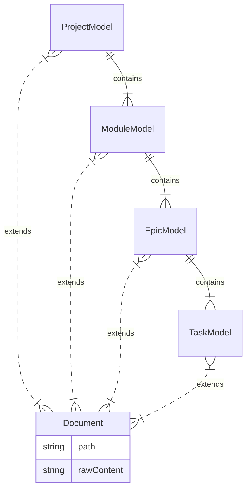

# Task: T2: Data Model Definition

<!-- This document provides the detailed implementation requirements for a single, focused unit of work. -->

---

## ✅ 1 Meta & Governance

### ✅ 1.2 Status

<!-- This section is auto-populated and updated by the developer as the task progresses. -->

- **Current State:** ✅ Complete
- **Priority:** 🟥 High
- **Progress:** 100%
- **Assignee**: @livelifelively
- **Planning Estimate:** 1
- **Est. Variance (pts):** 0
- **Created:** 2025-07-17 02:00
- **Implementation Started:** 2025-07-17 16:30
- **Completed:** 2025-07-17 16:35
- **Last Updated:** 2025-07-17 16:35

### ✅ 1.3 Priority Drivers

<!-- List the stable Driver IDs that justify this task's priority. These are inherited from the parent Epic unless overridden. -->

- [TEC-Dev_Productivity_Blocker](/docs/documentation-driven-development.md#tec-dev_productivity_blocker)

---

## ✅ 2 Business & Scope

### ✅ 2.1 Overview

<!-- Provide a concise, bulleted list outlining what this task delivers and why it matters. -->

- **Core Function**: Defines and implements the core TypeScript interfaces for the in-memory project data model.
- **Key Capability**: Creates the foundational data structures (`ProjectModel`, `ModuleModel`, `EpicModel`, `TaskModel`) that the rest of the parser will use to build the in-memory representation of the documentation.
- **Business Value**: Establishes a clear, typed contract for the project's data structure, ensuring consistency and enabling type-safe development for all subsequent logic.

### ✅ 2.4 Acceptance Criteria

<!-- A verifiable, tabular list of conditions that this task must satisfy to be considered complete. -->

| ID   | Criterion                                                                                                                                  | Test Reference    |
| ---- | ------------------------------------------------------------------------------------------------------------------------------------------ | ----------------- |
| AC-1 | A file `src/modules/analyzer/models.ts` is created containing all the required interfaces.                                                 | N/A (Code Review) |
| AC-2 | The file exports a `Document` base interface containing `path` and `rawContent` properties.                                                | N/A (Code Review) |
| AC-3 | The file exports `ProjectModel`, `ModuleModel`, `EpicModel`, and `TaskModel` interfaces.                                                   | N/A (Code Review) |
| AC-4 | Each model interface extends the `Document` interface and includes a property for its direct children (e.g., `modules` in `ProjectModel`). | N/A (Code Review) |

---

## ❓ 3 Planning & Decomposition

### ✅ 3.3 Dependencies

<!-- List any internal or external dependencies that could block the progress of this task. -->

This task has no dependencies.

---

## ✅ 4 High-Level Design

### ❓ 4.1 Current Architecture

None (Greenfield).

### ✅ 4.2 Target Architecture

This task involves creating a single file with TypeScript interface definitions.

#### ✅ 4.2.1 Data Models

<!-- "To-be" data structures (ER diagrams). -->

#### ✅ 4.2.2 Components

This task creates type definitions, not runtime components.

---

## ✅ 5 Maintenance and Monitoring

This task creates type definitions and has no runtime maintenance or monitoring implications.

---

## ✅ 6 Implementation Guidance

### ✅ 6.1 Implementation Plan

<!-- A direct, "one-shot" overview of the technical approach for this work item. -->

Create a new file, `src/modules/analyzer/models.ts`, and define the required TypeScript interfaces for the project's in-memory data model.

### ✅ 6.2 Implementation Log / Steps

<!-- A detailed, step-by-step log of the implementation process for this task. -->

1.  [x] Create the file `src/modules/analyzer/models.ts`.
2.  [x] Define and export a base `Document` interface with `path: string` and `rawContent: string`.
3.  [x] Define and export the `TaskModel` interface, extending `Document`.
4.  [x] Define and export the `EpicModel` interface, extending `Document` and including `tasks: TaskModel[]`.
5.  [x] Define and export the `ModuleModel` interface, extending `Document` and including `epics: EpicModel[]`.
6.  [x] Define and export the `ProjectModel` interface, extending `Document` and including `modules: ModuleModel[]`.

---

## ✅ 7 Quality & Operations

### ✅ 7.1 Testing Strategy / Requirements

<!-- The approach to testing and specific testing requirements for this task. -->

This task produces only TypeScript type definitions, which do not have a runtime component to test directly. Quality will be ensured through:

1.  **Code Review**: A peer will review the created interfaces for correctness and adherence to the plan.
2.  **Consuming Task Tests**: The unit and integration tests for the `Content Parser` (Task T3) will implicitly validate these types by attempting to build and use them. If the types are incorrect, the `Content Parser` tests will fail.

### ✅ 7.5 Local Test Commands

<!-- CLI commands to run tests locally. -->

N/A. This task does not produce testable code.

---

## ❓ 8 Reference

N/A
