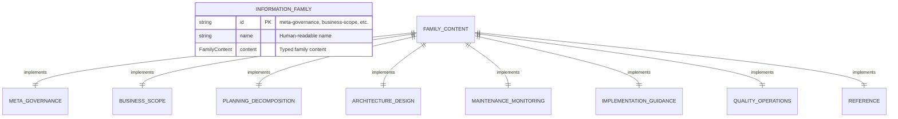

# Task: m2-e1-t1-core-typescript-types

<!-- Create TypeScript interfaces for the 8 information families -->

---

## ✅ 1 Meta & Governance

### ✅ 1.2 Status

- **Current State:** ✅ Complete
- **Priority:** 🟥 High
- **Progress:** 100%
- **Assignee**: @[username]
- **Planning Estimate:** 5
- **Est. Variance (pts):** 0
- **Created:** 2025-07-17 22:30
- **Implementation Started:** 2025-07-17 22:30
- **Completed:** 2025-07-17 22:30
- **Last Updated:** 2025-07-17 22:30

### ✅ 1.3 Priority Drivers

- [TEC-Dev_Productivity_Enhancement](/docs/documentation-driven-development.md#tec-dev_productivity_enhancement)

---

## ✅ 2 Business & Scope

### ✅ 2.1 Overview

- **Core Function**: Defines TypeScript interfaces that represent the 8 information families from the existing `documentation-schema.md` specification.
- **Key Capability**: Provides strongly-typed data structures for Meta & Governance, Business & Scope, Planning & Decomposition, Architecture & Design, Maintenance & Monitoring, Implementation Guidance, Quality & Operations, and Reference families.
- **Business Value**: Enables type-safe development of all downstream DDD tooling by providing the foundational type system.

### ✅ 2.4 Acceptance Criteria

| ID   | Criterion                                                                | Test Reference      |
| ---- | ------------------------------------------------------------------------ | ------------------- |
| AC-1 | All 8 information families represented as TypeScript interfaces          | `families.test.ts`  |
| AC-2 | Each family interface includes all sections from documentation-schema.md | `coverage.test.ts`  |
| AC-3 | Interfaces support optional/required distinction per hierarchy level     | `hierarchy.test.ts` |
| AC-4 | Types compile without errors using TypeScript 4.9+                       | `compile.test.ts`   |
| AC-5 | Enum types defined for status keys, priority levels, and other constants | `enums.test.ts`     |

---

## ✅ 3 Planning & Decomposition

### ✅ 3.3 Dependencies

| ID  | Dependency On                  | Type     | Status | Notes                                      |
| --- | ------------------------------ | -------- | ------ | ------------------------------------------ |
| D-1 | `docs/documentation-schema.md` | Internal | ✅     | Source specification for type definitions. |
| D-2 | TypeScript Compiler ≥ 4.9      | External | ✅     | Required for advanced type features.       |

---

## ✅ 4 High-Level Design

### ✅ 4.1 Current Architecture

This is a new task; no existing implementation.

### ✅ 4.2 Target Architecture

#### ✅ 4.2.1 Data Models



#### ✅ 4.2.2 Components


#### ✅ 4.2.6 Exposed API

| API Surface                 | Target Users    | Purpose                                        | Key Options/Exports                            |
| --------------------------- | --------------- | ---------------------------------------------- | ---------------------------------------------- |
| **Core Family Interfaces**  | Tool Developers | Base types for all information family content  | `InformationFamily`, `FamilyContent`           |
| **Specific Family Types**   | Parsers         | Detailed interfaces for each of the 8 families | `MetaGovernance`, `BusinessScope`, etc.        |
| **Utility Types and Enums** | Validators      | Common types used across multiple families     | `StatusKey`, `PriorityLevel`, `HierarchyLevel` |

---

## ✅ 5 Maintenance and Monitoring

### ✅ 5.1 Current Maintenance and Monitoring

This is a new task; no existing maintenance and monitoring infrastructure.

### ✅ 5.2 Target Maintenance and Monitoring

#### ✅ 5.2.1 Error Handling

| Error Type                 | Trigger                                      | Action                       | User Feedback                                             |
| :------------------------- | :------------------------------------------- | :--------------------------- | :-------------------------------------------------------- |
| **TypeScript Compilation** | Invalid interface definitions or syntax.     | Fail build with exit code 1. | `ERROR: TypeScript compilation failed: [error_details]`   |
| **Missing Family Content** | Interface doesn't cover all schema sections. | Fail validation.             | `ERROR: Missing coverage for family [family_name]`        |
| **Type Mismatch**          | Enum values don't match schema constants.    | Fail build with exit code 1. | `ERROR: Type mismatch in [enum_name]: [mismatch_details]` |

---

## ✅ 6 Implementation Guidance

### ✅ 6.1 Implementation Plan

This task follows a single-phase implementation approach focused on translating the human-readable schema to TypeScript interfaces.

**Technical Approach**: Create a comprehensive type system that mirrors the structure defined in `documentation-schema.md`, ensuring each of the 8 information families is represented as a TypeScript interface with proper typing for all sub-sections and their applicability across the 4-tier hierarchy.

### ✅ 6.2 Implementation Log / Steps

1. [ ] Analyze `documentation-schema.md` Family Index table for all 8 families
2. [ ] Create base `InformationFamily` interface with common properties
3. [ ] Define `MetaGovernance` interface covering status and priority drivers
4. [ ] Define `BusinessScope` interface covering overview, context, criteria
5. [ ] Define `PlanningDecomposition` interface covering roadmap, backlog, dependencies
6. [ ] Define `ArchitectureDesign` interface covering models, components, integrations
7. [ ] Define `MaintenanceMonitoring` interface covering error handling, logging
8. [ ] Define `ImplementationGuidance` interface covering plans and steps
9. [ ] Define `QualityOperations` interface covering testing, configuration, alerting
10. [ ] Define `Reference` interface covering appendices and external links
11. [ ] Create utility enums for `StatusKey`, `PriorityLevel`, `HierarchyLevel`
12. [ ] Add JSDoc comments with examples for all interfaces
13. [ ] Verify TypeScript compilation with strict mode enabled

---

## ✅ 7 Quality & Operations

### ✅ 7.1 Testing Strategy / Requirements

| Scenario                                         | Test Type | Tools                      |
| ------------------------------------------------ | --------- | -------------------------- |
| All TypeScript interfaces compile without errors | Unit      | TypeScript compiler + Jest |
| Each family interface covers required sections   | Unit      | Jest + schema validation   |
| Enum values match documentation constants        | Unit      | Jest + string comparison   |
| Interface properties support optional/required   | Unit      | TypeScript type checking   |

### ✅ 7.2 Configuration

| Setting Name        | Source          | Override Method         | Notes                                           |
| ------------------- | --------------- | ----------------------- | ----------------------------------------------- |
| `typescript-strict` | `tsconfig.json` | `--strict` CLI argument | Enable strict type checking during compilation. |
| `output-dir`        | CLI argument    | `--output <path>`       | Directory for generated TypeScript files.       |

### ✅ 7.5 Local Test Commands

```bash
# Compile TypeScript types
npx tsc --noEmit --strict src/types/schema-families.ts

# Run type tests
npm test -- --testPathPattern="families"

# Lint TypeScript files
npm run lint:types

# Validate interface coverage
npm run validate:coverage
```

---

## ❓ 8 Reference

- **Source Schema**: [docs/documentation-schema.md](../../../documentation-schema.md)
- **TypeScript Handbook**: [Interfaces](https://www.typescriptlang.org/docs/handbook/interfaces.html)
- **TypeScript Advanced Types**: [TypeScript Docs](https://www.typescriptlang.org/docs/handbook/advanced-types.html)
