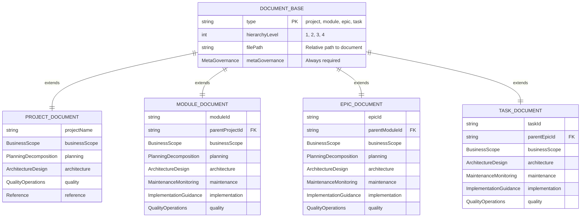
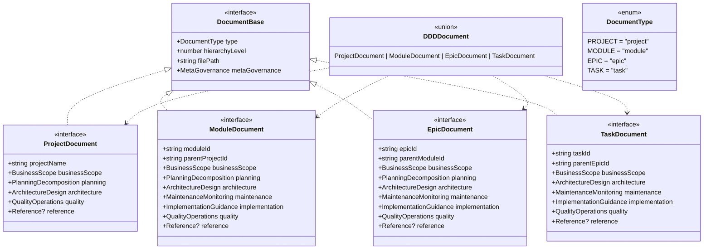

# Task: m2-e1-t2-document-hierarchy-types

<!-- Define Project, Module, Epic, and Task document type structures -->

---

## ✅ 1 Meta & Governance

### ✅ 1.2 Status

- **Current State:** 💡 Not Started
- **Priority:** 🟥 High
- **Progress:** 0%
- **Assignee**: @[username]
- **Planning Estimate:** 8
- **Est. Variance (pts):** 0
- **Created:** 2025-07-17 22:30
- **Implementation Started:** [YYYY-MM-DD HH:MM]
- **Completed:** [YYYY-MM-DD HH:MM]
- **Last Updated:** 2025-07-17 22:30

### ✅ 1.3 Priority Drivers

- [TEC-Dev_Productivity_Enhancement](/docs/documentation-driven-development.md#tec-dev_productivity_enhancement)

---

## ✅ 2 Business & Scope

### ✅ 2.1 Overview

- **Core Function**: Defines comprehensive TypeScript interfaces for the 4-tier documentation hierarchy (Project, Module, Epic, Task) based on the depth matrix from `documentation-schema.md`.
- **Key Capability**: Provides complete type definitions that capture which information families are required, optional, or omitted at each hierarchy level, enabling precise validation and code generation.
- **Business Value**: Enables automated tools to understand and enforce the progressive narrowing of information from Project level down to Task level, ensuring documentation consistency across all DDD projects.

### ✅ 2.4 Acceptance Criteria

| ID   | Criterion                                                        | Test Reference           |
| ---- | ---------------------------------------------------------------- | ------------------------ |
| AC-1 | Project document interface includes all required families        | `project-doc.test.ts`    |
| AC-2 | Module document interface correctly inherits and extends Project | `module-doc.test.ts`     |
| AC-3 | Epic document interface supports all applicable families         | `epic-doc.test.ts`       |
| AC-4 | Task document interface includes detailed implementation fields  | `task-doc.test.ts`       |
| AC-5 | Union type covers all 4 document types for generic processing    | `document-union.test.ts` |
| AC-6 | Depth matrix requirements correctly enforced in TypeScript       | `depth-matrix.test.ts`   |

---

## ✅ 3 Planning & Decomposition

### ✅ 3.3 Dependencies

| ID  | Dependency On                               | Type     | Status | Notes                                       |
| --- | ------------------------------------------- | -------- | ------ | ------------------------------------------- |
| D-1 | Task T1: Core TypeScript Types              | Internal | ❌     | Requires information family interfaces.     |
| D-2 | `docs/documentation-schema.md` depth matrix | Internal | ✅     | Source for hierarchy-specific requirements. |

---

## ✅ 4 High-Level Design

### ✅ 4.1 Current Architecture

This is a new task; no existing implementation.

### ✅ 4.2 Target Architecture

#### ✅ 4.2.1 Data Models



#### ✅ 4.2.2 Components



#### ✅ 4.2.6 Exposed API

| API Surface                  | Target Users       | Purpose                                           | Key Options/Exports                               |
| ---------------------------- | ------------------ | ------------------------------------------------- | ------------------------------------------------- |
| **Document Type Interfaces** | Parsers            | Strongly-typed interfaces for each document level | `ProjectDocument`, `ModuleDocument`, etc.         |
| **Document Union Type**      | Generic Tools      | Single type for processing any DDD document       | `DDDDocument`                                     |
| **Document Type Guards**     | Runtime Validation | Type-safe checking of document types              | `isProjectDocument()`, `isModuleDocument()`, etc. |
| **Hierarchy Utilities**      | Navigation Tools   | Helper functions for document relationships       | `getParentDocument()`, `getChildDocuments()`      |

---

## ✅ 5 Maintenance and Monitoring

### ✅ 5.1 Current Maintenance and Monitoring

This is a new task; no existing maintenance and monitoring infrastructure.

### ✅ 5.2 Target Maintenance and Monitoring

#### ✅ 5.2.1 Error Handling

| Error Type                   | Trigger                                       | Action                       | User Feedback                                                |
| :--------------------------- | :-------------------------------------------- | :--------------------------- | :----------------------------------------------------------- |
| **Missing Required Family**  | Document missing required information family. | Fail validation.             | `ERROR: Document [path] missing required family [family_id]` |
| **Hierarchy Level Mismatch** | Document type doesn't match hierarchy level.  | Fail validation.             | `ERROR: Document type [type] invalid for level [level]`      |
| **Parent Reference Invalid** | Parent document ID doesn't exist.             | Fail validation.             | `ERROR: Parent [parent_id] not found for [document_id]`      |
| **Interface Compilation**    | TypeScript interface compilation errors.      | Fail build with exit code 1. | `ERROR: Interface compilation failed: [error_details]`       |

---

## ✅ 6 Implementation Guidance

### ✅ 6.1 Implementation Plan

This task extends the foundational family types from T1 to create complete document type definitions that enforce the depth matrix requirements.

**Technical Approach**: Build interfaces that capture the progressive narrowing pattern where information flows from Project → Module → Epic → Task, with each level inheriting context from its parent while adding level-specific details. Use TypeScript's conditional types and utility types to enforce the depth matrix rules at compile time.

### ✅ 6.2 Implementation Log / Steps

1. [ ] Create `DocumentBase` interface with common properties
2. [ ] Define `ProjectDocument` interface with Project-level family requirements
3. [ ] Define `ModuleDocument` interface inheriting Project context + Module specifics
4. [ ] Define `EpicDocument` interface inheriting Module context + Epic specifics
5. [ ] Define `TaskDocument` interface inheriting Epic context + Task specifics
6. [ ] Create `DDDDocument` union type for generic document processing
7. [ ] Implement type guard functions for runtime document type checking
8. [ ] Add utility types for parent-child relationship validation
9. [ ] Create hierarchy validation functions
10. [ ] Add JSDoc documentation with examples for each document type
11. [ ] Implement depth matrix enforcement using conditional types
12. [ ] Add unit tests for all document interfaces
13. [ ] Verify TypeScript compilation and type safety

---

## ✅ 7 Quality & Operations

### ✅ 7.1 Testing Strategy / Requirements

| Scenario                                                  | Test Type | Tools                          |
| --------------------------------------------------------- | --------- | ------------------------------ |
| All document interfaces compile without TypeScript errors | Unit      | TypeScript compiler + Jest     |
| Required families are enforced at each hierarchy level    | Unit      | Jest + type assertions         |
| Optional families are correctly marked as optional        | Unit      | TypeScript type checking       |
| Document union type accepts all valid document types      | Unit      | Jest + type guards             |
| Parent-child relationships are correctly typed            | Unit      | Jest + relationship validation |
| Depth matrix rules are enforced at compile time           | Unit      | TypeScript strict mode         |

### ✅ 7.2 Configuration

| Setting Name         | Source       | Override Method      | Notes                                           |
| -------------------- | ------------ | -------------------- | ----------------------------------------------- | -------------------------------- |
| `strict-hierarchy`   | CLI argument | `--strict-hierarchy` | Enable strict validation of document hierarchy. |
| `allow-partial-docs` | CLI argument | `--allow-partial`    | Allow documents with missing optional families. |
| `validation-level`   | CLI argument | `--validation error  | warn`                                           | Set validation strictness level. |

### ✅ 7.5 Local Test Commands

```bash
# Compile document type interfaces
npx tsc --noEmit --strict src/types/document-hierarchy.ts

# Run document hierarchy tests
npm test -- --testPathPattern="document-hierarchy"

# Test type guards and utilities
npm test -- --testPathPattern="document-utils"

# Validate depth matrix enforcement
npm run test:depth-matrix

# Test all document interfaces
npm run test:document-types
```

---

## ❓ 8 Reference

- **Source Schema**: [docs/documentation-schema.md](../../../documentation-schema.md)
- **Depth Matrix Definition**: [Depth Matrix Tables](../../../documentation-schema.md#depth-matrix)
- **TypeScript Conditional Types**: [TS Docs](https://www.typescriptlang.org/docs/handbook/2/conditional-types.html)
- **TypeScript Utility Types**: [TS Docs](https://www.typescriptlang.org/docs/handbook/utility-types.html)
