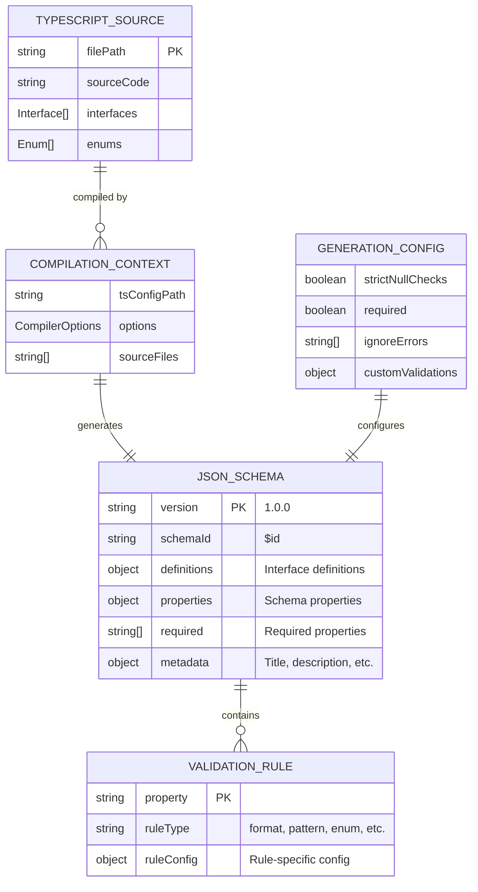
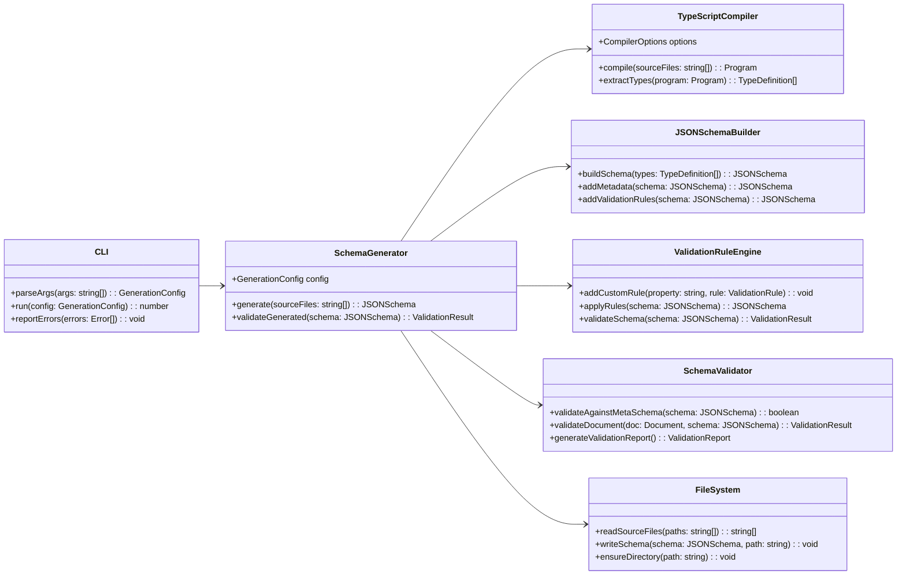
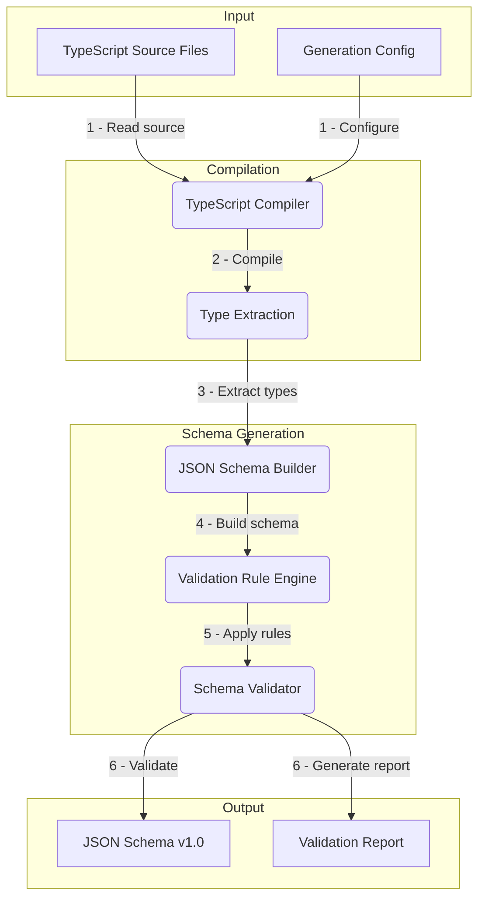

# Task: m2-e1-t3-json-schema-generation

<!-- Create tooling to generate JSON schema from TypeScript types -->

---

## ✅ 1 Meta & Governance

### ✅ 1.2 Status

- **Current State:** 💡 Not Started
- **Priority:** 🟧 Medium
- **Progress:** 0%
- **Assignee**: @[username]
- **Planning Estimate:** 10
- **Est. Variance (pts):** 0
- **Created:** 2025-07-17 22:30
- **Implementation Started:** [YYYY-MM-DD HH:MM]
- **Completed:** [YYYY-MM-DD HH:MM]
- **Last Updated:** 2025-07-17 22:30

### ✅ 1.3 Priority Drivers

- [TEC-Dev_Productivity_Enhancement](/docs/documentation-driven-development.md#tec-dev_productivity_enhancement)

---

## ✅ 2 Business & Scope

### ✅ 2.1 Overview

- **Core Function**: Builds a comprehensive pipeline to automatically generate JSON schema from the TypeScript type definitions created in T1 and T2, enabling machine-readable validation of DDD documents.
- **Key Capability**: Transforms TypeScript interfaces into standards-compliant JSON Schema Draft 7 with proper metadata, validation rules, and documentation embedded for each field.
- **Business Value**: Enables automated validation of DDD documents across all tools and CI/CD pipelines, ensuring consistency and eliminating manual schema maintenance.

### ✅ 2.4 Acceptance Criteria

| ID   | Criterion                                                              | Test Reference              |
| ---- | ---------------------------------------------------------------------- | --------------------------- |
| AC-1 | Generated JSON schema validates against JSON Schema meta-schema        | `meta-validation.test.ts`   |
| AC-2 | All TypeScript interfaces convert to valid JSON schema objects         | `interface-conversion.test` |
| AC-3 | Schema includes proper validation rules for all DDD constraints        | `validation-rules.test.ts`  |
| AC-4 | Generated schema validates existing project documentation successfully | `real-docs-validation.test` |
| AC-5 | Schema generation pipeline is deterministic and reproducible           | `deterministic.test.ts`     |
| AC-6 | CLI tool generates schema with proper exit codes and error reporting   | `cli-generation.test.ts`    |

---

## ✅ 3 Planning & Decomposition

### ✅ 3.3 Dependencies

| ID  | Dependency On                     | Type     | Status | Notes                                            |
| --- | --------------------------------- | -------- | ------ | ------------------------------------------------ |
| D-1 | Task T1: Core TypeScript Types    | Internal | ❌     | Requires information family interfaces.          |
| D-2 | Task T2: Document Hierarchy Types | Internal | ❌     | Requires complete document type definitions.     |
| D-3 | `typescript-json-schema` package  | External | ❓     | Tool for generating JSON schema from TypeScript. |
| D-4 | JSON Schema Draft 7 specification | External | ✅     | Target standard for generated schemas.           |

---

## ✅ 4 High-Level Design

### ✅ 4.1 Current Architecture

This is a new task; no existing implementation.

### ✅ 4.2 Target Architecture

#### ✅ 4.2.1 Data Models



#### ✅ 4.2.2 Components



#### ✅ 4.2.3 Data Flow



#### ✅ 4.2.6 Exposed API

| API Surface               | Target Users  | Purpose                                   | Key Options/Exports                             |
| ------------------------- | ------------- | ----------------------------------------- | ----------------------------------------------- |
| **Schema Generator API**  | Build Tools   | Programmatic schema generation            | `generateSchema()`, `validateSchema()`          |
| **CLI Interface**         | Developers    | Command-line schema generation            | `--input`, `--output`, `--config`, `--validate` |
| **Generated JSON Schema** | Validators    | Machine-readable validation schema        | `ddd-schema-v1.json`, validation rules          |
| **Validation Utilities**  | Testing Tools | Schema validation and reporting functions | `validateDocument()`, `generateReport()`        |

---

## ✅ 5 Maintenance and Monitoring

### ✅ 5.1 Current Maintenance and Monitoring

This is a new task; no existing maintenance and monitoring infrastructure.

### ✅ 5.2 Target Maintenance and Monitoring

#### ✅ 5.2.1 Error Handling

| Error Type                 | Trigger                                          | Action                 | User Feedback                                                |
| :------------------------- | :----------------------------------------------- | :--------------------- | :----------------------------------------------------------- |
| **TypeScript Compilation** | Source files contain syntax or type errors.      | Fail generation.       | `ERROR: TypeScript compilation failed: [compilation_errors]` |
| **JSON Schema Generation** | Unable to convert TypeScript types to schema.    | Fail generation.       | `ERROR: Schema generation failed for type [type_name]`       |
| **Meta-Schema Validation** | Generated schema doesn't conform to JSON Schema. | Fail generation.       | `ERROR: Generated schema invalid: [validation_errors]`       |
| **File System Error**      | Cannot read source files or write output.        | Fail with exit code 1. | `ERROR: File system error: [file_operation_error]`           |
| **Configuration Error**    | Invalid generation configuration provided.       | Fail with exit code 1. | `ERROR: Invalid configuration: [config_validation_errors]`   |

#### ✅ 5.2.2 Logging & Monitoring

- **Generation Metrics**: Track schema generation time, file sizes, and validation success rates.
- **Build Logs**: Structured JSON logs for all generation steps with timing and error details.
- **Validation Tracking**: Monitor which document types fail validation most frequently to identify schema gaps.

---

## ✅ 6 Implementation Guidance

### ✅ 6.1 Implementation Plan

This task builds the core infrastructure for converting TypeScript types to JSON schema, enabling all downstream validation and tooling.

**Technical Approach**: Use `typescript-json-schema` as the foundation but extend it with DDD-specific validation rules, custom metadata injection, and robust error handling. Create a CLI wrapper that can be integrated into build pipelines and CI/CD workflows.

### ✅ 6.2 Implementation Log / Steps

1. [ ] Install and configure `typescript-json-schema` package
2. [ ] Create `SchemaGenerator` class with TypeScript compilation support
3. [ ] Implement `JSONSchemaBuilder` for core schema construction
4. [ ] Add `ValidationRuleEngine` for DDD-specific validation rules
5. [ ] Create `SchemaValidator` for meta-schema validation
6. [ ] Build CLI interface with argument parsing and error handling
7. [ ] Add file system utilities for reading/writing schema files
8. [ ] Implement custom validation rules for DDD constraints
9. [ ] Add metadata injection (titles, descriptions, examples)
10. [ ] Create deterministic schema generation (consistent output)
11. [ ] Add comprehensive error handling and reporting
12. [ ] Write unit tests for all components
13. [ ] Test against existing project documentation
14. [ ] Create integration tests for CLI tool

---

## ✅ 7 Quality & Operations

### ✅ 7.1 Testing Strategy / Requirements

| Scenario                                                 | Test Type   | Tools                           |
| -------------------------------------------------------- | ----------- | ------------------------------- |
| TypeScript interfaces convert to valid JSON schema       | Unit        | Jest + typescript-json-schema   |
| Generated schema validates against JSON Schema meta-spec | Unit        | Jest + ajv validator            |
| CLI tool generates schema with correct exit codes        | Integration | Jest + child_process            |
| Schema validates real DDD documents successfully         | Integration | Generated schema + fixture docs |
| Generation pipeline is deterministic                     | Unit        | Jest + schema comparison        |
| Custom validation rules are correctly applied            | Unit        | Jest + rule validation          |

### ✅ 7.2 Configuration

| Setting Name        | Source       | Override Method                | Notes                                                 |
| ------------------- | ------------ | ------------------------------ | ----------------------------------------------------- |
| `input-files`       | CLI argument | `--input <glob>`               | TypeScript source files to process.                   |
| `output-file`       | CLI argument | `--output <path>`              | Path for generated JSON schema file.                  |
| `tsconfig-path`     | CLI argument | `--tsconfig <path>`            | TypeScript configuration file path.                   |
| `strict-validation` | CLI argument | `--strict` / `--no-strict`     | Enable strict validation mode.                        |
| `include-metadata`  | CLI argument | `--metadata` / `--no-metadata` | Include titles, descriptions, and examples in schema. |

### ✅ 7.5 Local Test Commands

```bash
# Generate JSON schema from TypeScript
npm run generate:schema -- --input "src/types/**/*.ts" --output "schema/ddd-v1.json"

# Validate generated schema
npm run validate:schema -- schema/ddd-v1.json

# Test schema against real docs
npm run test:schema -- --schema schema/ddd-v1.json --docs "docs/**/*.md"

# Run schema generation tests
npm test -- --testPathPattern="schema-generation"

# Test CLI tool
npm run test:cli-generation
```

---

## ❓ 8 Reference

- **typescript-json-schema**: [GitHub Repository](https://github.com/YousefED/typescript-json-schema)
- **JSON Schema Draft 7**: [Specification](https://json-schema.org/draft-07/schema#)
- **AJV Validator**: [Documentation](https://ajv.js.org/)
- **TypeScript Compiler API**: [TS Docs](https://github.com/Microsoft/TypeScript/wiki/Using-the-Compiler-API)
