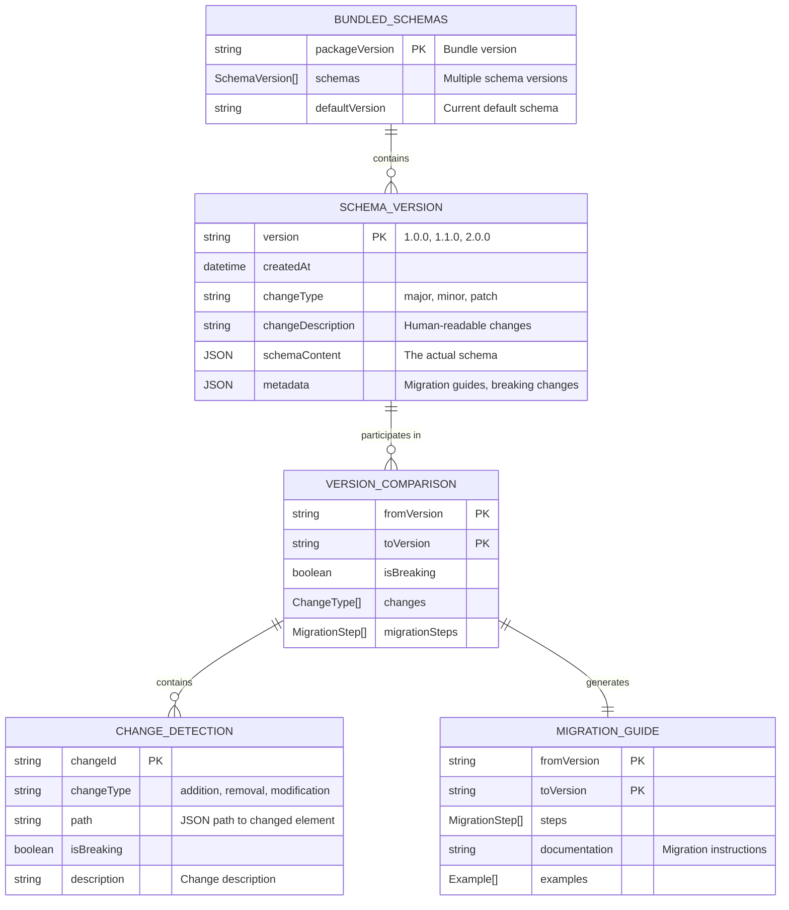
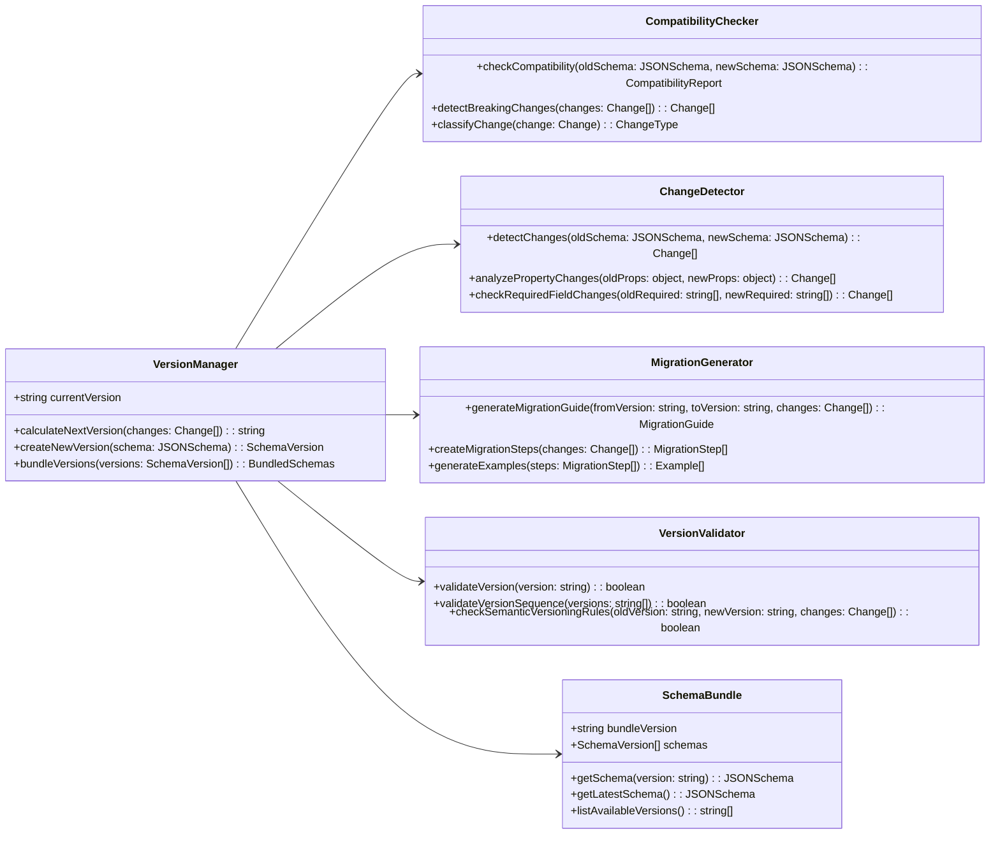
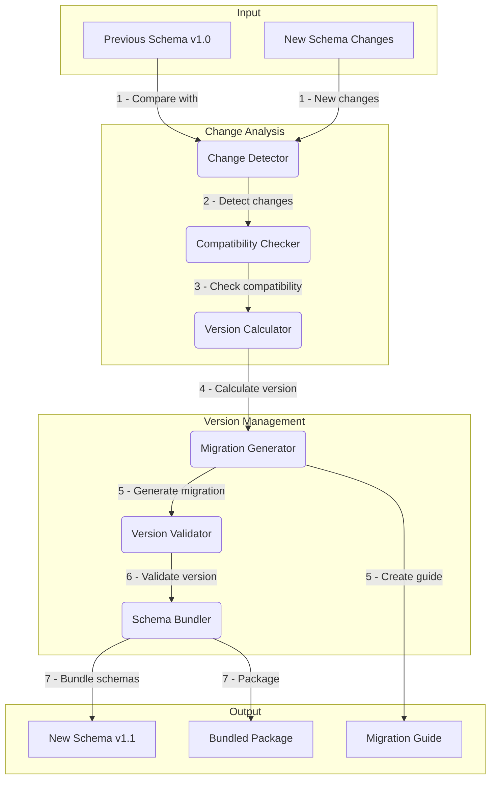

# Task: m2-e1-t4-schema-versioning

<!-- Add semantic versioning support for schema evolution -->

---

## ✅ 1 Meta & Governance

### ✅ 1.2 Status

- **Current State:** 💡 Not Started
- **Priority:** 🟧 Medium
- **Progress:** 0%
- **Assignee**: @[username]
- **Planning Estimate:** 6
- **Est. Variance (pts):** 0
- **Created:** 2025-07-17 22:30
- **Implementation Started:** [YYYY-MM-DD HH:MM]
- **Completed:** [YYYY-MM-DD HH:MM]
- **Last Updated:** 2025-07-17 22:30

### ✅ 1.3 Priority Drivers

- [TEC-Dev_Productivity_Enhancement](/docs/documentation-driven-development.md#tec-dev_productivity_enhancement)

---

## ✅ 2 Business & Scope

### ✅ 2.1 Overview

- **Core Function**: Implements semantic versioning strategy for DDD schema evolution, enabling controlled schema changes while maintaining backward compatibility and providing clear migration paths.
- **Key Capability**: Provides automated version management, compatibility checking, and schema migration support to ensure smooth evolution of the DDD specification without breaking existing projects.
- **Business Value**: Enables continuous improvement of DDD methodology while protecting existing investments in documentation and tooling, reducing upgrade friction and ensuring predictable schema evolution.

### ✅ 2.4 Acceptance Criteria

| ID   | Criterion                                                             | Test Reference              |
| ---- | --------------------------------------------------------------------- | --------------------------- |
| AC-1 | Version numbers follow semantic versioning (MAJOR.MINOR.PATCH) rules  | `semver-compliance.test.ts` |
| AC-2 | Breaking changes trigger MAJOR version bump automatically             | `breaking-changes.test.ts`  |
| AC-3 | Additive changes trigger MINOR version bump automatically             | `additive-changes.test.ts`  |
| AC-4 | Schema compatibility checker detects breaking vs. safe changes        | `compatibility.test.ts`     |
| AC-5 | Multiple schema versions can be bundled and distributed together      | `multi-version.test.ts`     |
| AC-6 | Version metadata includes change documentation and migration guidance | `metadata.test.ts`          |

---

## ✅ 3 Planning & Decomposition

### ✅ 3.3 Dependencies

| ID  | Dependency On                            | Type     | Status | Notes                                     |
| --- | ---------------------------------------- | -------- | ------ | ----------------------------------------- |
| D-1 | Task T3: JSON Schema Generation Pipeline | Internal | ❌     | Requires generated schema for versioning. |
| D-2 | `semver` package                         | External | ✅     | Standard semantic versioning utilities.   |
| D-3 | Semantic Versioning specification v2.0.0 | External | ✅     | Versioning rules and guidelines.          |

---

## ✅ 4 High-Level Design

### ✅ 4.1 Current Architecture

This is a new task; no existing implementation.

### ✅ 4.2 Target Architecture

#### ✅ 4.2.1 Data Models



#### ✅ 4.2.2 Components



#### ✅ 4.2.3 Data Flow



#### ✅ 4.2.6 Exposed API

| API Surface                   | Target Users    | Purpose                                       | Key Options/Exports                        |
| ----------------------------- | --------------- | --------------------------------------------- | ------------------------------------------ |
| **Version Management API**    | Build Tools     | Programmatic version calculation and bundling | `calculateVersion()`, `bundleSchemas()`    |
| **Compatibility Checker API** | CI/CD Tools     | Automated compatibility validation            | `checkCompatibility()`, `detectBreaking()` |
| **Migration Generator API**   | Migration Tools | Automated migration guide generation          | `generateMigration()`, `createSteps()`     |
| **Bundled Schema Package**    | Runtime Tools   | Multi-version schema access                   | `getSchema(version)`, `listVersions()`     |

---

## ✅ 5 Maintenance and Monitoring

### ✅ 5.1 Current Maintenance and Monitoring

This is a new task; no existing maintenance and monitoring infrastructure.

### ✅ 5.2 Target Maintenance and Monitoring

#### ✅ 5.2.1 Error Handling

| Error Type                       | Trigger                                           | Action                    | User Feedback                                                 |
| :------------------------------- | :------------------------------------------------ | :------------------------ | :------------------------------------------------------------ |
| **Invalid Version Number**       | Version doesn't follow semver format.             | Fail version creation.    | `ERROR: Invalid version format [version]: must follow semver` |
| **Version Sequence Violation**   | New version doesn't properly increment previous.  | Fail version creation.    | `ERROR: Version sequence violation: [old] -> [new]`           |
| **Breaking Change Detection**    | Breaking change found without MAJOR version bump. | Fail version creation.    | `ERROR: Breaking changes require MAJOR version bump`          |
| **Schema Compatibility Error**   | Schemas cannot be compared due to format issues.  | Fail compatibility check. | `ERROR: Schema compatibility check failed: [details]`         |
| **Migration Generation Failure** | Cannot generate migration guide for changes.      | Fail version creation.    | `ERROR: Migration generation failed: [error_details]`         |

#### ✅ 5.2.2 Logging & Monitoring

- **Version Tracking**: Log all version changes with justification and change summary.
- **Compatibility Metrics**: Track success rate of compatibility checks and common breaking change patterns.
- **Migration Usage**: Monitor which migration guides are accessed most frequently to identify upgrade patterns.

---

## ✅ 6 Implementation Guidance

### ✅ 6.1 Implementation Plan

This task builds the versioning infrastructure that enables controlled evolution of the DDD schema while maintaining backward compatibility.

**Technical Approach**: Implement automated change detection using JSON schema diffing, classify changes as breaking/non-breaking using semantic versioning rules, and generate appropriate version numbers and migration guides. Create a bundling system that packages multiple schema versions for backward compatibility.

### ✅ 6.2 Implementation Log / Steps

1. [ ] Install and configure `semver` package for version utilities
2. [ ] Create `VersionManager` class with semantic versioning logic
3. [ ] Implement `ChangeDetector` for schema diff analysis
4. [ ] Build `CompatibilityChecker` with breaking change rules
5. [ ] Create `MigrationGenerator` for automated migration guides
6. [ ] Implement `VersionValidator` for semver compliance
7. [ ] Build `SchemaBundle` for multi-version packaging
8. [ ] Add change classification rules (property additions, removals, type changes)
9. [ ] Implement automated version calculation based on change types
10. [ ] Create migration guide templates and examples
11. [ ] Add comprehensive validation for version sequences
12. [ ] Write unit tests for all versioning components
13. [ ] Create integration tests with real schema changes
14. [ ] Add CLI support for version management operations

---

## ✅ 7 Quality & Operations

### ✅ 7.1 Testing Strategy / Requirements

| Scenario                                              | Test Type   | Tools                       |
| ----------------------------------------------------- | ----------- | --------------------------- |
| Semantic version calculation follows semver rules     | Unit        | Jest + semver library       |
| Breaking changes are correctly identified             | Unit        | Jest + schema comparison    |
| Migration guides are generated for version changes    | Unit        | Jest + migration templates  |
| Schema bundles contain multiple versions correctly    | Integration | Jest + bundle validation    |
| Version sequence validation prevents invalid versions | Unit        | Jest + version validation   |
| Compatibility checker detects all breaking patterns   | Unit        | Jest + breaking change test |

### ✅ 7.2 Configuration

| Setting Name       | Source       | Override Method               | Notes                                           |
| ------------------ | ------------ | ----------------------------- | ----------------------------------------------- |
| `previous-schema`  | CLI argument | `--previous <path>`           | Path to previous schema version for comparison. |
| `auto-version`     | CLI argument | `--auto-version` / `--manual` | Enable automatic version calculation.           |
| `migration-output` | CLI argument | `--migration-output <path>`   | Path for generated migration guide.             |
| `bundle-versions`  | CLI argument | `--bundle <versions>`         | Versions to include in schema bundle.           |
| `strict-semver`    | CLI argument | `--strict-semver`             | Enable strict semantic versioning validation.   |

### ✅ 7.5 Local Test Commands

```bash
# Calculate next version based on changes
npm run version:calculate -- --previous schema/v1.0.json --current schema/v1.1.json

# Check compatibility between versions
npm run version:compatibility -- --from v1.0.0 --to v1.1.0

# Generate migration guide
npm run version:migration -- --from v1.0.0 --to v1.1.0 --output migration-guide.md

# Bundle multiple schema versions
npm run version:bundle -- --versions "1.0.0,1.1.0,2.0.0" --output schemas-bundle.json

# Run versioning tests
npm test -- --testPathPattern="versioning"
```

---

## ❓ 8 Reference

- **Semantic Versioning Specification**: [semver.org](https://semver.org/)
- **JSON Schema Versioning Best Practices**: [JSON Schema Docs](https://json-schema.org/understanding-json-schema/reference/schema.html)
- **semver npm package**: [Documentation](https://www.npmjs.com/package/semver)
- **Schema Evolution Patterns**: [Schema Evolution Guide](https://json-schema.org/draft/2020-12/json-schema-core.html#rfc.section.8.2.1)
