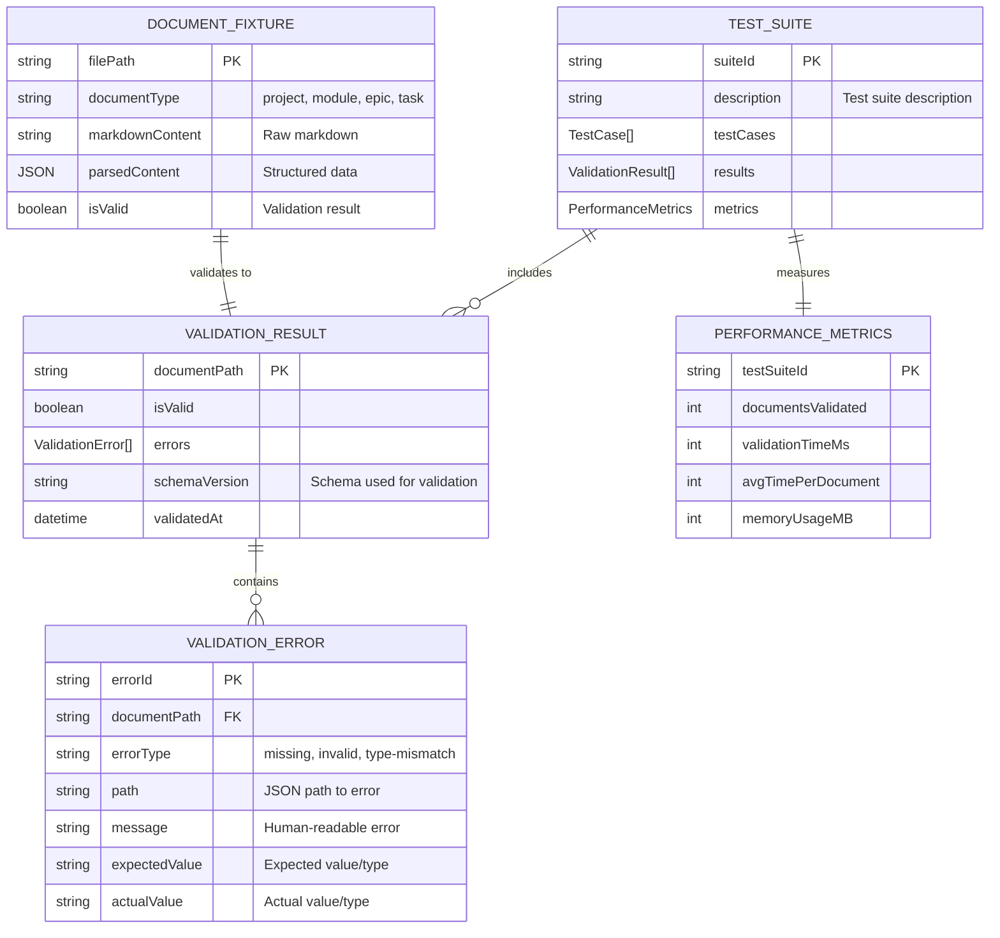
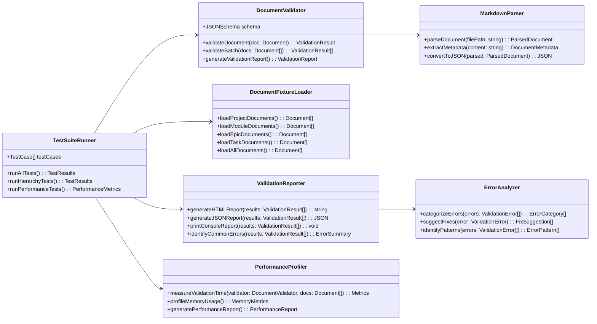
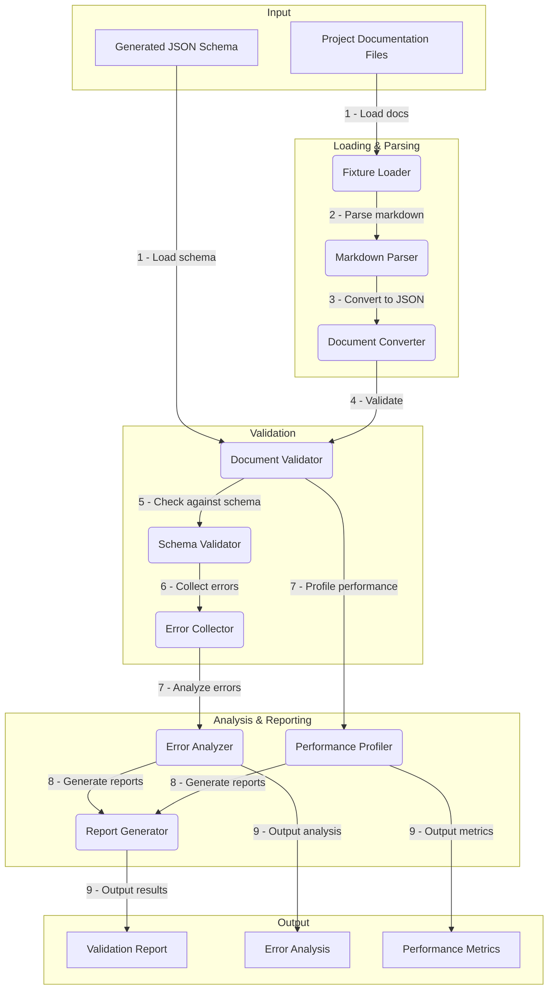

# Task: m2-e1-t5-validation-testing

<!-- Test generated schema against current project documentation -->

---

## ✅ 1 Meta & Governance

### ✅ 1.2 Status

- **Current State:** 💡 Not Started
- **Priority:** 🟨 Low
- **Progress:** 0%
- **Assignee**: @[username]
- **Planning Estimate:** 4
- **Est. Variance (pts):** 0
- **Created:** 2025-07-17 22:30
- **Implementation Started:** [YYYY-MM-DD HH:MM]
- **Completed:** [YYYY-MM-DD HH:MM]
- **Last Updated:** 2025-07-17 22:30

### ✅ 1.3 Priority Drivers

- [TEC-Dev_Productivity_Enhancement](/docs/documentation-driven-development.md#tec-dev_productivity_enhancement)

---

## ✅ 2 Business & Scope

### ✅ 2.1 Overview

- **Core Function**: Validates the generated TypeScript types and JSON schema against real DDD documentation examples from the current project to ensure accuracy and completeness of the schema specification.
- **Key Capability**: Provides comprehensive testing infrastructure that parses existing documentation files, validates them against the generated schema, and identifies gaps or inconsistencies in the type definitions.
- **Business Value**: Ensures the generated schema accurately represents real-world DDD documentation structure, preventing validation failures when the schema is used by downstream tools and maintaining confidence in the schema's correctness.

### ✅ 2.4 Acceptance Criteria

| ID   | Criterion                                                                    | Test Reference              |
| ---- | ---------------------------------------------------------------------------- | --------------------------- |
| AC-1 | All current project documentation validates successfully against schema      | `project-docs.test.ts`      |
| AC-2 | Schema validation provides clear error messages for invalid documents        | `error-messages.test.ts`    |
| AC-3 | Test suite covers all 4 document hierarchy levels (Project/Module/Epic/Task) | `hierarchy-coverage.test`   |
| AC-4 | Validation performance is acceptable for large documentation sets            | `performance.test.ts`       |
| AC-5 | Round-trip validation preserves all document information                     | `round-trip.test.ts`        |
| AC-6 | Schema validation identifies missing required sections correctly             | `required-sections.test.ts` |

---

## ✅ 3 Planning & Decomposition

### ✅ 3.3 Dependencies

| ID  | Dependency On                             | Type     | Status | Notes                                    |
| --- | ----------------------------------------- | -------- | ------ | ---------------------------------------- |
| D-1 | Task T4: Schema Versioning Strategy       | Internal | ❌     | Requires versioned schema for testing.   |
| D-2 | Current project documentation files       | Internal | ✅     | Test data from existing docs/ directory. |
| D-3 | `ajv` JSON Schema validator               | External | ❓     | Standard JSON Schema validation library. |
| D-4 | Markdown parsing library (e.g., `marked`) | External | ❓     | For parsing DDD documentation files.     |

---

## ✅ 4 High-Level Design

### ✅ 4.1 Current Architecture

This is a new task; no existing implementation.

### ✅ 4.2 Target Architecture

#### ✅ 4.2.1 Data Models



#### ✅ 4.2.2 Components



#### ✅ 4.2.3 Data Flow



#### ✅ 4.2.6 Exposed API

| API Surface                 | Target Users    | Purpose                                     | Key Options/Exports                           |
| --------------------------- | --------------- | ------------------------------------------- | --------------------------------------------- |
| **Document Validation API** | CI/CD Tools     | Programmatic validation of DDD documents    | `validateDocument()`, `validateBatch()`       |
| **Test Suite Runner API**   | Testing Tools   | Automated test execution and reporting      | `runTests()`, `generateReport()`              |
| **Error Analysis API**      | Debugging Tools | Detailed error analysis and fix suggestions | `analyzeErrors()`, `suggestFixes()`           |
| **CLI Validation Tool**     | Developers      | Command-line validation of documentation    | `--schema`, `--docs`, `--report`, `--verbose` |

---

## ✅ 5 Maintenance and Monitoring

### ✅ 5.1 Current Maintenance and Monitoring

This is a new task; no existing maintenance and monitoring infrastructure.

### ✅ 5.2 Target Maintenance and Monitoring

#### ✅ 5.2.1 Error Handling

| Error Type                      | Trigger                                         | Action                      | User Feedback                                                   |
| :------------------------------ | :---------------------------------------------- | :-------------------------- | :-------------------------------------------------------------- |
| **Schema Loading Error**        | Cannot load or parse JSON schema file.          | Fail validation.            | `ERROR: Schema loading failed: [schema_path] - [error_details]` |
| **Document Parsing Error**      | Cannot parse markdown document structure.       | Skip document with warning. | `WARN: Document parsing failed: [doc_path] - [parse_error]`     |
| **Validation Runtime Error**    | JSON Schema validator throws unexpected error.  | Fail validation.            | `ERROR: Validation failed: [doc_path] - [runtime_error]`        |
| **File System Error**           | Cannot read documentation files or directories. | Fail test suite.            | `ERROR: File system error: [operation] - [fs_error]`            |
| **Performance Threshold Error** | Validation time exceeds acceptable limits.      | Warn about performance.     | `WARN: Validation slow: [time]ms for [doc_count] documents`     |

#### ✅ 5.2.2 Logging & Monitoring

- **Validation Metrics**: Track validation success rates, error patterns, and performance trends over time.
- **Test Results**: Log all test runs with detailed results for regression detection and trend analysis.
- **Performance Tracking**: Monitor validation performance to detect schema or documentation changes that impact speed.

---

## ✅ 6 Implementation Guidance

### ✅ 6.1 Implementation Plan

This task validates the complete schema implementation by testing it against real project documentation, ensuring the generated types and schema accurately represent the DDD methodology.

**Technical Approach**: Build a comprehensive test suite that loads all existing project documentation, parses it into structured data, validates it against the generated JSON schema, and produces detailed reports on validation results and performance. Focus on identifying edge cases and missing type coverage.

### ✅ 6.2 Implementation Log / Steps

1. [ ] Install and configure `ajv` JSON Schema validator
2. [ ] Install markdown parsing library (`marked` or similar)
3. [ ] Create `DocumentFixtureLoader` to read all docs/ files
4. [ ] Implement `MarkdownParser` for DDD document structure parsing
5. [ ] Build `DocumentValidator` with JSON Schema validation
6. [ ] Create `TestSuiteRunner` for comprehensive test execution
7. [ ] Implement `ValidationReporter` for detailed error reporting
8. [ ] Add `ErrorAnalyzer` for pattern detection and fix suggestions
9. [ ] Build `PerformanceProfiler` for validation speed monitoring
10. [ ] Create test cases for all 4 hierarchy levels
11. [ ] Add round-trip validation tests (parse → validate → re-parse)
12. [ ] Implement CLI tool for manual validation runs
13. [ ] Create comprehensive test documentation and examples
14. [ ] Add CI integration for automated validation testing

---

## ✅ 7 Quality & Operations

### ✅ 7.1 Testing Strategy / Requirements

| Scenario                                                | Test Type   | Tools                          |
| ------------------------------------------------------- | ----------- | ------------------------------ |
| All current project docs validate successfully          | Integration | Jest + ajv + real docs         |
| Schema validation detects missing required sections     | Unit        | Jest + ajv + invalid fixtures  |
| Validation performance is acceptable for large doc sets | Performance | Jest + performance profiling   |
| Error messages are clear and actionable                 | Unit        | Jest + error message testing   |
| Round-trip validation preserves document information    | Integration | Jest + parse/validate cycles   |
| Validation works across all 4 hierarchy levels          | Integration | Jest + hierarchy test fixtures |

### ✅ 7.2 Configuration

| Setting Name       | Source       | Override Method            | Notes                                        |
| ------------------ | ------------ | -------------------------- | -------------------------------------------- | -------- | ------------------------------------ |
| `docs-directory`   | CLI argument | `--docs <path>`            | Path to documentation directory to validate. |
| `schema-file`      | CLI argument | `--schema <path>`          | Path to JSON schema file for validation.     |
| `report-format`    | CLI argument | `--format html             | json                                         | console` | Output format for validation report. |
| `performance-mode` | CLI argument | `--performance`            | Enable detailed performance profiling.       |
| `fail-on-warnings` | CLI argument | `--strict` / `--no-strict` | Treat validation warnings as failures.       |

### ✅ 7.5 Local Test Commands

```bash
# Validate all project documentation
npm run validate:docs -- --schema schema/ddd-v1.json --docs docs/

# Run validation test suite
npm test -- --testPathPattern="validation"

# Generate detailed validation report
npm run validate:report -- --format html --output validation-report.html

# Performance testing
npm run validate:performance -- --docs docs/ --iterations 10

# Validate specific document type
npm run validate:hierarchy -- --type epic --docs docs/
```

---

## ❓ 8 Reference

- **AJV JSON Schema Validator**: [Documentation](https://ajv.js.org/)
- **Marked Markdown Parser**: [GitHub Repository](https://github.com/markedjs/marked)
- **JSON Schema Validation Guide**: [JSON Schema Docs](https://json-schema.org/understanding-json-schema/reference/index.html)
- **Project Documentation**: [docs/](../../../)
