# DDD Tools: Schema Definition & Generation System

## 1 Meta & Governance

### 1.2 Status

- **Created:** 2025-07-20 01:58
- **Last Updated:** 2025-07-20 01:58

### 1.3 Priority Drivers

- [TEC-Dev_Productivity_Enhancement](../ddd-2.md#tec-dev_productivity_enhancement)
- [TEC-Dev_Productivity_Blocker](../ddd-2.md#tec-dev_productivity_blocker)

---

## 2 Business & Scope

### 2.1 Overview

- **Core Function**: Provides a type-safe, canonical schema definition, validation, and automated generation system for the Documentation-Driven Development (DDD) methodology.
- **Key Capability**: Defines the DDD schema using TypeScript as the source of truth, validates all `*.json` schema files for integrity, and transforms them into consistent documentation templates and schema references.
- **Business Value**: Guarantees structural consistency and correctness across all documentation, improves developer productivity by catching errors early, and eliminates manual template maintenance.

### 2.2 Business Context

The Documentation-Driven Development methodology requires strict structural consistency. Initially, this was achieved by generating artifacts from `*.json` schema files, but this approach was brittle as the JSON source could be edited incorrectly.

This plan outlines the system's evolution to a "type-first" architecture. By making TypeScript the canonical source of truth and introducing a validation layer, we ensure that the schema definition is robust and error-free _before_ any generation occurs. This migration to a validation-first approach significantly improves the reliability and maintainability of the entire DDD tooling ecosystem.

#### 2.2.1 User Journeys

##### 2.2.1.1 Journey: DDD Methodology Maintainer Updates Structure

A methodology maintainer needs to modify the DDD documentation structure (add new sections, change requirements, update examples).

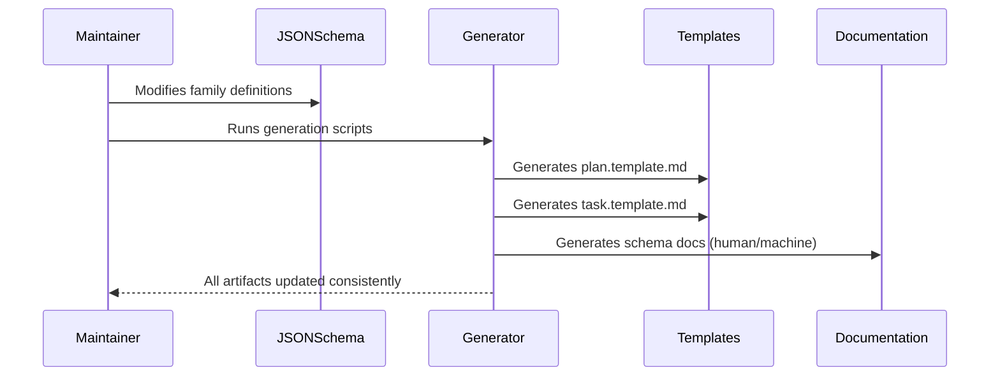

##### 2.2.1.2 Journey: Developer Creates New DDD Project

A developer needs to start a new project using current DDD methodology structure.

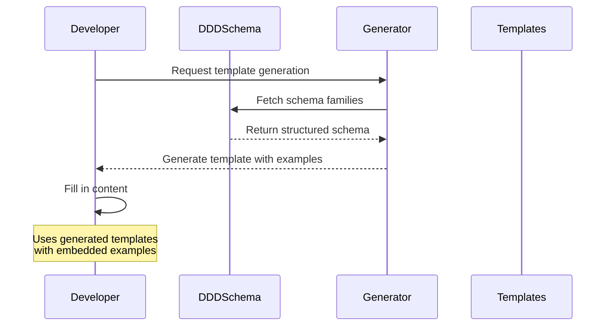

##### 2.2.1.3 Journey: Tool Author Integrates DDD Schema

A tool author wants to build analysis tools that understand DDD documentation structure.

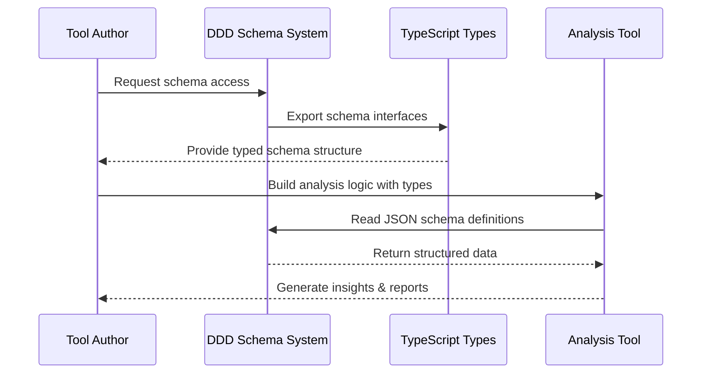

#### 2.2.2 User Personas

| Persona                        | Goal                                                                                     |
| :----------------------------- | :--------------------------------------------------------------------------------------- |
| **DDD Methodology Maintainer** | Evolve and maintain the canonical DDD structure definition with automated consistency.   |
| **Project Developer**          | Create new DDD-compliant projects using current methodology templates and documentation. |
| **Tool Author**                | Build analysis and visualization tools that understand DDD documentation structure.      |
| **LLM Integration**            | Parse and understand DDD structure through machine-optimized schema documentation.       |

#### 2.2.3 Core Business Rules

- **Zod as the Source of Truth for Structure**: The canonical schema structure is defined using Zod. TypeScript types are inferred from these schemas, ensuring a single point of maintenance for the structure itself.
- **JSON as the Source of Truth for Content**: The content (the data) for the schema is maintained in the `*.json` files within the `src/ddd-schema-json/` directory.
- **Validation Before Generation**: All `*.json` schema files must be validated against the canonical Zod schemas before any generation scripts are run.
- **Automated Generation**: All templates and documentation are generated programmatically from the validated JSON schema to ensure consistency.
- **Type Safety**: The entire validation and generation toolchain is compile-time type-safe.

#### 2.2.4 User Stories

- As a **DDD Methodology Maintainer**, I want to modify schema definitions in JSON so that all templates and documentation update automatically with guaranteed consistency.
- As a **Project Developer**, I want to access current DDD templates so that I can start new projects with the latest methodology structure.
- As an **LLM Integration**, I want machine-optimized schema documentation so that I can understand and validate DDD document structures programmatically.

### 2.3 Success Criteria

- **Automated Template Generation**: plan.template.md and task.template.md are generated automatically from JSON schema with 100% consistency.
- **Dual-Mode Documentation**: Both human-readable and machine-optimized schema documentation are generated automatically from the same source.
- **Type-Safe Generation**: All generation processes compile without TypeScript errors and produce valid markdown output.
- **Schema Coverage**: All 8 information families are properly defined in JSON and correctly rendered in all output formats.

### 2.5 Boundaries & Scope

#### 2.5.1 In Scope

- **JSON Schema Definition System**: Canonical definition of DDD documentation structure using 8 information families.
- **Template Generation Engine**: Automated creation of plan.template.md and task.template.md from schema definitions.
- **Documentation Generation Engine**: Automated creation of schema documentation in human and machine-readable formats.
- **Type-Safe Rendering**: TypeScript-based rendering system ensuring compile-time validation of all generated content.

#### 2.5.2 Out of Scope

- **Project Creation Tools**: Command-line tools for initializing new DDD projects (deferred to future iterations).
- **Validation Tools**: Schema compliance checking for existing documentation (deferred to future iterations).
- **Multi-Language Support**: Schema bindings for languages other than TypeScript (deferred to future iterations).
- **Live Documentation**: Dynamic or interactive documentation features (deferred to future iterations).

### 2.6 Core Business Processes

#### 2.6.1 Process: Schema-Driven Generation

- **Participants**: DDD Methodology Maintainer, Generation System
- **Goal**: Update all DDD artifacts consistently when schema changes
- **Workflow**:
  1. Maintainer modifies JSON schema files in `src/ddd-schema-json/`
  2. System validates TypeScript compilation for type safety
  3. Maintainer runs `npm run generate-templates` to update templates
  4. Maintainer runs `npm run generate-schema-doc` to update documentation
  5. All downstream artifacts are updated with guaranteed consistency

---

## 3 Planning & Decomposition

### 3.1 Roadmap (In-Focus Items)

| ID  | Child Plan/Task                                                            | Priority  | Priority Drivers                                                                                                                                                                                                                                   | Status         | Depends On                      | Summary                                                                             |
| :-- | :------------------------------------------------------------------------- | :-------- | :------------------------------------------------------------------------------------------------------------------------------------------------------------------------------------------------------------------------------------------------- | :------------- | :------------------------------ | :---------------------------------------------------------------------------------- |
| P2  | [CLI Tools](./p1.p2-cli-tools.plan.md)                                     | 🟥 High   | [TEC-Dev_Productivity_Enhancement](../ddd-2.md#tec-dev_productivity_enhancement), [TEC-Dev_Productivity_Blocker](../ddd-2.md#tec-dev_productivity_blocker)                                                                                         | ⏳ In Progress | P1 Schema System, CLI Framework | Provides command-line interface tools to wrap and extend the schema system.         |
| P4  | [NPM Package Publication](./p1.p4-npm-publication.plan.md)                 | 🟥 High   | [MKT-Launch_Critical](../ddd-2.md#mkt-launch_critical), [TEC-Dev_Productivity_Enhancement](../ddd-2.md#tec-dev_productivity_enhancement)                                                                                                           | 💡 Not Started | NPM Account, GitHub Secrets     | Defines the strategy for publishing and maintaining the `ddd-tools` package on NPM. |
| P5  | [Documentation Parser & Linter](./p1.p5-doc-parser.plan.md)                | 🟥 High   | [TEC-Dev_Productivity_Enhancement](../ddd-2.md#tec-dev_productivity_enhancement), [TEC-Prod_Stability_Blocker](../ddd-2.md#tec-prod_stability_blocker)                                                                                             | 💡 Not Started | P6                              | Provides a modular, schema-aware parser for linting and extracting data.            |
| P6  | [Documentation Content Validation](./p1.p6-doc-content-validator.plan.md)  | 🟥 High   | [TEC-Prod_Stability_Blocker](../ddd-2.md#tec-prod_stability_blocker), [TEC-Dev_Productivity_Enhancement](../ddd-2.md#tec-dev_productivity_enhancement)                                                                                             | 💡 Not Started | P1 Schema System                | Provides validation engine to ensure markdown content conforms to canonical schema. |
| T2  | [Refactor Placeholder to Constant](./p1.t2-todo-placeholder-const.task.md) | 🟧 Medium | [TEC-Tech_Debt_Refactor](../ddd-2.md#tec-tech_debt_refactor), [TEC-Dev_Productivity_Enhancement](../ddd-2.md#tec-dev_productivity_enhancement)                                                                                                     | ✅ Done        | `src/index.ts`                  | Replace the hardcoded placeholder text in template generators with a constant.      |
| T8  | [File Naming Pattern Change](./p1.t8-file-naming-pattern-change.task.md)   | 🟥 High   | [TEC-Debt_Maintainability](../ddd-2.md#tec-debt_maintainability), [TEC-Testability](../ddd-2.md#tec-testability), [TEC-Dev_FutureProofing](../ddd-2.md#tec-dev_futureproofing), [TEC-Dev_ParsingSimplicity](../ddd-2.md#tec-dev_parsingsimplicity) | ✅ Done        | `ddd-2.md`, `ddd-schema-json`   | Implements a new, parsing-friendly file naming convention for all DDD artefacts.    |
| T22 | [Schema Generation Scripts](./p1.t22-schema-generation-scripts.task.md)    | 🟥 High   | [TEC-Dev_Productivity_Enhancement](../ddd-2.md#tec-dev_productivity_enhancement)                                                                                                                                                                   | ✅ Done        | `src/ddd-schema-json/*`         | Documents the core scripts that generate templates and schema docs from JSON.       |
| T28 | [Define Canonical Schema Interfaces](p1.t28-define-schema-types.task.md)   | 🟥 High   | [TEC-Prod_Stability_Blocker](../ddd-2.md#tec-prod_stability_blocker)                                                                                                                                                                               | 💡 Not Started | —                               | Create the TypeScript interfaces that define the schema structure.                  |
| T29 | [Implement JSON Schema Validator](p1.t29-implement-validator.task.md)      | 🟥 High   | [TEC-Prod_Stability_Blocker](../ddd-2.md#tec-prod_stability_blocker)                                                                                                                                                                               | 💡 Not Started | T28                             | Build the script to validate `*.json` files against the TS types.                   |
| T30 | [Align Existing JSON Files](p1.t30-align-json.task.md)                     | 🟧 Medium | [TEC-Dev_Productivity_Enhancement](../ddd-2.md#tec-dev_productivity_enhancement)                                                                                                                                                                   | 💡 Not Started | T29                             | Update all existing JSON files to ensure they pass the new validator.               |

### 3.2 Backlog / Icebox

- **Template Customization**: Support for project-specific template variations
- **Schema Versioning**: Semantic versioning and migration tools for schema evolution
- **IDE Integration**: VSCode extensions for real-time DDD compliance checking

### 3.3 Dependencies

| ID  | Dependency On   | Type     | Status      | Affected Plans/Tasks | Notes                                                     |
| :-- | :-------------- | :------- | :---------- | :------------------- | :-------------------------------------------------------- |
| D-1 | TypeScript 5.0+ | External | ✅ Complete | All generation       | Required for type safety and modern language features.    |
| D-2 | Node.js 18+     | External | ✅ Complete | All scripts          | Required for script execution and file system operations. |

### 3.4 Decomposition Graph

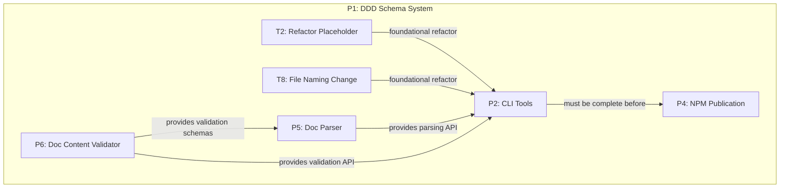

---

## 4 High-Level Design

### 4.0 Guiding Principles

- **Zod Schemas as the Source of Truth for Structure**: The manually crafted Zod schema definitions are the absolute source of truth for the data's structure. TypeScript types are inferred from them.
- **Validation by Parsing**: We validate data (`*.json` files) by parsing them with the Zod schemas. A successful parse guarantees conformance.
- **Fail-Fast**: Schema errors must be caught as early as possible in the development process, ideally before code is even committed.
- **Automated Consistency**: All downstream artifacts (templates, docs) are still generated programmatically, but only after the source JSON has been validated.

### 4.1 Current Architecture

#### 4.1.1 Data Models

**Core Schema Structure:**

```typescript
interface SchemaFamily {
  id: number;
  name: string;
  anchor: string;
  primaryQuestion: string;
  rationale: string;
  applicability: SchemaApplicability;
  notes: string;
  sections: SchemaSection[];
}

interface SchemaSection {
  id: string;
  name: string;
  headingLevel: number;
  description?: string;
  applicability: SchemaApplicability;
  examples?: SchemaExample[];
}

interface ContentElement {
  type: 'text' | 'list' | 'table' | 'codeblock' | 'mermaid';
  rendering: RenderingControl;
  children?: ContentElement[];
}
```

**Configuration System:**

```typescript
interface GenerationConfig {
  schema: {
    sourceDir: string;
    outputDirs: {
      src: string;
      docs: string;
    };
  };
  templates: {
    outputDirs: {
      src: string;
      docs: string;
    };
  };
}
```

**Entity Relationships:**

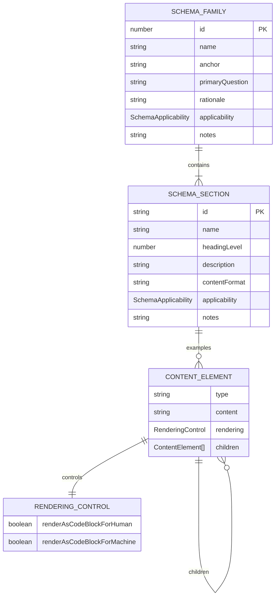

**Rendering Control:**

```typescript
interface ContentElement {
  type: 'text' | 'list' | 'table' | 'codeblock' | 'mermaid';
  rendering: RenderingControl;
}

interface RenderingControl {
  renderAsCodeBlockForHuman: boolean;
  renderAsCodeBlockForMachine: boolean;
}
```

#### 4.1.2 Components

**Component Architecture:**

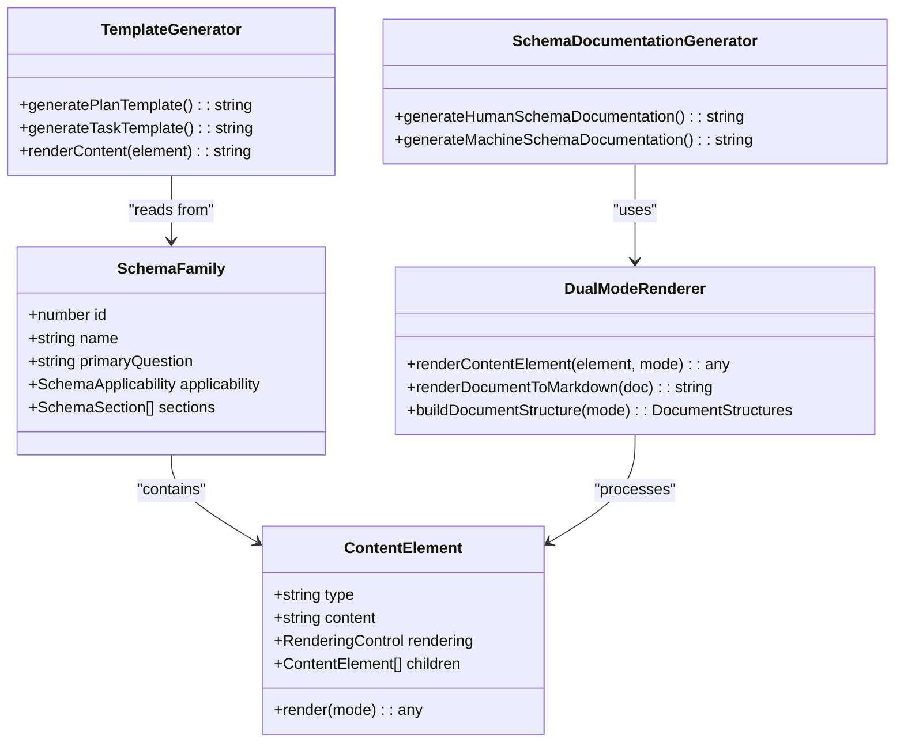

#### 4.1.3 Data Flow

```mermaid
graph TB
    subgraph "Configuration Layer"
        CONFIG["Configuration System"]
        PATHS["Path Utilities"]
    end

    subgraph "JSON Schema Layer"
        A["8 Family JSON Files"]
        B["Context Examples"]
    end

    subgraph "TypeScript Engine"
        C["Schema Loader"]
        D["Type Definitions"]
        E["Rendering Engine"]
        F["Content Converter"]
    end

    subgraph "Generation Scripts"
        G["Template Generator"]
        H["Documentation Generator"]
    end

    subgraph "Output Artifacts"
        I["plan.template.md"]
        J["task.template.md"]
        K["schema.human.md"]
        L["schema.machine.md"]
    end

    CONFIG -->|"provides output paths"| G
    CONFIG -->|"provides output paths"| H
    PATHS -->|"file writing utilities"| G
    PATHS -->|"file writing utilities"| H
    A -->|"schema definitions"| C
    B -->|"example content"| C
    C -->|"validated schemas"| D
    D -->|"type-safe interfaces"| E
    E -->|"rendering functions"| F
    F -->|"structured content"| G
    F -->|"structured content"| H
    G -->|"generated content"| I
    G -->|"generated content"| J
    H -->|"generated content"| K
    H -->|"generated content"| L
```

#### 4.1.4 Control Flow

**Template Generation Process:**

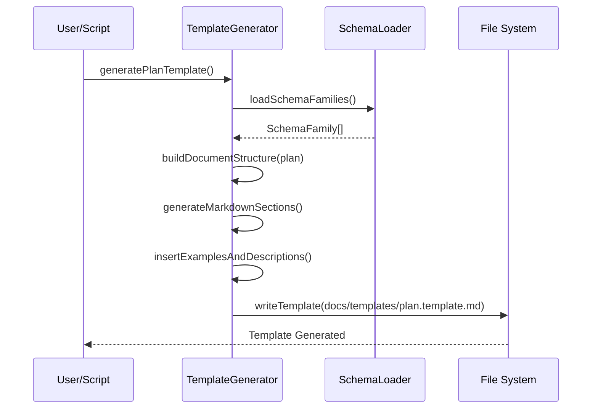

**Documentation Generation Workflow:**

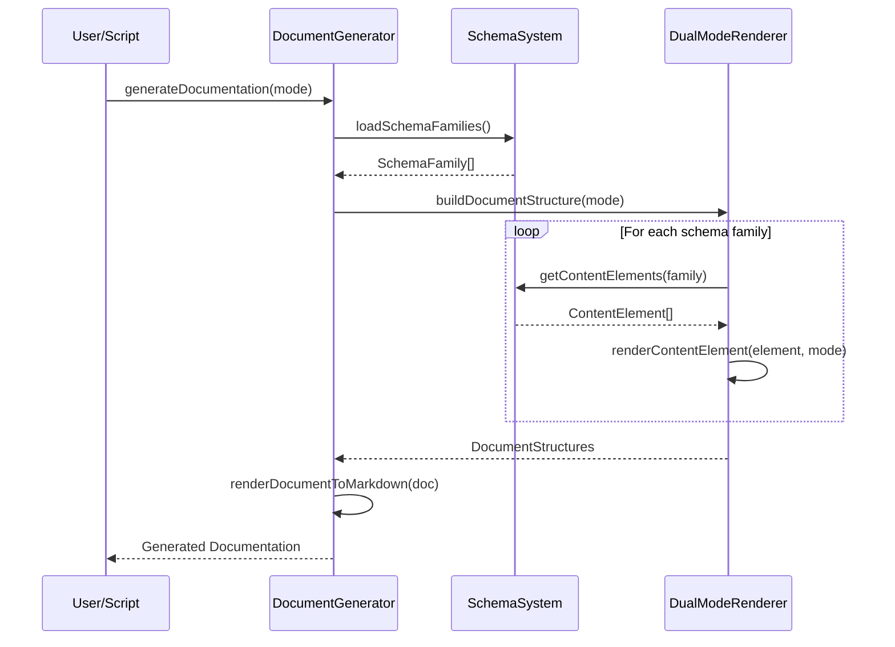

**Data Processing Flow:**

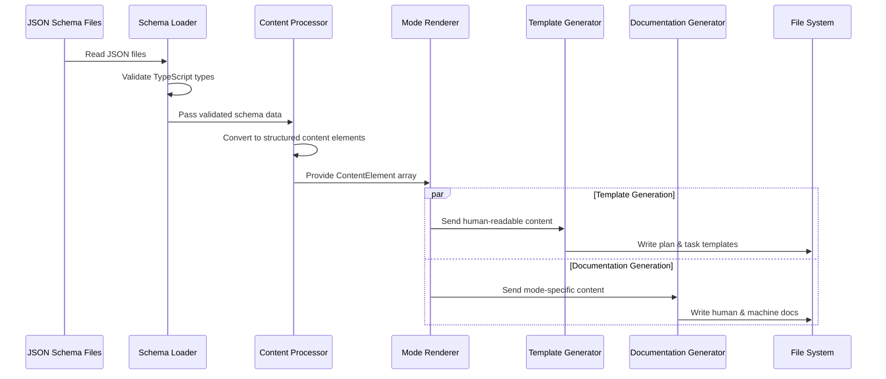

#### 4.1.5 Integration Points

**Input Interfaces:**

- JSON schema files (`src/ddd-schema-json/*.json`)
- TypeScript type definitions (`src/types.ts`)

**Output Interfaces:**

- Markdown templates (`docs/templates/*.template.md`)
- Schema documentation (`src/generated-schema-docs/*.md`)
- Generated documentation copied to `docs/` directory

#### 4.1.6 Exposed API

<!-- TODO: This section should be expanded to include detailed descriptions, parameters, and return types for each function, similar to a formal API reference. This will be addressed in a future task. -->

**Public Functions (exported from index.ts):**

```typescript
// Template generation
export function generatePlanTemplate(): string;
export function generateTaskTemplate(): string;

// Documentation generation
export function generateHumanSchemaDocumentation(): string;
export function generateMachineSchemaDocumentation(): string;

// Schema access
export const fullSchema: SchemaFamily[];
```

### 4.2 Target Architecture

The target architecture **appends** a new validation layer to the existing system. This addition shifts the source of truth from implied structure in JSON files to explicit, canonical TypeScript types. This new **Schema Integrity System** acts as a gatekeeper for the existing **Schema Generation System**, ensuring that no malformed data enters the generation pipeline. The core generation logic remains the same, but it is now protected by this validation gate.

#### 4.2.1 Data Models

**Entity Relationships:**


#### 4.2.2 Components

The target component architecture introduces a `ValidatorScript`. This script uses `ZodSchema` (the source of truth for structure) to parse raw data from the `JsonDataSource`. The output of this validation is a trusted `SchemaFamily` data object, which is then consumed by the rest of the system, such as the `TemplateGenerator` and `DualModeRenderer`.

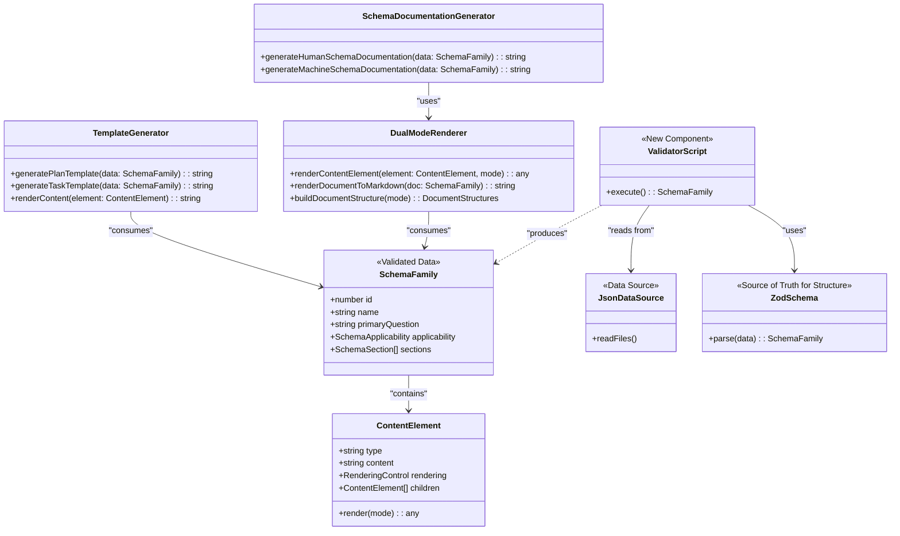

#### 4.2.3 Data Flow

The target data flow integrates validation directly into the `Schema Loader`. For clarity, the flow is split into two diagrams representing the two main functions of the system: Template Generation and Documentation Generation.

**Target Data Flow: Template Generation**

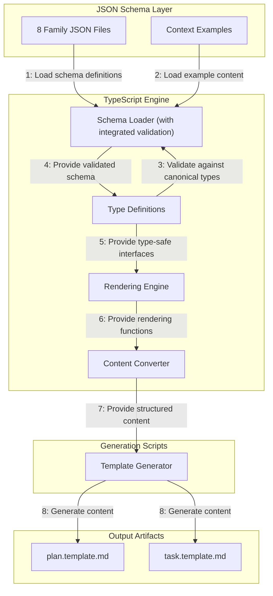

**Target Data Flow: Documentation Generation**

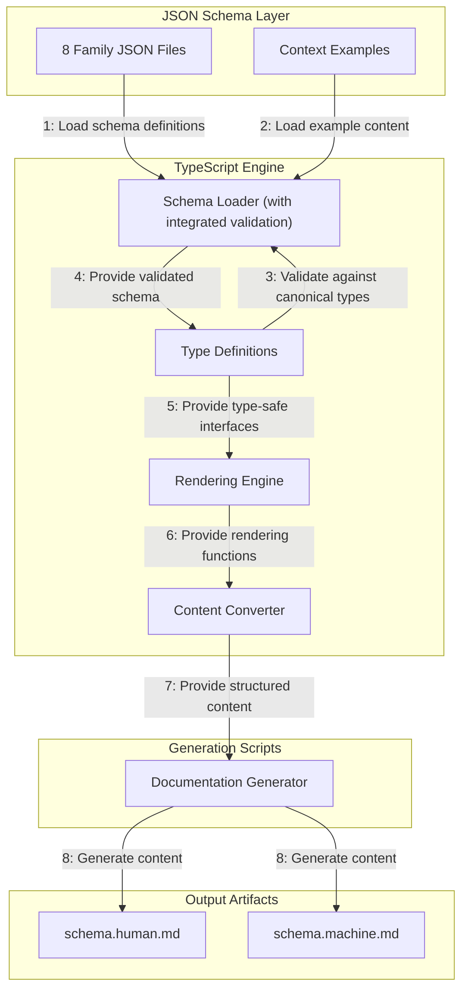

#### 4.2.4 Control Flow

The validation script can be invoked in two ways: automatically via a Git hook/CI pipeline, or manually by a developer. The existing generation flows remain unchanged but are now preceded by the validation step.

**Updated - Template Generation Process:**

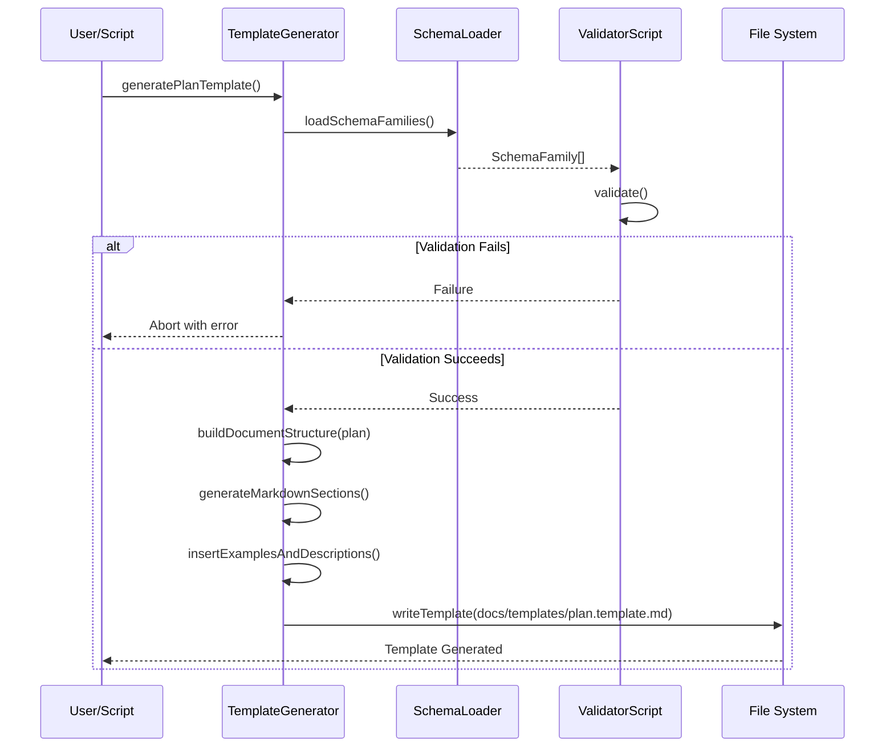

**Updated - Documentation Generation Workflow:**

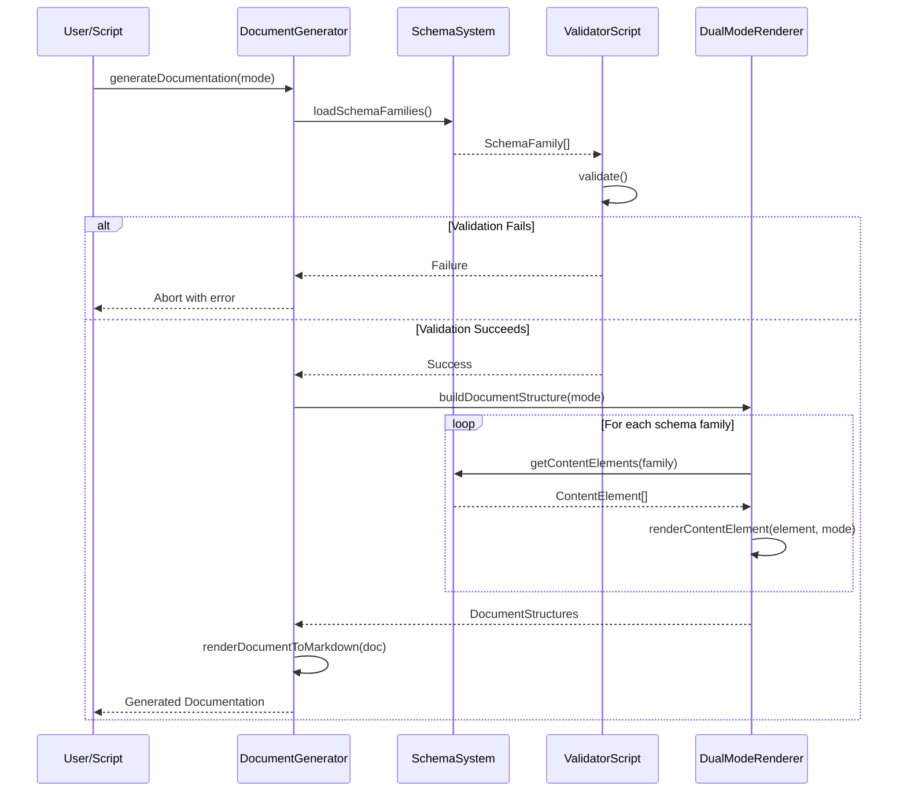

**Updated - Data Processing Flow:**

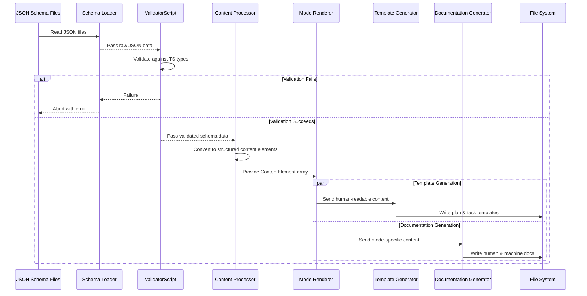

### 4.3 Tech Stack & Deployment

**Runtime Environment:**

- **Node.js 18+**: Script execution and file system operations
- **TypeScript 5.0+**: Type safety and modern language features

**Development Dependencies:**

- **Vitest**: Unit testing framework
- **tsx**: TypeScript execution for development scripts
- **zod**: TypeScript-first schema validation

**Deployment:**

- **Local Development**: Scripts run locally via npm commands
- **File System Output**: Generated files written directly to project directories
- **Version Control**: All generated artifacts committed to repository for consistency

### 4.4 Non-Functional Requirements

#### 4.4.1 Performance

| Requirement                   | Target                    | Current Status |
| :---------------------------- | :------------------------ | :------------- |
| Template Generation Time      | < 1 second                | ✅ Met         |
| Documentation Generation Time | < 2 seconds               | ✅ Met         |
| Memory Usage                  | < 100MB during generation | ✅ Met         |

#### 4.4.2 Reliability

| Requirement                       | Target                                     | Current Status |
| :-------------------------------- | :----------------------------------------- | :------------- |
| Type Safety                       | 100% compile-time validation               | ✅ Met         |
| Generation Consistency            | Identical output for identical input       | ✅ Met         |
| Error Handling                    | Graceful failure with clear error messages | ✅ Met         |
| **Schema Validation Enforcement** | **Mandatory, non-bypassable CI gate.**     | 💡 Not Started |

#### 4.4.3 Scalability

| Requirement           | Target                             | Current Status      |
| :-------------------- | :--------------------------------- | :------------------ |
| Schema Family Support | 8+ families                        | ✅ Met (8 families) |
| Section Nesting       | 5+ levels deep                     | ✅ Met              |
| Example Complexity    | Multiple content types per section | ✅ Met              |

#### 4.4.4 Permission Model

**Not applicable** - this is a local development tool with no user authentication or access control requirements.

---

## 5 Maintenance and Monitoring

### 5.1 Current Maintenance and Monitoring

#### 5.1.1 Error Handling

| Error Type                      | Trigger                               | Action                            | User Feedback                                                 |
| :------------------------------ | :------------------------------------ | :-------------------------------- | :------------------------------------------------------------ |
| **Zod Schema Validation Error** | Mismatched data in `*.json` files     | Abort generation with exit code 1 | Clear validation error with file, path, and issue details     |
| **Malformed JSON Error**        | Invalid JSON syntax in `*.json` files | Abort generation with exit code 1 | JSON parsing error with specific file and location            |
| **File System Error**           | Cannot write to output directories    | Abort generation with exit code 1 | Clear file system error with path and permissions information |

#### 5.1.2 Logging & Monitoring

- **Console Output**: Structured progress messages during generation processes
- **Error Reporting**: Detailed error messages with context for debugging
- **Success Confirmation**: Clear confirmation messages with output file paths
- **No External Monitoring**: System runs locally with immediate feedback

### 5.2 Target Maintenance and Monitoring

**Current monitoring approach is appropriate for the system scope.** No external monitoring or complex error handling is needed for a local development tool.

---

## 6 Implementation Guidance

### 6.1 Implementation Plan

The implementation of the DDD Schema System is decomposed into the child plans and tasks detailed in the **[3.1 Roadmap (In-Focus Items)](#31-roadmap-in-focus-items)**. Foundational refactoring tasks were completed first, followed by the development of the core CLI, Parser, and NPM publication capabilities.

### 6.2 Prompts (LLM reuse)

**For extending the schema system:**

```markdown
Add a new section to family [X] that [describes functionality]. Follow the existing pattern in src/ddd-schema-json/[X]-[name].json and ensure the section includes:

- Proper applicability matrix for plan/task
- Descriptive examples with rendering controls
- Clear content format specification
```

**For troubleshooting generation:**

```markdown
Debug the generation system by:

1. Running TypeScript compilation: npm run build
2. Checking JSON syntax in src/ddd-schema-json/
3. Verifying output directories exist and are writable
4. Running generation scripts individually to isolate issues
```

---

## 7 Quality & Operations

### 7.1 Testing Strategy / Requirements

| Scenario                                               | Test Type         | Tools / Runner               | Status         |
| :----------------------------------------------------- | :---------------- | :--------------------------- | :------------- |
| **TypeScript types (inferred from Zod) compile**       | Unit              | TypeScript compiler          | ✅ Complete    |
| **JSON schema files are correctly validated by Zod**   | Unit              | Vitest + Zod                 | 💡 Not Started |
| **Dual-mode rendering produces expected output**       | Unit              | Vitest + snapshot testing    | ✅ Complete    |
| **Template generation includes all required sections** | Integration       | Vitest + template validation | ✅ Complete    |
| **Documentation generation completes successfully**    | Integration       | Vitest + file system mocking | ✅ Complete    |
| **Generated markdown syntax is valid**                 | Output Validation | Manual review                | ✅ Complete    |
| **Schema coverage includes all 8 families**            | System            | Automated verification       | ✅ Complete    |

### 7.2 Configuration

| Setting Name                | Source                                 | Override Method                                  | Notes                                                       |
| :-------------------------- | :------------------------------------- | :----------------------------------------------- | :---------------------------------------------------------- |
| `DDD_SCHEMA_SOURCE_DIR`     | `src/ddd-schema-json/` (default)       | `DDD_SCHEMA_SOURCE_DIR` environment variable     | Location of JSON schema source files                        |
| `DDD_SCHEMA_SRC_OUTPUT`     | `src/generated-schema-docs/` (default) | `DDD_SCHEMA_SRC_OUTPUT` environment variable     | Output directory for generated schema docs in src           |
| `DDD_SCHEMA_DOCS_OUTPUT`    | `docs/` (default)                      | `DDD_SCHEMA_DOCS_OUTPUT` environment variable    | Output directory for generated schema docs in docs          |
| `DDD_TEMPLATES_SRC_OUTPUT`  | `src/templates/` (default)             | `DDD_TEMPLATES_SRC_OUTPUT` environment variable  | Output directory for generated templates in src             |
| `DDD_TEMPLATES_DOCS_OUTPUT` | `docs/templates/` (default)            | `DDD_TEMPLATES_DOCS_OUTPUT` environment variable | Output directory for generated templates in docs            |
| `NODE_ENV`                  | Environment Variable                   | Not overrideable                                 | Development vs production mode (currently development only) |

### 7.3 Alerting & Response

| Error Condition                  | Response Plan                                         | Status      |
| :------------------------------- | :---------------------------------------------------- | :---------- |
| **Generation Script Failure**    | Abort with non-zero exit code and clear error message | ✅ Complete |
| **TypeScript Compilation Error** | Display compiler errors and abort generation          | ✅ Complete |
| **File System Permission Error** | Log specific path and permission requirements         | ✅ Complete |

### 7.4 Deployment Steps

**For normal development:**

1. Make changes to JSON schema files in `src/ddd-schema-json/`
2. Run `npm run generate-templates` to update templates
3. Run `npm run generate-schema-doc` to update documentation
4. Commit all generated files to version control

**For custom output paths:**

```bash
# Custom development environment
DDD_TEMPLATES_DOCS_OUTPUT=/dev/docs npm run generate-templates

# Production deployment with custom paths
NODE_ENV=production DDD_SCHEMA_DOCS_OUTPUT=/prod/docs npm run generate-schema-doc

# Multiple custom paths
DDD_SCHEMA_SRC_OUTPUT=/custom/src DDD_TEMPLATES_DOCS_OUTPUT=/custom/templates npm run generate-templates
```

**For major schema changes:**

1. Update JSON schema files with new structure
2. Update TypeScript types if needed
3. Test compilation: `npm run build`
4. Regenerate all artifacts
5. Review generated output for correctness
6. Update this documentation if architecture changes

---

## 8 Reference

### 8.1 Appendices/Glossary

**Glossary:**

- **Schema Family**: One of 8 major categories of information in DDD documents (Meta, Business, Planning, Design, Maintenance, Implementation, Quality, Reference)
- **Applicability Matrix**: Defines which sections are required/optional/omitted for Plans vs Tasks
- **Rendering Control**: Configuration determining how examples appear in human vs machine-readable output
- **Dual-Mode**: System capability to generate both human-optimized and machine-optimized documentation from the same source

**Key File References:**

- `src/index.ts`: Main generation engine and exported API
- `src/config.ts`: Centralized configuration with environment variable support
- `src/path-utils.ts`: Shared utilities for directory creation and file writing
- `src/ddd-schema-json/`: JSON schema definitions (single source of truth)
- `src/types.ts`: TypeScript types inferred from the Zod schemas
- `src/generate-templates.ts`: Template generation script with configurable paths
- `src/generate-schema-doc.ts`: Schema documentation generation script with configurable paths
- `package.json`: Available scripts and dependencies

---
