# Task: CLI 'start' Command

## 1 Meta & Governance

### 1.2 Status

- **Current State:** 💡 Not Started
- **Priority:** 🟧 Medium
- **Progress:** 0%
- **Planning Estimate:** 5
- **Est. Variance (pts):** 0
- **Created:** 2025-07-23 11:07
- **Implementation Started:**
- **Completed:**
- **Last Updated:** 2025-07-23 11:07

### 1.3 Priority Drivers

- TEC-Dev_Productivity_Enhancement

---

## 2 Business & Scope

### 2.1 Overview

- **Core Function**: Implements the `ddd start <task_id>` command.
- **Key Capability**: Automates the initial steps of the developer workflow by creating a task-specific Git branch and updating the task document's status to "In Progress".
- **Business Value**: Reduces friction and context-switching for developers, enforces the correct branching strategy, and ensures the documentation accurately reflects the work currently underway.

### 2.4 Acceptance Criteria

| ID   | Criterion                                                                                                       | Test Reference   |
| :--- | :-------------------------------------------------------------------------------------------------------------- | :--------------- |
| AC-1 | Running `ddd start <task_id>` on a valid task creates a new Git branch named `task/<task_id>`.                  | Integration Test |
| AC-2 | After the command succeeds, the user is automatically on the new branch.                                        | Integration Test |
| AC-3 | The `Current State` in the corresponding task document is updated to `⏳ In Progress`.                          | Integration Test |
| AC-4 | The command fails with a clear error if the specified `<task_id>` does not correspond to an existing task file. | Integration Test |
| AC-5 | The command fails with a clear error if the Git branch `task/<task_id>` already exists.                         | Integration Test |

---

## 3 Planning & Decomposition

### 3.3 Dependencies

| ID  | Dependency On        | Type     | Status      | Notes                                                  |
| :-- | :------------------- | :------- | :---------- | :----------------------------------------------------- |
| D-1 | `simple-git` package | External | ✅ Complete | Installed in a previous step.                          |
| D-2 | Core CLI Framework   | Internal | ✅ Complete | The command will be built on the existing yargs setup. |

---

## 4 High-Level Design

### 4.2.1 Data Models


### 4.2.2 Components


### 4.2.3 Data Flow


### 4.2.4 Control Flow

```mermaid
sequenceDiagram
    participant User
    participant StartCommand
    participant TaskService
    participant GitService

    User->>StartCommand: ddd start p1-p2-p3.t10
    StartCommand->>TaskService: findTaskFile('p1-p2-p3.t10')
    TaskService-->>StartCommand: returns '/path/to/task.md'
    StartCommand->>GitService: branchExists('task/p1-p2-p3.t10')
    GitService-->>StartCommand: false
    StartCommand->>GitService: createBranch('task/p1-p2-p3.t10')
    StartCommand->>GitService: checkoutBranch('task/p1-p2-p3.t10')
    StartCommand->>TaskService: updateTaskStatus('/path/to/task.md', 'In Progress')
    TaskService-->>StartCommand: Success
    StartCommand-->>User: ✅ Branch created and task status updated.
```



### 4.2.5 Integration Points

##### 4.2.5.1 Upstream Integrations

- **CLI Argument**: The command is triggered by the user and receives the `<task_id>` as a positional argument.
- **File System**: The `TaskService` reads the task file from the `docs/requirements` directory to validate its existence and update its content.
- **Git Repository**: The `GitService` interacts with the local `.git` repository to check for existing branches and to create a new one.

##### 4.2.5.2 Downstream Integrations

- **Git Repository**: The primary output is the creation of a new local branch.
- **File System**: The task document is modified in place with an updated status.
- **Console**: A success or error message is printed to the user's console.

### 4.3 Tech Stack & Deployment

- **Command Parsing**: `yargs` to define and handle the `start <task_id>` command structure.
- **Git Interaction**: `simple-git` to provide a programmatic interface for creating and checking out branches.
- **File System**: Node.js `fs` module (likely using `gray-matter` for parsing frontmatter) to read and update the task document's status.

---

## 5 Maintenance and Monitoring

### 5.2.1 Error Handling

| Error Type                | Trigger                                                                            | Action                                                  | User Feedback                                                             |
| :------------------------ | :--------------------------------------------------------------------------------- | :------------------------------------------------------ | :------------------------------------------------------------------------ |
| **Task Not Found**        | The `<task_id>` provided does not match any file in the requirements directory.    | Abort the command with a non-zero exit code.            | `ERROR: Task 'p1-p2-p3.t99-nonexistent' not found.`                       |
| **Branch Already Exists** | A Git branch with the name `task/<task_id>` already exists.                        | Abort the command.                                      | `ERROR: Git branch 'task/p1-p2-p3.t10-cli-start-command' already exists.` |
| **Git Command Failure**   | `simple-git` fails to create or checkout the branch.                               | Abort the command and display the underlying Git error. | `ERROR: Git operation failed: [Original Git error message].`              |
| **File Update Failure**   | The script cannot write the new status to the task file (e.g., permissions issue). | Abort the command and report the file system error.     | `ERROR: Failed to update status in '[filepath]': [File system error].`    |

### 5.2.2 Logging & Monitoring

- **On Success**: The command will print a clear confirmation message, e.g., `✅ Branch 'task/p1-p2-p3.t10-cli-start-command' created and status updated.`.
- **On Failure**: A specific error message (from the table above) will be printed to `stderr`.
- **Debug Mode**: If the `--debug` flag is active, the command will log the file path being checked, the Git commands being executed, and the content being written to the task file.

---

## 6 Implementation Guidance

### 6.1 Implementation Log / Steps

- [ ] Create a new `GitService` (`src/cli/services/git-service.ts`) to encapsulate `simple-git` logic.
- [ ] Create a new `TaskService` (`src/cli/services/task-service.ts`) to handle finding and modifying task files.
- [ ] Create the `start` command module (`src/cli/commands/start.ts`).
- [ ] Implement the yargs command structure and handler logic.
- [ ] Add error handling for non-existent tasks and existing branches.
- [ ] Register the new command in the main CLI entry point (`src/cli/index.ts`).

### 6.1.1 Initial Situation

- The `simple-git` library is installed.
- The CLI framework is in place.
- There is no automated way to begin work on a task.

### 6.1.2 Files Change Log

- `src/cli/commands/start.ts` (New)
- `src/cli/services/git-service.ts` (New)
- `src/cli/services/task-service.ts` (New)
- `src/cli/index.ts` (Modified)
- `src/__tests__/cli/commands/start.test.ts` (New)
- `src/__tests__/cli/services/git-service.test.ts` (New)
- `src/__tests__/cli/services/task-service.test.ts` (New)

---

## 7 Quality & Operations

### 7.1 Testing Strategy / Requirements

| AC   | Scenario                                                | Test Type   | Tools / Runner           | Notes                                                                                  |
| :--- | :------------------------------------------------------ | :---------- | :----------------------- | :------------------------------------------------------------------------------------- |
| AC-1 | Run `ddd start` with a valid task ID.                   | Integration | Jest, `simple-git` mocks | Verify that the mock `checkoutLocalBranch` is called with the correct branch name.     |
| AC-3 | Run `ddd start` with a valid task ID.                   | Integration | Jest, `memfs`            | Verify that the status in the in-memory task file is updated correctly.                |
| AC-4 | Run `ddd start` with a non-existent task ID.            | Integration | Jest                     | The command should throw a specific, user-friendly error.                              |
| AC-5 | Run `ddd start` for a task whose branch already exists. | Integration | Jest, `simple-git` mocks | The mock `branchExists` should return true, and the command should fail with an error. |

### 7.5 Local Test Commands

```bash
# Run all tests for the 'start' command and its services
npm test -- --testPathPattern=start
npm test -- --testPathPattern=git-service
npm test -- --testPathPattern=task-service

# Manual Test (after implementation and linking)
ddd start p1-p2-p3.t10-cli-start-command
```
