# Task: CLI 'commit' Command

## 1 Meta & Governance

### 1.2 Status

- **Current State:** 💡 Not Started
- **Priority:** 🟧 Medium
- **Progress:** 0%
- **Planning Estimate:** 5
- **Est. Variance (pts):** 0
- **Created:** 2025-07-23 11:21
- **Implementation Started:**
- **Completed:**
- **Last Updated:** 2025-07-23 11:21

### 1.3 Priority Drivers

- TEC-Dev_Productivity_Enhancement

---

## 2 Business & Scope

### 2.1 Overview

- **Core Function**: Implements the `ddd commit` command.
- **Key Capability**: Provides a guided workflow to create a commit message that is compliant with the project's DDD convention, automatically extracting the task reference from the current Git branch.
- **Business Value**: Eliminates the cognitive load of remembering the commit message format and prevents errors, ensuring every commit is correctly and effortlessly linked to its corresponding task.

#### 2.2.3 Core Business Rules

- The command MUST extract the task ID from the current branch name.
- The command MUST NOT proceed if the branch name does not conform to the `task/<task_id>` pattern.
- The final generated commit message MUST pass the validation defined in the `commit-msg` hook (Task T9).

### 2.4 Acceptance Criteria

| ID   | Criterion                                                                                        | Test Reference   |
| :--- | :----------------------------------------------------------------------------------------------- | :--------------- |
| AC-1 | Running `ddd commit` from a `task/<task_id>` branch stages all changes and creates a commit.     | Integration Test |
| AC-2 | The generated commit message is correctly formatted as `type(scope): subject (refs: <task_id>)`. | Integration Test |
| AC-3 | The `<task_id>` in the commit message is correctly extracted from the current branch name.       | Integration Test |
| AC-4 | The command prompts the user for `type`, `scope`, and `subject` to build the message.            | Manual Test      |
| AC-5 | The command fails with a clear error if not run from a branch with the `task/` prefix.           | Integration Test |

---

## 3 Planning & Decomposition

### 3.3 Dependencies

| ID  | Dependency On                   | Type     | Status         | Notes                                                                     |
| :-- | :------------------------------ | :------- | :------------- | :------------------------------------------------------------------------ |
| D-1 | `simple-git` package            | External | ✅ Complete    | For staging files and creating the commit.                                |
| D-2 | `p1-p2-p3.t9-git-hooks.task.md` | Internal | 💡 Not Started | The `commit-msg` hook must be in place to validate the generated message. |
| D-3 | `GitService` from T10           | Internal | 💡 Not Started | The service will be enhanced to get the current branch name.              |

---

## 4 High-Level Design

### 4.2.1 Data Models


### 4.2.2 Components

```mermaid
classDiagram
    direction TB

    class CommitCommand {
        <<yargs command>>
        +handler(argv)
    }

    class GitService {
        <<Service>>
        +getCurrentBranchName(): Promise<string>
        +stageAll(): Promise<void>
        +commit(message): Promise<void>
    }

    class PromptService {
        <<Service>>
        +askForCommitDetails(): Promise<{type, scope, subject}>
    }

    CommitCommand --> GitService : uses
    CommitCommand --> PromptService : uses
```

### 4.2.3 Data Flow


### 4.2.4 Control Flow

```mermaid
sequenceDiagram
    participant User
    participant CommitCommand
    participant GitService
    participant PromptService

    User->>CommitCommand: ddd commit
    CommitCommand->>GitService: getCurrentBranchName()
    GitService-->>CommitCommand: returns 'task/p1-p2-p3.t11'
    CommitCommand->>CommitCommand: parseTaskId('task/p1-p2-p3.t11')
    CommitCommand->>PromptService: askForCommitDetails()
    PromptService-->>CommitCommand: returns {type: 'feat', scope: 'cli', subject: 'add commit cmd'}
    CommitCommand->>CommitCommand: formatMessage('feat', 'cli', 'add commit cmd', 'p1-p2-p3.t11')
    CommitCommand->>GitService: stageAll()
    CommitCommand->>GitService: commit('feat(cli): add commit cmd (refs: p1-p2-p3.t11)')
    GitService-->>CommitCommand: Success
    CommitCommand-->>User: ✅ Commit created successfully.
```



### 4.2.5 Integration Points

##### 4.2.5.1 Upstream Integrations

- **Git Repository**: The command reads the current branch name from the local `.git` repository.
- **User's Terminal (stdin)**: The `PromptService` requires interactive input from the user to provide commit details.

##### 4.2.5.2 Downstream Integrations

- **Git Repository**: The command creates a new commit object in the local repository.
- **`commit-msg` Hook**: The created commit message is passed to the `commit-msg` hook (from Task T9) for validation.

### 4.3 Tech Stack & Deployment

- **Command Parsing**: `yargs`.
- **Git Interaction**: `simple-git`.
- **Interactive Prompts**: A library like `inquirer` or `prompts` will be needed to gather user input for the commit message details.

---

## 5 Maintenance and Monitoring

### 5.2.1 Error Handling

| Error Type             | Trigger                                                                         | Action                                      | User Feedback                                                                          |
| :--------------------- | :------------------------------------------------------------------------------ | :------------------------------------------ | :------------------------------------------------------------------------------------- |
| **Invalid Branch**     | The command is run from a branch that does not start with `task/`.              | Abort the command.                          | `ERROR: This command can only be run from a task branch (e.g., 'task/p1-t1-example').` |
| **Git Commit Fails**   | The underlying `git commit` command fails (e.g., hook rejection, empty commit). | Abort and surface the underlying Git error. | `ERROR: Git commit failed: [Original Git error message].`                              |
| **User Aborts Prompt** | The user cancels the interactive prompt for commit details.                     | Abort the command gracefully.               | `Commit aborted.`                                                                      |

---

## 6 Implementation Guidance

### 6.1 Implementation Log / Steps

- [ ] **Dependency**: Add `inquirer` package to `package.json` for interactive prompts.
- [ ] **Service Enhancement**: Update `GitService` (`src/cli/services/git-service.ts`) to include `getCurrentBranchName()`, `stageAll()`, and `commit(message)` methods.
- [ ] **New Service**: Create a new `PromptService` (`src/cli/services/prompt.service.ts`) that uses `inquirer` to ask the user for the commit `type`, `scope`, and `subject`.
- [ ] **Command Creation**: Create the `commit` command file at `src/cli/commands/commit.ts`.
- [ ] **Branch Parsing Logic**: Implement a function within `commit.ts` to parse the task ID from a branch name string (e.g., `task/p1-p2-p3.t11-cli-commit-command` -> `p1-p2-p3.t11-cli-commit-command`).
- [ ] **Command Handler Logic**: In the `commit.ts` handler:
  - Call `GitService.getCurrentBranchName()`.
  - Validate the branch name starts with `task/`. If not, exit with an error.
  - Parse the task ID from the branch name.
  - Call `PromptService.askForCommitDetails()`.
  - Format the final commit message: `type(scope): subject (refs: <task_id>)`.
  - Call `GitService.stageAll()`.
  - Call `GitService.commit(formattedMessage)`.
- [ ] **Command Registration**: Import and register the new `commit` command in the main CLI entry point (`src/cli/index.ts`).
- [ ] **Testing**: Create unit and integration tests for the new services and command in the `src/__tests__/` directory.

### 6.1.1 Initial Situation

- `GitService` exists but may need new methods.
- The CLI has no interactive prompt capabilities.
- Committing is a manual process.

### 6.1.2 Files Change Log

- `package.json` (Modified)
- `src/cli/commands/commit.ts` (New)
- `src/cli/services/prompt.service.ts` (New)
- `src/cli/services/git-service.ts` (Modified)
- `src/cli/index.ts` (Modified)
- `src/__tests__/cli/commands/commit.test.ts` (New)
- `src/__tests__/cli/services/prompt.service.test.ts` (New)

---

## 7 Quality & Operations

### 7.1 Testing Strategy / Requirements

| AC   | Scenario                                                | Test Type   | Tools / Runner             | Notes                                                                           |
| :--- | :------------------------------------------------------ | :---------- | :------------------------- | :------------------------------------------------------------------------------ |
| AC-1 | Run `ddd commit` from a valid task branch.              | Integration | Vitest, `simple-git` mocks | Verify `stageAll` and `commit` are called with the correctly formatted message. |
| AC-3 | Check the task ID extraction logic.                     | Unit        | Vitest                     | Test the regex or string manipulation that parses the branch name.              |
| AC-5 | Run `ddd commit` from a non-task branch (e.g., `main`). | Integration | Vitest, `simple-git` mocks | The command should fail early with a specific error message.                    |

### 7.5 Local Test Commands

```bash
# Unit test the branch parsing logic
npm test -- --testPathPattern=commit.test.ts

# Manual Test (after implementation)
# 1. ddd start p1-p2-p3.t11-cli-commit-command
# 2. (make a file change)
# 3. ddd commit
#    - Enter type: feat
#    - Enter scope: cli
#    - Enter subject: add guided commit command
# 4. git log -1
#    - Verify the last commit message is formatted correctly
```
