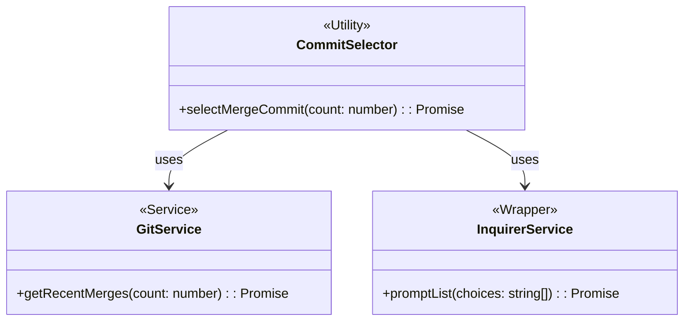
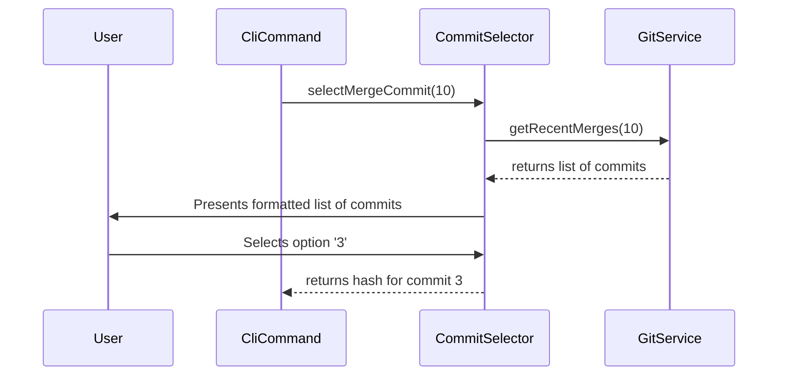

# Task: Interactive Git Commit Selection

## 1 Meta & Governance

### 1.2 Status

- **Current State:** 💡 Not Started
- **Priority:** 🟧 Medium
- **Progress:** 0%
- **Planning Estimate:** 3
- **Est. Variance (pts):** 0
- **Created:** 2025-07-23 07:40
- **Implementation Started:**
- **Completed:**
- **Last Updated:** 2025-07-23 07:40

### 1.3 Priority Drivers

- TEC-Dev_Productivity_Enhancement
- UX-Noticeable_Friction

---

## 2 Business & Scope

### 2.1 Overview

- **Core Function**: Develop a reusable CLI utility that prompts the user to select a commit from a list of recent Git commits.
- **Key Capability**: Provides an interactive and user-friendly way to select a specific commit hash without requiring the user to manually search the Git log.
- **Business Value**: Improves the user experience of CLI tools that need to operate on a specific commit, particularly in post-merge scenarios where branch-based diffs are not viable. This removes friction from the `Post-Implementation Documentation Synchronization` workflow and other future tools.

### 2.4 Acceptance Criteria

| ID   | Criterion                                                                                                   | Test Reference            |
| :--- | :---------------------------------------------------------------------------------------------------------- | :------------------------ |
| AC-1 | The utility must fetch and display the last 'n' (default 10) merge commits from the Git log.                | `commit-selector.test.ts` |
| AC-2 | The list presented to the user must be clear, numbered, and include the commit hash, author, and title.     | `commit-selector.test.ts` |
| AC-3 | The utility must correctly capture the user's numerical selection and return the corresponding commit hash. | `commit-selector.test.ts` |
| AC-4 | If the user provides invalid input (e.g., not a number, out of range), it should re-prompt with an error.   | `commit-selector.test.ts` |
| AC-5 | The utility must be exportable and usable by other CLI commands within the `ddd` tool.                      | `cli-integration.test.ts` |

---

## 3 Planning & Decomposition

### 3.3 Dependencies

| ID  | Dependency On | Type     | Status         | Affected Plans/Tasks | Notes                                                            |
| :-- | :------------ | :------- | :------------- | :------------------- | :--------------------------------------------------------------- |
| D-1 | `inquirer`    | External | 💡 Not Started | This Task            | A library for creating interactive command-line user interfaces. |
| D-2 | `simple-git`  | External | ✅ Complete    | This Task            | Already identified as a dependency for the parent plan.          |

---

## 4 High-Level Design

### 4.2 Target Architecture

#### 4.2.2 Components



#### 4.2.4 Control Flow



---

## 6 Implementation Guidance

### 6.1 Implementation Log / Steps

- [ ] Add `inquirer` as a project dependency.
- [ ] Create a new `GitService` method `getRecentMerges()` that uses `simple-git` to fetch and parse merge commits.
- [ ] Create a new `CommitSelector` utility.
- [ ] Implement the `selectMergeCommit` function, orchestrating the calls to `GitService` and `inquirer`.
- [ ] Write unit tests to cover all acceptance criteria.

---

## 7 Quality & Operations

### 7.1 Testing Strategy / Requirements

| AC  | Scenario                                                                                   | Test Type | Tools / Runner | Notes                                                     |
| :-- | :----------------------------------------------------------------------------------------- | :-------- | :------------- | :-------------------------------------------------------- |
| 1-5 | Test the `CommitSelector` utility by mocking the `GitService` and `inquirer` dependencies. | Unit      | Vitest         | Ensure correct data flow, formatting, and error handling. |

### 7.5 Local Test Commands

```bash
npm test -- src/cli/utils/commit-selector.test.ts
```
