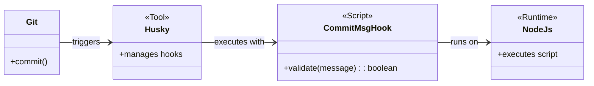
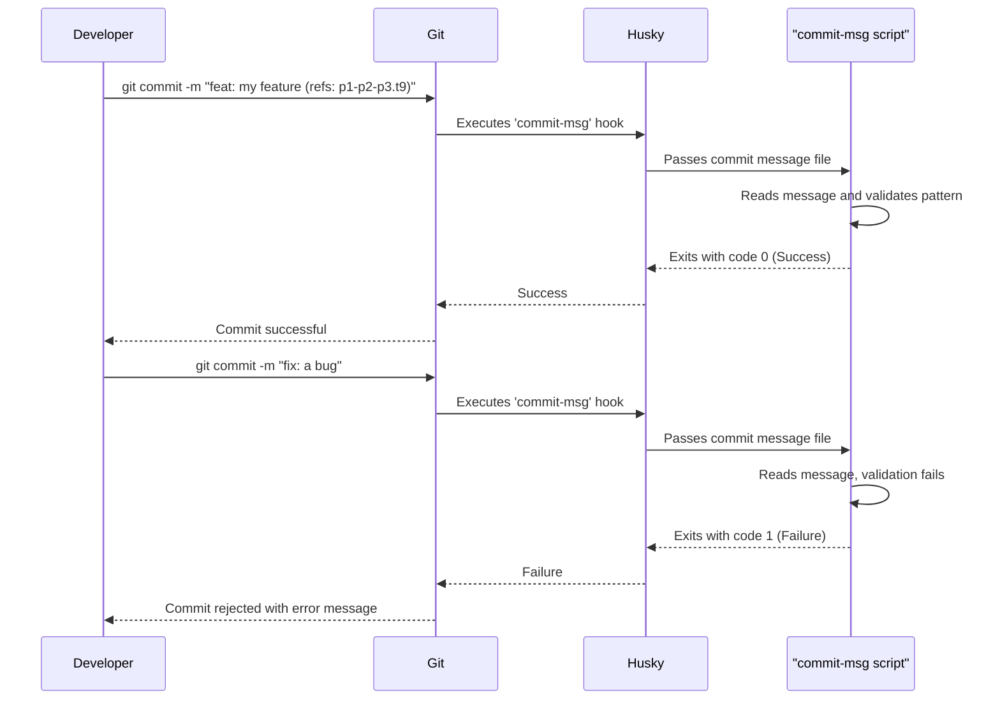

# Task: Git Hook Integration

## 1 Meta & Governance

### 1.2 Status

- **Current State:** 💡 Not Started
- **Priority:** 🟥 High
- **Progress:** 0%
- **Planning Estimate:** 3
- **Est. Variance (pts):** 0
- **Created:** 2025-07-23 10:52
- **Implementation Started:**
- **Completed:**
- **Last Updated:** 2025-07-23 10:52

### 1.3 Priority Drivers

- TEC-Dev_Productivity_Enhancement

---

## 2 Business & Scope

### 2.1 Overview

- **Core Function**: Implements and configures the `commit-msg` Git hook to automatically enforce the DDD commit message convention.
- **Key Capability**: Programmatically validates every commit message against a defined pattern, ensuring that each commit is explicitly linked to a documented task.
- **Business Value**: Guarantees 100% traceability between code and documentation, eliminates the need for manual developer discipline, and prevents non-compliant code from entering the repository.

### 2.4 Acceptance Criteria

| ID   | Criterion                                                                                                       | Test Reference                      |
| :--- | :-------------------------------------------------------------------------------------------------------------- | :---------------------------------- |
| AC-1 | `husky` is installed and configured to run a script for the `commit-msg` hook.                                  | `package.json`, `.husky/commit-msg` |
| AC-2 | A commit with a valid message (e.g., `feat(cli): add new command (refs: p1-p2-p3.t9-git-hooks)`) is successful. | Manual Test                         |
| AC-3 | A commit with an invalid message (e.g., `fix: my commit`) is rejected with a clear error message.               | Manual Test                         |
| AC-4 | The validation script correctly identifies the task reference pattern.                                          | Unit Test                           |

---

## 3 Planning & Decomposition

### 3.3 Dependencies

| ID  | Dependency On   | Type     | Status      | Notes                                  |
| :-- | :-------------- | :------- | :---------- | :------------------------------------- |
| D-1 | `husky` package | External | ✅ Complete | Installed in a previous step.          |
| D-2 | Node.js         | External | ✅ Complete | Required to run the validation script. |

---

## 4 High-Level Design

### 4.2.2 Components



### 4.2.4 Control Flow



### 4.2.5 Integration Points

##### 4.2.5.1 Upstream Integrations

- **Git `commit-msg` Hook**: The entire process is initiated by Git when a developer runs `git commit`.
- **Commit Message File**: The script receives the path to a temporary file containing the full commit message as its primary input.

##### 4.2.5.2 Downstream Integrations

- **Developer's Console (`stderr`)**: On failure, the script writes a clear error message to `stderr`, which is displayed to the developer.
- **Git Process Exit Code**: The script's exit code (`0` for success, `1` for failure) signals to Git whether to proceed with or abort the commit.

### 4.3 Tech Stack & Deployment

- **Hook Management**: `husky` for declarative management of Git hooks in `package.json`.
- **Scripting Runtime**: `Node.js` for the validation script to ensure cross-platform compatibility and easy access to the file system.

---

## 5 Maintenance and Monitoring

### 5.2.1 Error Handling

| Error Type            | Trigger                                                         | Action            | User Feedback                                                                        |
| :-------------------- | :-------------------------------------------------------------- | :---------------- | :----------------------------------------------------------------------------------- |
| **No Task Reference** | The regex `\(refs: .*\)` does not find a match.                 | Exit with code 1. | `ERROR: Commit message is missing a task reference. e.g., '(refs: p1-t2-some-task)'` |
| **File Read Error**   | The script cannot read the commit message file provided by Git. | Exit with code 1. | `ERROR: Could not read commit message file at [filepath].`                           |

### 5.2.2 Logging & Monitoring

- **On Success**: No output. A successful hook should be silent.
- **On Failure**: A single, clear error message is printed to `stderr` explaining why the commit was rejected and how to fix it.

---

## 6 Implementation Guidance

### 6.1 Implementation Log / Steps

- [ ] Initialize `husky` in the project.
- [ ] Create the `commit-msg` hook file in the `.husky/` directory.
- [ ] Create a Node.js script (`scripts/validate-commit-msg.js`) to perform the validation logic.
- [ ] Update the `commit-msg` hook to execute the Node.js script.
- [ ] Add a `prepare` script to `package.json` to enable automatic hook installation for all developers.

### 6.1.1 Initial Situation

- `husky` is installed as a dev dependency.
- No Git hooks are currently configured in the project.
- The commit message convention is defined in the parent plan but not enforced.

### 6.1.2 Files Change Log

- `.husky/commit-msg` (New)
- `scripts/validate-commit-msg.js` (New)
- `package.json` (Modified)

---

## 7 Quality & Operations

### 7.1 Testing Strategy / Requirements

Testing for this task will be primarily manual, as it involves the interactive `git commit` process.

| AC   | Scenario                                                                        | Test Type | Tools / Runner | Notes                                                                    |
| :--- | :------------------------------------------------------------------------------ | :-------- | :------------- | :----------------------------------------------------------------------- |
| AC-2 | Commit with a message like `feat(cli): my change (refs: p1-p2-p3.t9-git-hooks)` | Manual    | Git CLI        | The commit should be created successfully.                               |
| AC-3 | Commit with a message like `fix: a bug`                                         | Manual    | Git CLI        | The commit should be rejected, and an error message should be displayed. |
| AC-3 | Commit with a message like `docs: update readme`                                | Manual    | Git CLI        | The commit should be rejected.                                           |

### 7.5 Local Test Commands

```bash
# Test Case 1: Valid Commit (should succeed)
git commit -m "feat(hooks): add initial hook (refs: p1-p2-p3.t9-git-hooks)"

# Test Case 2: Invalid Commit - Missing Reference (should fail)
git commit -m "fix: something is broken"

# Test Case 3: Invalid Commit - Malformed Reference (should fail)
git commit -m "docs: update file (ref: p1-t1)"
```
