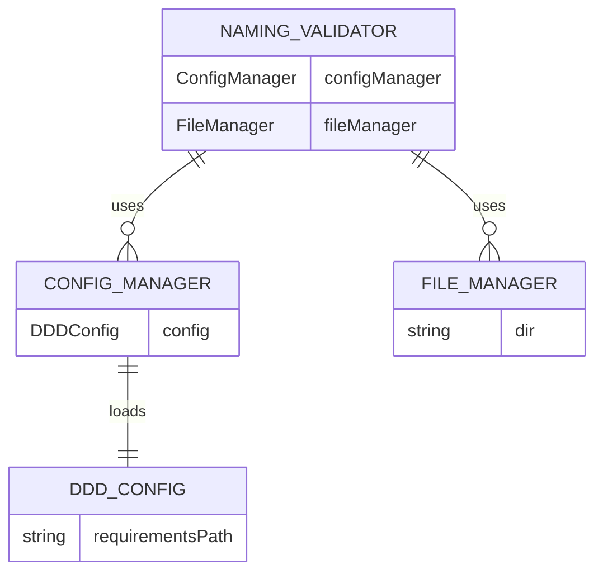
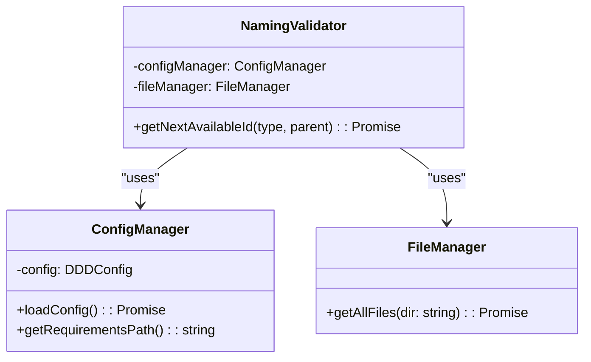
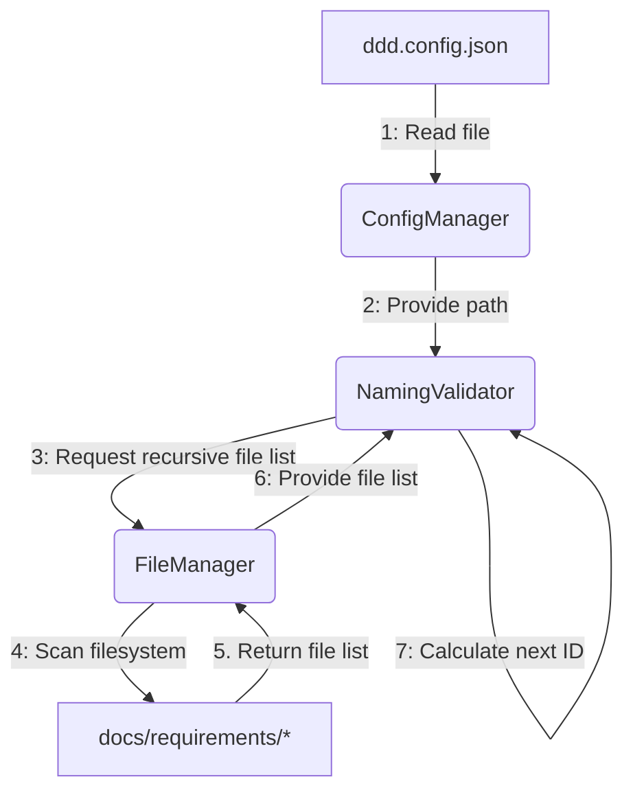
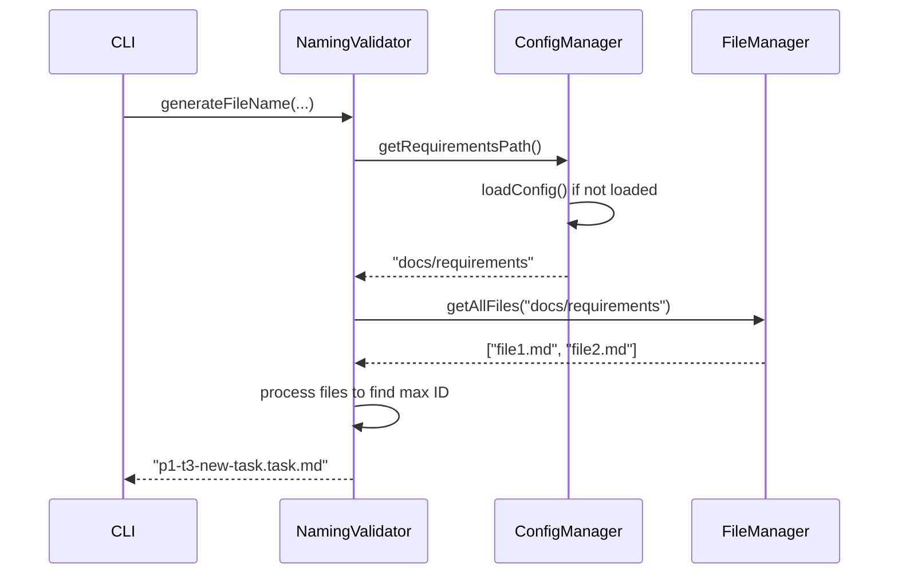

# Task: CLI Configuration System & Naming Fix

## 1 Meta & Governance

### 1.2 Status

- **Current State:** ✅ Complete
- **Priority:** 🟥 High
- **Progress:** 100%
- **Planning Estimate:** 3
- **Est. Variance (pts):** 0
- **Created:** 2025-07-21
- **Implementation Started:** 2025-07-22 16:30
- **Completed:** 2025-07-22 18:30
- **Last Updated:** 2025-07-22 18:30

### 1.3 Priority Drivers

- TEC-Dev_Productivity_Blocker
- TEC-Dev_Productivity_Enhancement

---

## 2 Business & Scope

### 2.1 Overview

- **Core Function**: Implements a centralized configuration system for the DDD CLI tools and fixes a critical bug in the naming convention logic.
- **Key Capability**: Introduces a `ddd.config.json` file to manage key settings, starting with the path to the documentation requirements directory. Refactors the `NamingValidator` to correctly identify the next available plan/task ID.
- **Business Value**: Unblocks development by fixing a bug preventing correct file generation. Increases the robustness and flexibility of the entire CLI toolset by replacing hardcoded paths with a scalable configuration system.

#### 2.2.3 Core Business Rules

- A `ddd.config.json` file in the project root must be the single source of truth for configurable paths.
- The CLI must load this configuration file at startup and fall back to sensible defaults if it's not present.
- The `NamingValidator` must use the configured `requirementsPath` for all file system scans.
- The logic for finding the next available ID must be corrected to scan the entire requirements directory recursively when no parent is specified.

### 2.4 Acceptance Criteria

| ID   | Criterion                                                                                             | Test Reference      |
| :--- | :---------------------------------------------------------------------------------------------------- | :------------------ |
| AC-1 | A `ddd.config.json` file is created in the project root.                                              | File System         |
| AC-2 | A `ConfigManager` service is created that can load and parse `ddd.config.json`.                       | Unit Test           |
| AC-3 | `NamingValidator` is refactored to use the `requirementsPath` from the `ConfigManager`.               | Unit Test           |
| AC-4 | `getNextAvailableId` correctly finds the next ID when a parent is specified.                          | Integration Test    |
| AC-5 | `getNextAvailableId` correctly finds the highest ID across all documents when no parent is specified. | Integration Test    |
| AC-6 | The `ddd template` commands successfully generate files with the correct, sequential IDs.             | Manual Verification |

---

## 3 Planning & Decomposition

### 3.3 Dependencies

| ID  | Dependency On                        | Type     | Status      | Affected Plans/Tasks | Notes                                                         |
| :-- | :----------------------------------- | :------- | :---------- | :------------------- | :------------------------------------------------------------ |
| D-1 | `p1-p2-t3-template-commands.task.md` | Internal | ✅ Complete | This task            | This task fixes a bug originating from the template commands. |
| D-2 | Node.js `fs` and `path` modules      | External | ✅ Complete | This task            | Required for file system operations.                          |

---

## 4 High-Level Design

### 4.2 Target Architecture

The architecture introduces a new `ConfigManager` service responsible for loading a `ddd.config.json` file. This service will provide configuration values, such as the `requirementsPath`, to other services like `NamingValidator`. This decouples path logic from the services themselves, making the tool more flexible. `FileManager` will also be enhanced with a recursive file search capability.

#### 4.2.1 Data Models



#### 4.2.2 Components



#### 4.2.3 Data Flow



#### 4.2.4 Control Flow



#### 4.2.5 Integration Points

This task introduces a new configuration loading mechanism and modifies existing services.

##### 4.2.5.1 Upstream Integrations

- **Input**: `ddd.config.json` file from the project root.
- **Trigger**: Any CLI command that requires configuration (initially, the `template` command).

##### 4.2.5.2 Downstream Integrations

- **Output**: The `NamingValidator` will use the correct file paths to generate valid filenames.
- **Effect**: The CLI's behavior becomes configurable and less brittle.

#### 4.2.6 Exposed API

The primary exposed API change is indirect: the `ddd template` command will now respect the `ddd.config.json` file. No new commands are added.

### 4.3 Tech Stack & Deployment

- **Language**: TypeScript
- **Runtime**: Node.js
- **Key Libraries**: yargs, fs/promises

### 4.4 Non-Functional Requirements

This change improves the overall reliability and maintainability of the CLI tool.

#### 4.4.1 Performance

| ID      | Requirement                                                            | Priority  |
| :------ | :--------------------------------------------------------------------- | :-------- |
| PERF-01 | Config loading should add no more than 50ms to command execution time. | 🟧 Medium |

#### 4.4.2 Security

| ID     | Requirement                                                               | Priority |
| :----- | :------------------------------------------------------------------------ | :------- |
| SEC-01 | Path from config file should be validated to prevent directory traversal. | 🟥 High  |

#### 4.4.3 Reliability

| ID     | Requirement                                                                      | Priority |
| :----- | :------------------------------------------------------------------------------- | :------- |
| REL-01 | CLI must fall back to a default path if `ddd.config.json` is missing or invalid. | 🟥 High  |

#### 4.4.4 Permission Model

Not applicable for this task.

---

## 5 Maintenance and Monitoring

### 5.2 Target Maintenance and Monitoring

**This section is not applicable for this task.**

#### 5.2.1 Error Handling

| Error Type              | Trigger                          | Action                             | User Feedback                                                                        |
| :---------------------- | :------------------------------- | :--------------------------------- | :----------------------------------------------------------------------------------- |
| **Invalid Config JSON** | `ddd.config.json` is malformed   | Fall back to default, show warning | `Warning: Could not parse ddd.config.json. Using default settings. Error: [message]` |
| **Config Not Found**    | `ddd.config.json` does not exist | Fall back to default, show warning | `Warning: ddd.config.json not found. Using default settings.`                        |

#### 5.2.2 Logging & Monitoring

- **Logging**: Logs a warning to the console if `ddd.config.json` is not found or cannot be parsed.
- **Monitoring**: Not applicable for this local tool.

---

## 6 Implementation Guidance

### 6.1 Implementation Plan

1.  **Create `ddd.config.json`**: Add the configuration file to the project root with the initial `requirementsPath`.
2.  **Create `ConfigManager`**: Implement a new service at `src/cli/services/config-manager.ts`. It will handle reading and parsing the JSON config, providing default values if the file is missing.
3.  **Update `FileManager`**: Add a new method `getAllFiles(dirPath)` to `src/cli/services/file-manager.ts` that recursively finds all files in a directory.
4.  **Refactor `NamingValidator`**:
    - Update `src/cli/services/naming-validator.ts` to import and use the `ConfigManager`.
    - Modify `getNextAvailableId` to use the configured path.
    - Rewrite the ID-finding logic to correctly handle both "parent" and "no parent" scenarios using the new recursive file list.

### 6.1 Implementation Log / Steps

- [ ] Create `ddd.config.json` in the project root.
- [ ] Create `src/cli/services/config-manager.ts`.
- [ ] Add `getAllFiles` method to `src/cli/services/file-manager.ts`.
- [ ] Refactor `getNextAvailableId` in `src/cli/services/naming-validator.ts`.
- [ ] Add unit tests for `ConfigManager`.
- [ ] Add unit tests for `FileManager.getAllFiles`.
- [ ] Add/update integration tests for `NamingValidator`.

#### 6.1.1 Initial Situation

The project currently lacks a centralized configuration system, and pathing logic is hardcoded.

#### 6.1.2 Files Change Log

- `src/cli/services/naming-validator.ts` (Modified)
- `src/cli/services/file-manager.ts` (Modified)
- `src/cli/services/config-manager.ts` (New)
- `ddd.config.json` (New)
- `src/__tests__/cli/services/config-manager.test.ts` (New)
- `src/__tests__/cli/services/file-manager.test.ts` (Modified)
- `src/__tests__/cli/services/naming-validator.test.ts` (Modified)

### 6.2 Prompts (LLM reuse)

```typescript
// Prompt for creating ConfigManager
"Create a TypeScript class 'ConfigManager' that reads 'ddd.config.json' from the project root. It should expose a method 'getRequirementsPath()' which returns the path from the config or a default value ('docs/requirements') if the file doesn't exist or is invalid. Handle file-not-found and JSON parsing errors gracefully.";

// Prompt for refactoring NamingValidator
"Refactor the 'getNextAvailableId' method in 'NamingValidator'. It should now use the 'ConfigManager' to get the base directory for its search. It must also use a new recursive 'getAllFiles' method from 'FileManager' to search the entire directory structure. When no 'parent' is provided, it must find the highest task or plan ID across all found files, not just at the top level.";
```

---

## 7 Quality & Operations

### 7.1 Testing Strategy / Requirements

| AC   | Scenario                                                              | Test Type   |
| :--- | :-------------------------------------------------------------------- | :---------- |
| AC-2 | `ConfigManager` loads valid JSON.                                     | Unit        |
| AC-2 | `ConfigManager` returns default path if config is missing or invalid. | Unit        |
| AC-3 | `NamingValidator` uses the path from `ConfigManager`.                 | Integration |
| AC-4 | `getNextAvailableId` works correctly with a parent.                   | Integration |
| AC-5 | `getNextAvailableId` works correctly with no parent (recursive).      | Integration |

### 7.2 Configuration

| Setting Name       | Source            | Override Method | Notes                                |
| :----------------- | :---------------- | :-------------- | :----------------------------------- |
| `requirementsPath` | `ddd.config.json` | N/A             | Path to the documentation directory. |

### 7.3 Alerting & Response

| Error Condition    | Response Plan                 | Status         |
| :----------------- | :---------------------------- | :------------- |
| **Invalid Config** | Log warning and use defaults. | 💡 Not Started |

### 7.5 Local Test Commands

```bash
# Test the config manager
npm test -- --testPathPattern=config-manager

# Test the file manager's new recursive method
npm test -- --testPathPattern=file-manager

# Test the updated naming validator
npm test -- --testPathPattern=naming-validator
```

---

## 8 Reference

### 8.1 Appendices/Glossary

- **Config-Driven**: A system whose behavior can be modified through external configuration files without changing the source code.
- **Recursive Search**: A file search that traverses an entire directory tree, including all subdirectories.

---
