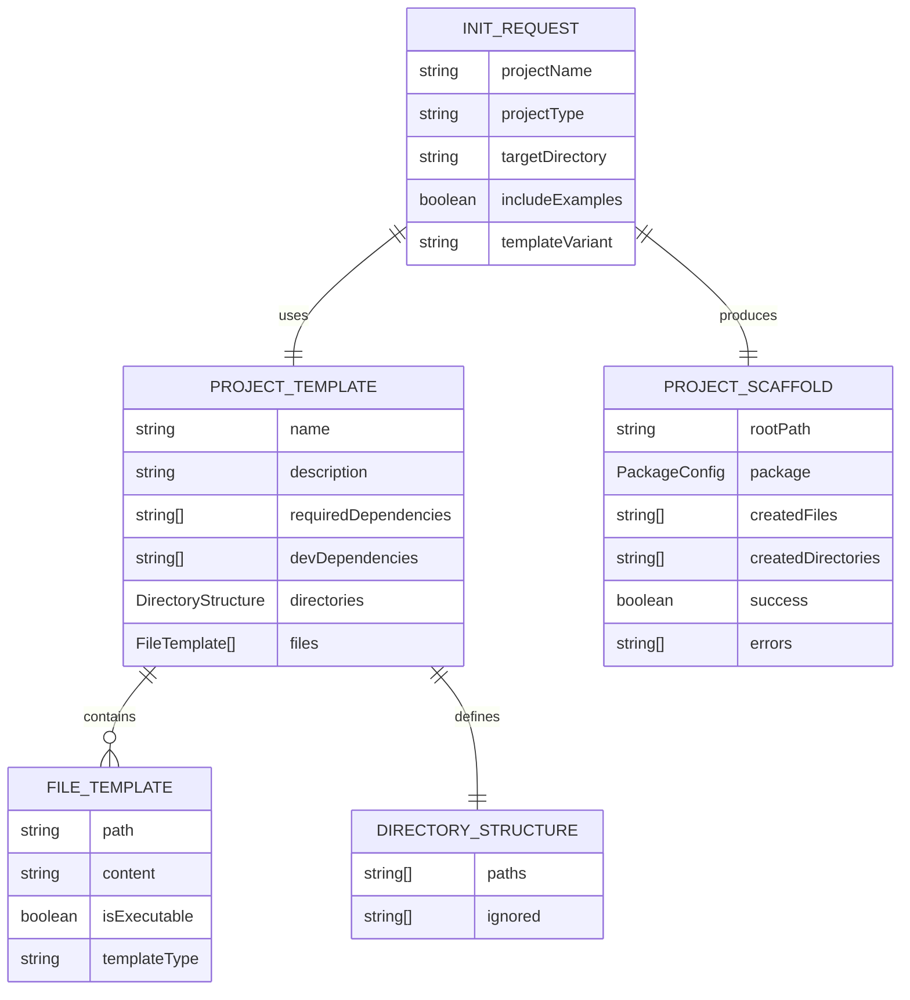
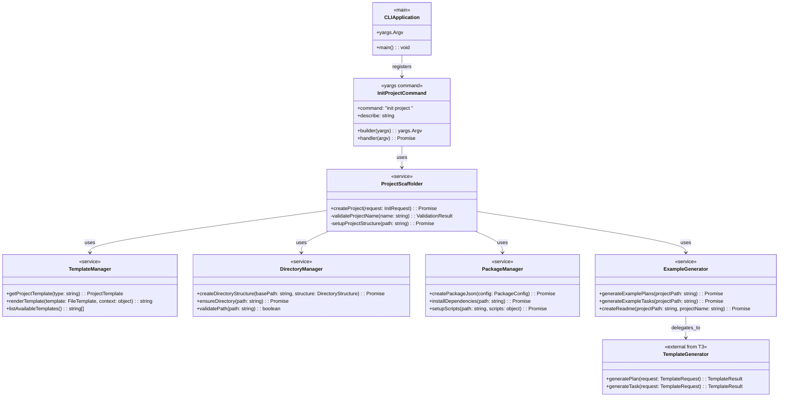
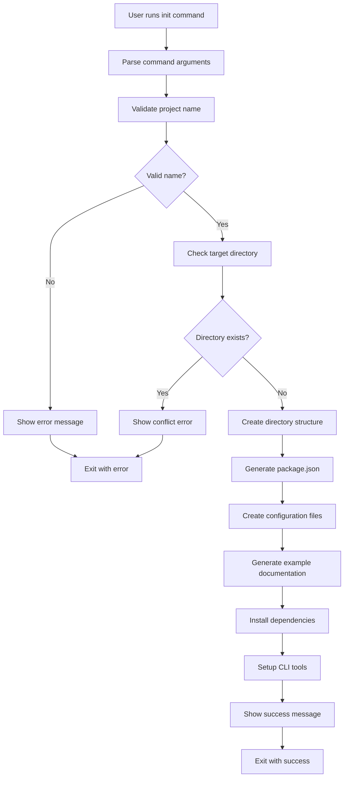
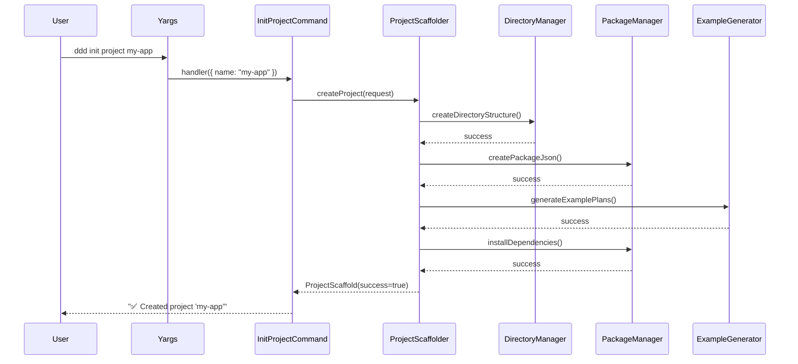

# Task: Project Initialization CLI Commands

## 1 Meta & Governance

### 1.2 Status

- **Current State:** 💡 Not Started
- **Priority:** 🟥 High
- **Progress:** 0%
- **Planning Estimate:** 12
- **Est. Variance (pts):** 0
- **Created:** 2025-01-19 21:00
- **Implementation Started:** [YYYY-MM-DD HH:MM]
- **Completed:** [YYYY-MM-DD HH:MM]
- **Last Updated:** 2025-01-19 21:00

### 1.3 Priority Drivers

- UX-Noticeable_Friction
- TEC-Dev_Productivity_Enhancement

---

## 2 Business & Scope

### 2.1 Overview

- **Core Function**: Implements CLI command `ddd init project` that creates complete DDD project structures with proper directory layouts, configuration files, and initial documentation.
- **Key Capability**: Transforms the complex process of setting up a new DDD project into a single command that generates a fully functional project scaffold with best practices built-in.
- **Business Value**: Eliminates the biggest barrier to DDD adoption by providing instant project setup that includes all necessary files, proper structure, and example documentation to get teams started immediately.

### 2.2.3 Core Business Rules

- All generated projects must follow the established DDD directory structure and naming conventions
- Generated projects must include a working CLI setup with the ddd command pre-configured
- All generated projects must include example plans and tasks that demonstrate proper DDD methodology
- Projects must include proper package.json configuration with all necessary dependencies
- Generated documentation must be schema-compliant and ready for immediate use
- Projects must include proper TypeScript/Node.js configuration for immediate development

### 2.4 Acceptance Criteria

| ID    | Criterion                                                                              | Test Reference                |
| :---- | :------------------------------------------------------------------------------------- | :---------------------------- |
| AC-1  | `ddd init project <name>` creates a complete project directory with proper structure   | CLI integration test          |
| AC-2  | Generated project includes working package.json with correct dependencies              | Package validation test       |
| AC-3  | Generated project includes functional CLI setup with ddd command                       | CLI functionality test        |
| AC-4  | Generated project includes example plans and tasks with proper naming                  | Documentation validation test |
| AC-5  | Generated projects include proper .gitignore and other development configuration files | Configuration validation test |
| AC-6  | CLI validates project names and prevents invalid directory creation                    | Name validation test          |
| AC-7  | Generated projects include proper TypeScript configuration and build setup             | Build system test             |
| AC-8  | CLI provides clear progress feedback during project creation                           | User experience test          |
| AC-9  | Generated projects include README with DDD methodology guidance                        | Documentation quality test    |
| AC-10 | CLI supports `--template` flag for different project types (basic, full, enterprise)   | Template variation test       |

---

## 3 Planning & Decomposition

### 3.3 Dependencies

| ID  | Dependency On                                | Type     | Status         | Affected Plans/Tasks | Notes                                                               |
| :-- | :------------------------------------------- | :------- | :------------- | :------------------- | :------------------------------------------------------------------ |
| D-1 | p1-p2-t1-cli-framework.task.md               | Internal | ✅ Complete    | This task            | CLI framework and yargs setup required                              |
| D-2 | p1-p2-t3-template-commands.task.md           | Internal | 💡 Not Started | This task            | Template generation functions for creating example docs in projects |
| D-3 | P1 Schema System (src/generate-templates.ts) | Internal | ✅ Complete    | This task            | Schema system for generating compliant documentation                |
| D-4 | P1 Types System (src/types.ts)               | Internal | ✅ Complete    | This task            | Type definitions for validation and structure                       |

---

## 4 High-Level Design

### 4.2 Target Architecture

The init commands will create complete project scaffolds by orchestrating directory creation, file generation, and dependency management. This builds on the template generation capabilities while adding project-level concerns like build systems and package management.

#### 4.2.1 Data Models



#### 4.2.2 Components



#### 4.2.3 Data Flow



#### 4.2.4 Control Flow



#### 4.2.5 Integration Points

##### 4.2.5.1 Upstream Integrations

- **Trigger**: User command-line invocation with project name and options
- **Input Data**: Command arguments (project name, template type, target directory, flags)
- **Dependencies**: CLI framework from T1, template generation from T3, P1 schema system

##### 4.2.5.2 Downstream Integrations

- **Output**: Complete project directory structure with all files
- **Package Installation**: npm/yarn dependency installation
- **CLI Setup**: Functional ddd command in generated project
- **Success Feedback**: Console messages with next steps guidance

#### 4.2.6 Exposed API

**CLI Commands:**

```bash
# Create a new DDD project
ddd init project <name> [--template <type>] [--output-dir <dir>] [--no-install] [--no-examples]

# Show available project templates
ddd init --list-templates

# Examples:
ddd init project my-ddd-app
ddd init project enterprise-system --template enterprise
ddd init --list-templates
ddd init project basic-app --output-dir ./projects --no-install
```

**Command Options:**

- `--template, -t`: Project template type (basic, full, enterprise) - default: basic
- `--output-dir, -o`: Parent directory for project creation (default: current directory)
- `--no-install`: Skip npm dependency installation
- `--no-examples`: Skip generation of example plans and tasks
- `--list-templates`: Show available project template types
- `--help, -h`: Show command help and examples

### 4.3 Tech Stack & Deployment

- **CLI Framework**: yargs (inherited from T1)
- **File System**: Node.js fs/promises for async file operations
- **Path Resolution**: Node.js path module for cross-platform compatibility
- **Template System**: Handlebars or similar for file template rendering
- **Package Management**: npm/yarn for dependency installation
- **Template Generation**: T3 template commands for individual documents
- **Schema System**: P1 system for generating compliant documentation

### 4.4 Non-Functional Requirements

#### 4.4.1 Performance

| ID      | Requirement                                                                      | Priority  |
| :------ | :------------------------------------------------------------------------------- | :-------- |
| PERF-01 | Project creation must complete in < 30 seconds including dependency installation | 🟧 Medium |
| PERF-02 | Component creation must complete in < 5 seconds                                  | 🟧 Medium |
| PERF-03 | CLI startup time must remain < 500ms                                             | 🟨 Low    |

#### 4.4.2 Security

| ID     | Requirement                                                           | Priority  |
| :----- | :-------------------------------------------------------------------- | :-------- |
| SEC-01 | CLI must validate output paths to prevent directory traversal attacks | 🟥 High   |
| SEC-02 | Project names must be sanitized to prevent shell injection            | 🟥 High   |
| SEC-03 | Generated package.json must not include vulnerable dependencies       | 🟧 Medium |

#### 4.4.3 Reliability

| ID     | Requirement                                                                    | Priority  |
| :----- | :----------------------------------------------------------------------------- | :-------- |
| REL-01 | Failed project creation must clean up partial artifacts                        | 🟥 High   |
| REL-02 | CLI must handle npm/yarn installation failures gracefully                      | 🟥 High   |
| REL-03 | Network failures during dependency installation must not corrupt project state | 🟧 Medium |

---

## 5 Maintenance and Monitoring

### 5.2 Target Maintenance and Monitoring

#### 5.2.1 Error Handling

| Error Type                   | Trigger                                            | Action                                   | User Feedback                                                                                    |
| :--------------------------- | :------------------------------------------------- | :--------------------------------------- | :----------------------------------------------------------------------------------------------- |
| **Invalid Project Name**     | Name contains invalid characters or reserved words | Show validation error with valid format  | `ERROR: Invalid project name. Use lowercase letters, numbers, and hyphens only.`                 |
| **Directory Already Exists** | Target project directory already exists            | Abort operation, suggest alternatives    | `ERROR: Directory 'my-app' already exists. Use --force to overwrite or choose a different name.` |
| **Permission Error**         | Cannot create directory or files                   | Show detailed error with suggested fixes | `ERROR: Permission denied creating directory. Check write permissions for current directory.`    |
| **Network Error**            | npm/yarn installation fails                        | Offer to continue without deps or retry  | `WARNING: Dependency installation failed. Project created but run 'npm install' manually.`       |
| **Template Error**           | Template rendering or generation fails             | Show internal error and recovery options | `ERROR: Template generation failed. Project structure created but documentation incomplete.`     |

#### 5.2.2 Logging & Monitoring

- **Progress Logging**: Real-time feedback during project creation with step-by-step progress
- **Error Logging**: Detailed error messages with actionable guidance and recovery options
- **Debug Mode**: Verbose logging available via `--debug` flag showing all file operations
- **Success Summary**: Completion report with created files, installed dependencies, and next steps

---

## 6 Implementation Guidance

### 6.1 Implementation Log / Steps

- [ ] Create `src/cli/commands/init.ts` with yargs command structure for project initialization
- [ ] Implement project subcommand with `builder` and `handler` functions
- [ ] Create `src/cli/services/project-scaffolder.ts` main orchestration service
- [ ] Create `src/cli/services/template-manager.ts` for project template management
- [ ] Create `src/cli/services/directory-manager.ts` for file system operations
- [ ] Create `src/cli/services/package-manager.ts` for npm/package.json handling
- [ ] Create `src/cli/services/example-generator.ts` for creating sample documentation
- [ ] Create project template definitions (basic, full, enterprise) in `src/cli/templates/`
- [ ] Integrate with T3 template generation for individual documents
- [ ] Register init command in main CLI application (src/cli/index.ts)
- [ ] Add progress feedback and error handling following yargs patterns
- [ ] Implement cleanup on failure to prevent partial project states
- [ ] Add command help documentation using yargs describe/example features
- [ ] Write integration tests for all init commands using Jest + temp filesystem
- [ ] Write unit tests for all service components

#### 6.1.1 Initial Situation

- CLI framework is established from T1 with yargs setup and command registration pattern
- Template generation capabilities will be available from T3 for individual documents
- P1 schema system provides type definitions and template generation functions
- No project-level initialization capabilities exist - only individual document creation
- Need to bridge from document-level to project-level scaffolding

#### 6.1.2 Files Change Log

- [ ] `src/cli/commands/init.ts` - New yargs command module with project initialization
- [ ] `src/cli/services/project-scaffolder.ts` - Main project creation orchestration service
- [ ] `src/cli/services/template-manager.ts` - Project template loading and rendering
- [ ] `src/cli/services/directory-manager.ts` - Directory structure creation and management
- [ ] `src/cli/services/package-manager.ts` - Package.json creation and npm operations
- [ ] `src/cli/services/example-generator.ts` - Example documentation generation
- [ ] `src/cli/templates/` - Directory containing project template definitions
- [ ] `src/cli/templates/basic/` - Basic project template files
- [ ] `src/cli/templates/full/` - Full project template files
- [ ] `src/cli/templates/enterprise/` - Enterprise project template files
- [ ] `src/cli/index.ts` - Register init command in main yargs application
- [ ] `__tests__/cli/commands/init.test.ts` - Integration tests for init commands
- [ ] `package.json` - Add template rendering dependencies (handlebars, etc.)

### 6.2 Prompts (LLM reuse)

```typescript
// Generate yargs init command implementation
Implement a yargs command module that:
1. Exports a command object with "init <subcommand>" structure
2. Includes "project <name>" subcommand and --list-templates option
3. Uses builder() function to define options like --template and --output-dir
4. Uses handler() function to orchestrate project creation through ProjectScaffolder
5. Follows the pattern established in src/cli/commands/hello.ts and template.ts

// Generate project template system
Create a template management system that:
1. Loads project template definitions from src/cli/templates/
2. Supports multiple template variants (basic, full, enterprise)
3. Renders template files with project-specific variables (name, description)
4. Provides template listing and validation capabilities
5. Integrates with file system operations for project creation
```

---

## 7 Quality & Operations

### 7.1 Testing Strategy / Requirements

| AC    | Scenario                                                       | Test Type   | Tools / Runner               | Notes                                       |
| :---- | :------------------------------------------------------------- | :---------- | :--------------------------- | :------------------------------------------ |
| AC-1  | `ddd init project my-app` creates complete directory structure | Integration | Jest + temp filesystem       | Test full project creation                  |
| AC-2  | Generated package.json has correct dependencies and scripts    | Unit        | Jest + JSON validation       | Verify package configuration                |
| AC-3  | Generated project has working ddd CLI setup                    | Integration | Jest + child_process         | Test CLI functionality in generated project |
| AC-4  | Generated documentation is schema-compliant                    | Unit        | Jest + schema validation     | Parse and validate generated docs           |
| AC-5  | `ddd init component` creates proper component structure        | Integration | Jest + filesystem            | Test component creation in existing project |
| AC-6  | Invalid project names are rejected with clear errors           | Unit        | Jest + validation            | Test various invalid inputs                 |
| AC-7  | TypeScript compilation works in generated projects             | Integration | Jest + tsc                   | Test build system setup                     |
| AC-8  | Progress feedback is shown during creation                     | Unit        | Jest + console capture       | Verify user experience                      |
| AC-9  | Generated README contains proper DDD guidance                  | Unit        | Jest + content analysis      | Verify documentation quality                |
| AC-10 | Template variants create different project structures          | Integration | Jest + filesystem comparison | Test template system                        |

### 7.2 Configuration

| Setting Name          | Plan Dependency | Source     | Override Method      | Notes                               |
| :-------------------- | :-------------- | :--------- | :------------------- | :---------------------------------- |
| `defaultTemplate`     | CLI Tools       | CLI config | `--template` flag    | Default: 'basic' project template   |
| `packageManager`      | CLI Tools       | CLI config | Environment variable | npm vs yarn preference              |
| `defaultOutputDir`    | CLI Tools       | CLI config | `--output-dir` flag  | Default: current working directory  |
| `installDependencies` | CLI Tools       | CLI config | `--no-install` flag  | Default: true, install dependencies |
| `includeExamples`     | CLI Tools       | CLI config | `--no-examples` flag | Default: true, generate examples    |

### 7.3 Alerting & Response

| Error Condition                     | Relevant Plans       | Response Plan                                                 | Status         |
| :---------------------------------- | :------------------- | :------------------------------------------------------------ | :------------- |
| **Project Creation Failure**        | CLI Tools, P1 Schema | Clean up partial artifacts, provide recovery guidance         | 💡 Not Started |
| **Dependency Installation Failure** | CLI Tools            | Continue with project creation, warn user to install manually | 💡 Not Started |
| **Template Rendering Error**        | CLI Tools, P1 Schema | Fall back to basic template or manual creation guidance       | 💡 Not Started |
| **File System Permission Error**    | CLI Tools            | Provide clear permission guidance with suggested solutions    | 💡 Not Started |

### 7.5 Local Test Commands

```bash
# Run all init command tests
npm test -- --testPathPattern=init

# Test specific init functionality
npm test -- --testNamePattern="init project command"

# Run integration tests with filesystem
npm test -- --testPathPattern=integration/init

# Test init commands manually (after npm link for global access)
ddd init project test-project
ddd init --list-templates

# Test error scenarios
ddd init project ""  # invalid name
ddd init project existing-dir  # directory conflict
ddd init project test --template nonexistent  # invalid template

# Test template variants
ddd init project basic-app --template basic
ddd init project full-app --template full
ddd init project enterprise-app --template enterprise

# Test without installation
ddd init project no-deps-app --no-install --no-examples
```

---

## 8 Reference

### 8.1 Appendices/Glossary

**Glossary:**

- **Project Scaffold**: Complete directory structure with configuration files for a new DDD project
- **Project Structure**: The directory layout and files that make up a complete DDD project
- **Template Variant**: Different project types (basic, full, enterprise) with varying complexity and features
- **Project Template**: A set of files and directory structure that serves as the starting point for new projects
- **Package Manager**: npm or yarn tool for managing Node.js dependencies
- **CLI Setup**: Configuration that enables the ddd command to work within the generated project
