# Plan: Git-Integrated DDD Workflow

## 1 Meta & Governance

### 1.2 Status

- **Created:** 2025-07-23 06:38
- **Last Updated:** 2025-07-23 06:38

### 1.3 Priority Drivers

- TEC-Dev_Productivity_Enhancement
- TEC-Tech_Debt_Refactor
- CBP-Incremental_Improvement

---

## 2 Business & Scope

### 2.1 Overview

- **Core Function**: Integrates the Git version control system directly into the Documentation-Driven Development (DDD) workflow.
- **Key Capability**: Introduces automation, validation, and tooling that enforce a direct, traceable link between every code change and its corresponding DDD Task document.
- **Business Value**: Matures the DDD methodology by eliminating manual process adherence, increasing developer productivity, and creating a fully auditable, self-documenting development history. This reduces "code archaeology" and enhances both maintenance and onboarding.

### 2.2 Business Context

The current DDD process successfully establishes documentation as the source of truth. However, the link between the documentation and the resulting code is based on manual developer discipline (e.g., referencing tasks in commit messages). This creates a risk of inconsistency and requires developers to perform several manual steps to stay compliant.

This plan addresses that gap by weaving Git directly into the fabric of the DDD workflow. By introducing automation via Git hooks and developer-friendly CLI commands, we can make the "right way" the "easy way," ensuring that every commit is programmatically tied to a specific, documented task. This transforms the Git history from a simple log of changes into a rich, queryable database explaining _why_ every change was made.

#### 2.2.1 User Journeys

##### 2.2.1.1 Journey: Developer Starts and Completes a Task

This journey describes the ideal, end-to-end workflow for a developer implementing a single, documented task.

```mermaid
sequenceDiagram
    participant Developer
    participant CLI
    participant Git
    participant TaskDoc as Task Document

    Developer->>CLI: ddd start p1-p2-t1-new-feature
    CLI->>TaskDoc: Update status to 'In Progress'
    CLI->>Git: git checkout -b task/p1-p2-t1-new-feature
    CLI-->>Developer: ✅ Ready to work on task.

    Developer->>Developer: Writes code...
    Developer->>CLI: ddd commit
    CLI->>Git: git add .
    CLI->>Git: git commit -m "feat(scope): subject (refs: p1-p2-t1-new-feature)"
    CLI-->>Developer: ✅ Commit created and linked to task.
```



##### 2.2.1.2 Journey: Team Lead Reviews a Pull Request

This journey shows how the integrated system provides immediate context for code reviews.


#### 2.2.2 User Personas

| Persona               | Goal                                                                                                                 |
| :-------------------- | :------------------------------------------------------------------------------------------------------------------- |
| **Project Developer** | To implement features efficiently with a clear, low-friction process that guarantees compliance with DDD principles. |
| **Team Lead**         | To review code changes with full context and ensure every change is traceable to a documented requirement.           |
| **QA Engineer**       | To understand the exact scope and acceptance criteria of a change by tracing a commit back to its task document.     |

#### 2.2.3 Core Business Rules

- **Task-Commit Linkage**: Every `git commit` MUST be associated with exactly one Task ID. No commits are allowed without this linkage.
- **Branching Convention**: All development work for a task MUST be done on a branch named according to the pattern `task/<task_id>`.
- **Automated Validation**: The system MUST automatically validate commit messages and branch names to enforce compliance.
- **Status Synchronization**: The state of the task (e.g., "In Progress") SHOULD be synchronized with the start of development work (e.g., branch creation).

#### 2.2.4 User Stories

- As a **Project Developer**, I want to run a single command (`ddd start`) to begin a task, so that my branch is created and the task status is updated automatically.
- As a **Project Developer**, I want to use a simple command (`ddd commit`) to create a compliant commit message, so that I don't have to remember the format.
- As a **Team Lead**, I want every commit in a pull request to link back to its task document, so that I can perform context-rich code reviews without asking for clarification.
- As a **Platform Engineer**, I want to enforce the DDD workflow automatically using Git hooks, so that developer discipline is not required for compliance.

### 2.3 Success Criteria

- A `commit-msg` Git hook is implemented and successfully rejects any commit message that does not reference a valid Task ID.
- A task-driven branching strategy (`task/<task_id>`) is successfully enforced, potentially via `pre-commit` hooks or CLI tooling.
- New `ddd` CLI commands (`start`, `commit`) are created and successfully abstract away the underlying Git operations and status updates.
- The developer workflow for starting, implementing, and committing a task is measurably faster and less error-prone than the current manual process.

### 2.5 Boundaries & Scope

#### 2.5.1 In Scope

- **Git Hooks**: Implementation of `commit-msg` and potentially `pre-commit` hooks to enforce the workflow.
- **CLI Tooling**: Creation of new `ddd` commands (`start`, `commit`) that wrap Git commands and interact with task documents.
- **Branching Strategy**: Defining and encouraging a task-based branching convention.
- **Commit Message Convention**: Defining and enforcing a standardized commit message format that includes a task reference.
- **Local Environment Setup**: Providing scripts or commands to help developers easily install the Git hooks in their local repository clones.

#### 2.5.2 Out of Scope

- **CI/CD Integration**: This plan focuses on the local development workflow. Integrating these checks into a CI/CD pipeline (e.g., validating PR titles on GitHub Actions) is a separate, future initiative.
- **Complex Git Operations**: The CLI wrappers will focus on the core workflow (`start`, `commit`). Advanced operations like rebasing, merging, and cherry-picking will remain standard Git commands.
- **Graphical User Interfaces**: No GUI tools will be developed. This plan is focused on the command-line experience.
- **Remote Git Provider Integration**: The tools will not directly interact with APIs from GitHub, GitLab, etc.

### 2.6 Core Business Processes

#### 2.6.1 Process: The Git-Integrated DDD Cycle

This process replaces the manual steps with a streamlined, tool-assisted workflow.

- **Participants**: Developer, DDD CLI, Git, Task Documents
- **Goal**: To implement a documented task with full traceability and automated compliance.
- **Workflow**:
  1.  **Start Task**: Developer runs `ddd start <task_id>`. The CLI updates the task document's status and creates a corresponding `task/<task_id>` Git branch.
  2.  **Implement**: Developer writes code and tests to meet the task's acceptance criteria.
  3.  **Commit Changes**: Developer uses `ddd commit`. The CLI stages files and creates a commit with a compliant message, automatically referencing the `<task_id>` from the branch name.
  4.  **Push & PR**: Developer uses standard `git push` and creates a Pull Request.
  5.  **Review**: The Team Lead reviews the PR, using the task references in the commit log to understand the full context of the changes.

---

## 3 Planning & Decomposition

### 3.1 Roadmap (In-Focus Items)

| ID  | Child Plan/Task                                                                     | Priority  | Priority Drivers                 | Status         | Depends On | Summary                                                                                  |
| :-- | :---------------------------------------------------------------------------------- | :-------- | :------------------------------- | :------------- | :--------- | :--------------------------------------------------------------------------------------- |
| T9  | [Git Hook Integration](./p1-p2-p3.t9-git-hooks.task.md)                             | 🟥 High   | TEC-Dev_Productivity_Enhancement | 💡 Not Started | —          | Implement and document the `commit-msg` Git hook to enforce commit message conventions.  |
| T10 | [CLI 'start' Command](./p1-p2-p3.t10-cli-start-command.task.md)                     | 🟧 Medium | TEC-Dev_Productivity_Enhancement | 💡 Not Started | —          | Create the `ddd start <task_id>` command to automate branch creation and status updates. |
| T11 | [CLI 'commit' Command](./p1-p2-p3.t11-cli-commit-command.task.md)                   | 🟧 Medium | TEC-Dev_Productivity_Enhancement | 💡 Not Started | T9         | Create the `ddd commit` command to simplify the creation of compliant commit messages.   |
| T27 | [Interactive Commit Selection](./p1-p2-p3.t27-interactive-commit-selection.task.md) | 🟧 Medium | UX-Noticeable_Friction           | 💡 Not Started | -          | Create a reusable CLI utility for interactively selecting a commit from git history.     |

### 3.2 Backlog / Icebox

- **CI/CD Integration**: A future plan to integrate these validation hooks into the remote CI/CD pipeline (e.g., GitHub Actions) to validate pull requests.
- **`pre-commit` Hook**: A hook to run `ddd lint` or other checks automatically before a commit is created. Deferred to keep initial scope focused.
- **Automated PR Creation**: A `ddd finish` command that could automatically push the branch and open a pull request on GitHub/GitLab.

### 3.3 Dependencies

| ID  | Dependency On                                        | Type     | Status         | Affected Plans/Tasks | Notes                                                                                         |
| :-- | :--------------------------------------------------- | :------- | :------------- | :------------------- | :-------------------------------------------------------------------------------------------- |
| D-1 | [p1.p2-cli-tools.plan.md](./p1.p2-cli-tools.plan.md) | Internal | ✅ Complete    | All Tasks            | The core CLI framework and existing commands are a prerequisite.                              |
| D-2 | `husky`                                              | External | 💡 Not Started | T9                   | A library to manage Git hooks easily and reliably. Will need to be added as a dev dependency. |
| D-3 | `simple-git`                                         | External | 💡 Not Started | T10, T11             | A library to programmatically execute Git commands from within the Node.js CLI application.   |

### 3.4 Decomposition Graph


---

## 4 High-Level Design

### 4.0 Guiding Principles

- **Leverage, Don't Reinvent**: The solution must use standard, idiomatic Git features. It should feel like a natural extension of Git, not a replacement for it.
- **Automate for Compliance**: The system should use automation (hooks, CLI tools) to make following the process the path of least resistance.
- **Developer Experience is Key**: Tooling should be intuitive, fast, and provide clear, actionable feedback. The goal is to reduce friction, not add it.
- **Decouple for Maintainability**: The Git-related logic should be encapsulated in dedicated services and hooks, separate from the core business logic of the application.

### 4.1 Current Architecture

The current system relies on manual developer discipline to link code changes to documentation. There is no automated enforcement of branching strategies or commit message formats. The `ddd` CLI interacts with the file system but has no awareness of the version control state.

#### 4.1.2 Components


### 4.2 Target Architecture

The target architecture introduces a new layer of automation and tooling that sits between the developer and Git. This layer, composed of Git hooks and new CLI commands, will orchestrate the DDD workflow, ensuring compliance and providing a streamlined developer experience.

#### 4.2.1 Data Models


#### 4.2.2 Components


#### 4.2.3 Data Flow

**`ddd start <task_id>` command flow:**


**`commit-msg` hook flow:**


#### 4.2.4 Control Flow

```mermaid
sequenceDiagram
    participant User
    participant DddCli
    participant GitService
    participant TaskService

    User->>DddCli: "ddd start p1-p2-p3.t9-git-hooks"
    DddCli->>TaskService: "updateStatus('p1-p2-p3.t9', 'In Progress')"
    TaskService-->>DddCli: "Success"
    DddCli->>GitService: "createBranch('task/p1-p2-p3.t9-git-hooks')"
    GitService-->>DddCli: "Success"
    DddCli-->>User: "✅ Branch created and task started."
```



#### 4.2.5 Integration Points

##### 4.2.5.1 Upstream Integrations

- **Git**: The entire system is triggered by and interacts with the local Git repository's state and hooks mechanism.
- **File System**: The CLI and hooks need to read task documents to validate IDs and update statuses.

##### 4.2.5.2 Downstream Integrations

- **Developer's Shell**: The CLI and hooks provide direct feedback (success or error messages) to the developer in their terminal.

#### 4.2.6 Exposed API

**New CLI Commands:**

```bash
# Start working on a task
ddd start <task_id>

# Create a compliant commit
ddd commit
```

### 4.3 Tech Stack & Deployment

- **Git Hook Management**: `husky` to simplify the setup and maintenance of Git hooks in the repository.
- **Programmatic Git**: `simple-git` library for executing Git commands from within the Node.js-based CLI tools.
- **Shell Scripting**: The Git hooks themselves will be simple shell scripts that can call Node.js scripts for more complex logic.
- **Deployment**: The `husky` setup will be part of the project's `package.json`, installed via `npm install`. A command (`ddd install-hooks`) might be provided for easy setup.

### 4.4 Non-Functional Requirements

#### 4.4.2 Security

| ID     | Requirement                                                                                  | Priority |
| :----- | :------------------------------------------------------------------------------------------- | :------- |
| SEC-01 | CLI commands and hooks must not execute arbitrary code from commit messages or branch names. | 🟥 High  |
| SEC-02 | The tools must not expose any sensitive Git configuration or credentials.                    | 🟥 High  |

#### 4.4.3 Reliability

| ID     | Requirement                                                                                                                     | Priority |
| :----- | :------------------------------------------------------------------------------------------------------------------------------ | :------- |
| REL-01 | Git hooks must be fast (< 500ms) to avoid slowing down the developer's workflow.                                                | 🟥 High  |
| REL-02 | Failure in a hook or CLI command must provide a clear error message and must not leave the Git repository in a corrupted state. | 🟥 High  |

---

## 5 Maintenance and Monitoring

### 5.2 Target Maintenance and Monitoring

#### 5.2.1 Error Handling

The primary goal of error handling in this system is to provide immediate, clear, and actionable feedback to the developer within their terminal, ensuring they can correct issues without ambiguity.

| Error Type                 | Trigger                                                                          | Action                                                      | User Feedback                                                                          |
| :------------------------- | :------------------------------------------------------------------------------- | :---------------------------------------------------------- | :------------------------------------------------------------------------------------- |
| **Invalid Commit Message** | `commit-msg` hook fails to validate the message format.                          | Reject the commit with a non-zero exit code.                | `ERROR: Commit message does not follow format 'type(scope): subject (refs: task_id)'.` |
| **Invalid Task ID**        | The task ID referenced in a commit or branch does not exist.                     | Reject the operation (commit or branch creation).           | `ERROR: Task ID 'p1-p2-t99-nonexistent' not found.`                                    |
| **Invalid Branch Name**    | Developer tries to commit from a branch not following the `task/...` convention. | Reject the commit (if using `ddd commit`).                  | `ERROR: 'ddd commit' can only be run from a branch named 'task/<task_id>'.`            |
| **Git Command Failure**    | The underlying `simple-git` command fails (e.g., no repo, detached HEAD).        | Abort the CLI command and surface the underlying Git error. | `ERROR: Git operation failed: [Original Git error message].`                           |
| **File System Error**      | Cannot read or write to a task document to update its status.                    | Abort the operation and report the file system issue.       | `ERROR: Could not update status for task 'p1-p2-t9': [File system error].`             |

#### 5.2.2 Logging & Monitoring

Logging for this system is focused on developer feedback rather than backend monitoring.

- **Success Logging**: All successful CLI commands (`ddd start`, `ddd commit`) will output a clear, affirmative message confirming the actions taken (e.g., `✅ Branch 'task/p1-p2-p3.t9-git-hooks' created and checked out.`).
- **Error Logging**: All error messages will be prefixed with `ERROR:` and printed to `stderr`.
- **Debug Logging**: A global `--debug` flag on the `ddd` CLI will enable verbose logging from the `simple-git` library and other internal services, helping to diagnose complex issues.
- **Hook Logging**: Git hooks will print clear success or failure messages. On failure, they will output the same structured error messages as the CLI tools.

---

## 6 Implementation Guidance

### 6.1 Implementation Plan

The implementation will follow the tasks outlined in the roadmap, executed in phases to ensure stability and incremental progress.

| Phase                                | Scope / Deliverables                                                   | Key Artifacts                                                               | Exit Criteria                                                     |
| :----------------------------------- | :--------------------------------------------------------------------- | :-------------------------------------------------------------------------- | :---------------------------------------------------------------- |
| **Phase 1: Core Validation**         | Implement the `commit-msg` hook to enforce commit message format.      | `commit-msg` script, `husky` configuration, documentation for manual setup. | Commits without a valid `(refs: <task_id>)` are rejected.         |
| **Phase 2: Workflow Automation**     | Develop the `ddd start` and `ddd commit` CLI commands.                 | New files in `src/cli/commands/`, new `GitService` and `TaskService`.       | Developers can use the new CLI commands to manage their workflow. |
| **Phase 3: Rollout & Documentation** | Document the new workflow and provide setup instructions for the team. | Updates to `README.md`, a new `CONTRIBUTING.md` section.                    | The entire team can install the hooks and use the new workflow.   |

### 6.2 Prompts (LLM reuse)

**For creating the `commit-msg` hook script:**

```bash
"Create a Node.js script that can be used as a 'commit-msg' Git hook. It should:
1. Read the commit message from the file path passed as the first argument ($1).
2. Use a regular expression to check if the message contains '(refs: pX-tY-...)'.
3. If the pattern is not found, log an error message to the console and exit with a status of 1.
4. If the pattern is found, exit with a status of 0."
```

**For creating the `ddd start` command:**

```typescript
"Implement a yargs command 'start <taskId>'. It should:
1. Use a 'GitService' to create and checkout a new branch named 'task/<taskId>'.
2. Use a 'TaskService' to read the corresponding task file and update its status to 'In Progress'.
3. Handle errors gracefully if the task doesn't exist or the Git command fails."
```

---

## 7 Quality & Operations

### 7.1 Testing Strategy / Requirements

| Test Type             | Scope                                                             | Tools / Runner          | Notes                                                                  |
| :-------------------- | :---------------------------------------------------------------- | :---------------------- | :--------------------------------------------------------------------- |
| **Unit Tests**        | `GitService`, `TaskService`, and commit message validation logic. | Vitest                  | Mock `simple-git` and `fs` to isolate logic.                           |
| **Integration Tests** | `ddd start` and `ddd commit` commands.                            | Vitest, `child_process` | Run CLI commands against a temporary, dummy Git repository.            |
| **Manual E2E Tests**  | The full developer workflow.                                      | Manual                  | Follow the user journey to ensure the process is smooth and intuitive. |

### 7.2 Configuration

| Setting Name             | Source        | Override Method | Notes                                                                   |
| :----------------------- | :------------ | :-------------- | :---------------------------------------------------------------------- |
| **Commit Message Regex** | Code constant | N/A             | The regex used to validate commit messages.                             |
| **Branch Name Template** | Code constant | N/A             | The template string for creating task branches (e.g., `task/{taskId}`). |

### 7.3 Alerting & Response

This system does not have external alerting. All responses are delivered directly to the user's console as immediate feedback. See the `Error Handling` table in section 5.2.1 for the response plan.

### 7.4 Deployment Steps

1.  **Install Dependencies**: Run `npm install husky simple-git --save-dev`.
2.  **Configure Husky**: Run `npx husky init` and add the `commit-msg` hook to the `.husky/` directory.
3.  **Update `package.json`**: Add a `prepare` script to `package.json` to automatically run `husky install` for all team members after `npm install`.
4.  **Educate Team**: Announce the new workflow and provide instructions for pulling the latest changes and running `npm install` to get the new hooks.

---

## 8 Reference

### 8.1 Appendices/Glossary

- **Git Hook**: An automated script that runs at specific points in the Git lifecycle (e.g., before a commit, after a push).
- **Husky**: A popular tool for managing Git hooks in a Node.js project, making them easy to share across a team.
- **simple-git**: A lightweight Node.js library for programmatically running Git commands.
- **Conventional Commits**: A specification for adding human and machine-readable meaning to commit messages. Our proposed format is a variant of this.
