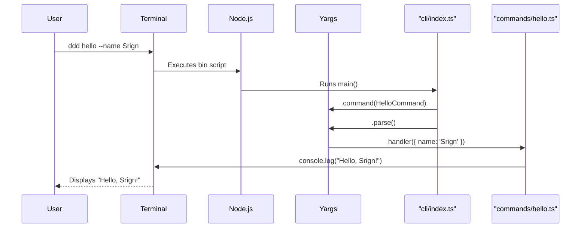

# Task: CLI Framework Setup

## 1 Meta & Governance

### 1.2 Status

- **Current State:** ✅ Complete
- **Priority:** 🟥 High
- **Progress:** 100%
- **Planning Estimate:** 1
- **Est. Variance (pts):** 0
- **Created:** 2025-07-20 05:52
- **Implementation Started:** 2025-01-19 17:15
- **Completed:** 2025-01-19 17:35
- **Last Updated:** 2025-01-19 17:35

### 1.3 Priority Drivers

- [TEC-Dev_Productivity_Enhancement](/docs/ddd-2.md#tec-dev_productivity_enhancement)

---

## 2 Business & Scope

### 2.1 Overview

- **Core Function**: Establishes the foundational structure for the DDD command-line interface using the `yargs` framework.
- **Key Capability**: Creates a runnable `ddd` command, sets up the argument parsing engine, and defines the file structure for adding future commands.
- **Business Value**: Provides the essential scaffolding required for all subsequent CLI feature development, enabling rapid implementation of template, init, and validation commands.

#### 2.2.3 Core Business Rules

- **Framework Selection**: The `yargs` library must be used for all command parsing and handling.
- **Entry Point**: A single binary entry point (`ddd`) must be defined in `package.json`.
- **Command Structure**: The initial implementation must include a placeholder command to verify the framework is working correctly.

### 2.4 Acceptance Criteria

| ID   | Criterion                                                                              | Test Reference      |
| :--- | :------------------------------------------------------------------------------------- | :------------------ |
| AC-1 | `yargs` and `@types/yargs` are added as development dependencies in `package.json`.    | `package.json`      |
| AC-2 | A `bin` entry for the `ddd` command is added to `package.json`.                        | `package.json`      |
| AC-3 | A `src/cli` directory is created to hold all CLI-related source code.                  | File System         |
| AC-4 | A `src/cli/index.ts` file is created as the main entry point for the CLI application.  | `src/cli/index.ts`  |
| AC-5 | Running `ddd --help` from the command line displays the yargs-generated help message.  | Manual Verification |
| AC-6 | A placeholder command (`ddd hello`) is implemented and returns a simple string output. | Manual Verification |

---

## 3 Planning & Decomposition

### 3.3 Dependencies

| ID  | Dependency On | Type     | Status         | Affected Plans/Tasks | Notes                                                           |
| :-- | :------------ | :------- | :------------- | :------------------- | :-------------------------------------------------------------- |
| D-1 | `yargs`       | External | 💡 Not Started | This task            | The core framework for parsing command-line arguments.          |
| D-2 | `tsx`         | External | ✅ Complete    | This task            | Already installed; will be used to run the TypeScript CLI code. |

---

## 4 High-Level Design

### 4.2 Target Architecture

The target architecture for the CLI framework is a modular system where each command is a self-contained module. This allows for clear separation of concerns and easy extensibility. The main `index.ts` will act as a router, delegating to the appropriate command module based on user input.

#### 4.2.1 Data Models

<!-- The structure of data at a high level, often represented as an Entity-Relationship Diagram. This section defines the core data entities and their relationships before detailing the components that manage them. -->


#### 4.2.2 Components


#### 4.2.3 Data Flow


#### 4.2.4 Control Flow



#### 4.2.5 Integration Points

- **Trigger**: User executes the `ddd` command from the terminal.
- **Input Data**: Command-line arguments and options parsed by `yargs`.

##### 4.2.5.1 Upstream Integrations

- **Completion Trigger**: The CLI process exits.
- **Output Data**: Writes output to `stdout` (e.g., command results) or `stderr` (e.g., error messages).

##### 4.2.5.2 Downstream Integrations

- **Completion Trigger**: The CLI process exits.
- **Output Data**: Writes output to `stdout` (e.g., command results) or `stderr` (e.g., error messages).

#### 4.2.6 Exposed API

This task only establishes the CLI framework. The primary "API" is the command-line interface itself.

```bash
ddd [command] [options]
```

- **`ddd hello`**: A placeholder command to verify setup.
- **`ddd --help`**: Displays help for all registered commands.

### 4.3 Tech Stack & Deployment

- **Language**: TypeScript
- **CLI Framework**: yargs
- **Runner**: tsx
- **Testing**: Jest
- **Deployment**: npm package `bin` script

### 4.4 Non-Functional Requirements

<!-- A container for the high-level, non-functional requirements (NFRs) or quality attributes that the system must meet. This section defines what the requirements are, while the `7. Quality & Operations` family describes how they will be tested and monitored. -->

[TODO: Add content for this section]

#### 4.4.1 Performance

<!-- Defines the performance-related NFRs, such as response times, throughput, and resource utilization, in a prioritized table. -->

<!--
EXAMPLE:
| ID | Requirement | Priority |
| :--- | :--- | :--- |
| PERF-01 | API endpoints must respond in < 200ms (95th percentile). | 🟥 High |
| PERF-02 | The system must support 100 concurrent users without degradation. | 🟧 Medium |
-->

[TODO: Add content for this section]

#### 4.4.2 Security

<!-- Defines the security-related NFRs, such as data encryption, access control, and vulnerability standards, in a prioritized table. -->

<!--
EXAMPLE:
| ID | Requirement | Priority |
| :--- | :--- | :--- |
| SEC-01 | All sensitive user data must be encrypted at rest using AES-256. | 🟥 High |
| SEC-02 | Access to admin endpoints must be restricted to users with 'Admin' role. | 🟥 High |
-->

[TODO: Add content for this section]

#### 4.4.3 Reliability

<!-- Defines the reliability-related NFRs, such as uptime, data integrity, and disaster recovery, in a prioritized table. -->

<!--
EXAMPLE:
| ID | Requirement | Priority |
| :--- | :--- | :--- |
| REL-01 | The service must maintain 99.9% uptime, measured monthly. | 🟥 High |
| REL-02 | All database transactions must be atomic and durable. | 🟥 High |
-->

[TODO: Add content for this section]

#### 4.4.4 Permission Model

<!-- Defines the access control rules, user roles, and permissions for the system. This section should clearly outline who can access what and perform which actions. The mechanism for assigning these roles in each environment should be detailed in the `7.2 Configuration` section. -->

<!--
EXAMPLE:
| Role | Permissions | Notes |
| :--- | :--- | :--- |
| **Admin** | - Full CRUD access to all documents<br>- Can assign roles | For system administrators only. |
| **Analyst** | - Read/Write access to assigned documents<br>- Cannot delete | The primary user role. |
| **Viewer** | - Read-only access to completed documents | For stakeholders or external users. |
-->

[TODO: Add content for this section]

---

## 5 Maintenance and Monitoring

### 5.2 Target Maintenance and Monitoring

#### 5.2.1 Error Handling

| Error Type                  | Trigger                               | Action                              | User Feedback                                  |
| :-------------------------- | :------------------------------------ | :---------------------------------- | :--------------------------------------------- |
| **Invalid Command**         | User enters a non-existent command.   | `yargs` shows help and suggestions. | `Unknown argument: [command]`                  |
| **Missing Required Option** | A required option is not provided.    | `yargs` shows the specific error.   | `Missing required argument: [option]`          |
| **TypeScript Error**        | A type error occurs during execution. | The `tsx` runner will halt and log. | Standard TypeScript error message to `stderr`. |

#### 5.2.2 Logging & Monitoring

- **Logging**: All output will be directed to `stdout` for successful operations and `stderr` for errors. No file-based logging is required for this simple CLI.
- **Monitoring**: Not applicable for a local command-line tool.

---

## 6 Implementation Guidance

### 6.1 Implementation Plan

- [ ] Install `yargs` and `@types/yargs` as dev dependencies.
- [ ] Add `bin` entry to `package.json`: `"ddd": "dist/cli/index.js"`.
- [ ] Create the `src/cli` directory.
- [ ] Create `src/cli/index.ts` with the main yargs setup.
- [ ] Create a `src/cli/commands` directory.
- [ ] Create a placeholder command `src/cli/commands/hello.ts`.
- [ ] Run `npm link` to make the `ddd` command available globally for testing.
- [ ] Verify `ddd --help` and `ddd hello` work as expected.

### 6.1 Implementation Log / Steps

- [x] Updated task status to "In Progress" with implementation started timestamp
- [x] Created `src/cli/index.ts` with main yargs setup and CLI application structure
- [x] Created `src/cli/commands/` directory for command modules
- [x] Created `src/cli/commands/hello.ts` placeholder command with name positional argument and caps option
- [x] Fixed package.json bin path from `"dist/cli/index.js"` to `"dist/src/cli/index.js"`
- [x] Built TypeScript code successfully using `npm run build`
- [x] Verified `ddd --help` displays yargs-generated help message
- [x] Verified `ddd hello` command executes and returns "Hello, World!"
- [x] Verified `ddd hello Srign` shows custom name: "Hello, Srign!"
- [x] Verified `ddd hello Srign --caps` shows uppercase output: "HELLO, SRIGN!"

#### 6.1.1 Initial Situation

**Baseline state before implementation:**

- ✅ `yargs` and `@types/yargs` already installed as dev dependencies
- ✅ `bin` entry already configured in package.json (though path needed correction)
- ✅ `src/cli/` directory existed but was empty
- ✅ `tsx` runner available for TypeScript execution
- ✅ TypeScript build system already configured and working

#### 6.1.2 Files Change Log

**Files Created:**

- `src/cli/index.ts` - Main CLI entry point with yargs setup (35 lines)
- `src/cli/commands/` - Directory for organizing command modules
- `src/cli/commands/hello.ts` - Placeholder hello command with options (39 lines)

**Files Modified:**

- `package.json` - Fixed bin path from `"dist/cli/index.js"` to `"dist/src/cli/index.js"`

**Files Generated (by build):**

- `dist/src/cli/index.js` - Compiled main CLI entry point
- `dist/src/cli/index.d.ts` - TypeScript declarations
- `dist/src/cli/commands/hello.js` - Compiled hello command
- `dist/src/cli/commands/hello.d.ts` - TypeScript declarations

### 6.2 Prompts (LLM reuse)

```markdown
Generate a yargs command module for a command named `[name]` that takes the following options:

- `--option1`: [description]
- `--option2`: [description]

The command should be implemented in TypeScript.
```

---

## 7 Quality & Operations

### 7.1 Testing Strategy / Requirements

| AC   | Scenario                                    | Test Type | Tools / Runner      | Notes                                     |
| :--- | :------------------------------------------ | :-------- | :------------------ | :---------------------------------------- |
| AC-5 | `ddd --help` shows usage.                   | Manual    | Terminal            | Verify that the help output is displayed. |
| AC-6 | `ddd hello` command executes successfully.  | Unit      | Jest                | Mock the handler and verify it's called.  |
| AC-6 | `ddd hello --name Srign` shows custom name. | E2E       | Child Process + CLI | Execute the command and check `stdout`.   |

### 7.2 Configuration

| Setting Name | Source       | Override Method      | Notes                               |
| :----------- | :----------- | :------------------- | :---------------------------------- |
| `NODE_ENV`   | Environment  | Environment Variable | `development` vs `production` mode. |
| Command Args | Command Line | User Input           | Standard `yargs` argument parsing.  |

### 7.3 Alerting & Response

| Error Condition         | Response Plan                                        | Status         |
| :---------------------- | :--------------------------------------------------- | :------------- |
| **CLI Command Failure** | Exit with a non-zero code and log error to `stderr`. | 💡 Not Started |
| **Unhandled Exception** | Log the stack trace to `stderr` and exit.            | 💡 Not Started |

### 7.5 Local Test Commands

```bash
# Link the package for local development
npm link

# Run the placeholder command
ddd hello

# Check the help output
ddd --help
```

---

## 8 Reference

### 8.1 Appendices/Glossary

**Glossary:**

- **CLI**: Command Line Interface.
- **yargs**: The library used for parsing command-line arguments.
- **tsx**: A TypeScript execution environment for Node.js.
- **bin**: A field in `package.json` that exposes a command-line interface.

---
