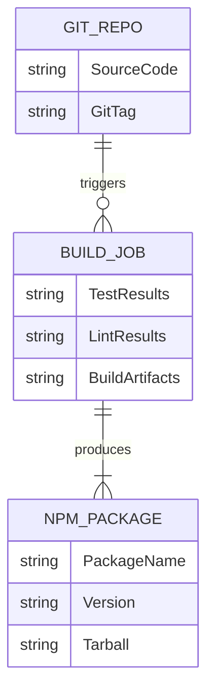
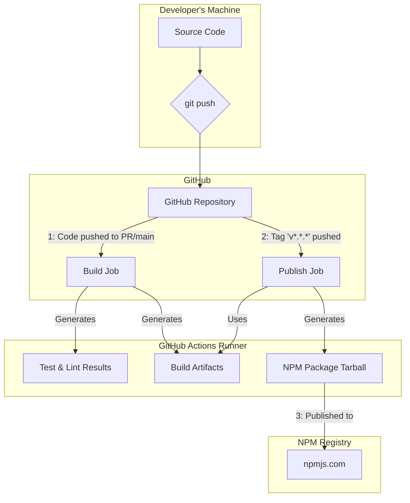
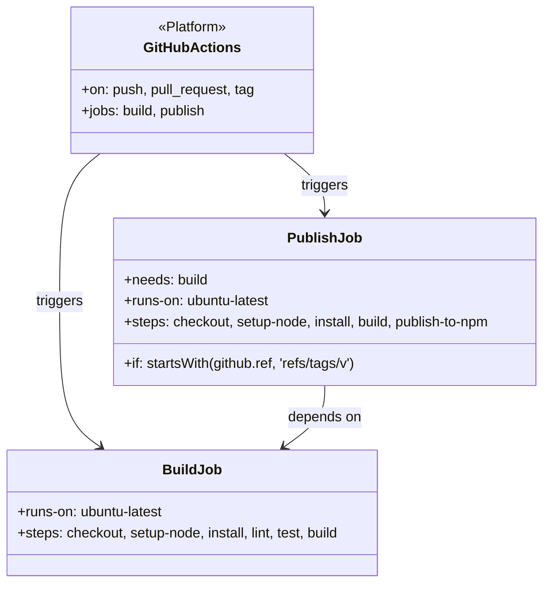
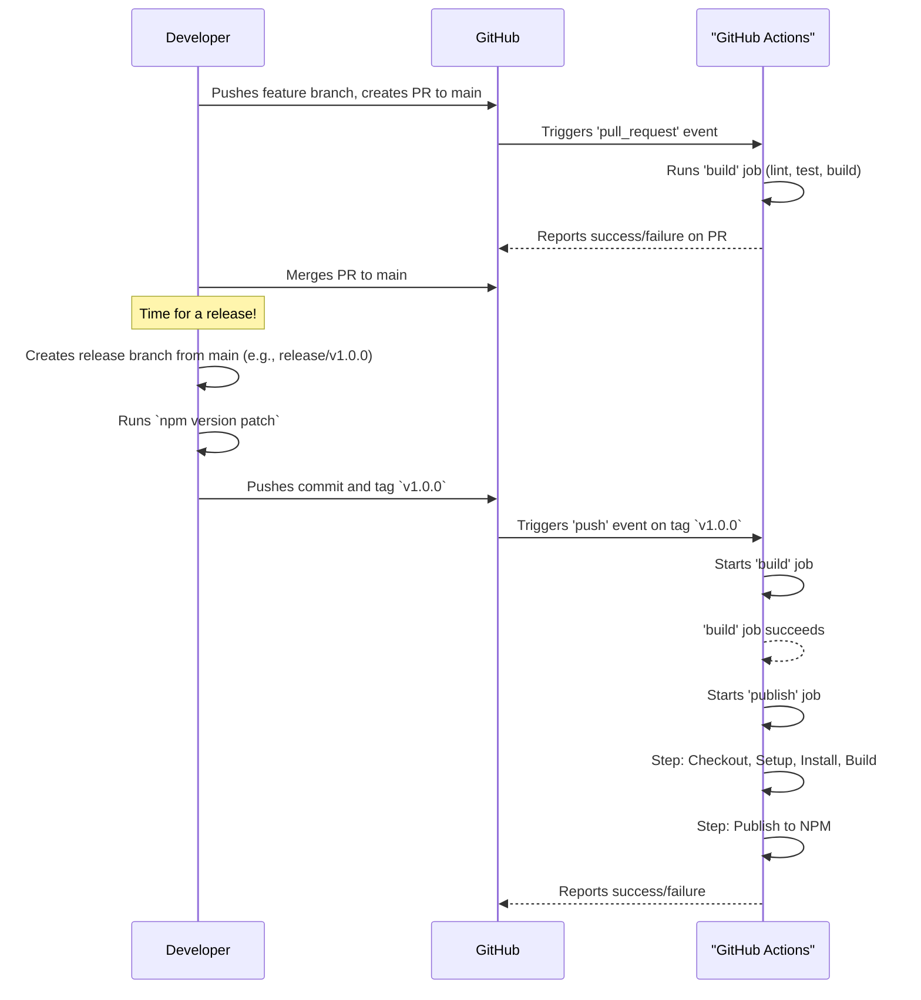

# Task: Implement CI/CD Pipeline

## 1 Meta & Governance

### 1.2 Status

- **Current State:** 💡 Not Started
- **Priority:** 🟧 Medium
- **Progress:** 0%
- **Planning Estimate:** 8
- **Est. Variance (pts):** 0
- **Created:** 2025-07-23 19:55
- **Implementation Started:**
- **Completed:**
- **Last Updated:** 2025-07-23 19:55

### 1.3 Priority Drivers

- TEC-Prod_Stability_Blocker
- TEC-Dev_Productivity_Enhancement

---

## 2 Business & Scope

### 2.1 Overview

- **Core Function**: To implement a Continuous Integration and Continuous Deployment (CI/CD) pipeline for the `ddd-tools` repository using GitHub Actions.
- **Key Capability**: The pipeline will automatically build, test, and validate the project on every push and pull request, and will automatically publish the package to NPM when a new version tag is pushed.
- **Business Value**: Automates the entire quality assurance and release process, prevents regressions, ensures consistent releases, and provides a stable foundation for the project.

### 2.4 Acceptance Criteria

| ID    | Criterion                                                                                                |
| :---- | :------------------------------------------------------------------------------------------------------- |
| AC-1  | A GitHub Actions workflow file is created in `.github/workflows/ci.yml`.                                 |
| AC-2  | The workflow contains a `build` job that is triggered on every push to `main` and on every pull request. |
| AC-3  | The `build` job installs all dependencies using `npm install`.                                           |
| AC-4  | The `build` job runs all tests using `npm test` and fails if any tests fail.                             |
| AC-5  | The `build` job builds the project using `npm run build` and fails if the build fails.                   |
| AC-6  | The `build` job includes a linting step to check for code quality (e.g., `npm run lint`).                |
| AC-7  | The workflow contains a `publish` job that runs after the `build` job.                                   |
| AC-8  | The `publish` job is triggered **only** when a git tag matching the pattern `v*.*.*` is pushed.          |
| AC-9  | The `publish` job correctly authenticates with the NPM registry using a secret token.                    |
| AC-10 | The `publish` job successfully publishes the package to NPM.                                             |

---

## 3 Planning & Decomposition

### 3.3 Dependencies

| ID  | Dependency On  | Type     | Status      | Notes                               |
| :-- | :------------- | :------- | :---------- | :---------------------------------- |
| D-1 | GitHub Actions | External | ✅ Complete | The repository is hosted on GitHub. |

---

## 4 High-Level Design

### 4.2.1 Data Models



### 4.2.3 Data Flow



### 4.2.2 Components



### 4.2.4 Control Flow



---

## 5 Maintenance and Monitoring

### 5.2.1 Error Handling

| Error Type                | Trigger                                        | Action                                       | User Feedback                                                                |
| :------------------------ | :--------------------------------------------- | :------------------------------------------- | :--------------------------------------------------------------------------- |
| **Build or Test Failure** | `npm test` or `npm run build` returns non-zero | Fail the GitHub Actions job.                 | GitHub UI will show a red 'X' next to the commit. Email notification sent.   |
| **Linting Failure**       | `npm run lint` returns non-zero                | Fail the GitHub Actions job.                 | GitHub UI will show details of the linting error in the job logs.            |
| **Publishing Failure**    | `npm publish` fails                            | Fail the GitHub Actions job.                 | Job logs will contain the error from NPM (e.g., auth issue, version exists). |
| **Invalid NPM Token**     | `secrets.NPM_TOKEN` is incorrect or expired    | The `publish` job will fail on the NPM step. | NPM will return a 401 or 403 error, visible in the job logs.                 |

### 5.2.2 Logging & Monitoring

- **Real-time Logging**: All steps in the GitHub Actions workflow will stream their output to the job log in real-time. This includes `npm install` output, test runner results, and build tool messages.
- **Status Badges**: A status badge will be added to the `README.md` file to show the current build status of the `main` branch at a glance.
- **Job Summaries**: GitHub Actions provides a summary page for each workflow run, showing the status of each job and the time taken.

---

## 6 Implementation Guidance

### 6.1 Implementation Log / Steps

- [ ] **Add Lint Script**: Add a `lint` script to `package.json` (e.g., `"lint": "eslint ."`).
- [ ] **Create Workflow Directory**: Create the `.github/workflows` directory if it doesn't exist.
- [ ] **Create Workflow File**: Create a new file named `ci.yml` inside `.github/workflows`.
- [ ] **Define Triggers**: Configure the workflow to run on `push` to `main`, on `pull_request` to `main`, and on `push` of tags matching `v*.*.*`.
- [ ] **Define `build` Job**:
  - Configure the job to run on `ubuntu-latest`.
  - Add steps for checkout, Node.js setup, `npm install`, `npm run lint`, `npm test`, and `npm run build`.
- [ ] **Define `publish` Job**:
  - Configure the job to run on `ubuntu-latest`.
  - Make it dependent on the `build` job (`needs: build`).
  - Add a condition to ensure it only runs for version tags (`if: startsWith(github.ref, 'refs/tags/v')`).
  - Add steps for checkout, Node.js setup (with `registry-url`), `npm install`, and `npm run build`.
  - Add a final step to run `npm publish` using an `NPM_TOKEN` secret.
- [ ] **Document Release Process**: Add a section to the project's main `README.md` or a `CONTRIBUTING.md` file explaining the "Release PR" workflow for maintainers.

### 6.1.1 Initial Situation

- The project has a working build and test process.
- There is no automated CI/CD pipeline.
- There is no `lint` script in `package.json`.

### 6.1.2 Files Change Log

- `.github/workflows/ci.yml` (New)
- `package.json` (Modified)

---

## 7 Quality & Operations

### 7.1 Testing Strategy / Requirements

| ID    | Scenario                                                     | Test Type   | Tools / Runner | Notes                                                               |
| :---- | :----------------------------------------------------------- | :---------- | :------------- | :------------------------------------------------------------------ |
| TST-1 | The `build` job runs on all PRs to `main`.                   | Integration | GitHub Actions | Manually create a test PR and verify the workflow is triggered.     |
| TST-2 | The `build` job fails if tests or linting fails.             | Integration | GitHub Actions | Push a commit with a failing test to a PR branch to verify failure. |
| TST-3 | The `publish` job does **not** run on pushes to `main`.      | Integration | GitHub Actions | Push a commit to `main` and verify the `publish` job is skipped.    |
| TST-4 | The `publish` job **does** run when a version tag is pushed. | Integration | GitHub Actions | Push a test tag (e.g., `v0.0.0-test`) and verify the job runs.      |
| TST-5 | The `publish` job fails gracefully with an invalid token.    | Integration | GitHub Actions | Run the job with a fake NPM token to ensure it fails as expected.   |

### 7.2 Configuration

| Setting Name          | Source                                        | Override Method                                 | Notes                                                                                                   |
| :-------------------- | :-------------------------------------------- | :---------------------------------------------- | :------------------------------------------------------------------------------------------------------ |
| **Node.js Version**   | `.github/workflows/ci.yml`                    | Modify the `node-version` in the YAML file.     | The version should match the one specified in `.nvmrc` for consistency. Currently `18`.                 |
| **NPM Token**         | GitHub Repository Secrets (`NPM_TOKEN`)       | Update the secret in the repository settings.   | This is required for the `publish` job to authenticate with the NPM registry. It must not be hardcoded. |
| **Workflow Triggers** | `on:` key in `.github/workflows/ci.yml`       | Modify the `push`, `pull_request`, `tags` keys. | Defines exactly when the CI/CD pipeline runs.                                                           |
| **Job Dependencies**  | `needs:` key in the `publish` job definition. | Modify the YAML key.                            | Ensures that publishing only happens after a successful build and test run.                             |

### 7.3 Alerting & Response

| Error Condition              | Relevant Plans | Response Plan                                                                                              | Status         |
| :--------------------------- | :------------- | :--------------------------------------------------------------------------------------------------------- | :------------- |
| **CI `build` Job Failure**   | All            | GitHub sends an email notification to the user who pushed the commit. The PR will be blocked from merging. | 💡 Not Started |
| **CD `publish` Job Failure** | All            | GitHub sends an email notification. A maintainer must investigate the job logs to diagnose the failure.    | 💡 Not Started |

### 7.5 Local Test Commands

```bash
# The CI pipeline can be partially tested by running the scripts locally
npm install
npm run lint # (after adding the script)
npm test
npm run build
```
