# Task: Template Generation CLI Commands

## 1 Meta & Governance

### 1.2 Status

- **Current State:** ✅ Complete
- **Priority:** 🟥 High
- **Progress:** 100%
- **Planning Estimate:** 8
- **Est. Variance (pts):** 0
- **Created:** 2025-07-20 20:30
- **Implementation Started:** 2025-07-20 21:42
- **Completed:** 2025-07-20 22:26
- **Last Updated:** 2025-07-20 22:26

### 1.3 Priority Drivers

- [TEC-Dev_Productivity_Enhancement](/docs/ddd-2.md#tec-dev_productivity_enhancement)
- [UX-Noticeable_Friction](/docs/ddd-2.md#ux-noticeable_friction)

---

## 2 Business & Scope

### 2.1 Overview

- **Core Function**: Implements CLI commands `ddd template plan` and `ddd template task` that wrap the existing P1 schema system's template generation capabilities.
- **Key Capability**: Transforms the powerful but script-based template generation into accessible CLI commands with intelligent naming, validation, and file placement.
- **Business Value**: Eliminates the friction of manually running npm scripts and organizing files, making DDD template creation as simple as running a single command.

### 2.2.3 Core Business Rules

- **Automatic ID Assignment**: The CLI automatically determines the next available sequential ID (e.g., `p1`, `p2`, `t1`, `t2`) based on existing files within the same hierarchy level. The user does not provide the ID.
- **Hierarchical Naming**: All generated templates must follow the exact naming convention: `[parent-prefix.]p<id>-<name>.plan.md` or `[parent-prefix.]t<id>-<name>.task.md`.
- **Mandatory Parent for Tasks**: All tasks (`ddd template task`) **must** have a parent plan specified via the `--parent` flag.
- **Schema Compliance**: All generated templates must be schema-compliant with proper section structure and examples.
- **Conflict Prevention**: The CLI must validate and prevent the creation of files with conflicting names.

### 2.4 Acceptance Criteria

| ID   | Criterion                                                                                | Test Reference           |
| :--- | :--------------------------------------------------------------------------------------- | :----------------------- |
| AC-1 | `ddd template plan <name>` generates a properly named plan template in current directory | CLI integration test     |
| AC-2 | `ddd template task <name>` generates a properly named task template in current directory | CLI integration test     |
| AC-3 | CLI validates and prevents creation of files with conflicting names                      | Error handling test      |
| AC-4 | Generated templates include schema-compliant structure with all required sections        | Template validation test |
| AC-5 | CLI provides helpful error messages for invalid names or missing dependencies            | Error message test       |
| AC-6 | CLI supports `--parent` flag to specify parent plan for proper naming hierarchy          | Parent hierarchy test    |
| AC-7 | CLI supports `--output-dir` flag to specify custom output directory                      | Output directory test    |
| AC-8 | Generated templates include contextual examples based on document type                   | Content quality test     |

---

## 3 Planning & Decomposition

### 3.3 Dependencies

| ID  | Dependency On                                | Type     | Status      | Affected Plans/Tasks | Notes                                              |
| :-- | :------------------------------------------- | :------- | :---------- | :------------------- | :------------------------------------------------- |
| D-1 | p1-p2.t1-cli-framework.task.md               | Internal | ✅ Complete | This task            | CLI framework and basic command structure required |
| D-2 | P1 Schema System (src/generate-templates.ts) | Internal | ✅ Complete | This task            | Template generation functions from P1 system       |
| D-3 | P1 Types System (src/types.ts)               | Internal | ✅ Complete | This task            | Schema type definitions for validation             |

---

## 4 High-Level Design

### 4.2 Target Architecture

The CLI commands will wrap the existing P1 template generation system, adding file management, naming validation, and user-friendly interfaces.

#### 4.2.1 Data Models


#### 4.2.2 Components


#### 4.2.3 Data Flow


#### 4.2.4 Control Flow

```mermaid
sequenceDiagram
    participant User
    participant Yargs
    participant TemplatePlanCommand
    participant TemplateGenerator
    participant NamingValidator
    participant FileManager
    participant P1System

    User->>Yargs: ddd template plan my-feature
    Yargs->>TemplatePlanCommand: handler({ name: "my-feature" })
    TemplatePlanCommand->>TemplateGenerator: generatePlan(request)
    TemplateGenerator->>NamingValidator: validatePlanName("my-feature")
    NamingValidator-->>TemplateGenerator: ValidationResult(valid=true)
    TemplateGenerator->>FileManager: checkFileExists("my-feature.plan.md")
    FileManager-->>TemplateGenerator: false
    TemplateGenerator->>P1System: generateTemplates()
    P1System-->>TemplateGenerator: template content
    TemplateGenerator->>FileManager: writeTemplate(path, content)
    FileManager-->>TemplateGenerator: success
    TemplateGenerator-->>TemplatePlanCommand: TemplateResult(success=true)
    TemplatePlanCommand-->>User: "✅ Created my-feature.plan.md"
```



#### 4.2.5 Integration Points

##### 4.2.5.1 Upstream Integrations

- **Trigger**: User command-line invocation with arguments
- **Input Data**: Command arguments (name, parent, output directory, flags)
- **Dependencies**: CLI framework from T1, P1 schema system functions

##### 4.2.5.2 Downstream Integrations

- **Output**: Generated template files written to file system
- **Success Feedback**: Console messages confirming file creation
- **Error Feedback**: Detailed error messages for validation failures or conflicts

#### 4.2.6 Exposed API

**CLI Commands:**

```bash
# Generate a new plan template (ID is assigned automatically)
ddd template plan <name> [--parent <parent-filename>] [--output-dir <dir>]

# Generate a new task template (parent is required)
ddd template task <name> --parent <parent-filename> [--output-dir <dir>]

# Examples:
# Creates docs/requirements/p1-user-management.plan.md
ddd template plan user-management

# Creates docs/requirements/p2-another-plan.plan.md (assuming p1 exists)
ddd template plan another-plan

# Creates docs/requirements/p1.t1-user-authentication.task.md
ddd template task user-authentication --parent p1-user-management.plan.md

# Creates a nested plan
# Creates docs/requirements/p1.p2-api-endpoints.plan.md
ddd template plan api-endpoints --parent p1-user-management.plan.md
```

**Command Options:**

- `--parent, -p`: Specify parent plan for proper hierarchy naming
- `--output-dir, -o`: Specify output directory (default: current directory)
- `--dry-run, -d`: Show what would be generated without creating files
- `--help, -h`: Show command help and examples

### 4.3 Tech Stack & Deployment

- **CLI Framework**: yargs (inherited from T1)
- **File System**: Node.js fs/promises for async file operations
- **Path Resolution**: Node.js path module for cross-platform compatibility
- **Template Generation**: Existing P1 system functions (src/generate-templates.ts)
- **Validation**: Custom validation using P1 type definitions
- **Runner**: tsx for TypeScript execution
- **Build**: TypeScript compiler to dist/ directory

### 4.4 Non-Functional Requirements

#### 4.4.1 Performance

| ID      | Requirement                                                       | Priority  |
| :------ | :---------------------------------------------------------------- | :-------- |
| PERF-01 | Template generation must complete in < 2 seconds for single files | 🟧 Medium |
| PERF-02 | CLI startup time must be < 500ms                                  | 🟨 Low    |

#### 4.4.2 Security

| ID     | Requirement                                                           | Priority  |
| :----- | :-------------------------------------------------------------------- | :-------- |
| SEC-01 | CLI must validate output paths to prevent directory traversal attacks | 🟧 Medium |
| SEC-02 | File write operations must respect system permissions                 | 🟧 Medium |

#### 4.4.3 Reliability

| ID     | Requirement                                                             | Priority |
| :----- | :---------------------------------------------------------------------- | :------- |
| REL-01 | CLI must handle file system errors gracefully with clear error messages | 🟥 High  |
| REL-02 | Partial failures must not leave corrupt or incomplete template files    | 🟥 High  |

---

## 5 Maintenance and Monitoring

### 5.2 Target Maintenance and Monitoring

#### 5.2.1 Error Handling

| Error Type                    | Trigger                              | Action                                       | User Feedback                                                                                             |
| :---------------------------- | :----------------------------------- | :------------------------------------------- | :-------------------------------------------------------------------------------------------------------- |
| **Invalid Name Format**       | Name doesn't match naming convention | Show validation error with expected format   | `ERROR: Invalid name format. Expected: [a-z-]+ (e.g., 'user-management')`                                 |
| **File Already Exists**       | Target file already exists           | Abort operation, suggest alternatives        | `ERROR: File 'p1-user-auth.plan.md' already exists. Use --force to overwrite or choose a different name.` |
| **Missing Parent Plan**       | Parent specified but doesn't exist   | Abort operation, list available parents      | `ERROR: Parent plan 'p1-nonexistent' not found. Available parents: p1-backend, p1-frontend`               |
| **File System Error**         | Cannot write to target directory     | Show detailed error with suggested fixes     | `ERROR: Cannot write to directory './docs/'. Check permissions or create directory first.`                |
| **Template Generation Error** | P1 system fails to generate template | Show internal error and fallback suggestions | `ERROR: Template generation failed. Try updating the CLI or check schema integrity.`                      |

#### 5.2.2 Logging & Monitoring

- **Success Logging**: Console output with file paths and confirmation messages
- **Error Logging**: Detailed error messages with actionable guidance
- **Debug Mode**: Verbose logging available via `--debug` flag showing internal operations
- **Dry Run Mode**: Preview mode showing what would be generated without file operations

---

## 6 Implementation Guidance

### 6.1 Implementation Log / Steps

- [x] Create `src/cli/services/file-manager.ts` for file system operations
- [x] Create `src/cli/services/naming-validator.ts` with naming convention logic
- [x] Create `src/cli/services/template-generator.ts` service class
- [x] Create `src/cli/commands/template.ts` with yargs command structure
- [x] Implement plan and task subcommands with `builder` and `handler` functions
- [x] Integrate with P1 template generation system (src/generate-templates.ts)
- [x] Register template command in main CLI application (src/cli/index.ts)
- [x] Add error handling and user feedback following yargs patterns
- [x] Implement dry-run functionality with preview output
- [x] Add command help documentation using yargs describe/example features
- [x] Write integration tests for all commands using Jest + child_process
- [x] Write unit tests for `FileManager`, `NamingValidator`, and `TemplateGenerator` services

#### 6.1.1 Initial Situation

- CLI framework is established from T1 with basic command structure
- P1 schema system provides template generation functions and type definitions
- Current template generation requires running npm scripts manually
- No CLI interface exists for template creation

#### 6.1.2 Files Change Log

- [x] `src/cli/commands/template.ts` - New yargs command module with plan/task subcommands
- [x] `src/cli/services/template-generator.ts` - New template generation service
- [x] `src/cli/services/naming-validator.ts` - New naming validation service
- [x] `src/cli/services/file-manager.ts` - New file management service
- [x] `src/cli/index.ts` - Register template command in main yargs application
- [x] `src/__tests__/cli/commands/template.test.ts` - Integration tests for template commands
- [x] `src/__tests__/cli/services/file-manager.test.ts` - Unit tests for FileManager
- [x] `src/__tests__/cli/services/naming-validator.test.ts` - Unit tests for NamingValidator
- [x] `src/__tests__/cli/services/template-generator.test.ts` - Unit tests for TemplateGenerator
- [x] `package.json` - No changes needed

### 6.2 Prompts (LLM reuse)

```typescript
// Generate yargs command implementation
Implement a yargs command module that:
1. Exports a command object with "template <subcommand>" structure
2. Includes "plan <name>" and "task <name>" subcommands
3. Uses builder() function to define options like --parent and --output-dir
4. Uses handler() function to process arguments and call TemplateGenerator service
5. Follows the pattern established in src/cli/commands/hello.ts

// Generate naming validation logic
Create a function that:
1. Validates plan/task names against DDD naming convention: /^[a-z][a-z0-9-]*$/
2. Generates proper file names with parent hierarchy (e.g., p1-p2-t3-name.task.md)
3. Checks for existing file conflicts in the target directory
4. Returns detailed validation results with error messages
```

---

## 7 Quality & Operations

### 7.1 Testing Strategy / Requirements

| AC   | Scenario                                              | Test Type   | Tools / Runner             | Notes                                      |
| :--- | :---------------------------------------------------- | :---------- | :------------------------- | :----------------------------------------- |
| AC-1 | `ddd template plan my-feature` generates correct file | Integration | Jest + temp filesystem     | Test full command execution                |
| AC-2 | `ddd template task my-task` generates correct file    | Integration | Jest + temp filesystem     | Test full command execution                |
| AC-3 | CLI prevents overwriting existing files               | Integration | Jest + mock filesystem     | Create existing file first                 |
| AC-4 | Generated templates have all required schema sections | Unit        | Jest + template validation | Parse generated content                    |
| AC-5 | Clear error messages for invalid names                | Unit        | Jest + command validation  | Test various invalid inputs                |
| AC-6 | Parent hierarchy naming works correctly               | Integration | Jest + filesystem          | Test with real parent plans                |
| AC-7 | Custom output directory support                       | Integration | Jest + temp directories    | Test directory creation and file placement |
| AC-8 | Templates include appropriate examples                | Unit        | Jest + content analysis    | Verify example quality and relevance       |

### 7.2 Configuration

| Setting Name       | Plan Dependency | Source             | Override Method      | Notes                              |
| :----------------- | :-------------- | :----------------- | :------------------- | :--------------------------------- |
| `defaultOutputDir` | CLI Tools       | CLI config         | `--output-dir` flag  | Default: current working directory |
| `templateSource`   | P1 Schema       | Code configuration | Environment variable | Source of template definitions     |
| `namingPattern`    | CLI Tools       | Code constants     | Not overrideable     | Regex pattern for valid names      |
| `debugMode`        | CLI Tools       | Command flag       | `--debug` flag       | Enables verbose logging            |

### 7.3 Alerting & Response

| Error Condition                  | Relevant Plans       | Response Plan                                                     | Status         |
| :------------------------------- | :------------------- | :---------------------------------------------------------------- | :------------- |
| **Template Generation Failure**  | P1 Schema, CLI Tools | Log error details, suggest schema verification                    | 💡 Not Started |
| **File System Permission Error** | CLI Tools            | Provide clear permission guidance, suggest directory alternatives | 💡 Not Started |
| **Invalid Name Input**           | CLI Tools            | Show validation error with correct format examples                | 💡 Not Started |

### 7.5 Local Test Commands

```bash
# Run all template command tests
npm test -- --testPathPattern=template

# Test specific command functionality
npm test -- --testNamePattern="template plan command"

# Run integration tests with filesystem
npm test -- --testPathPattern=integration/template

# Run all template command tests
npm test -- --testPathPattern=template

# Run unit tests for services
npm test -- --testPathPattern=services

# Test specific command functionality
npm test -- --testNamePattern="template plan command"

# Run integration tests with filesystem
npm test -- --testPathPattern=integration/template

# Test CLI commands manually (after npm link for global access)
ddd template plan test-feature
ddd template task test-task --parent p1-test-feature.plan.md

# Test error scenarios
ddd template plan ""  # invalid name
ddd template task duplicate-name  # existing file
ddd template plan test --parent nonexistent  # missing parent
ddd template plan test --parent p1-test-feature # incomplete parent name

```

---

## 8 Reference

### 8.1 Appendices/Glossary

**Glossary:**

- **Template**: Schema-compliant markdown file structure for plans or tasks
- **Naming Convention**: DDD file naming pattern using hierarchy prefixes
- **P1 System**: Existing schema definition and generation system
- **CLI Framework**: yargs-based command-line interface from T1
- **Dry Run**: Preview mode that shows intended actions without execution
