# Task: DDD Documentation Initialization Command

## 1 Meta & Governance

### 1.2 Status

- **Current State:** ✅ Complete
- **Priority:** 🟥 High
- **Progress:** 100%
- **Planning Estimate:** 12
- **Est. Variance (pts):** 0
- **Created:** 2025-07-22 00:54
- **Implementation Started:** 2025-07-26 13:12
- **Completed:** 2025-07-26 13:23
- **Last Updated:** 2025-07-26 13:23

### 1.3 Priority Drivers

- [UX-Noticeable_Friction](../ddd-2.md#ux-noticeable_friction)
- [TEC-Dev_Productivity_Enhancement](../ddd-2.md#tec-dev_productivity_enhancement)

---

## 2 Business & Scope

### 2.1 Overview

- **Core Function**: Implements a CLI command `ddd init` to scaffold a standard DDD documentation structure within an existing project.
- **Key Capability**: Creates the `docs/` directory with all necessary subdirectories (`requirements`, `templates`) and standard DDD documents (`ddd-2.md`, schemas, templates, and examples).
- **Business Value**: Radically simplifies the adoption of DDD in any existing codebase by providing a one-command setup for all required documentation artifacts.

### 2.2.3 Core Business Rules

- The `ddd init` command must create a `ddd.config.json` file in the project root if one does not already exist.
- The command must create a `docs/` directory with `requirements/` and `templates/` subdirectories.
- The command must populate the `docs/` directory with the core methodology documents (`ddd-2.md`, `ddd-2-schema.machine.md`, and `ddd-2-schema.human.md`).
- The `docs/templates/` directory must be populated with `plan.template.md` and `task.template.md`.
- The `docs/requirements/` directory must be populated with an example `p1-example.plan.md`.
- The command must not run if `ddd.config.json` already exists, unless a `--force` flag is provided.

### 2.4 Acceptance Criteria

| ID   | Criterion                                                                                           | Test Reference          |
| :--- | :-------------------------------------------------------------------------------------------------- | :---------------------- |
| AC-1 | `ddd init` creates a `ddd.config.json` file with default settings.                                  | File content validation |
| AC-2 | `ddd init` creates a `docs/` directory with `requirements/` and `templates/` subdirectories.        | CLI integration test    |
| AC-3 | The `docs/` directory is populated with `ddd-2.md` and both human and machine-readable schema docs. | File content validation |
| AC-4 | The `docs/templates/` directory contains `plan.template.md` and `task.template.md`.                 | File existence test     |
| AC-5 | The `docs/requirements/` directory contains an example `p1-example.plan.md`.                        | File existence test     |
| AC-6 | The command fails with a clear error if `ddd.config.json` already exists.                           | Conflict handling test  |
| AC-7 | The command succeeds if `ddd.config.json` exists and the `--force` flag is used.                    | Force flag test         |
| AC-8 | The command provides clear feedback upon successful creation of the documentation structure.        | User experience test    |

---

## 3 Planning & Decomposition

### 3.3 Dependencies

| ID  | Dependency On                                                                | Type     | Status      | Affected Plans/Tasks | Notes                                                               |
| :-- | :--------------------------------------------------------------------------- | :------- | :---------- | :------------------- | :------------------------------------------------------------------ |
| D-1 | [T1: CLI Framework Setup](./p1-p2.t1-cli-framework.task.md)                  | Internal | ✅ Complete | This task            | CLI framework and yargs setup required                              |
| D-2 | [T3: Template Generation CLI Commands](./p1-p2.t3-template-commands.task.md) | Internal | ✅ Complete | This task            | Template generation functions for creating example docs in projects |
| D-3 | P1 Schema System (`src/generate-templates.ts`)                               | Internal | ✅ Complete | This task            | Schema system for generating compliant documentation                |
| D-4 | P1 Types System (`src/types.ts`)                                             | Internal | ✅ Complete | This task            | Type definitions for validation and structure                       |

---

## 4 High-Level Design

### 4.2 Target Architecture

The `init` command will orchestrate the creation of the standard DDD `docs` directory structure. It will copy the core methodology documents and generate example templates to provide a ready-to-use documentation system within an existing project.

#### 4.2.1 Data Models


#### 4.2.2 Components


#### 4.2.3 Data Flow


#### 4.2.4 Control Flow

```mermaid
sequenceDiagram
    participant User
    participant Yargs
    participant InitCommand
    participant DocsInitializer
    participant FileManager

    User->>Yargs: ddd init
    Yargs->>InitCommand: handler()
    InitCommand->>DocsInitializer: initialize(request)
    DocsInitializer->>FileManager: checkDirectoryExists("docs")
    FileManager-->>DocsInitializer: false
    DocsInitializer->>FileManager: ensureDirectory("docs/requirements")
    DocsInitializer->>FileManager: ensureDirectory("docs/templates")
    DocsInitializer->>FileManager: copyFile(core_doc_src, core_doc_dest)
    DocsInitializer-->>InitCommand: success
    InitCommand-->>User: ✅ DDD documentation structure initialized in 'docs/'
```



#### 4.2.5 Integration Points

##### 4.2.5.1 Upstream Integrations

- **Trigger**: User command-line invocation
- **Input Data**: Command flags (e.g., `--force`, `--output-dir`)
- **Dependencies**: CLI framework from T1, template generation from T3 for examples

##### 4.2.5.2 Downstream Integrations

- **Output**: A `docs` directory containing the standard DDD documentation structure.
- **Success Feedback**: Console message confirming the creation of the `docs` directory.

#### 4.2.6 Exposed API

**CLI Command:**

```bash
# Initialize the DDD documentation structure in the current project
ddd init [--output-dir <dir>] [--force]

# Example:
ddd init
ddd init --output-dir ./project/root
ddd init --force
```

**Command Options:**

- `--output-dir, -o`: The directory where the `docs` folder will be created (default: current directory).
- `--force, -f`: Overwrite the `docs` directory if it already exists.
- `--help, -h`: Show command help and examples.

### 4.3 Tech Stack & Deployment

- **CLI Framework**: yargs (inherited from T1)
- **File System**: Node.js fs/promises for async file operations
- **Path Resolution**: Node.js path module for cross-platform compatibility
- **Template Generation**: T3 template commands for generating example documents.

### 4.4 Non-Functional Requirements

#### 4.4.1 Performance

| ID      | Requirement                                               | Priority  |
| :------ | :-------------------------------------------------------- | :-------- |
| PERF-01 | Documentation initialization must complete in < 2 seconds | 🟧 Medium |
| PERF-02 | CLI startup time must remain < 500ms                      | 🟨 Low    |

#### 4.4.2 Security

| ID     | Requirement                                                           | Priority |
| :----- | :-------------------------------------------------------------------- | :------- |
| SEC-01 | CLI must validate output paths to prevent directory traversal attacks | 🟥 High  |

#### 4.4.3 Reliability

| ID     | Requirement                                                            | Priority |
| :----- | :--------------------------------------------------------------------- | :------- |
| REL-01 | Failed initialization must clean up any partially created directories. | 🟥 High  |
| REL-02 | The command must handle file system permission errors gracefully.      | 🟥 High  |

---

## 5 Maintenance and Monitoring

### 5.2 Target Maintenance and Monitoring

#### 5.2.1 Error Handling

| Error Type                   | Trigger                                | Action                                   | User Feedback                                                                                |
| :--------------------------- | :------------------------------------- | :--------------------------------------- | :------------------------------------------------------------------------------------------- |
| **Directory Already Exists** | `docs` directory already exists        | Abort operation, suggest `--force` flag  | `ERROR: 'docs/' directory already exists. Use --force to overwrite.`                         |
| **Permission Error**         | Cannot create directory or write files | Show detailed error with suggested fixes | `ERROR: Permission denied. Check write permissions for the target directory.`                |
| **Template Error**           | Generating example plan fails          | Show internal error and recovery options | `ERROR: Failed to generate example documentation. The 'docs' directory might be incomplete.` |

#### 5.2.2 Logging & Monitoring

- **Progress Logging**: Real-time feedback during project creation with step-by-step progress
- **Error Logging**: Detailed error messages with actionable guidance and recovery options
- **Debug Mode**: Verbose logging available via `--debug` flag showing all file operations
- **Success Summary**: Completion report with created files, installed dependencies, and next steps

---

## 6 Implementation Guidance

### 6.1 Implementation Log / Steps

- [ ] Create `src/cli/commands/init.ts` with the yargs command structure for `ddd init`.
- [ ] Implement the `builder` to handle `--force` and `--output-dir` options.
- [ ] Create `src/cli/services/docs-initializer.ts` to handle the logic for creating the `docs` structure.
- [ ] Implement logic in the service to check for an existing `docs` directory and handle the `--force` flag.
- [ ] Implement functions to create the `docs/`, `docs/requirements/`, and `docs/templates/` directories.
- [ ] Implement logic to copy the core `ddd-2.md`, schema, and template files to the new structure.
- [ ] Integrate with the `TemplateGenerator` from T3 to create an example `p1-example.plan.md`.
- [ ] Register the `init` command in the main CLI application (`src/cli/index.ts`).
- [ ] Add clear console feedback for success and error states.
- [ ] Write integration tests for the `ddd init` command, including the `--force` flag and conflict scenarios.
- [ ] Write unit tests for the `DocsInitializer` service.

#### 6.1.1 Initial Situation

- CLI framework is established from T1 with yargs setup and command registration pattern
- Template generation capabilities will be available from T3 for individual documents
- P1 schema system provides type definitions and template generation functions
- No project-level initialization capabilities exist - only individual document creation
- Need to bridge from document-level to project-level scaffolding

#### 6.1.2 Files Change Log

- [ ] `src/cli/commands/init.ts` - New yargs command module for the `init` command.
- [ ] `src/cli/services/docs-initializer.ts` - New service to handle the documentation scaffolding logic.
- [ ] `src/cli/index.ts` - Modified to register the new `init` command.
- [ ] `__tests__/cli/commands/init.test.ts` - New integration tests for the `init` command.
- [ ] `__tests__/cli/services/docs-initializer.test.ts` - New unit tests for the initializer service.
- [ ] Update `p1-p2.t3-template-commands.task.md` to reflect the new naming convention for generated example plans.

### 6.2 Prompts (LLM reuse)

```typescript
// Generate yargs init command implementation
Implement a yargs command module for `ddd init` that:
1. Exports a command object with the command "init".
2. Uses the builder() function to define `--force` and `--output-dir` options.
3. Uses a handler() function to call a `DocsInitializer` service.
4. Provides clear user feedback on success or failure.

// Generate DocsInitializer service
Create a service that:
1. Checks if a `docs` directory exists and respects the `--force` flag.
2. Creates the standard DDD directory structure (`docs`, `docs/requirements`, `docs/templates`).
3. Copies the core methodology and schema files into the new `docs` directory.
4. Uses the existing `TemplateGenerator` to create an example `p1-example.plan.md`.
```

---

## 7 Quality & Operations

### 7.1 Testing Strategy / Requirements

| AC   | Scenario                                                               | Test Type   | Tools / Runner           | Notes                                     |
| :--- | :--------------------------------------------------------------------- | :---------- | :----------------------- | :---------------------------------------- |
| AC-1 | `ddd init` creates the full `docs/` directory structure.               | Integration | Vitest + temp filesystem | Verify all subdirs are created.           |
| AC-2 | Core documents (`ddd-2.md`, etc.) are copied correctly.                | Integration | Vitest + temp filesystem | Check for file existence and content.     |
| AC-3 | Template files (`plan.template.md`, etc.) are copied correctly.        | Integration | Vitest + temp filesystem | Check for file existence.                 |
| AC-4 | An example `p1-example.plan.md` is generated in `docs/requirements/`.  | Integration | Vitest + temp filesystem | Verify integration with TemplateGenerator |
| AC-5 | `ddd init` fails when `docs/` exists without `--force`.                | Integration | Vitest + temp filesystem | Test conflict handling.                   |
| AC-6 | `ddd init --force` overwrites an existing `docs/` directory.           | Integration | Vitest + temp filesystem | Test overwrite functionality.             |
| AC-7 | The command provides clear success and error feedback to the console.  | Unit        | Vitest + console capture | Verify user experience.                   |
| AC-8 | `ddd init --debug` outputs verbose file operation logs to the console. | Unit        | Vitest + console capture | Verify that debug-level logs are present. |

### 7.2 Configuration

| Setting Name     | Plan Dependency | Source      | Override Method      | Notes                                                    |
| :--------------- | :-------------- | :---------- | :------------------- | :------------------------------------------------------- |
| `outputDir`      | CLI Tools       | Current Dir | `--output-dir` flag  | The directory where the `docs` folder should be created. |
| `forceOverwrite` | CLI Tools       | `false`     | `--force` flag       | Whether to overwrite an existing `docs` directory.       |
| `coreDocsSource` | P1 Schema       | `docs/`     | Environment variable | The source location of core documents like `ddd-2.md`.   |

### 7.3 Alerting & Response

| Error Condition                     | Relevant Plans       | Response Plan                                                 | Status         |
| :---------------------------------- | :------------------- | :------------------------------------------------------------ | :------------- |
| **Project Creation Failure**        | CLI Tools, P1 Schema | Clean up partial artifacts, provide recovery guidance         | 💡 Not Started |
| **Dependency Installation Failure** | CLI Tools            | Continue with project creation, warn user to install manually | 💡 Not Started |
| **Template Rendering Error**        | CLI Tools, P1 Schema | Fall back to basic template or manual creation guidance       | 💡 Not Started |
| **File System Permission Error**    | CLI Tools            | Provide clear permission guidance with suggested solutions    | 💡 Not Started |

### 7.5 Local Test Commands

```bash
# Run all init command tests
npm test -- --testPathPattern=init.test

# Test specific init functionality
npm test -- --testNamePattern="init command"

# Test init command manually (after npm link)
ddd init

# Test error scenario (run twice)
ddd init
ddd init

# Test force flag
ddd init --force

# Test custom output directory
mkdir temp-dir && ddd init --output-dir ./temp-dir
```

---

## 8 Reference

### 8.1 Appendices/Glossary

**Glossary:**

- **Project Scaffold**: Complete directory structure with configuration files for a new DDD project
- **Project Structure**: The directory layout and files that make up a complete DDD project
- **Template Variant**: Different project types (basic, full, enterprise) with varying complexity and features
- **Project Template**: A set of files and directory structure that serves as the starting point for new projects
- **Package Manager**: npm or yarn tool for managing Node.js dependencies
- **CLI Setup**: Configuration that enables the ddd command to work within the generated project
