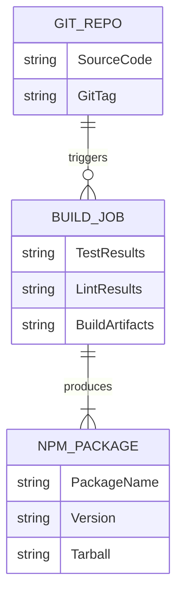
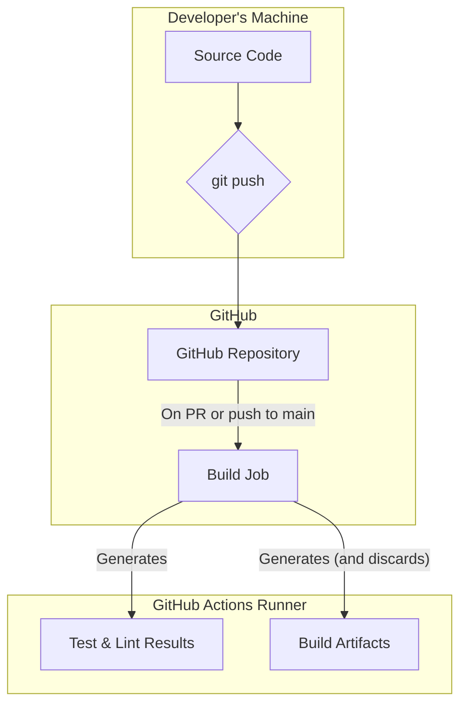
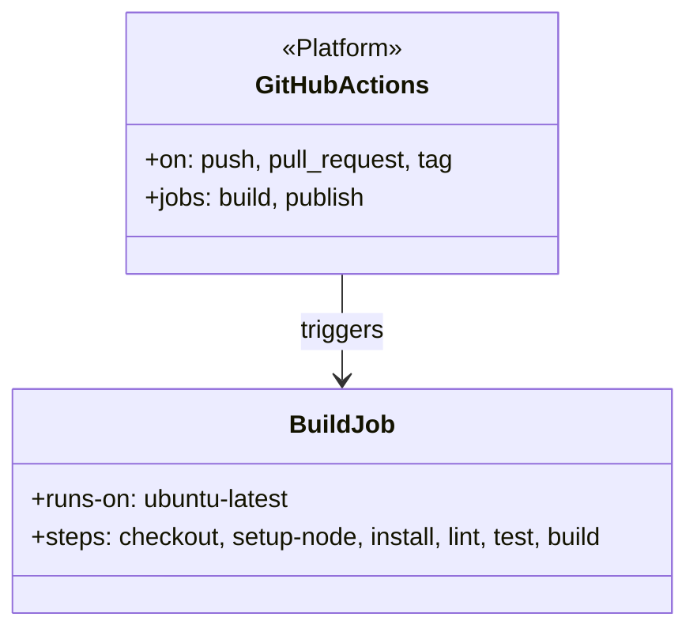
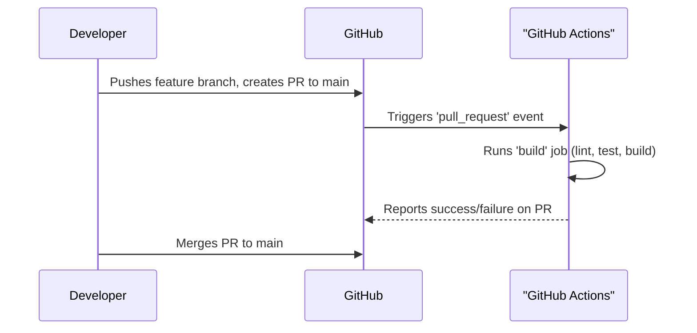

# Task: Implement CI/CD Pipeline

## 1 Meta & Governance

### 1.2 Status

- **Current State:** 💡 Not Started
- **Priority:** 🟧 Medium
- **Progress:** 0%
- **Planning Estimate:** 8
- **Est. Variance (pts):** 0
- **Created:** 2025-07-23 19:55
- **Implementation Started:**
- **Completed:**
- **Last Updated:** 2025-07-23 19:55

### 1.3 Priority Drivers

- TEC-Prod_Stability_Blocker
- TEC-Dev_Productivity_Enhancement

---

## 2 Business & Scope

### 2.1 Overview

- **Core Function**: To implement a Continuous Integration (CI) pipeline for the `ddd-tools` repository using GitHub Actions.
- **Key Capability**: The pipeline will automatically build, test, and validate the project on every push and pull request to ensure code quality and prevent regressions.
- **Business Value**: Automates the quality assurance process, prevents regressions from being merged, and provides a stable foundation for the project.

### 2.4 Acceptance Criteria

| ID   | Criterion                                                                                                |
| :--- | :------------------------------------------------------------------------------------------------------- |
| AC-1 | A GitHub Actions workflow file is created in `.github/workflows/ci.yml`.                                 |
| AC-2 | The workflow contains a `build` job that is triggered on every push to `main` and on every pull request. |
| AC-3 | The `build` job installs all dependencies using `npm install`.                                           |
| AC-4 | The `build` job runs all tests using `npm test` and fails if any tests fail.                             |
| AC-5 | The `build` job builds the project using `npm run build` and fails if the build fails.                   |
| AC-6 | The `build` job includes a linting step to check for code quality (e.g., `npm run lint`).                |

---

## 3 Planning & Decomposition

### 3.3 Dependencies

| ID  | Dependency On  | Type     | Status      | Notes                               |
| :-- | :------------- | :------- | :---------- | :---------------------------------- |
| D-1 | GitHub Actions | External | ✅ Complete | The repository is hosted on GitHub. |

---

## 4 High-Level Design

### 4.2.1 Data Models



### 4.2.3 Data Flow



### 4.2.2 Components



### 4.2.4 Control Flow



---

## 5 Maintenance and Monitoring

### 5.2.1 Error Handling

| Error Type                | Trigger                                        | Action                       | User Feedback                                                              |
| :------------------------ | :--------------------------------------------- | :--------------------------- | :------------------------------------------------------------------------- |
| **Build or Test Failure** | `npm test` or `npm run build` returns non-zero | Fail the GitHub Actions job. | GitHub UI will show a red 'X' next to the commit. Email notification sent. |
| **Linting Failure**       | `npm run lint` returns non-zero                | Fail the GitHub Actions job. | GitHub UI will show details of the linting error in the job logs.          |

### 5.2.2 Logging & Monitoring

- **Real-time Logging**: All steps in the GitHub Actions workflow will stream their output to the job log in real-time. This includes `npm install` output, test runner results, and build tool messages.
- **Status Badges**: A status badge will be added to the `README.md` file to show the current build status of the `main` branch at a glance.
- **Job Summaries**: GitHub Actions provides a summary page for each workflow run, showing the status of each job and the time taken.

---

## 6 Implementation Guidance

### 6.1 Implementation Log / Steps

- [ ] **Add Lint Script**: Add a `lint` script to `package.json` (e.g., `"lint": "eslint ."`).
- [ ] **Create Workflow Directory**: Create the `.github/workflows` directory if it doesn't exist.
- [ ] **Create Workflow File**: Create a new file named `ci.yml` inside `.github/workflows`.
- [ ] **Add Lint Script**: Add a `lint` script to `package.json` (e.g., `"lint": "eslint ."`).
- [ ] **Create Workflow Directory**: Create the `.github/workflows` directory if it doesn't exist.
- [ ] **Create Workflow File**: Create a new file named `ci.yml` inside `.github/workflows`.
- [ ] **Define Triggers**: Configure the workflow to run on `push` to `main` and on `pull_request` to `main`.
- [ ] **Define `build` Job**:
  - Configure the job to run on `ubuntu-latest`.
  - Add steps for checkout, Node.js setup, `npm install`, `npm run lint`, `npm test`, and `npm run build`.

### 6.1.1 Initial Situation

- The project has a working build and test process.
- There is no automated CI/CD pipeline.
- There is no `lint` script in `package.json`.

### 6.1.2 Files Change Log

- `.github/workflows/ci.yml` (New)
- `package.json` (Modified)

---

## 7 Quality & Operations

### 7.1 Testing Strategy / Requirements

| ID    | Scenario                                         | Test Type   | Tools / Runner | Notes                                                               |
| :---- | :----------------------------------------------- | :---------- | :------------- | :------------------------------------------------------------------ |
| TST-1 | The `build` job runs on all PRs to `main`.       | Integration | GitHub Actions | Manually create a test PR and verify the workflow is triggered.     |
| TST-2 | The `build` job fails if tests or linting fails. | Integration | GitHub Actions | Push a commit with a failing test to a PR branch to verify failure. |

### 7.2 Configuration

| Setting Name          | Source                                  | Override Method                             | Notes                                                                                   |
| :-------------------- | :-------------------------------------- | :------------------------------------------ | :-------------------------------------------------------------------------------------- |
| **Node.js Version**   | `.github/workflows/ci.yml`              | Modify the `node-version` in the YAML file. | The version should match the one specified in `.nvmrc` for consistency. Currently `18`. |
| **Workflow Triggers** | `on:` key in `.github/workflows/ci.yml` | Modify the `push`, `pull_request` keys.     | Defines exactly when the CI pipeline runs.                                              |

### 7.3 Alerting & Response

| Error Condition            | Relevant Plans | Response Plan                                                                                              | Status         |
| :------------------------- | :------------- | :--------------------------------------------------------------------------------------------------------- | :------------- |
| **CI `build` Job Failure** | All            | GitHub sends an email notification to the user who pushed the commit. The PR will be blocked from merging. | 💡 Not Started |

### 7.5 Local Test Commands

```bash
# The CI pipeline can be partially tested by running the scripts locally
npm install
npm run lint # (after adding the script)
npm test
npm run build
```
