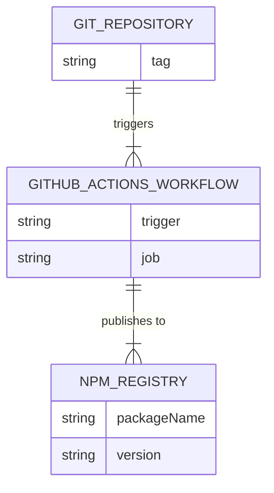
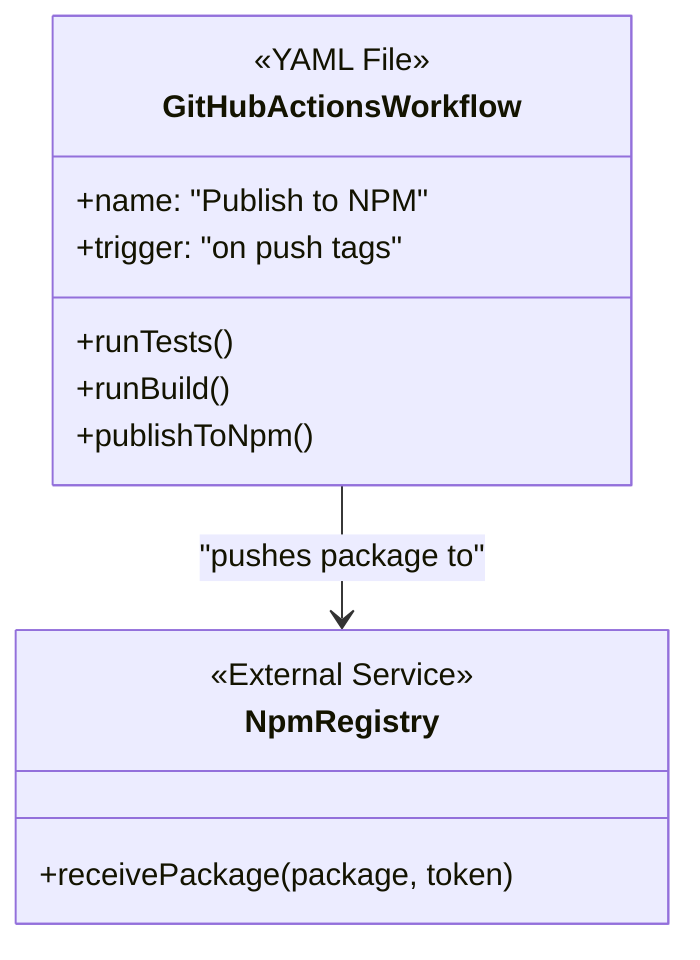
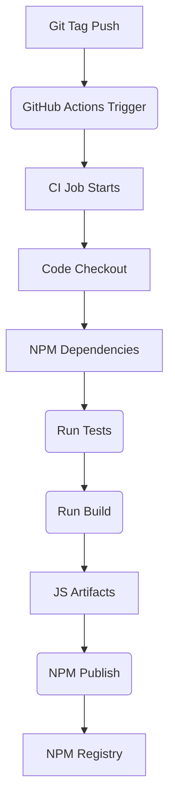
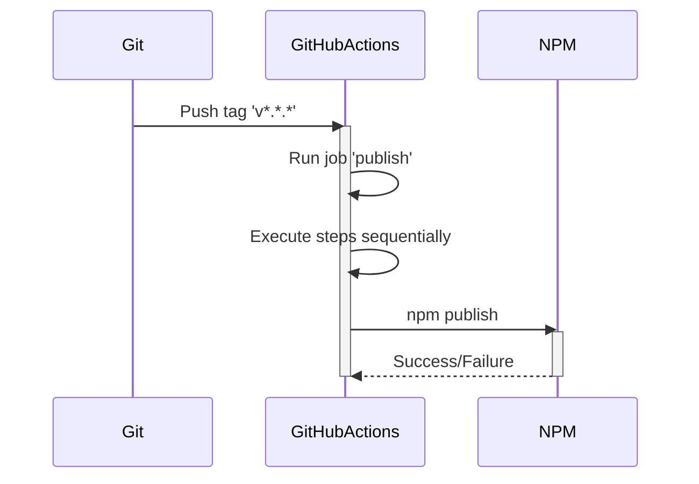

# Task: Automated NPM Publish CD (Continuous Deployment)

---

## 1 Meta & Governance

### 1.2 Status

- **Current State:** 💡 Not Started
- **Priority:** 🟧 Medium
- **Progress:** 0%
- **Planning Estimate:** 5
- **Est. Variance (pts):** 0
- **Created:** 2025-07-24 11:20
- **Implementation Started:**
- **Completed:**
- **Last Updated:** 2025-07-24 11:20

### 1.3 Priority Drivers

- [TEC-Dev_Productivity_Enhancement](/docs/ddd-2.md#tec-dev_productivity_enhancement)

---

## 2 Business & Scope

### 2.1 Overview

- **Core Function**: To create a Continuous Deployment (CD) workflow using GitHub Actions that automatically publishes the `ddd-tools` package to the NPM registry.
- **Key Capability**: The workflow will trigger on the push of a new version tag, ensuring that every versioned release is built, tested, and published consistently.
- **Business Value**: Automating the release process eliminates the risk of manual error, reduces the effort required for new releases, and ensures a reliable and repeatable deployment pipeline.

#### 2.2.3 Core Business Rules

- The workflow MUST only trigger on tags matching the pattern `v*.*.*`.
- The workflow MUST run the full test suite and build the project before attempting to publish.
- The workflow MUST fail and prevent publishing if either the tests or the build fails.
- The NPM authentication token MUST be stored securely as a GitHub secret and not exposed in the workflow logs.

### 2.4 Acceptance Criteria

| ID   | Criterion                                                                                           |
| :--- | :-------------------------------------------------------------------------------------------------- |
| AC-1 | A workflow file is created at `.github/workflows/publish.yml`.                                      |
| AC-2 | The workflow successfully triggers when a new tag matching `v*.*.*` is pushed to the repository.    |
| AC-3 | The workflow job successfully installs dependencies, builds the project, and runs all tests.        |
| AC-4 | The workflow job successfully publishes the package to the NPM registry using a secret `NPM_TOKEN`. |
| AC-5 | The workflow job fails if any step before the publish step fails.                                   |

---

## 3 Planning & Decomposition

### 3.3 Dependencies

| ID  | Dependency On                             | Type     | Status         | Notes                                                                                                       |
| :-- | :---------------------------------------- | :------- | :------------- | :---------------------------------------------------------------------------------------------------------- |
| D-1 | `p1-p4.t14-ci-cd-pipeline.task.md`        | Internal | 💡 Not Started | The CI pipeline should be in place to ensure code quality before setting up deployment.                     |
| D-2 | `p1-p4.t15-npm-executable-config.task.md` | Internal | 💡 Not Started | The package must be fully configured before automating its publication.                                     |
| D-3 | `NPM_TOKEN` GitHub Secret                 | External | 💡 Not Started | A secret named `NPM_TOKEN` containing a valid NPM publish token must be created in the repository settings. |

---

## 4 High-Level Design

_Inherits overall design from parent plan [p1.p4-npm-publication.plan.md](./p1.p4-npm-publication.plan.md)._

### 4.2 Target Architecture

#### 4.2.1 Data Models

This diagram shows the relationship between the Git repository, the CI workflow, and the NPM registry.



#### 4.2.2 Components

The main components are the workflow definition and the external NPM service it interacts with.



#### 4.2.3 Data Flow

This shows the flow of artifacts and triggers through the CI/CD pipeline.



#### 4.2.4 Control Flow

The control flow is orchestrated by GitHub Actions based on the workflow definition.



#### 4.2.5 Integration Points

- **Upstream**: GitHub repository (triggering on tag push).
- **Downstream**: NPM registry (publishing the package).

---

## 5 Maintenance and Monitoring

### 5.2 Target Maintenance and Monitoring

#### 5.2.1 Error Handling

- **Workflow Failures**: If any step in the workflow fails, GitHub Actions will stop the run, mark it as failed, and send a notification email to the user who pushed the tag.
- **Debugging**: Detailed logs for each step are available in the "Actions" tab of the GitHub repository, allowing for post-mortem analysis of failed runs.

---

## 6 Implementation Guidance

### 6.1 Implementation Log / Steps

- [ ] Create the directory structure `.github/workflows/`.
- [ ] Create a new file named `publish.yml` inside the new directory.
- [ ] Add the following content to the `publish.yml` file:

  ```yaml
  # .github/workflows/publish.yml
  name: Publish to NPM

  on:
    push:
      tags:
        - 'v*.*.*'

  jobs:
    publish:
      runs-on: ubuntu-latest
      steps:
        - name: Checkout
          uses: actions/checkout@v3
        - name: Setup Node.js
          uses: actions/setup-node@v3
          with:
            node-version: '18'
            registry-url: 'https://registry.npmjs.org'
        - name: Install Dependencies
          run: npm ci
        - name: Test
          run: npm test
        - name: Build
          run: npm run build
        - name: Publish
          run: npm publish --access public
          env:
            NODE_AUTH_TOKEN: ${{ secrets.NPM_TOKEN }}
  ```

- [ ] Navigate to the GitHub repository's "Settings" -> "Secrets and variables" -> "Actions".
- [ ] Create a new repository secret named `NPM_TOKEN` and paste a valid NPM publish token into the value field.

### 6.1.2 Files Change Log

- `.github/workflows/publish.yml` (New)

---

## 7 Quality & Operations

### 7.1 Testing Strategy / Requirements

| AC ID | Scenario                      | Test Type  | Tools / Runner       | Notes                                                                 |
| :---- | :---------------------------- | :--------- | :------------------- | :-------------------------------------------------------------------- |
| AC-2  | Workflow triggers on tag push | Manual E2E | `git push --tags`    | A test tag (e.g., `v0.0.1-test`) can be pushed to verify the trigger. |
| AC-4  | Package is published          | Manual E2E | `npm view ddd-tools` | After a successful run, check the NPM registry for the new version.   |

### 7.2 Configuration

- **`NPM_TOKEN`**: This is the only configuration required. It must be a repository secret in GitHub.

### 7.5 Local Test Commands

- It is not possible to run this workflow locally. It must be tested by pushing a tag to the GitHub repository.

---

## 8 Reference

### 8.1 Appendices/Glossary

- **GitHub Actions**: [Official Documentation](https://docs.github.com/en/actions)
- **NPM Publish Workflow**: [Configuring Node.js CI](https://docs.github.com/en/actions/automating-builds-and-tests/building-and-testing-nodejs-or-python#publishing-packages-to-the-npm-registry)
