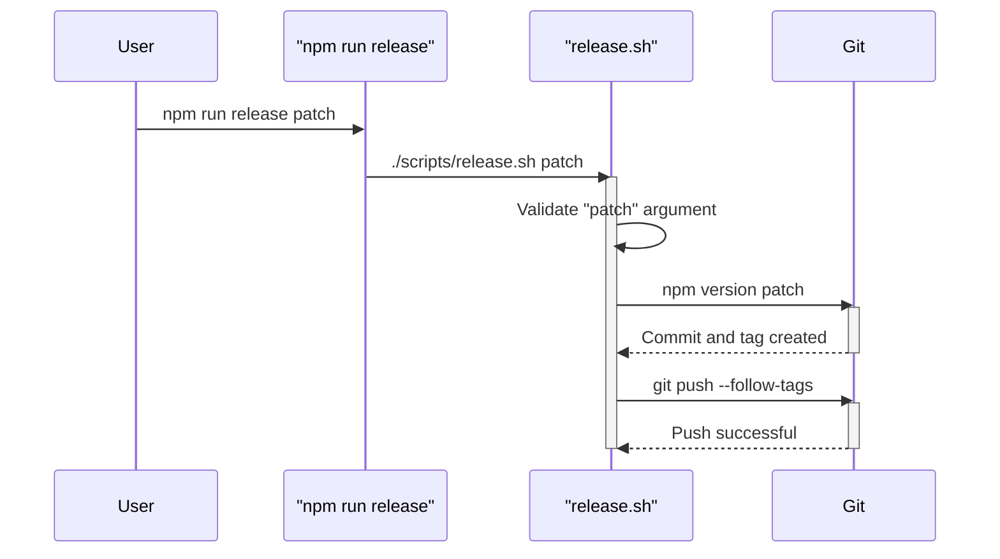

# Task: Create Automated Release Script

---

## 1 Meta & Governance

### 1.2 Status

- **Current State:** 💡 Not Started
- **Priority:** 🟧 Medium
- **Progress:** 0%
- **Planning Estimate:** 3
- **Est. Variance (pts):** 0
- **Created:** 2025-07-24 11:30
- **Implementation Started:**
- **Completed:**
- **Last Updated:** 2025-07-24 11:30

### 1.3 Priority Drivers

- [TEC-Dev_Productivity_Enhancement](/docs/ddd-2.md#tec-dev_productivity_enhancement)

---

## 2 Business & Scope

### 2.1 Overview

- **Core Function**: To create a simple shell script that automates the process of versioning the package and pushing the new tag to trigger the CI/CD publish workflow.
- **Key Capability**: Provides a single, memorable command for maintainers to perform a release, reducing manual steps.
- **Business Value**: Simplifies the release process, reduces the chance of human error (e.g., forgetting to push tags), and improves developer experience for maintainers.

#### 2.2.3 Core Business Rules

- The script MUST accept one argument: `major`, `minor`, or `patch`.
- The script MUST fail if the argument is missing or invalid.
- The script MUST execute `npm version` with the provided argument.
- The script MUST then execute `git push --follow-tags` to push the commit and the new tag.

### 2.4 Acceptance Criteria

| ID   | Criterion                                                                                               |
| :--- | :------------------------------------------------------------------------------------------------------ |
| AC-1 | A new script is created at `scripts/release.sh`.                                                        |
| AC-2 | A `release` script is added to `package.json` that executes the shell script.                           |
| AC-3 | Running `npm run release patch` successfully executes `npm version patch` and `git push --follow-tags`. |
| AC-4 | Running `npm run release` with no arguments or an invalid argument prints an error message and exits.   |

---

## 3 Planning & Decomposition

### 3.3 Dependencies

| ID  | Dependency On                                | Type     | Status         | Notes                                                                                      |
| :-- | :------------------------------------------- | :------- | :------------- | :----------------------------------------------------------------------------------------- |
| D-1 | `p1-p4.t16-automated-npm-publish-ci.task.md` | Internal | 💡 Not Started | This script's primary purpose is to trigger the CI workflow defined in the preceding task. |

---

## 4 High-Level Design

_Inherits overall design from parent plan [p1.p4-npm-publication.plan.md](./p1.p4-npm-publication.plan.md)._

### 4.2 Target Architecture

#### 4.2.2 Components

The solution consists of a simple shell script and a corresponding entry in `package.json`.

```mermaid
classDiagram
    class PackageJson {
        <<manifest>>
        +scripts: { "release": "sh ./scripts/release.sh" }
    }

    class ReleaseScript {
        <<shell script>>
        +validate_input(arg)
        +run_npm_version(arg)
        +run_git_push()
    }

    PackageJson --> ReleaseScript : "executes"
```

#### 4.2.4 Control Flow



#### 4.2.5 Integration Points

- **Upstream**: User input from the command line (`major`, `minor`, or `patch`).
- **Downstream**: Interacts with the `npm` and `git` command-line tools.

### 4.3 Tech Stack & Deployment

- **Language**: Bash (shell script)

### 4.4 Non-Functional Requirements

#### 4.4.3 Reliability

- The script must be reliable and exit on failure to prevent partial releases (e.g., a version bump without a push).

---

## 5 Maintenance and Monitoring

### 5.2 Target Maintenance and Monitoring

#### 5.2.1 Error Handling

| Error Type           | Trigger                                                     | Action                                 | User Feedback                                                                              |
| :------------------- | :---------------------------------------------------------- | :------------------------------------- | :----------------------------------------------------------------------------------------- |
| **No Argument**      | User runs `npm run release`                                 | Exit with code 1                       | "Error: Release type (major, minor, patch) is required."                                   |
| **Invalid Argument** | User runs `npm run release foo`                             | Exit with code 1                       | "Error: Invalid release type 'foo'. Use major, minor, or patch."                           |
| **Git Push Fails**   | User is not on the main branch or has a dirty working tree. | `npm version` or `git push` will fail. | The script will exit, and the error from the underlying command will be shown to the user. |

---

## 6 Implementation Guidance

### 6.1 Implementation Log / Steps

- [ ] Create the `scripts/` directory if it doesn't exist.
- [ ] Create the `scripts/release.sh` file.
- [ ] Add the shell script logic to validate input and run the `npm version` and `git push` commands.
- [ ] Make the script executable: `chmod +x scripts/release.sh`.
- [ ] Add the `release` script to the `scripts` section of `package.json`.

#### 6.1.1 Initial Situation

- The release process requires two manual commands: `npm version <type>` and `git push --follow-tags`.

#### 6.1.2 Files Change Log

- `scripts/release.sh` (New)
- `package.json` (Modified)

---

## 7 Quality & Operations

### 7.1 Testing Strategy / Requirements

- Manual testing is the only practical way to test this script, as it directly interacts with the live Git repository and versioning.
- **Test Plan**:
  1. Create a test branch.
  2. Run `npm run release patch`.
  3. Verify that the `package.json` version was bumped, a commit was created, and a tag was created.
  4. Verify that the push command was executed (it may fail if the test branch doesn't have a remote counterpart, which is expected).
  5. Reset the changes: `git tag -d v...`, `git reset --hard HEAD~1`.

### 7.5 Local Test Commands

```bash
# Run the script for a patch release
npm run release patch
```

---

## 8 Reference

### 8.1 Appendices/Glossary

- **npm version**: [Official NPM Documentation](https://docs.npmjs.com/cli/v10/commands/npm-version)
