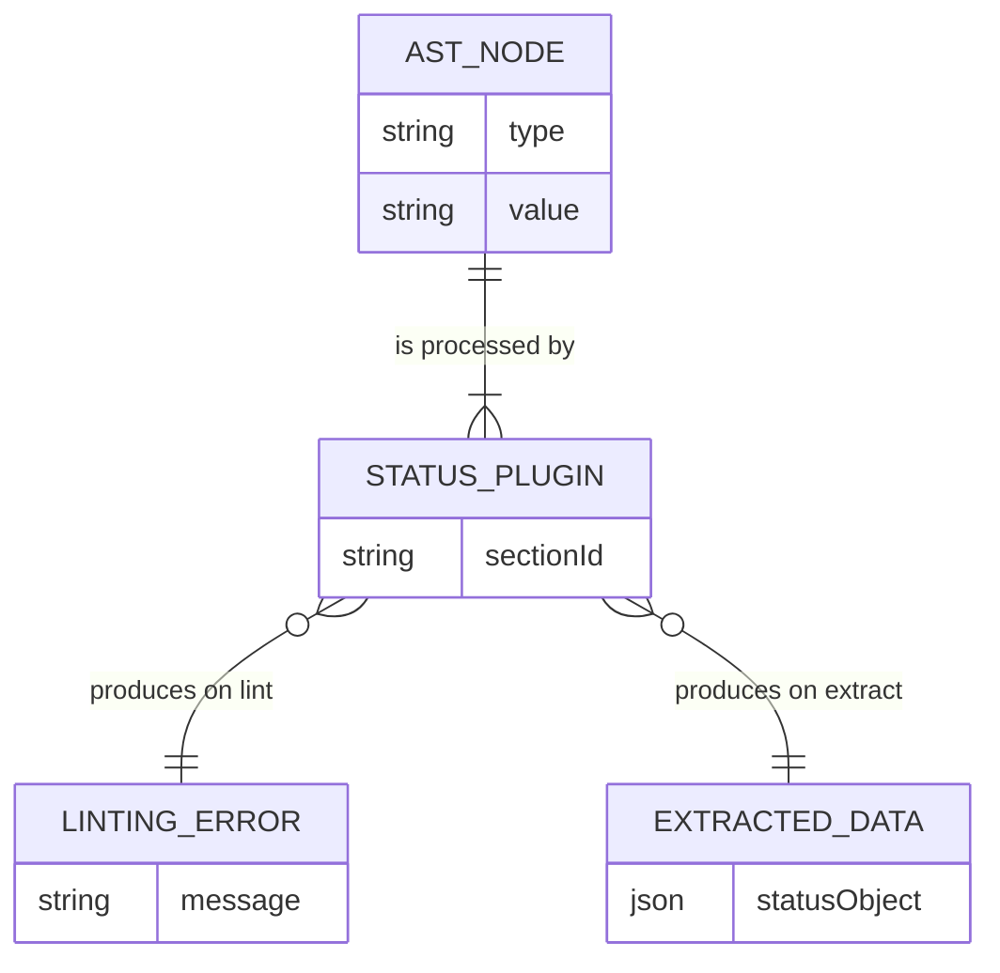
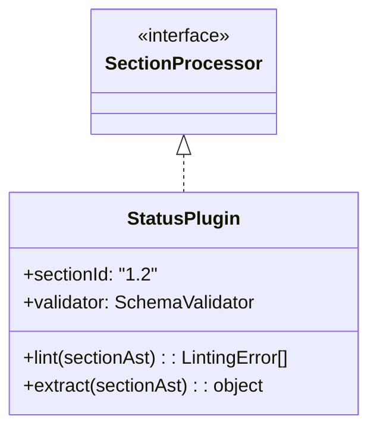
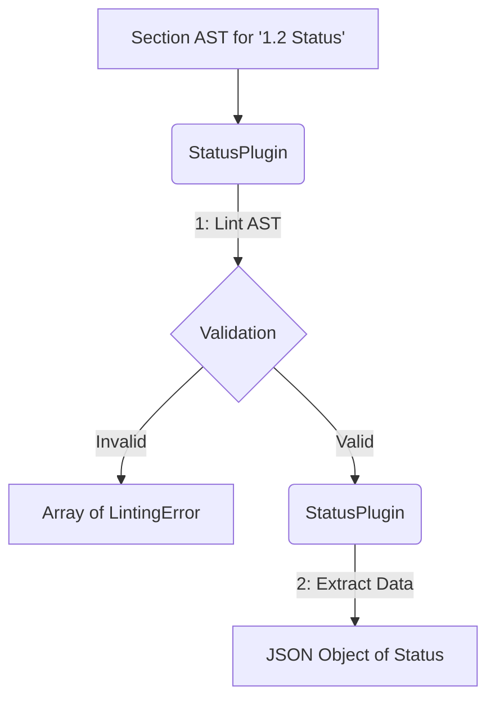
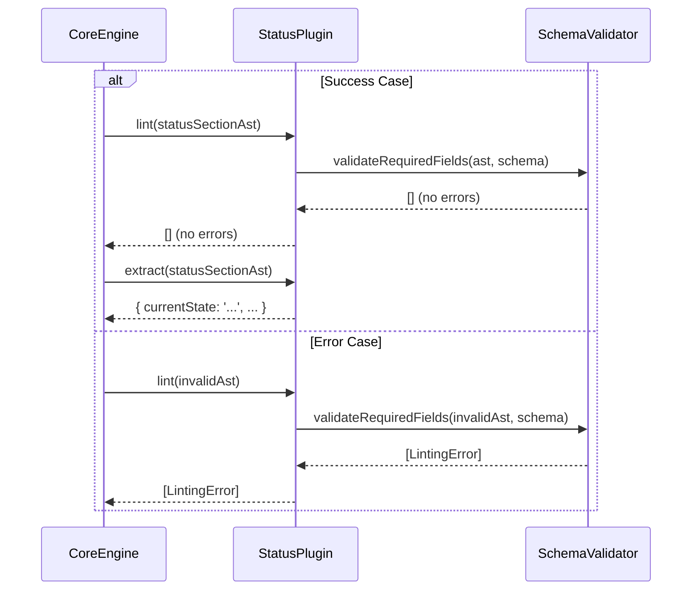

# PoC Plugin for `1.2 Status`

## 1 Meta & Governance

### 1.2 Status

- **Current State:** 💡 Not Started
- **Priority:** 🟥 High
- **Progress:** 0%
- **Planning Estimate:** 3
- **Est. Variance (pts):** 0
- **Created:** 2025-07-27 14:57
- **Implementation Started:**
- **Completed:**
- **Last Updated:** 2025-07-27 14:57

### 1.3 Priority Drivers

- [TEC-Dev_Productivity_Enhancement](../ddd-2.md#tec-dev_productivity_enhancement)

---

## 2 Business & Scope

### 2.1 Overview

- **Core Function**: Implements the first section processor plugin for the `1.2 Status` section.
- **Key Capability**: This task delivers a concrete implementation of the `SectionProcessor` interface that can both lint and extract data from the status block of a task document.
- **Business Value**: Serves as a proof-of-concept for the entire parser architecture, validating that the plugin model is viable. It provides the first piece of real, extractable data from the documentation.

### 2.4 Acceptance Criteria

| ID   | Criterion                                                                                                     | Test Reference          |
| :--- | :------------------------------------------------------------------------------------------------------------ | :---------------------- |
| AC-1 | The `StatusPlugin` correctly identifies a missing required field (e.g., `Priority`) in a status block.        | `status.plugin.test.ts` |
| AC-2 | The `StatusPlugin` correctly identifies a field with the wrong data type (e.g., `Progress` is not a number).  | `status.plugin.test.ts` |
| AC-3 | The `StatusPlugin` correctly extracts all key-value pairs from a valid status block into a structured object. | `status.plugin.test.ts` |
| AC-4 | The plugin uses the `SchemaValidator` from task `t26` to perform its validation.                              | `status.plugin.test.ts` |

---

## 3 Planning & Decomposition

### 3.3 Dependencies

| ID  | Dependency On                                           | Type     | Status         | Affected Plans/Tasks | Notes                                                       |
| :-- | :------------------------------------------------------ | :------- | :------------- | :------------------- | :---------------------------------------------------------- |
| D-1 | [Task t18](./p1-p5.t18-core-engine-parser.task.md)      | Internal | 💡 Not Started | This task            | Requires the Core Engine to load and execute the plugin.    |
| D-2 | [Task t26](./p1-p5.t26-schema-validation-utils.task.md) | Internal | 💡 Not Started | This task            | Requires the schema validation utils for its `lint` method. |

---

## 4 High-Level Design

### 4.2 Target Architecture

#### 4.2.1 Data Models

The `StatusPlugin` primarily deals with transforming a portion of the markdown AST into a structured JSON object.



#### 4.2.2 Components



#### 4.2.3 Data Flow



#### 4.2.4 Control Flow

This diagram shows both the success and failure paths for the linting process.



#### 4.2.5 Integration Points

##### 4.2.5.1 Upstream Integrations

- **Core Engine**: The plugin is invoked by the `CoreEngine`, which provides the specific AST chunk for the `1.2 Status` section.
- **Schema Validator**: The plugin uses the `SchemaValidator` service to validate the AST against the canonical schema.

##### 4.2.5.2 Downstream Integrations

- **Core Engine**: The plugin returns either an array of `LintingError` objects or a structured JSON object to the `CoreEngine`.

#### 4.2.6 Exposed API

This module implements the `SectionProcessor` interface and does not expose a public API directly. Its functionality is consumed by the `CoreEngine`.

### 4.3 Tech Stack & Deployment

- **Language**: TypeScript
- **Testing**: Vitest
- **Dependencies**:
  - `unist-util-visit`: To traverse the AST and find the relevant nodes for extraction.

### 4.4 Non-Functional Requirements

#### 4.4.1 Performance

| ID      | Requirement                                                                                            | Priority  |
| :------ | :----------------------------------------------------------------------------------------------------- | :-------- |
| PERF-01 | The plugin's `lint` and `extract` methods should execute in well under 10ms for a typical section AST. | 🟧 Medium |

#### 4.4.2 Security

| ID     | Requirement                                                                                                   | Priority |
| :----- | :------------------------------------------------------------------------------------------------------------ | :------- |
| SEC-01 | The plugin must not execute any code or evaluate any strings from the document it is parsing.                 | 🟥 High  |
| SEC-02 | The plugin must not make any network requests or access the file system outside of its explicit dependencies. | 🟥 High  |

#### 4.4.3 Reliability

| ID     | Requirement                                                                                               | Priority |
| :----- | :-------------------------------------------------------------------------------------------------------- | :------- |
| REL-01 | Must not crash on malformed or unexpected AST input; it must always return a `LintingError[]` or data.    | 🟥 High  |
| REL-02 | Must correctly identify all validation rules defined in the `1-meta.json` schema via the SchemaValidator. | 🟥 High  |
| REL-03 | Extracted data must be a 1:1, lossless match with the content in the source document.                     | 🟥 High  |

---

## 5 Maintenance and Monitoring

### 5.2 Target Maintenance and Monitoring

#### 5.2.1 Error Handling

| Error Type                        | Trigger                                                             | Action                                                         | Notes                                                                   |
| :-------------------------------- | :------------------------------------------------------------------ | :------------------------------------------------------------- | :---------------------------------------------------------------------- |
| **AST Node Traversal Error**      | The AST structure for the section is unexpected (e.g., not a list). | Return a `LintingError` explaining the structural issue.       | The plugin should not crash, but report a validation error to the user. |
| **Schema Validation Failure**     | A required field is missing or a value has the wrong type.          | Return the `LintingError` generated by the `SchemaValidator`.  | Delegate error creation to the centralized validation utility.          |
| **Extraction Key-Value Mismatch** | A list item in the status block does not contain a `:` separator.   | Return a `LintingError` indicating a malformed key-value pair. | Ensures the extractor is robust against malformed content.              |

#### 5.2.2 Logging & Monitoring

- **Logging**: The plugin itself will not perform any logging. It will communicate all outcomes (success or failure) through its return values (`LintingError[]` or a data object), leaving the `CoreEngine` or the CLI to handle logging.
- **Monitoring**: Not applicable.

---

## 6 Implementation Guidance

### 6.1 Implementation Log / Steps

- [ ] Create `src/doc-parser/plugins/status.plugin.ts`.
- [ ] Implement the `SectionProcessor` interface.
- [ ] In the `lint` method, use the injected `SchemaValidator` to check for required fields and types based on the `1-meta.json` schema.
- [ ] In the `extract` method, traverse the list nodes of the status block AST to build a key-value object.
- [ ] Create `src/doc-parser/plugins/status.plugin.test.ts` with comprehensive unit tests.

#### 6.1.1 Initial Situation

- The `CoreEngine` and `SchemaValidator` are available for use.
- The `SectionProcessor` interface is defined.
- No plugin for section `1.2` exists.

#### 6.1.2 Files Change Log

| Action | File Path                                                | Notes                                         |
| :----- | :------------------------------------------------------- | :-------------------------------------------- |
| CREATE | `src/doc-parser/plugins/status.plugin.ts`                | The main implementation file for this plugin. |
| CREATE | `src/__tests__/doc-parser/plugins/status.plugin.test.ts` | Unit tests for the plugin.                    |
| MODIFY | `src/doc-parser/core-engine.ts`                          | To register and load the new status plugin.   |

---

## 7 Quality & Operations

### 7.1 Testing Strategy / Requirements

This task's quality is ensured by a comprehensive suite of unit tests that treat the plugin as an independent module, covering valid inputs, common errors, and edge cases. Since there is no dedicated QA, these tests are the primary reliability net.

| ID        | Scenario                                                                                                | Test Type | Tools / Runner | Notes                                                                                           |
| :-------- | :------------------------------------------------------------------------------------------------------ | :-------- | :------------- | :---------------------------------------------------------------------------------------------- |
| T1 (AC-1) | **Linting: Missing Required Field**: An AST missing the `Priority` field returns a specific error.      | Unit      | Vitest         | Create a mock AST representing the invalid structure.                                           |
| T2 (AC-2) | **Linting: Wrong Data Type**: An AST where `Progress` is `"abc"` returns a "wrong type" error.          | Unit      | Vitest         |                                                                                                 |
| T3        | **Linting: Unknown Field**: An AST with an extra field like `Assignee: "Bob"` returns an error.         | Unit      | Vitest         | Ensures the plugin is strict and rejects fields not defined in the schema.                      |
| T4        | **Linting: Malformed Key-Value**: An AST with a list item like `- Just a note` returns an error.        | Unit      | Vitest         | Tests robustness against content that isn't a key-value pair.                                   |
| T5 (AC-3) | **Extraction: Valid Data**: A valid status block AST is extracted into a perfect JSON object.           | Unit      | Vitest         | The baseline success case for the `extract` method.                                             |
| T6        | **Extraction: Case Insensitivity**: Keys like `priority` and `PRIORITY` are normalized to `priority`.   | Unit      | Vitest         | Ensures consistency in the extracted data object.                                               |
| T7        | **Extraction: Special Characters**: A value with markdown or special characters is extracted correctly. | Unit      | Vitest         | e.g., `Notes: A **bold** note.` should be extracted as a string with the markdown intact.       |
| T8 (AC-4) | **Delegation**: The `SchemaValidator`'s methods are called during the `lint()` execution.               | Unit      | Vitest         | Use `vi.spyOn` to ensure the plugin is delegating validation instead of implementing it itself. |

### 7.2 Configuration

- This plugin requires no specific configuration. It receives its dependencies (like the `SchemaValidator`) from the `CoreEngine`.

### 7.3 Alerting & Response

- Not applicable. This plugin does not generate alerts. It returns errors programmatically to its consumer, the `CoreEngine`.

### 7.5 Local Test Commands

```bash
npm test -- src/doc-parser/plugins/status.plugin.test.ts
```
