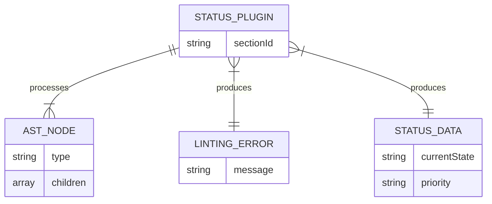
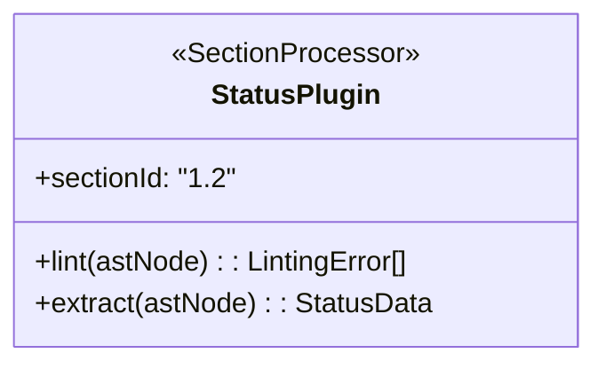
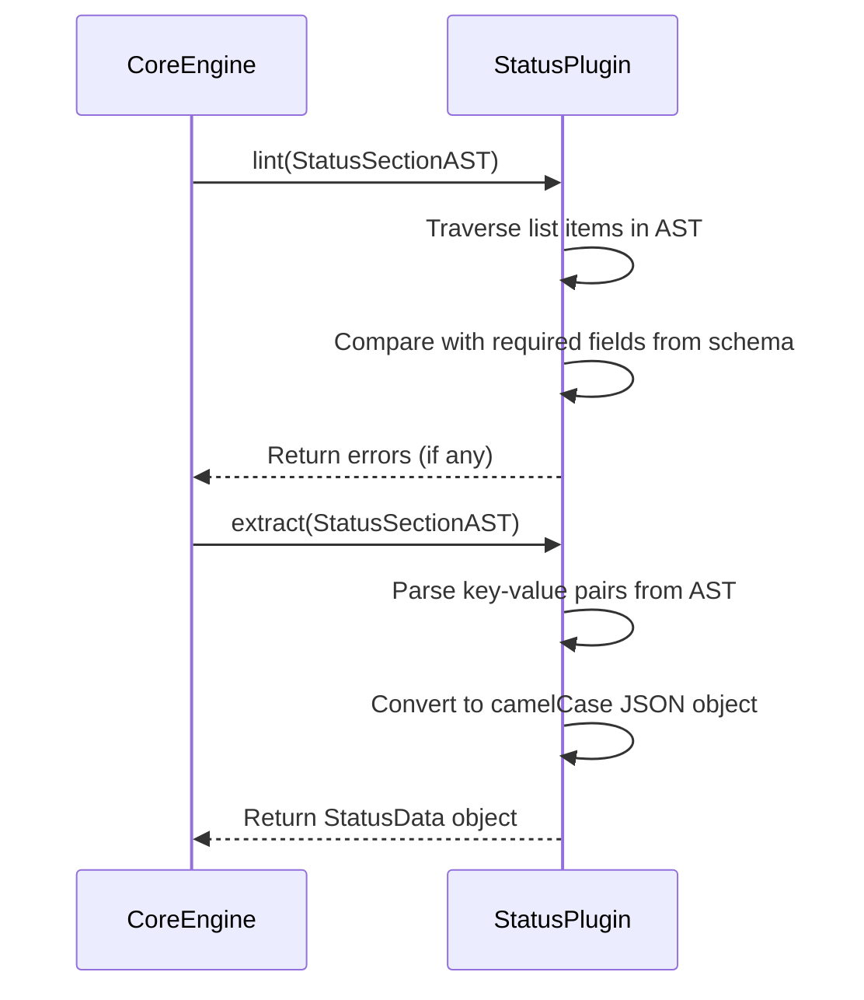

# PoC Plugin for 1.2 Status

## 1 Meta & Governance

### 1.2 Status

- **Current State:** 💡 Not Started
- **Priority:** 🟥 High
- **Progress:** 0%
- **Planning Estimate:** 2
- **Est. Variance (pts):** 0
- **Created:** 2025-07-24 17:00
- **Implementation Started:**
- **Completed:**
- **Last Updated:** 2025-07-24 17:05

### 1.3 Priority Drivers

- TEC-Dev_Productivity_Enhancement

---

## 2 Business & Scope

### 2.1 Overview

- **Core Function**: Implements a proof-of-concept `SectionProcessor` plugin for the `1.2 Status` section.
- **Key Capability**: This plugin will validate the structure of the `### 1.2 Status` section in any task file and extract its key-value data into a structured object.
- **Business Value**: Proves the viability of the plugin-based architecture and delivers the first piece of concrete data extraction, enabling status tracking.

### 2.4 Acceptance Criteria

| ID   | Criterion                                                                                                   | Test Reference                    |
| :--- | :---------------------------------------------------------------------------------------------------------- | :-------------------------------- |
| AC-1 | The plugin's `lint` method returns an error if a required field (e.g., `Priority`) is missing.              | `status.plugin.test.ts`           |
| AC-2 | The plugin's `lint` method returns an error if a field value has an incorrect format (e.g., bad date).      | `status.plugin.test.ts`           |
| AC-3 | The plugin's `extract` method correctly parses all key-value pairs from the status list into a JSON object. | `status.plugin.test.ts`           |
| AC-4 | The plugin is successfully discovered and loaded by the `PluginManager` from the `CoreEngine` task.         | `core-engine.integration.test.ts` |

---

## 3 Planning & Decomposition

### 3.3 Dependencies

| ID  | Dependency On                          | Type     | Status         | Affected Plans/Tasks | Notes                                                                |
| :-- | :------------------------------------- | :------- | :------------- | :------------------- | :------------------------------------------------------------------- |
| D-1 | `p1-p5.t18-core-engine-parser.task.md` | Internal | 💡 Not Started | This task            | This task requires the Core Engine and plugin architecture to exist. |
| D-2 | `src/ddd-schema-json/1-meta.json`      | Internal | ✅ Complete    | This task            | The plugin will read its validation rules from this schema file.     |

---

## 4 High-Level Design

### 4.2 Target Architecture

#### 4.2.1 Data Models



#### 4.2.2 Components



#### 4.2.3 Data Flow

```mermaid
graph TD
    A[AST Node for Status Section] --> B(StatusPlugin);
    subgraph "Linting Path"
        B -- "1a. Validate against schema" --> C{Is Valid?};
        C -- "No" --> D[LintingError[]];
    end
    subgraph "Extraction Path"
        C -- "Yes" --> E[StatusData Object];
    end
    D --> F(Output);
    E --> F(Output);
```

#### 4.2.4 Control Flow



#### 4.2.5 Integration Points

##### 4.2.5.1 Upstream Integrations

- **Core Engine**: The plugin is dynamically imported and invoked by the `CoreEngine`. It receives a specific portion of the document's AST that corresponds to the `### 1.2 Status` section.

##### 4.2.5.2 Downstream Integrations

- **Core Engine**: The plugin returns a `StatusData` object and an array of `LintingError` objects back to the `CoreEngine`, which aggregates them into the final `ParseResult`.

#### 4.2.6 Exposed API

This module implements the `SectionProcessor` interface and does not expose a direct public API. It is consumed by the `PluginManager`.

### 4.3 Tech Stack & Deployment

- **Language**: TypeScript
- **Testing**: Jest

### 4.4 Non-Functional Requirements

#### 4.4.3 Reliability

| ID     | Requirement                                                             | Priority |
| :----- | :---------------------------------------------------------------------- | :------- |
| REL-01 | The plugin must not crash on malformed input; it must return errors.    | 🟥 High  |
| REL-02 | The plugin must correctly identify all required fields from the schema. | 🟥 High  |

---

## 5 Maintenance and Monitoring

### 5.2 Target Maintenance and Monitoring

#### 5.2.1 Error Handling

| Error Type            | Trigger                                          | Action                   | User Feedback                                                                    |
| :-------------------- | :----------------------------------------------- | :----------------------- | :------------------------------------------------------------------------------- |
| **AST Node Mismatch** | The AST node passed to the plugin is not a list. | Return a `LintingError`. | `Invalid structure for Status section: expected a list.`                         |
| **Invalid Key-Value** | A list item does not contain a ':' separator.    | Return a `LintingError`. | `Invalid line in Status section: "[line content]". Must be "Key: Value" format.` |

#### 5.2.2 Logging & Monitoring

- **Logging**: This plugin will not perform any logging itself. It will return errors to the `CoreEngine` to handle logging.

---

## 6 Implementation Guidance

### 6.1 Implementation Log / Steps

- [ ] Create new directory `src/doc-parser/plugins/1-meta-governance/`.
- [ ] Create new file `1.2-status.plugin.ts` in the new directory.
- [ ] In this file, implement the `SectionProcessor` interface.
- [ ] Implement the `lint` method:
  - [ ] Parse the list items from the AST node.
  - [ ] Read the required fields from `src/ddd-schema-json/1-meta.json`.
  - [ ] Compare the fields present in the AST against the required list.
  - [ ] Return a `LintingError` for each missing required field.
- [ ] Implement the `extract` method:
  - [ ] Parse the list items from the AST node.
  - [ ] Convert the key-value pairs into a camelCase JSON object (`StatusData`).
  - [ ] Coerce types where necessary (e.g., convert "0%" to `0`).
- [ ] Create `1.2-status.plugin.test.ts` to unit test the plugin.
  - [ ] Add a test case with a valid status block.
  - [ ] Add a test case with a missing `Priority` field.
  - [ ] Add a test case with an invalid `Progress` value.

---

## 7 Quality & Operations

### 7.1 Testing Strategy / Requirements

| AC   | Scenario                                                             | Test Type | Tools / Runner | Notes                                                              |
| :--- | :------------------------------------------------------------------- | :-------- | :------------- | :----------------------------------------------------------------- |
| AC-1 | `lint()` returns an error when `Priority` is missing from the input. | Unit      | Jest           | Provide a mock AST for a status section without the priority line. |
| AC-2 | `lint()` returns an error when `Progress` is not a valid percentage. | Unit      | Jest           | Provide a mock AST with `Progress: ninety`.                        |
| AC-3 | `extract()` correctly converts "Current State" to `currentState`.    | Unit      | Jest           | Check for correct camelCase conversion.                            |
| AC-3 | `extract()` correctly parses "50%" into the number `50`.             | Unit      | Jest           | Test type coercion for percentage values.                          |

### 7.2 Configuration

- This plugin has no specific configuration. It reads its rules from the central `ddd-schema-json` files.

### 7.3 Alerting & Response

- Not applicable.

### 7.5 Local Test Commands

```bash
npm test -- src/doc-parser/plugins/1-meta-governance/1.2-status.plugin.test.ts
```

---

## 8 Reference

### 8.1 Appendices/Glossary

- **Section Processor**: A plugin dedicated to linting and extracting data from a single, specific section of a task document.

---
