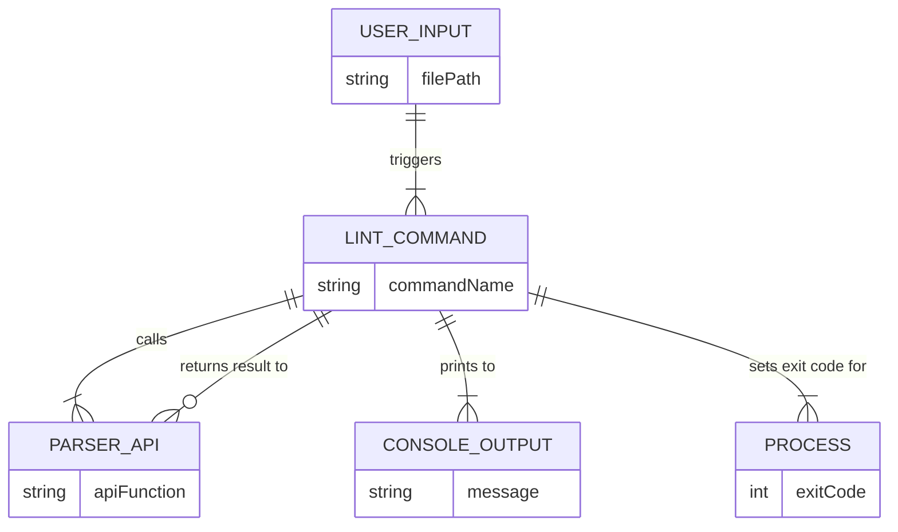
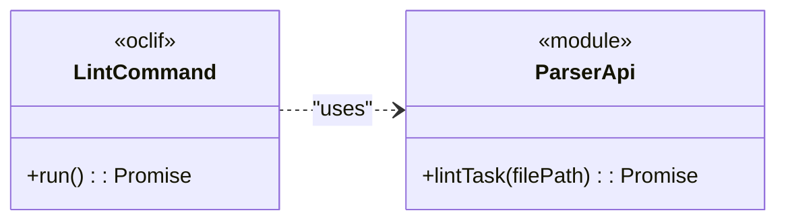
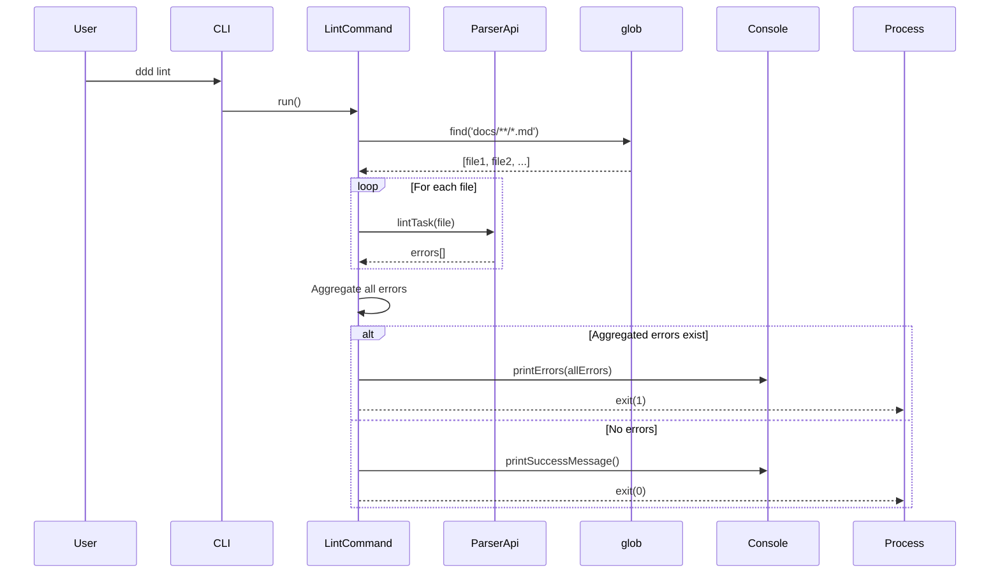

# CLI `lint` Command Integration

## 1 Meta & Governance

### 1.2 Status

- **Current State:** 💡 Not Started
- **Priority:** 🟧 Medium
- **Progress:** 0%
- **Planning Estimate:** 3
- **Est. Variance (pts):** 0
- **Created:** 2025-07-27 15:21
- **Implementation Started:**
- **Completed:**
- **Last Updated:** 2025-07-27 15:21

### 1.3 Priority Drivers

- [TEC-Dev_Productivity_Enhancement](../ddd-2.md#tec-dev_productivity_enhancement)

---

## 2 Business & Scope

### 2.1 Overview

- **Core Function**: Exposes the document parser's linting functionality through a new `ddd lint` command.
- **Key Capability**: Allows developers and automated scripts to validate either a single task document or the entire documentation suite (`docs/`) directly from the command line.
- **Business Value**: Provides a direct, user-facing tool for enforcing documentation quality, making the parser's capabilities accessible and actionable for everyday development workflows.

### 2.4 Acceptance Criteria

| ID   | Criterion                                                                                                            | Test Reference     |
| :--- | :------------------------------------------------------------------------------------------------------------------- | :----------------- |
| AC-1 | A new command `ddd lint <file>` is available in the CLI.                                                             | `lint.e2e.test.ts` |
| AC-2 | The command correctly calls the `lintTask` API from the document parser.                                             | `lint.test.ts`     |
| AC-3 | If `lintTask` returns errors, the command prints them to the console in a readable format and exits with code 1.     | `lint.e2e.test.ts` |
| AC-4 | If `lintTask` returns no errors, the command prints a success message and exits with code 0.                         | `lint.e2e.test.ts` |
| AC-5 | If the file path is invalid, the command prints a "file not found" error and exits with code 1.                      | `lint.e2e.test.ts` |
| AC-6 | If no file path is provided, the command lints all `*.task.md` and `*.plan.md` files within the `docs/` directory.   | `lint.e2e.test.ts` |
| AC-7 | When linting a directory, errors from multiple files are aggregated and printed before exiting with code 1.          | `lint.e2e.test.ts` |
| AC-8 | If a file path is provided that is outside the `docs/` directory, the command prints an error and exits with code 1. | `lint.e2e.test.ts` |

---

## 3 Planning & Decomposition

### 3.3 Dependencies

| ID  | Dependency On                                     | Type     | Status         | Affected Plans/Tasks | Notes                                               |
| :-- | :------------------------------------------------ | :------- | :------------- | :------------------- | :-------------------------------------------------- |
| D-1 | [Task t19](./p1-p5.t19-poc-plugin-status.task.md) | Internal | 💡 Not Started | This task            | Requires the `lintTask` API to be fully functional. |

---

## 4 High-Level Design

### 4.2 Target Architecture

#### 4.2.1 Data Models

The command acts as a bridge between the user's input (a file path) and the `ParserApi`, transforming the API's output into user-readable console messages and a process exit code.



#### 4.2.2 Components

This task integrates the existing `ParserApi` with the `oclif` CLI framework.



#### 4.2.3 Data Flow

```mermaid
graph TD
    subgraph "User Input"
        A[ddd lint [file]]
    end
    subgraph "Lint Command Logic"
        B(LintCommand)
        C{File path provided?}
        D[Find all docs in `docs/`]
        E[Lint each file]
        F[Aggregate results]
    end
    subgraph "Output"
        G[Console Output]
        H[Process Exit Code]
    end

    A --> B;
    B --> C;
    C -- Yes --> E;
    C -- No --> D;
    D --> E;
    E --> F;
    F --> G;
    F --> H;
```

#### 4.2.4 Control Flow



#### 4.2.5 Integration Points

##### 4.2.5.1 Upstream Integrations

- **User/Shell**: The command is invoked from the command line with a file path as an argument.
- **Parser API**: It calls the `lintTask` function from the document parser module.

##### 4.2.5.2 Downstream Integrations

- **Console**: It prints formatted success or error messages to `stdout` or `stderr`.
- **Operating System**: It sets the process exit code to `0` for success and `1` for failure.

#### 4.2.6 Exposed API

- This task exposes a command-line interface: `ddd lint [file]`. The `<file>` argument is optional.

### 4.3 Tech Stack & Deployment

- **Language**: TypeScript
- **Framework**: Yargs (the existing CLI framework)
- **Testing**: Jest
- **Dependencies**:
  - `chalk`: To provide color-coded, readable output for errors and success messages.

### 4.4 Non-Functional Requirements

#### 4.4.1 Performance

| ID      | Requirement                                                                              | Priority  |
| :------ | :--------------------------------------------------------------------------------------- | :-------- |
| PERF-01 | The command should add less than 50ms of overhead to the underlying `lintTask` API call. | 🟧 Medium |

#### 4.4.2 Security

| ID     | Requirement                                                          | Priority |
| :----- | :------------------------------------------------------------------- | :------- |
| SEC-01 | The command must not execute any content from the file being linted. | 🟥 High  |

#### 4.4.3 Reliability

| ID     | Requirement                                                           | Priority  |
| :----- | :-------------------------------------------------------------------- | :-------- |
| REL-01 | The command must reliably exit with a non-zero code if linting fails. | 🟥 High   |
| REL-02 | Error messages printed to the console must be clear and actionable.   | 🟧 Medium |

---

## 6 Implementation Guidance

### 6.1 Implementation Log / Steps

- [ ] Create `src/cli/commands/lint.ts`.
- [ ] Define the Yargs command structure with an optional `file` argument.
- [ ] In the `run` method, check if the `file` argument was provided.
- [ ] If a file is provided, first validate that the resolved path is within the project's `docs/` directory. If not, exit with an error.
- [ ] If the path is valid, lint that single file.
- [ ] If no file is provided, use `glob` to find all `*.plan.md` and `*.task.md` files in the `docs/` directory and lint each one.
- [ ] Aggregate all errors and print them at the end.
- [ ] Implement logic to format and print errors or success messages to the console.
- [ ] Ensure the process exit code is set correctly based on the outcome.
- [ ] Create `src/__tests__/cli/commands/lint.test.ts` for unit tests.
- [ ] Create `src/__tests__/cli/commands/lint.e2e.test.ts` for end-to-end tests.

---

## 7 Quality & Operations

### 7.1 Testing Strategy / Requirements

| ID  | Scenario                                                                                               | Test Type | Tools / Runner | Notes                                                                      |
| :-- | :----------------------------------------------------------------------------------------------------- | :-------- | :------------- | :------------------------------------------------------------------------- |
| T1  | The command correctly calls the `lintTask` API with the file path argument.                            | Unit      | Jest           | Use `jest.spyOn` to mock the API and verify it was called.                 |
| T2  | The command prints a formatted error message for each `LintingError` returned by the API.              | Unit      | Jest           | Mock the API to return a sample error array and assert the console output. |
| T3  | Running the compiled `ddd lint` on a valid file exits with code 0.                                     | E2E       | Jest + execa   | Use the test fixture `valid.task.md`.                                      |
| T4  | Running the compiled `ddd lint` on an invalid file prints errors to stderr and exits with code 1.      | E2E       | Jest           | Use the test fixture `invalid-missing-field.task.md`.                      |
| T5  | Running `ddd lint` with no arguments on a directory with one invalid file exits with code 1.           | E2E       | Jest           | Create a test directory with a mix of valid and invalid files.             |
| T6  | Running `ddd lint` with no arguments on a fully valid directory exits with code 0.                     | E2E       | Jest           |                                                                            |
| T7  | Running `ddd lint` with a path outside the `docs/` directory (e.g., `../README.md`) exits with code 1. | E2E       | Jest           | Assert that a specific error message about path validation is shown.       |

### 7.5 Local Test Commands

```bash
npm test -- src/__tests__/cli/commands/lint.test.ts
npm test -- src/__tests__/cli/commands/lint.e2e.test.ts
```
