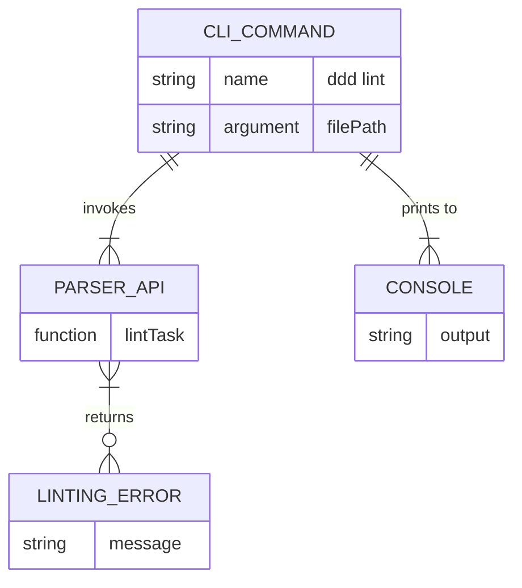
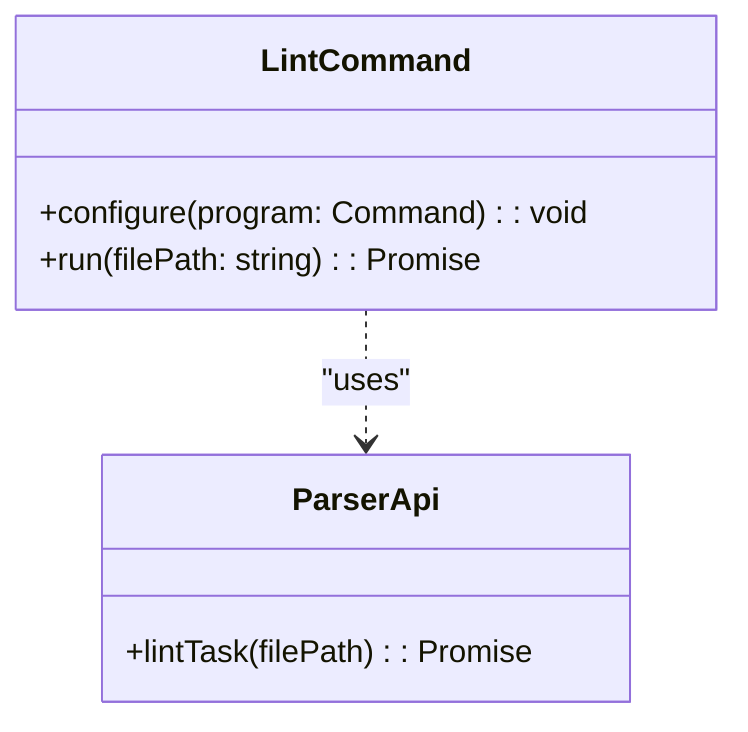
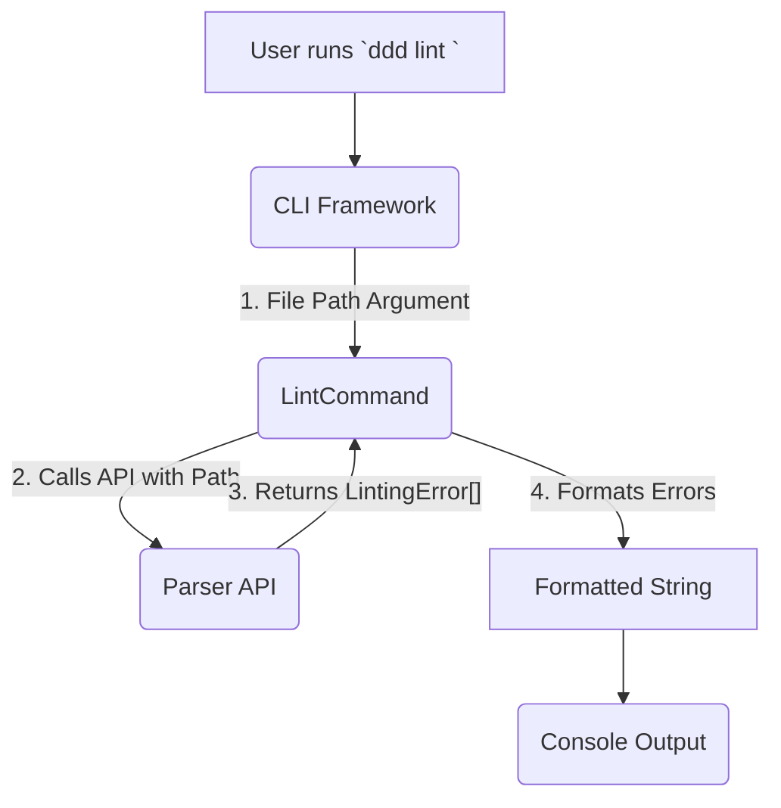
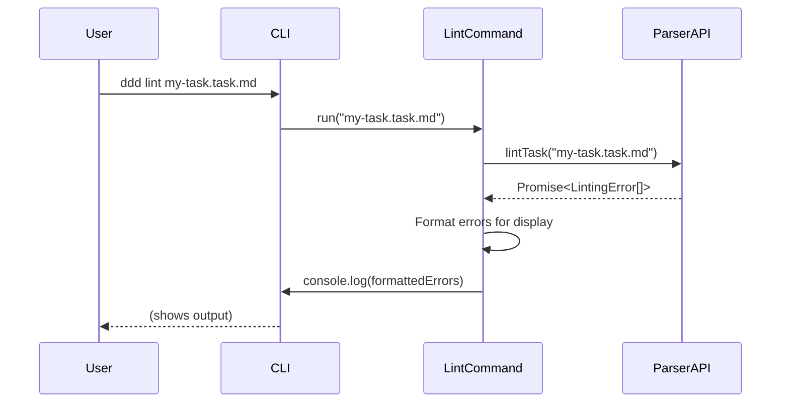

# CLI lint Command Integration

## 1 Meta & Governance

### 1.2 Status

- **Current State:** 💡 Not Started
- **Priority:** 🟧 Medium
- **Progress:** 0%
- **Planning Estimate:** 2
- **Est. Variance (pts):** 0
- **Created:** 2025-07-24 17:10
- **Implementation Started:**
- **Completed:**
- **Last Updated:** 2025-07-24 17:15

### 1.3 Priority Drivers

- TEC-Dev_Productivity_Enhancement

---

## 2 Business & Scope

### 2.1 Overview

- **Core Function**: Implements a new `ddd lint` command in the CLI.
- **Key Capability**: Provides a user-friendly command-line interface to validate a specific `*.task.md` file against the documentation schema.
- **Business Value**: Enables developers to easily check their documentation for compliance before committing, improving documentation quality and preventing errors from entering the version control system.

### 2.2.3 Core Business Rules

- The command **must** exit with a non-zero status code if any linting errors are found.
- The command **must** exit with a status code of 0 if no linting errors are found.
- Error messages printed to the console **must** be human-readable and clearly indicate the file, section, and nature of the error.

### 2.4 Acceptance Criteria

| ID   | Criterion                                                                                             | Test Reference |
| :--- | :---------------------------------------------------------------------------------------------------- | :------------- |
| AC-1 | A new command `ddd lint <file>` is available in the CLI.                                              | `lint.test.ts` |
| AC-2 | The command exits with code 0 and prints a success message when run on a valid task file.             | `lint.test.ts` |
| AC-3 | The command exits with code 1 and prints a formatted list of errors when run on an invalid task file. | `lint.test.ts` |
| AC-4 | The command prints a user-friendly error and exits with code 1 if the specified file does not exist.  | `lint.test.ts` |

---

## 3 Planning & Decomposition

### 3.3 Dependencies

| ID  | Dependency On                         | Type     | Status         | Affected Plans/Tasks | Notes                                                                 |
| :-- | :------------------------------------ | :------- | :------------- | :------------------- | :-------------------------------------------------------------------- |
| D-1 | `p1-p5.t19-poc-plugin-status.task.md` | Internal | 💡 Not Started | This task            | This task requires the `lintTask` API from the parser to be complete. |
| D-2 | `commander` npm package               | External | ✅ Complete    | This task            | The existing CLI framework used in the project.                       |

---

## 4 High-Level Design

### 4.2 Target Architecture

#### 4.2.1 Data Models



#### 4.2.2 Components



#### 4.2.3 Data Flow



#### 4.2.4 Control Flow



#### 4.2.5 Integration Points

##### 4.2.5.1 Upstream Integrations

- **User/Terminal**: The command is triggered by a user running it in their terminal and providing a file path as an argument.

##### 4.2.5.2 Downstream Integrations

- **Parser API**: The command calls the `lintTask` function from the `doc-parser` module.
- **Console**: The command prints its output (success or error messages) to the standard output of the console.

#### 4.2.6 Exposed API

The API for this task is the command-line interface itself.

```bash
ddd lint <file>

Arguments:
  file      The path to the *.task.md file to validate.

Options:
  -h, --help  display help for command
```

### 4.3 Tech Stack & Deployment

- **Language**: TypeScript
- **CLI Framework**: `commander`
- **Testing**: Jest, `execa` for integration testing the CLI.

### 4.4 Non-Functional Requirements

#### 4.4.1 Performance

| ID      | Requirement                            | Priority  |
| :------ | :------------------------------------- | :-------- |
| PERF-01 | Command should execute in under 200ms. | 🟧 Medium |

#### 4.4.3 Reliability

| ID     | Requirement                                                              | Priority |
| :----- | :----------------------------------------------------------------------- | :------- |
| REL-01 | The command must not crash on unexpected errors from the API.            | 🟥 High  |
| REL-02 | The command must reliably set the correct exit code based on the result. | 🟥 High  |

---

## 5 Maintenance and Monitoring

### 5.2 Target Maintenance and Monitoring

#### 5.2.1 Error Handling

| Error Type           | Trigger                                               | Action                                                               | User Feedback                                   |
| :------------------- | :---------------------------------------------------- | :------------------------------------------------------------------- | :---------------------------------------------- |
| **File Not Found**   | The path provided by the user does not exist.         | Print a clear error message to `console.error` and exit with code 1. | `Error: File not found at <path>`               |
| **Parser API Error** | The `lintTask` promise rejects for an unknown reason. | Catch the exception, print a generic error, and exit with code 1.    | `An unexpected error occurred: [error.message]` |

#### 5.2.2 Logging & Monitoring

- **Logging**: All user-facing output is sent to `console.log` for successes and `console.error` for failures. No internal logging is required.

---

## 6 Implementation Guidance

### 6.1 Implementation Log / Steps

- [ ] Create new file `src/cli/commands/lint.ts`.
- [ ] In `lint.ts`, create a new `commander` command definition.
- [ ] Implement the command's action handler, which will call `lintTask` from the `doc-parser` API.
- [ ] Add logic to check if the file exists before calling the API.
- [ ] Add logic to format the returned `LintingError[]` into a human-readable string.
- [ ] Add logic to set the process exit code based on the result (0 for success, 1 for failure).
- [ ] Register the new `lint` command in the main CLI entry point (`src/cli/index.ts`).
- [ ] Create `src/cli/commands/lint.test.ts` for unit and integration tests.

---

## 7 Quality & Operations

### 7.1 Testing Strategy / Requirements

| AC   | Scenario                                                                   | Test Type   | Tools / Runner | Notes                                                       |
| :--- | :------------------------------------------------------------------------- | :---------- | :------------- | :---------------------------------------------------------- |
| AC-2 | Running `ddd lint` on a valid file exits with code 0.                      | Integration | Jest + `execa` | Create a temporary valid task file for the test.            |
| AC-3 | Running `ddd lint` on an invalid file exits with code 1 and prints errors. | Integration | Jest + `execa` | Create a temporary invalid task file and assert the stdout. |
| AC-4 | Running `ddd lint` on a non-existent file prints a "not found" error.      | Integration | Jest + `execa` | Assert the stderr for the correct error message.            |

### 7.2 Configuration

- This command does not require any configuration.

### 7.3 Alerting & Response

- Not applicable.

### 7.5 Local Test Commands

```bash
npm test -- src/cli/commands/lint.test.ts
```

---

## 8 Reference

### 8.1 Appendices/Glossary

- **CLI**: Command-Line Interface. A text-based interface used to run programs.
- **Exit Code**: A number returned by a program when it finishes. `0` typically means success, and any other number indicates an error.

---
