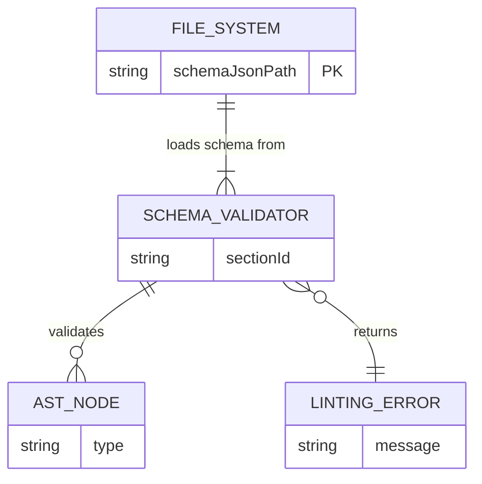
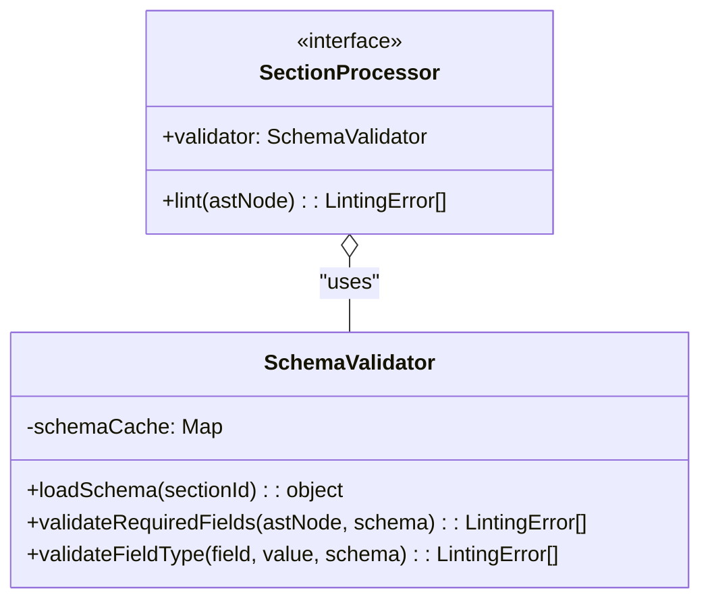
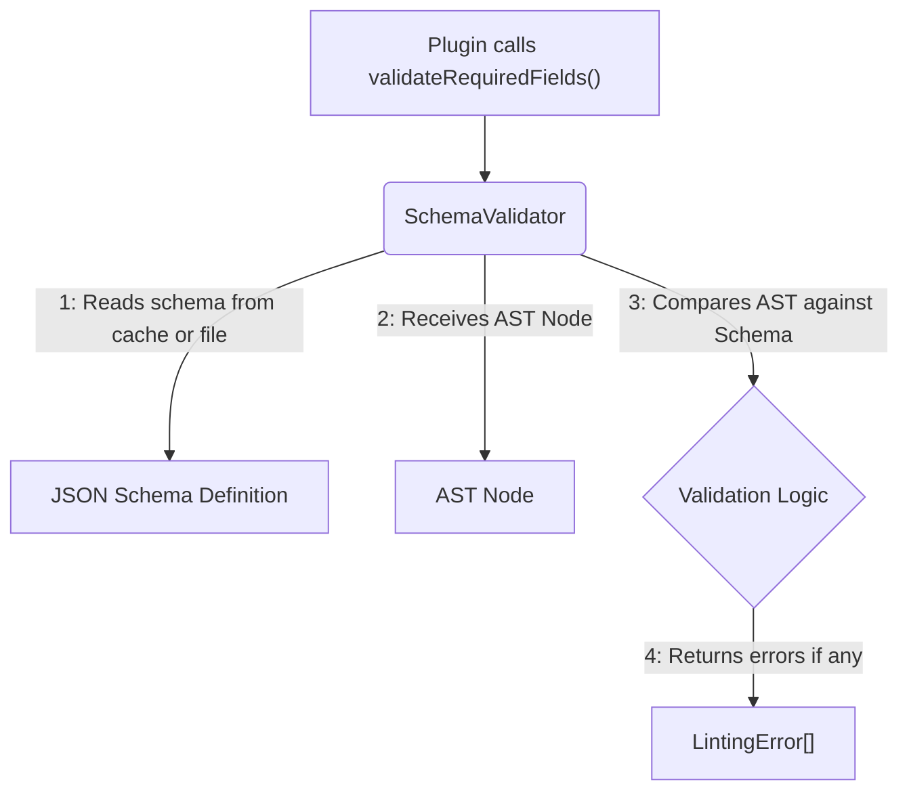
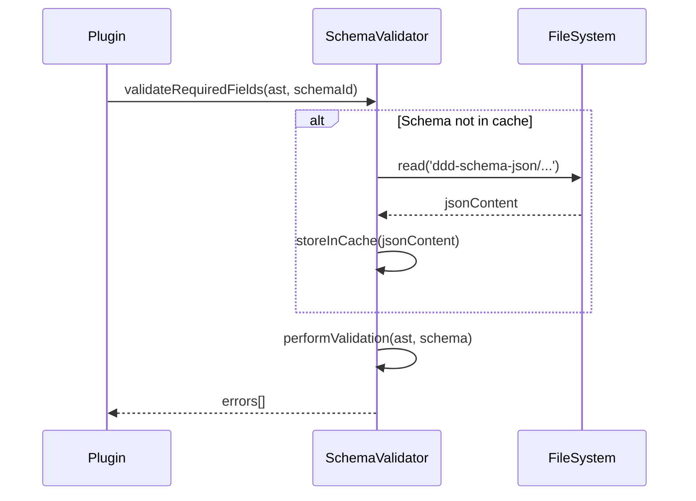

# Schema Validation Utilities

## 1 Meta & Governance

### 1.2 Status

- **Current State:** 💡 Not Started
- **Priority:** 🟥 High
- **Progress:** 0%
- **Planning Estimate:** 5
- **Est. Variance (pts):** 0
- **Created:** 2025-07-27 14:45
- **Implementation Started:** 2025-08-01 08:30
- **Completed:**
- **Last Updated:** 2025-07-27 14:45

### 1.3 Priority Drivers

- [TEC-Dev_Productivity_Enhancement](../ddd-2.md#tec-dev_productivity_enhancement)
- [TEC-Prod_Stability_Blocker](../ddd-2.md#tec-prod_stability_blocker)

---

## 2 Business & Scope

### 2.1 Overview

- **Core Function**: Provides a set of schema-aware utility functions for use by section processor plugins.
- **Key Capability**: This task delivers a centralized validator that reads the canonical `ddd-schema-json` files and offers helpers to check for required fields, validate data types, and enforce other schema rules.
- **Business Value**: Enforces the "Schema-Driven" principle by preventing validation logic from being scattered and duplicated across multiple plugins. It reduces boilerplate code for plugin authors and ensures all validation is consistent and derived from the single source of truth.

### 2.4 Acceptance Criteria

| ID   | Criterion                                                                                               | Test Reference             |
| :--- | :------------------------------------------------------------------------------------------------------ | :------------------------- |
| AC-1 | A `SchemaProvider` can load a specific section's JSON schema definition from the file system.           | `schema-provider.test.ts`  |
| AC-2 | A `SchemaValidator` utility can take an AST node and a schema definition and check for required fields. | `schema-validator.test.ts` |
| AC-3 | The `SchemaValidator` can validate that a given value matches a simple type specified in the schema.    | `schema-validator.test.ts` |
| AC-4 | The `StatusPlugin` (from task `t19`) is updated to use these new utilities for its linting logic.       | `status.plugin.test.ts`    |

---

## 3 Planning & Decomposition

### 3.3 Dependencies

| ID  | Dependency On                                      | Type     | Status         | Affected Plans/Tasks | Notes                                                          |
| :-- | :------------------------------------------------- | :------- | :------------- | :------------------- | :------------------------------------------------------------- |
| D-1 | [Task t18](./p1-p5.t18-core-engine-parser.task.md) | Internal | 💡 Not Started | This task            | Depends on the core AST structure provided by the core engine. |

---

## 4 High-Level Design

### 4.2 Target Architecture

#### 4.2.1 Data Models

This utility acts as a bridge between the file system (reading schema definitions) and the plugins (providing validation logic).



#### 4.2.2 Components



#### 4.2.3 Data Flow



#### 4.2.4 Control Flow



#### 4.2.5 Integration Points

##### 4.2.5.1 Upstream Integrations

- **Section Processor Plugins**: The validator is called by plugins during their `lint` method.
- **File System**: It reads the `*.json` schema definition files from `src/ddd-schema-json/`.

##### 4.2.5.2 Downstream Integrations

- **Section Processor Plugins**: It returns an array of `LintingError` objects to the calling plugin.

#### 4.2.6 Exposed API

This module will export a `SchemaValidator` class with public methods for use by other components within the doc-parser.

```typescript
export class SchemaValidator {
  /**
   * Validates that all required fields defined in the schema exist in the AST.
   */
  validateRequiredFields(astNode: AstNode, schema: object): LintingError[];

  /**
   * Validates that a specific field's value matches the type defined in the schema.
   */
  validateFieldType(field: string, value: any, schema: object): LintingError[];
}
```

### 4.3 Tech Stack & Deployment

- **Language**: TypeScript
- **Testing**: Vitest

### 4.4 Non-Functional Requirements

#### 4.4.1 Performance

| ID      | Requirement                                                                    | Priority |
| :------ | :----------------------------------------------------------------------------- | :------- |
| PERF-01 | Schema files should be cached after the first read to avoid repeated file I/O. | 🟥 High  |

#### 4.4.2 Security

| ID     | Requirement                                                                  | Priority |
| :----- | :--------------------------------------------------------------------------- | :------- |
| SEC-01 | The utility must not execute any code or content from the JSON schema files. | 🟥 High  |

#### 4.4.3 Reliability

| ID     | Requirement                                                                    | Priority |
| :----- | :----------------------------------------------------------------------------- | :------- |
| REL-01 | Must throw a clear error if a schema file cannot be found or parsed.           | 🟥 High  |
| REL-02 | Validation logic must be a direct and accurate reflection of the schema rules. | 🟥 High  |

---

## 5 Maintenance and Monitoring

### 5.2 Target Maintenance and Monitoring

#### 5.2.1 Error Handling

| Error Type              | Trigger                                                   | Action                             | Notes                                              |
| :---------------------- | :-------------------------------------------------------- | :--------------------------------- | :------------------------------------------------- |
| **Schema Not Found**    | A plugin requests a schema for a non-existent section ID. | Throw a hard error.                | This is a programmatic error and should fail fast. |
| **Invalid JSON Schema** | A schema file contains invalid JSON.                      | Throw a hard error during loading. | The build should fail if the schemas are corrupt.  |

#### 5.2.2 Logging & Monitoring

- **Logging**: This utility will not log directly. It will throw errors or return validation results to the caller.

---

## 6 Implementation Guidance

### 6.1 Implementation Log / Steps

- [ ] Create `src/doc-parser/schema/schema-provider.ts` to handle loading JSON schema files.
- [ ] Create `src/doc-parser/schema/schema-validator.ts` to house the validation logic.
- [ ] Add unit tests for both new modules.
- [ ] Refactor the `SectionProcessor` interface to expect a `SchemaValidator` instance.
- [ ] Update the `CoreEngine` to inject the validator into each plugin.

#### 6.1.1 Initial Situation

- The `CoreEngine` is defined but does not yet inject dependencies into plugins.
- Plugins have no shared mechanism for validating against the canonical schema.

#### 6.1.2 Files Change Log

| Action | File Path                                                  | Notes                                            |
| :----- | :--------------------------------------------------------- | :----------------------------------------------- |
| CREATE | `src/doc-parser/schema/schema-provider.ts`                 | Handles loading schema files.                    |
| CREATE | `src/__tests__/doc-parser/schema/schema-provider.test.ts`  | Tests for the schema provider.                   |
| CREATE | `src/doc-parser/schema/schema-validator.ts`                | The main validation logic.                       |
| CREATE | `src/__tests__/doc-parser/schema/schema-validator.test.ts` | Tests for the schema validator.                  |
| MODIFY | `src/doc-parser/plugin.types.ts`                           | To update the `SectionProcessor` interface.      |
| MODIFY | `src/doc-parser/core-engine.ts`                            | To instantiate and inject the `SchemaValidator`. |

---

## 7 Quality & Operations

### 7.1 Testing Strategy / Requirements

| AC   | Scenario                                                                                              | Test Type | Tools / Runner | Notes                                                        |
| :--- | :---------------------------------------------------------------------------------------------------- | :-------- | :------------- | :----------------------------------------------------------- |
| AC-1 | The `SchemaProvider` correctly loads a known JSON file and throws an error for an unknown section ID. | Unit      | Vitest         | Test both success and failure cases for schema loading.      |
| AC-2 | The `SchemaValidator` returns an error if a required field is missing from a mock AST node.           | Unit      | Vitest         | Provide a mock AST and a schema definition to the validator. |
| AC-3 | The `SchemaValidator` returns an error if a field's value is of the wrong type (e.g., string vs int). | Unit      | Vitest         | Test basic type-checking against a schema rule.              |

### 7.2 Configuration

- The path to the `ddd-schema-json` directory will be a hardcoded constant relative to the source files.

### 7.3 Alerting & Response

- Not applicable. This utility throws programmatic errors, which are handled by the consumer (the `CoreEngine`).

### 7.5 Local Test Commands

```bash
npm test -- src/doc-parser/schema/
```
