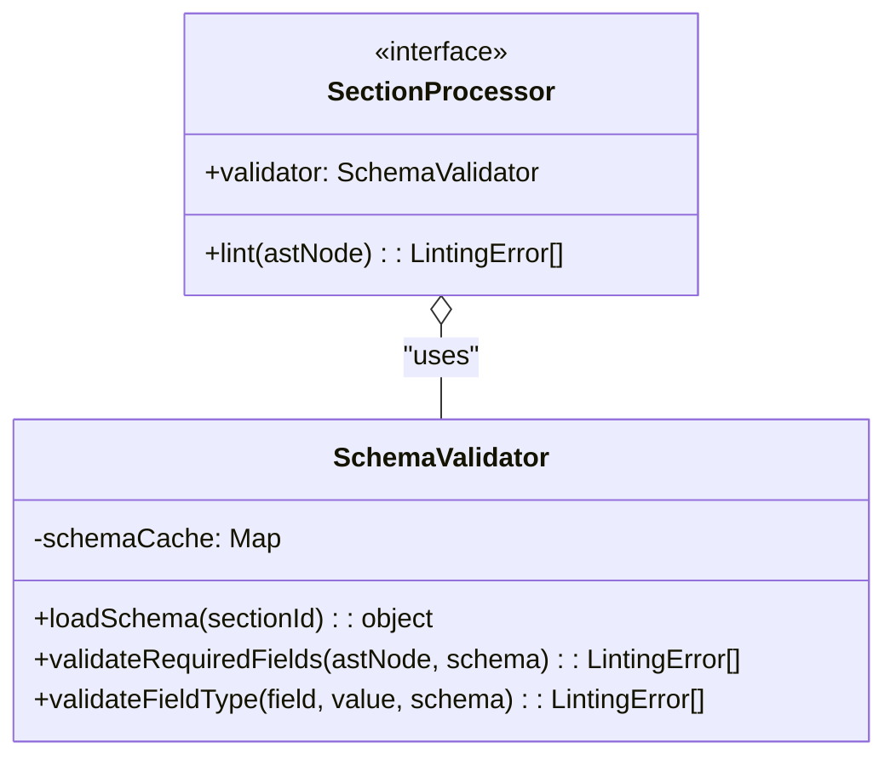

# Schema Validation Utilities

## 1 Meta & Governance

### 1.2 Status

- **Current State:** 💡 Not Started
- **Priority:** 🟥 High
- **Progress:** 0%
- **Planning Estimate:** 2
- **Est. Variance (pts):** 0
- **Created:** 2025-07-27 14:45
- **Implementation Started:**
- **Completed:**
- **Last Updated:** 2025-07-27 14:45

### 1.3 Priority Drivers

- [TEC-Dev_Productivity_Enhancement](../ddd-2.md#tec-dev_productivity_enhancement)
- [TEC-Prod_Stability_Blocker](../ddd-2.md#tec-prod_stability_blocker)

---

## 2 Business & Scope

### 2.1 Overview

- **Core Function**: Provides a set of schema-aware utility functions for use by section processor plugins.
- **Key Capability**: This task delivers a centralized validator that reads the canonical `ddd-schema-json` files and offers helpers to check for required fields, validate data types, and enforce other schema rules.
- **Business Value**: Enforces the "Schema-Driven" principle by preventing validation logic from being scattered and duplicated across multiple plugins. It reduces boilerplate code for plugin authors and ensures all validation is consistent and derived from the single source of truth.

### 2.4 Acceptance Criteria

| ID   | Criterion                                                                                               | Test Reference             |
| :--- | :------------------------------------------------------------------------------------------------------ | :------------------------- |
| AC-1 | A `SchemaProvider` can load a specific section's JSON schema definition from the file system.           | `schema-provider.test.ts`  |
| AC-2 | A `SchemaValidator` utility can take an AST node and a schema definition and check for required fields. | `schema-validator.test.ts` |
| AC-3 | The `SchemaValidator` can validate that a given value matches a simple type specified in the schema.    | `schema-validator.test.ts` |
| AC-4 | The `StatusPlugin` (from task `t19`) is updated to use these new utilities for its linting logic.       | `status.plugin.test.ts`    |

---

## 3 Planning & Decomposition

### 3.3 Dependencies

| ID  | Dependency On | Type     | Status         | Affected Plans/Tasks | Notes                                                          |
| :-- | :------------ | :------- | :------------- | :------------------- | :------------------------------------------------------------- |
| D-1 | Task `t18`    | Internal | 💡 Not Started | This task            | Depends on the core AST structure provided by the core engine. |

---

## 4 High-Level Design

### 4.2 Target Architecture

#### 4.2.2 Components



### 4.3 Tech Stack & Deployment

- **Language**: TypeScript
- **Testing**: Jest

---

## 6 Implementation Guidance

### 6.1 Implementation Log / Steps

- [ ] Create `src/doc-parser/schema/schema-provider.ts` to handle loading JSON schema files.
- [ ] Create `src/doc-parser/schema/schema-validator.ts` to house the validation logic.
- [ ] Add unit tests for both new modules.
- [ ] Refactor the `SectionProcessor` interface to expect a `SchemaValidator` instance.
- [ ] Update the `CoreEngine` to inject the validator into each plugin.

---

## 7 Quality & Operations

### 7.1 Testing Strategy / Requirements

| AC   | Scenario                                                                                              | Test Type | Tools / Runner | Notes                                                        |
| :--- | :---------------------------------------------------------------------------------------------------- | :-------- | :------------- | :----------------------------------------------------------- |
| AC-1 | The `SchemaProvider` correctly loads a known JSON file and throws an error for an unknown section ID. | Unit      | Jest           | Test both success and failure cases for schema loading.      |
| AC-2 | The `SchemaValidator` returns an error if a required field is missing from a mock AST node.           | Unit      | Jest           | Provide a mock AST and a schema definition to the validator. |
| AC-3 | The `SchemaValidator` returns an error if a field's value is of the wrong type (e.g., string vs int). | Unit      | Jest           | Test basic type-checking against a schema rule.              |

### 7.5 Local Test Commands

```bash
npm test -- src/doc-parser/schema/
```
