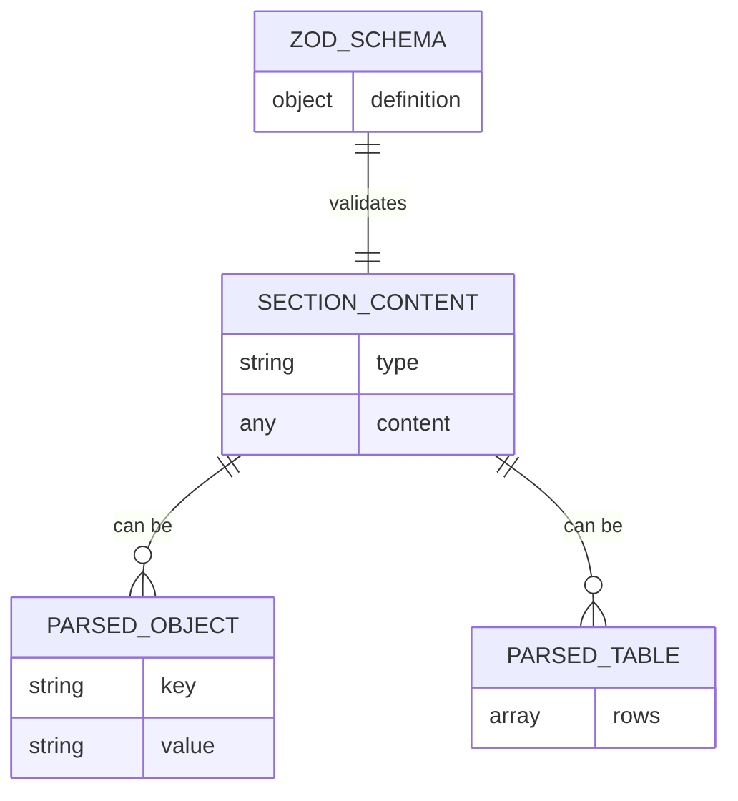
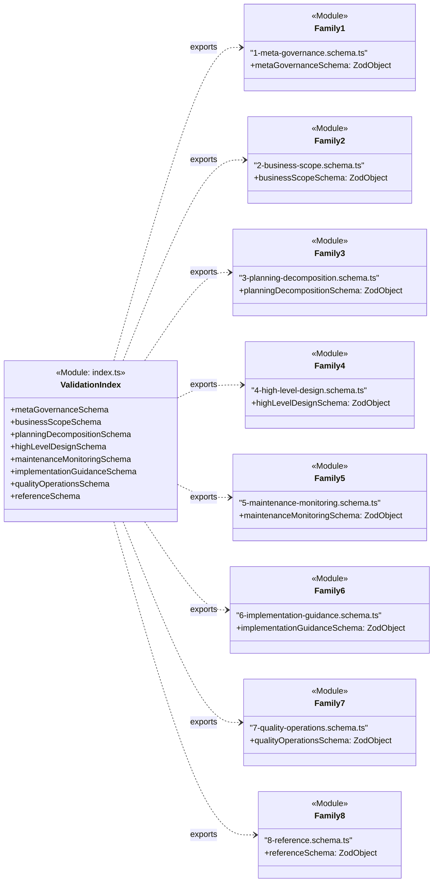

# T32: Define Section Content Schemas

## 1 Meta & Governance

### 1.2 Status

- **Current State:** 💡 Not Started
- **Priority:** 🟥 High
- **Progress:** 0%
- **Planning Estimate:** 5
- **Est. Variance (pts):** 0
- **Created:** 2025-08-03 06:13
- **Implementation Started:**
- **Completed:**
- **Last Updated:** 2025-08-03 21:35

### 1.3 Priority Drivers

- [TEC-Prod_Stability_Blocker](../ddd-2.md#tec-prod_stability_blocker)
- [TEC-Dev_Productivity_Enhancement](../ddd-2.md#tec-dev_productivity_enhancement)

---

## 2 Business & Scope

### 2.1 Overview

- **Core Function**: This task is to create the canonical Zod schemas that define the expected content structure for each section within a `*.plan.md` or `*.task.md` document.
- **Key Capability**: It will produce one or more `*.ts` files that export Zod schemas for validating the parsed content of markdown sections (e.g., ensuring a "Status" section contains the correct bullet points).
- **Business Value**: Enables automated validation of documentation content, guaranteeing that all documents are structurally correct and can be reliably parsed by tools and LLMs. This prevents runtime errors in downstream tooling.

### 2.4 Definition of Done

| ID    | Criterion                                                                                                                      |
| :---- | :----------------------------------------------------------------------------------------------------------------------------- |
| DoD-1 | A validation library is available that can check the content of documentation files.                                           |
| DoD-2 | The library correctly identifies when a document's "Status" or "Priority" section has missing or malformed information.        |
| DoD-3 | The library can validate the structure of all tables, such as "Dependencies", ensuring they have the right columns.            |
| DoD-4 | The library successfully flags documents that contain structural errors and confirms that valid documents pass without errors. |
| DoD-5 | The validation logic for each of the 8 documentation families is organized separately for maintainability.                     |

---

## 3 Planning & Decomposition

### 3.3 Dependencies

| ID  | Dependency On                                                                   | Type     | Status         | Notes                                                                                                                    |
| :-- | :------------------------------------------------------------------------------ | :------- | :------------- | :----------------------------------------------------------------------------------------------------------------------- |
| D-1 | [T28: Define Canonical Schema Interfaces](./p1.t28-define-schema-types.task.md) | Internal | 💡 Not Started | The base types for the schema definition itself are a prerequisite for creating strongly-typed content schemas.          |
| D-2 | A Markdown Parser (e.g., `remark`)                                              | External | ✅ Done        | The schemas must validate the output of the chosen parser. We will assume a standard AST structure produced by `remark`. |

---

## 4 High-Level Design

### 4.2 Target Architecture

#### 4.2.1 Data Models

The Zod schemas will validate data structures representing parsed markdown content. The parser is expected to transform markdown elements into predictable object shapes. For example, a bulleted list of key-value pairs becomes an object, and a table becomes an array of objects.



#### 4.2.2 Components

The architecture is composed of multiple schema modules, one for each documentation family. A central barrel file (`index.ts`) aggregates these modules for easy consumption.



#### 4.2.3 Data Flow

Not applicable. This task is focused on creating a schema library, which does not have an internal data flow. The data flow belongs to the consumer of the library.

#### 4.2.4 Control Flow

Not applicable. The control flow is owned by the consumer that imports and executes the schemas.

### 4.3 Tech Stack & Deployment

- **Language**: TypeScript
- **Schema Validation**: Zod
- **Testing**: Vitest
- **Deployment**: The schemas will be part of the `@livelifelively/ddd-tools` internal package, located in the `src/doc-parser/validation/` directory.

### 4.4 Non-Functional Requirements

#### 4.4.1 Performance

| ID      | Requirement                                                                   | Priority |
| :------ | :---------------------------------------------------------------------------- | :------- |
| PERF-01 | Schema validation should be fast enough for interactive use (e.g., git-hook). | 🟥 High  |

#### 4.4.2 Security

| ID     | Requirement                                                          | Priority |
| :----- | :------------------------------------------------------------------- | :------- |
| SEC-01 | Schemas must not execute any untrusted code from the parsed content. | 🟥 High  |

---

## 5 Maintenance and Monitoring

### 5.2 Target Maintenance and Monitoring

#### 5.2.1 Error Handling

| Error Type                    | Trigger                                                                | Action                   | Consumer Feedback                                                                      |
| :---------------------------- | :--------------------------------------------------------------------- | :----------------------- | :------------------------------------------------------------------------------------- |
| **Schema Validation Failure** | A consumer calls `schema.parse()` with a non-compliant content object. | Zod throws a `ZodError`. | The `ZodError` object contains detailed information about the validation failure.      |
| **Schema Import Failure**     | A consumer attempts to import a non-existent schema from the library.  | Runtime throws an error. | Standard module-not-found error from the runtime environment (e.g., Node.js, bundler). |

#### 5.2.2 Logging & Monitoring

- **Logging**: Not applicable. As a static library, this system does not perform logging. The consuming tool is responsible for logging validation results.
- **Monitoring**: Not applicable. The consuming tool is responsible for any monitoring related to schema validation.

---

## 6 Implementation Guidance

### 6.1 Implementation Log / Steps

- [ ] Create the main directory `src/doc-parser/validation/`.
- [ ] Create the main directory `src/doc-parser/validation/`.
- [ ] Create the test directory `src/doc-parser/validation/__tests__/`.
- [ ] **Family 1: Meta & Governance**
  - [ ] Create `src/doc-parser/validation/1-meta-governance.schema.ts`.
  - [ ] Create `src/doc-parser/validation/__tests__/1-meta-governance.schema.test.ts`.
  - [ ] Implement and test schemas for all sections in Family 1.
- [ ] **Family 2: Business & Scope**
  - [ ] Create `src/doc-parser/validation/2-business-scope.schema.ts`.
  - [ ] Create `src/doc-parser/validation/__tests__/2-business-scope.schema.test.ts`.
  - [ ] Implement and test schemas for all sections in Family 2.
- [ ] **Family 3: Planning & Decomposition**
  - [ ] Create `src/doc-parser/validation/3-planning-decomposition.schema.ts`.
  - [ ] Create `src/doc-parser/validation/__tests__/3-planning-decomposition.schema.test.ts`.
  - [ ] Implement and test schemas for all sections in Family 3.
- [ ] **Family 4: High-Level Design**
  - [ ] Create `src/doc-parser/validation/4-high-level-design.schema.ts`.
  - [ ] Create `src/doc-parser/validation/__tests__/4-high-level-design.schema.test.ts`.
  - [ ] Implement and test schemas for all sections in Family 4.
- [ ] **Family 5: Maintenance and Monitoring**
  - [ ] Create `src/doc-parser/validation/5-maintenance-monitoring.schema.ts`.
  - [ ] Create `src/doc-parser/validation/__tests__/5-maintenance-monitoring.schema.test.ts`.
  - [ ] Implement and test schemas for all sections in Family 5.
- [ ] **Family 6: Implementation Guidance**
  - [ ] Create `src/doc-parser/validation/6-implementation-guidance.schema.ts`.
  - [ ] Create `src/doc-parser/validation/__tests__/6-implementation-guidance.schema.test.ts`.
  - [ ] Implement and test schemas for all sections in Family 6.
- [ ] **Family 7: Quality & Operations**
  - [ ] Create `src/doc-parser/validation/7-quality-operations.schema.ts`.
  - [ ] Create `src/doc-parser/validation/__tests__/7-quality-operations.schema.test.ts`.
  - [ ] Implement and test schemas for all sections in Family 7.
- [ ] **Family 8: Reference**
  - [ ] Create `src/doc-parser/validation/8-reference.schema.ts`.
  - [ ] Create `src/doc-parser/validation/__tests__/8-reference.schema.test.ts`.
  - [ ] Implement and test schemas for all sections in Family 8.
- [ ] **Integration Testing**
  - [ ] Create a directory `src/doc-parser/validation/__tests__/mocks/` for mock markdown files.
  - [ ] Create at least one valid and one invalid mock `*.task.md` file.
  - [ ] Create the integration test file `src/doc-parser/validation/__tests__/integration.test.ts`.
  - [ ] Implement tests that parse the mock files and validate their content against the schemas.
- [ ] **Finalization**
  - [ ] Create the barrel file `src/doc-parser/validation/index.ts` to export all family-level schemas.
  - [ ] Create a test file `src/doc-parser/validation/__tests__/index.test.ts` to ensure all exports are present.

---

## 7 Quality & Operations

### 7.1 Testing Strategy / Requirements

| AC ID | DoD Link | Scenario                                                              | Test Type   | Test File                                           |
| :---- | :------- | :-------------------------------------------------------------------- | :---------- | :-------------------------------------------------- |
| AC-1  | DoD-2    | Unit test for `metaGovernanceSchema` (valid and invalid Status)       | Unit        | `__tests__/1-meta-governance.schema.test.ts`        |
| AC-2  | DoD-3    | Unit test for `businessScopeSchema` (valid and invalid DoD table)     | Unit        | `__tests__/2-business-scope.schema.test.ts`         |
| AC-3  | DoD-3    | Unit test for `planningDecompositionSchema` (valid/invalid Dep table) | Unit        | `__tests__/3-planning-decomposition.schema.test.ts` |
| AC-4  | DoD-4    | Integration test with a fully valid mock `task.md`                    | Integration | `__tests__/integration.test.ts`                     |
| AC-5  | DoD-4    | Integration test with a mock `task.md` containing multiple errors     | Integration | `__tests__/integration.test.ts`                     |
| AC-6  | DoD-1, 5 | Test that all family schemas are exported from the main index         | Unit        | `__tests__/index.test.ts`                           |

### 7.5 Local Test Commands

```bash
# Run all validation schema tests (unit and integration) and view coverage
npm test -- --coverage src/doc-parser/validation/
```

---

## 8 Reference

### 8.1 Appendices/Glossary

- **Zod**: The schema validation library used to define the content structure rules.
- **AST (Abstract Syntax Tree)**: The tree representation of the parsed markdown content that the schemas will validate.
- **Consumer**: Any tool or script that imports and uses this schema library for validation (e.g., a linter, a git-hook script).
