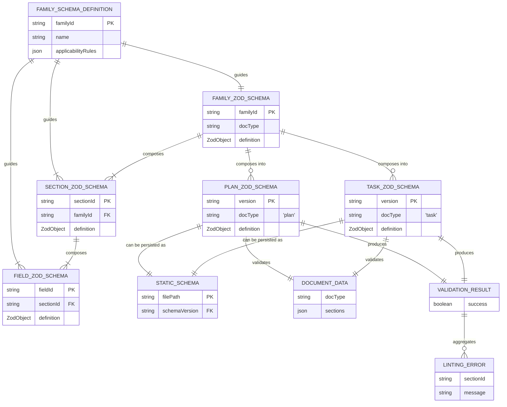
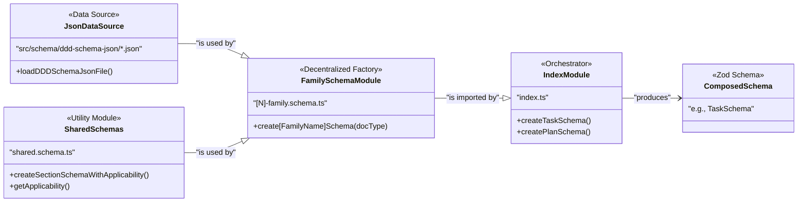
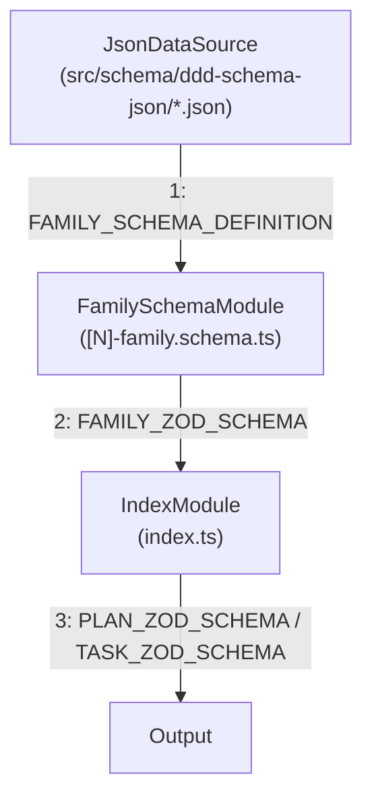
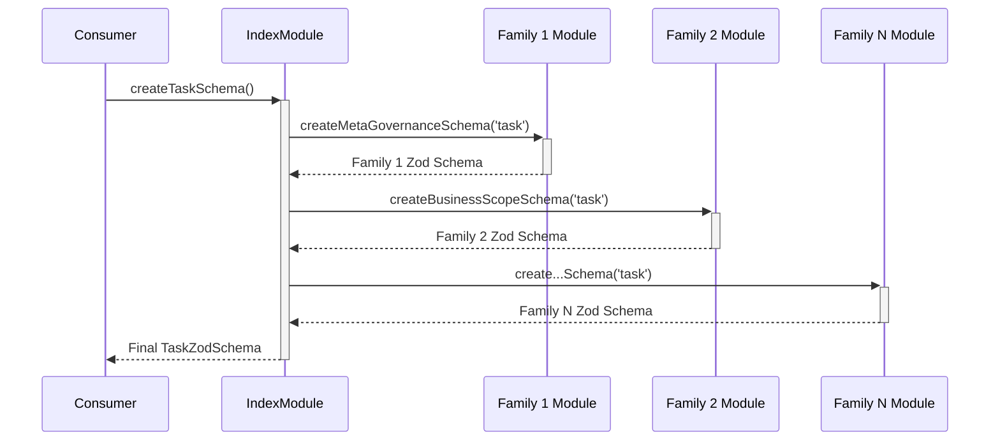

# T32: Define Section Content Schemas

## 1 Meta & Governance

### 1.2 Status

- **Current State:** ✅ Complete
- **Priority:** 🟥 High
- **Progress:** 100%
- **Planning Estimate:** 25
- **Est. Variance (pts):** +12
- **Created:** 2025-08-03 06:13
- **Implementation Started:** 2025-08-04 17:55
- **Completed:** 2025-08-10 10:52
- **Last Updated:** 2025-08-10 10:52

### 1.3 Priority Drivers

- [TEC-Prod_Stability_Blocker](../ddd-2.md#tec-prod_stability_blocker)
- [TEC-Dev_Productivity_Enhancement](../ddd-2.md#tec-dev_productivity_enhancement)

---

## 2 Business & Scope

### 2.1 Overview

- **Core Function**: This task is to create the canonical Zod schemas that define the expected content structure for each section within a `*.plan.md` or `*.task.md` document.
- **Key Capability**: It will produce one or more `*.ts` files that export Zod schemas for validating the parsed content of markdown sections (e.g., ensuring a "Status" section contains the correct bullet points).
- **Business Value**: Enables automated validation of documentation content, guaranteeing that all documents are structurally correct and can be reliably parsed by tools and LLMs. This prevents runtime errors in downstream tooling.

### 2.4 Definition of Done

| ID    | Criterion                                                                                                                      |
| :---- | :----------------------------------------------------------------------------------------------------------------------------- |
| DoD-1 | A validation library is available that can check the content of documentation files.                                           |
| DoD-2 | The library correctly identifies when a document's "Status" or "Priority" section has missing or malformed information.        |
| DoD-3 | The library can validate the structure of all tables, such as "Dependencies", ensuring they have the right columns.            |
| DoD-4 | The library successfully flags documents that contain structural errors and confirms that valid documents pass without errors. |
| DoD-5 | The validation logic for each of the 8 documentation families is organized separately for maintainability.                     |
| DoD-6 | The validation schemas are dynamically composed based on the `applicability` rules in the `ddd-schema-json` files.             |

---

## 3 Planning & Decomposition

### 3.3 Dependencies

| ID  | Dependency On                                                                   | Type     | Status  | Notes                                                                                                                    |
| :-- | :------------------------------------------------------------------------------ | :------- | :------ | :----------------------------------------------------------------------------------------------------------------------- |
| D-1 | [T28: Define Canonical Schema Interfaces](./p1.t28-define-schema-types.task.md) | Internal | ✅ Done | The base types for the schema definition itself are a prerequisite for creating strongly-typed content schemas.          |
| D-2 | A Markdown Parser (e.g., `remark`)                                              | External | ✅ Done | The schemas must validate the output of the chosen parser. We will assume a standard AST structure produced by `remark`. |

---

## 4 High-Level Design

### 4.2 Target Architecture

#### 4.2.1 Data Models

This task focuses on the composition of Zod schemas based on definitions. The model below illustrates the key entities and their relationships within the scope of this task.



#### 4.2.2 Components

The architecture will be refactored to a more modular, decentralized model. The composition logic within the monolithic `SchemaFactory` will be distributed into family-specific factory functions. Each family schema module will be responsible for its own construction, using the `ddd-schema-json` rules to compose atomic field and section schemas into a final family-level schema. The central `SchemaFactory` will then act as a lightweight orchestrator, calling each family factory to assemble the complete document schema.



#### 4.2.3 Data Flow

The data flow begins with the `JsonDataSource` providing the raw `FAMILY_SCHEMA_DEFINITION` to the `FamilySchemaModule`. This module processes the definition and produces a `FAMILY_ZOD_SCHEMA`. Finally, the `IndexModule` gathers all family schemas and composes them into the final `PLAN_ZOD_SCHEMA` or `TASK_ZOD_SCHEMA`.



#### 4.2.4 Control Flow

The control flow is initiated by an external `Consumer` (e.g., a linter or test runner) that needs a document schema. The consumer calls an orchestrator function (`createTaskSchema` or `createPlanSchema`) from the `IndexModule`. This function, in turn, calls the `create[FamilyName]Schema` factory function from each `FamilySchemaModule` to compose the final schema.



### 4.3 Tech Stack & Deployment

- **Language**: TypeScript
- **Schema Validation**: Zod
- **Testing**: Vitest
- **Deployment**: The schemas will be part of the `@livelifelively/ddd-tools` internal package, located in the `src/doc-parser/validation/` directory.

### 4.4 Non-Functional Requirements

#### 4.4.1 Performance

| ID      | Requirement                                                                   | Priority |
| :------ | :---------------------------------------------------------------------------- | :------- |
| PERF-01 | Schema validation should be fast enough for interactive use (e.g., git-hook). | 🟥 High  |

#### 4.4.2 Security

| ID     | Requirement                                                          | Priority |
| :----- | :------------------------------------------------------------------- | :------- |
| SEC-01 | Schemas must not execute any untrusted code from the parsed content. | 🟥 High  |

---

## 5 Maintenance and Monitoring

### 5.2 Target Maintenance and Monitoring

#### 5.2.1 Error Handling

| Error Type                       | Trigger                                                                | Action                                | Consumer Feedback                                                                      |
| :------------------------------- | :--------------------------------------------------------------------- | :------------------------------------ | :------------------------------------------------------------------------------------- |
| **Schema Validation Failure**    | A consumer calls `schema.parse()` with a non-compliant content object. | Zod throws a `ZodError`.              | The `ZodError` object contains detailed information about the validation failure.      |
| **Schema Definition Load Error** | The `SchemaFactory` cannot find or parse a `ddd-schema-json` file.     | The factory function throws an Error. | A descriptive error message, e.g., "Failed to load schema definition for family 1".    |
| **Schema Import Failure**        | A consumer attempts to import a non-existent schema from the library.  | Runtime throws an error.              | Standard module-not-found error from the runtime environment (e.g., Node.js, bundler). |

#### 5.2.2 Logging & Monitoring

- **Logging**: While the library itself won't have a dedicated logger, the schema creation functions will use `console.warn` for non-blocking issues (e.g., a missing schema for an optional family) and will throw descriptive errors for critical issues. It is the consumer's responsibility to catch and log these appropriately.
- **Monitoring**: Not applicable. The consuming tool is responsible for any monitoring related to schema validation.

---

## 6 Implementation Guidance

### 6.1 Implementation Log / Steps

- Latest updates

  - Converted families 6–8 to the functions-only export pattern; removed static schema/type exports; added `create...Schema` and `get...Schema` where applicable; all family tests green.
  - Refactored tests to access section schemas via `create...Schema('plan'|'task').shape` with local `planShape`/`taskShape` where useful.
  - Fixed Family 3 array element validation to avoid `.element` by validating via the array schema (wrap the item in an array).
  - Family 5: added `id` to error handling rows; standardized `loggingMonitoring` to table shape with optional `notes`; used table schemas for current/target sections.
  - Index integration: exports only factory functions and combined `getTaskSchema`/`getPlanSchema`; `index.test.ts` updated and green.
  - Integration tests: added negative task case (multiple structural errors) and positive plan case; removed debug logging; suite green.

- [x] Create the main directory `src/doc-parser/validation/`.
- [x] Create the test directory `src/doc-parser/validation/__tests__/`.
  - [x] **Family 1: Meta & Governance** ✅
  - [x] Create `src/doc-parser/validation/1-meta-governance.schema.ts`.
  - [x] Create `src/doc-parser/validation/__tests__/1-meta-governance.schema.test.ts`.
  - [x] Implement and test schemas for all sections in Family 1.
  - [x] **Family 2: Business & Scope**
  - [x] Create `src/doc-parser/validation/2-business-scope.schema.ts`.
  - [x] Create `src/doc-parser/validation/__tests__/2-business-scope.schema.test.ts`.
  - [x] Implement and test schemas for all sections in Family 2.
    - [x] **Family 3: Planning & Decomposition**
  - [x] Create `src/doc-parser/validation/3-planning-decomposition.schema.ts`.
  - [x] Create `src/doc-parser/validation/__tests__/3-planning-decomposition.schema.test.ts`.
  - [x] Implement and test schemas for all sections in Family 3.
  - [x] **Family 4: High-Level Design**
  - [x] Create `src/doc-parser/validation/4-high-level-design.schema.ts`.
  - [x] Create `src/doc-parser/validation/__tests__/4-high-level-design.schema.test.ts`.
  - [x] Implement and test schemas for all sections in Family 4.
- [x] **Family 5: Maintenance and Monitoring** ✅
  - [x] Create `src/doc-parser/validation/5-maintenance-monitoring.schema.ts`.
  - [x] Create `src/doc-parser/validation/__tests__/5-maintenance-monitoring.schema.test.ts`.
  - [x] Implement and test schemas for all sections in Family 5.
- [x] **Family 6: Implementation Guidance** ✅
  - [x] Create `src/doc-parser/validation/6-implementation-guidance.schema.ts`.
  - [x] Create `src/doc-parser/validation/__tests__/6-implementation-guidance.schema.test.ts`.
  - [x] Implement and test schemas for all sections in Family 6.
- [x] **Family 7: Quality & Operations** ✅
  - [x] Create `src/doc-parser/validation/7-quality-operations.schema.ts`.
  - [x] Create `src/doc-parser/validation/__tests__/7-quality-operations.schema.test.ts`.
  - [x] Implement and test schemas for all sections in Family 7.
- [x] **Family 8: Reference** ✅
  - [x] Create `src/doc-parser/validation/8-reference.schema.ts`.
  - [x] Create `src/doc-parser/validation/__tests__/8-reference.schema.test.ts`.
  - [x] Implement and test schemas for all sections in Family 8.
- [x] **Integration Testing**
  - [x] Create a directory `src/doc-parser/validation/__tests__/mocks/` for mock markdown files.
  - [x] Create at least one valid and one invalid mock `*.task.md` file.
  - [x] Create the integration test file `src/doc-parser/validation/__tests__/integration.test.ts`.
  - [x] Implement tests that parse the mock files and validate their content against the schemas.
- [x] **Finalization**
  - [x] Create the barrel file `src/doc-parser/validation/index.ts` to export all family-level schemas.
  - [x] Create a test file `src/doc-parser/validation/__tests__/index.test.ts` to ensure all exports are present.
- [x] **Phase 1: Create Shared Utilities**
  - [x] Create `src/doc-parser/validation/shared.schema.ts`.
  - [x] Add a `DocumentType` enum (`'plan' | 'task'`).
  - [x] Add helper functions to read and process the `applicability` rules from the `ddd-schema-json` files.
  - [x] Make family definitions configurable with default values.
  - [x] Add detailed applicability information (required/optional/omitted) instead of just boolean.
- [x] **Phase 2: Refactor to Decentralized Factories**
  - [x] **Create Shared Composition Utilities:**
    - [x] In `shared.schema.ts`, create generic helper functions (e.g., `applyApplicability(schema, rules, docType)`) to handle the common Zod `.pick()`, `.omit()`, and `.optional()` logic based on applicability rules.
  - [x] **Implement Family-Specific Factories (All Families 1–8 complete)**

#### 6.1.2 Files Change Log

- `src/doc-parser/validation/1-meta-governance.schema.ts`
- `src/doc-parser/validation/2-business-scope.schema.ts`
- `src/doc-parser/validation/3-planning-decomposition.schema.ts`
- `src/doc-parser/validation/4-high-level-design.schema.ts`
- `src/doc-parser/validation/5-maintenance-monitoring.schema.ts`
- `src/doc-parser/validation/6-implementation-guidance.schema.ts`
- `src/doc-parser/validation/7-quality-operations.schema.ts`
- `src/doc-parser/validation/8-reference.schema.ts`
- `src/doc-parser/validation/index.ts`
- `src/doc-parser/validation/shared.schema.ts`

---

## 7 Quality & Operations

### 7.1 Testing Strategy / Requirements

| AC ID | DoD Link | Scenario                                                                                                                               | Test Type   | Test File                                           |
| :---- | :------- | :------------------------------------------------------------------------------------------------------------------------------------- | :---------- | :-------------------------------------------------- |
| AC-1  | DoD-2    | Unit test for `MetaGovernanceFamilySchema` (valid and invalid Status)                                                                  | Unit        | `__tests__/1-meta-governance.schema.test.ts`        |
| AC-2  | DoD-3    | Unit test for `BusinessScopeFamilySchema` (valid and invalid DoD table)                                                                | Unit        | `__tests__/2-business-scope.schema.test.ts`         |
| AC-3  | DoD-3    | Unit test for `PlanningDecompositionFamilySchema` (valid/invalid Dep table)                                                            | Unit        | `__tests__/3-planning-decomposition.schema.test.ts` |
| AC-4  | DoD-4, 6 | Integration test with a fully valid mock `task.md` using the `TaskSchema`                                                              | Integration | `__tests__/integration.test.ts`                     |
| AC-5  | DoD-4, 6 | Integration test with a mock `task.md` containing multiple errors using the `TaskSchema`                                               | Integration | `__tests__/integration.test.ts`                     |
| AC-6  | DoD-1, 5 | Test that all family schemas and composite schemas (`TaskSchema`, `PlanSchema`) are exported from the main index.                      | Unit        | `__tests__/index.test.ts`                           |
| AC-7  | DoD-6    | Unit test for `schema-factory` to ensure it correctly composes a **task-specific schema**, respecting section and field applicability. | Unit        | `__tests__/schema-factory.test.ts`                  |
| AC-8  | DoD-6    | Unit test for `schema-factory` to ensure it correctly composes a **plan-specific schema**, respecting section and field applicability. | Unit        | `__tests__/schema-factory.test.ts`                  |
| AC-9  | DoD-4, 6 | Integration test with a fully valid mock `plan.md` using the `PlanSchema` factory function.                                            | Integration | `__tests__/integration.test.ts`                     |
| AC-10 | DoD-6    | Unit test for `createFamilySchema` in each family module to verify correct composition for both 'plan' and 'task' types.               | Unit        | `__tests__/[N]-<family-name>.schema.test.ts`        |
| AC-11 | DoD-6    | Unit test for the central `SchemaFactory` orchestrator to ensure it correctly calls all family factories.                              | Unit        | `__tests__/schema-factory.test.ts`                  |

### 7.5 Local Test Commands

```bash
# Run all validation schema tests (unit and integration) and view coverage
npm test -- --coverage src/doc-parser/validation/
```

---

## 8 Reference

### 8.1 Appendices/Glossary

- **Zod**: The schema validation library used to define the content structure rules.
- **AST (Abstract Syntax Tree)**: The tree representation of the parsed markdown content that the schemas will validate.
- **Consumer**: Any tool or script that imports and uses this schema library for validation (e.g., a linter, a git-hook script).
